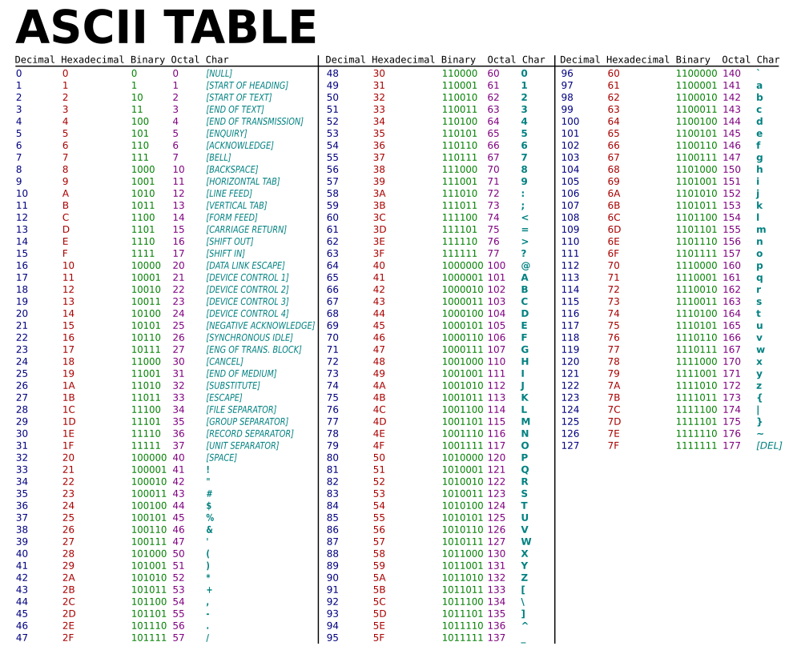
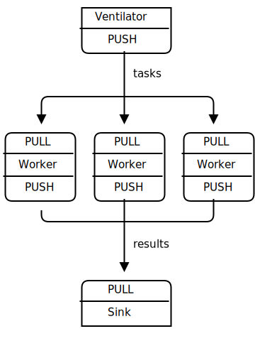

# 1장-기본(Basics)

## 세상을 구원하라
;How to explain ØMQ? Some of us start by saying all the wonderful things it does. It's sockets on steroids. It's like mailboxes with routing. It's fast! Others try to share their moment of enlightenment, that zap-pow-kaboom satori paradigm-shift moment when it all became obvious. Things just become simpler. Complexity goes away. It opens the mind. Others try to explain by comparison. It's smaller, simpler, but still looks familiar. Personally, I like to remember why we made ØMQ at all, because that's most likely where you, the reader, still are today.

ØMQ를 어떻게 설명할 것인가?  우리 중 일부는 ØMQ가 하는 놀라운 것들을 말하는 것으로 시작합니다.
* 스테로이드를 먹은 스켓입니다.
* 라우팅 기능이 있는 우편함과 같습니다.
* 빠릅니다.
어떤 사람들은 깨달음의 순간을 공유하려 합니다.
* 모든 것이 분명해졌을 때 번쩍-우르릉-쾅쾅 깨달음(zap-pow-kaboom satori) 패러다임 전환 순간을 느낍니다.
* 사물은 단순해지고 복잡성이 사라집니다
* 마음을 열게 합니다.
어떤 사람들은 다른 것과 비교하여 ØMQ를 설명하려고 한다:
*  더 작고 단순하지만 여전히 익숙해 보입니다
개인적으로 저는 왜 우리가 ØMQ를 만들었는지를 기억하고 싶으며, 독자 여러분은 우리가 처음 길을 접어든 근처에 머물고 있을지 모르기 때문입니다.

> [옮긴이] 번쩍-우르릉-쾅쾅 사토리(zap-pow-kaboom satori)에서 사토리는 불교의 용어로 해달의 경지인 깨달음 의미합니다. 일본에서 돈버는 것에도 출세에도 관심이 없는 젊은 세대를 ‘사토리 세대’라고 부릅니다.


;Programming is science dressed up as art because most of us don't understand the physics of software and it's rarely, if ever, taught. The physics of software is not algorithms, data structures, languages and abstractions. These are just tools we make, use, throw away. The real physics of software is the physics of people—specifically, our limitations when it comes to complexity, and our desire to work together to solve large problems in pieces. This is the science of programming: make building blocks that people can understand and use easily, and people will work together to solve the very largest problems.

프로그래밍은 예술로 치장된 과학이지만 우리 대부분은 소프트웨어의 물리학을 거의 이해하지 못하고 있으며 과학으로 가르치는 곳이 거의 없습니다.  소프트웨어의 물리학은 알고리즘이나, 자료 구조, 프로그래밍 언어나 추상화 등이 아닙니다. 이런 것들은 다만 우리가 그냥 만들어내고 사용하고 버리는 도구들일 뿐입니다. 소프트웨어의 진정한 물리학은 인간의 물리학입니다. 특히 복잡성 앞에서의 인간의 한계와 우리의 협력을 통하여 거대한 문제를 작은 조각들로 쪼개서 해결하려고 하는 욕구가 있습니다.
이것이 프로그래밍 과학입니다 : 사람들이 쉽게 이해하고 사용할 수 있는 구성요소들을 만들어냄으로써, 사람들이 그걸 이용하여 거대한 문제들을 해결하게 도와줍니다.

;We live in a connected world, and modern software has to navigate this world. So the building blocks for tomorrow's very largest solutions are connected and massively parallel. It's not enough for code to be "strong and silent" any more. Code has to talk to code. Code has to be chatty, sociable, well-connected. Code has to run like the human brain, trillions of individual neurons firing off messages to each other, a massively parallel network with no central control, no single point of failure, yet able to solve immensely difficult problems. And it's no accident that the future of code looks like the human brain, because the endpoints of every network are, at some level, human brains.

우리는 연결된 세상 속에 살고 있습니다. 그리고 현대의 소프트웨어들은 이런 세상 속을 항해할 수 있습니다. 따라서 미래의 거대한 솔루션들을 위한 구성요소들은 반드시 서로 연결되어야 하며 대규모로 병렬적이어야 합니다. 더 이상 프로그램이 그냥 “강력하고 침묵” 하기만 하면 되던 그런 시대는 지났습니다. 코드는 이젠 코드와 대화해야 합니다. 코드는 수다스러워야 하고 사교적이어야 하며 연결되어야 합니다. 코드는 반드시 인간의 두뇌처럼 작동해야 하고, 수조 개의 뉴런들이 서로에게 메시지를 던지듯이, 중앙 통제가 없는 대규모 병렬 네트워크로 단일 장애점 없어야 합니다. 그러면서도 극도로 어려운 문제들을 해결할 수 있어야 합니다. 그리고 코드의 미래가 인간의 두뇌처럼 보인다는 것은 우연이 아닙니다. 왜냐면 결국 네트워크도 단말에서 인간의 두뇌에 연결되며, 그 어떤 네트워크의 진화의 종착점도 인간의 두뇌이기 때문입니다.

;If you've done any work with threads, protocols, or networks, you'll realize this is pretty much impossible. It's a dream. Even connecting a few programs across a few sockets is plain nasty when you start to handle real life situations. Trillions? The cost would be unimaginable. Connecting computers is so difficult that software and services to do this is a multi-billion dollar business.

당신이 스레드, 통신규약 또는 네트워크와 관련된 일을 하였다면 당신은 이것이 얼마나 불가능에 가까운 일인가를 알 것입니다. 이건 꿈과 같습니다. 실제 상황에서 몇 개의 프로그램들을 몇 개의 소켓을 통해 연결하는 것조차도 어렵고 불쾌합니다. 수조 원? 그 비용은 상상도 할 수 없을 정도입니다. 컴퓨터들을 연결시키는 것이 매우 어렵기 때문에 이를 수행하는 소프트웨어와 서비스들은 수십억 달러짜리의 사업입니다.

;So we live in a world where the wiring is years ahead of our ability to use it. We had a software crisis in the 1980s, when leading software engineers like Fred Brooks believed there was no "Silver Bullet" to "promise even one order of magnitude of improvement in productivity, reliability, or simplicity".

그래서 결국 우리는 이러한 세상에서 살게 되었습니다: 인터넷 보급과 속도는 상당히 발전되었는데, 그것을 제대로 활용하는 능력은 몇 년이나 뒤쳐져 있습니다. 우리는 1980년대에 한차례 소프트웨어 위기를 겼었으며, 그때 프레드 브룩스와 같은 수준급 소프트웨어 엔지니어들은 “소프트웨어 업계에서 생산성, 신뢰성, 단순성 이 세 가지 척도중 그 어느 한 방면에서도 진보를 이루는 것에는 [「은총알이 존재하지 않는다」](http://en.wikipedia.org/wiki/No_Silver_Bullet)” 고 주장하였습니다.

;Brooks missed free and open source software, which solved that crisis, enabling us to share knowledge efficiently. Today we face another software crisis, but it's one we don't talk about much. Only the largest, richest firms can afford to create connected applications. There is a cloud, but it's proprietary. Our data and our knowledge is disappearing from our personal computers into clouds that we cannot access and with which we cannot compete. Who owns our social networks? It is like the mainframe-PC revolution in reverse.

브룩스가 놓쳤던 것은 자유롭게 이용 가능한 오픈소스 소프트웨어들이었으며, 서로 효율적으로 지식을 공유함으로 위기를 해결할 수 있었습니다. 
하지만 오늘날 우리는 또 다른 소프트웨어 위기에 직면하고 있지만 이번에는 이걸 얘기하는 사람은 거의 없습니다. 위기는 가장 크고 가장 부유한 기업들만이 “연결된 응용프로그램들을” 만들 수 있다는 점이다. 물론 요즘에는 클라우드가 있지만 클라우드는 사적 소유이며 우리의 데이터와 우리의 지식은 개인 컴퓨터에서 점점 사라지고, 우리가 접근할 수 없고 우리가 그걸 상대로 경쟁조차 펼칠 수 없는 클라우드로 흘러 들어가고 있습니다. 우리의 소셜 네트워크를 누가 가지고 있을까요? 이것은 PC에서 대형 컴퓨터로 전환되는 혁명이 역으로 수행되고 있습니다.

;We can leave the political philosophy for another book. The point is that while the Internet offers the potential of massively connected code, the reality is that this is out of reach for most of us, and so large interesting problems (in health, education, economics, transport, and so on) remain unsolved because there is no way to connect the code, and thus no way to connect the brains that could work together to solve these problems.

우리는 이런 정치철학은 [문명과 제국, 디지털 혁명](http://cultureandempire.com/)에서 다루고 있습니다 여기서 말하고자 하는 건, 인터넷이 대규모 연결된 프로그램에 잠재력을 제공하고 있음에도 불구하고, 현실은 이것을 충분히 이용할 수 있는 사람은 극히 드물다는 점입니다. 그러므로 거대하고 흥미로운 문제들(건강 의료, 교육, 경제, 물류 등 분야들의)에 대하여 해결되지 못하고 있으며 원인은 우리가 코드들을 효과적으로 연결 못하고 개개인이 함께 협력하여 이러한 문제를 해결할 방법이 없었기 때문입니다.

> [옮긴이] 문화와 제국, 디지털 혁명은 피터 힌트젠스가 지은 책이다. 링크 내 무료로 읽을 수 있고 PDF나 전자책 포맷으로 다운로드할 수 있습니다.

;There have been many attempts to solve the challenge of connected code. There are thousands of IETF specifications, each solving part of the puzzle. For application developers, HTTP is perhaps the one solution to have been simple enough to work, but it arguably makes the problem worse by encouraging developers and architects to think in terms of big servers and thin, stupid clients.

연결된 코드의 도전 문제를 해결하기 위한 많은 시도들도 있었습니다. 예를 들어 수천 개의 IETF 규격들, 그것들은 각각 퍼즐의 일부만 해결합니다. 응용프로그램 개발자에게 있어서 HTTP 는 아마도 한가지 충분히 간단하고 효과도 괜찮은 해결책이었지만 HTTP는 개발자들과 아키텍처들을 거대한  서버와 작고, 어리석은 클라이언트로 구성된 아키텍처를 권고하면서 문제를 더 악화시키게 되었습니다.

;So today people are still connecting applications using raw UDP and TCP, proprietary protocols, HTTP, and Websockets. It remains painful, slow, hard to scale, and essentially centralized. Distributed P2P architectures are mostly for play, not work. How many applications use Skype or Bittorrent to exchange data?

그래서 결과적으로 오늘날에도 사람들은 여전히 UDP, TCP, 사적 소유의 통신규약, HTTP와 웹소켓 등을 그대로 사용하고 있습니다. 여전히 고통스럽고 굼뜨고 확장이 어려우며 대체적으로 중앙화 되어 있습니다. 분산된 P2P 아키텍처도 존재하긴 하지만, 대부분 노는 일에만 기여하지 생산적인 데는 도움이 되지 않으며 스카이프나 비트토렌트로 데이터를 주고받는 사람은 많지 않습니다.

;Which brings us back to the science of programming. To fix the world, we needed to do two things. One, to solve the general problem of "how to connect any code to any code, anywhere". Two, to wrap that up in the simplest possible building blocks that people could understand and use easily.

이 모든 현실은 다시 우리를 최초의 프로그래밍 과학에 대한 문제로 되돌려 보냅니다. 세상을 구원하기 위해 우리는 두 가지 일을 해야 합니다. :
* 첫째, 일반적인 문제인 “어디서나, 코드와 코드 간에 연결시키기”
* 둘째, 모든 대책을 최대한 간단한 구성요소로 만들어 사람들이 이해하고 사용하기도 쉽게 하기

;It sounds ridiculously simple. And maybe it is. That's kind of the whole point.

말도 안 되게 간단하게 들립니다. 그리고 정말로 그럴지도 모릅니다. 하지만 이것이 바로 이 책의 전부입니다.

## 전제 조건
;We assume you are using at least version 3.2 of ØMQ. We assume you are using a Linux box or something similar. We assume you can read C code, more or less, as that's the default language for the examples. We assume that when we write constants like PUSH or SUBSCRIBE, you can imagine they are really called ZMQ_PUSH or ZMQ_SUBSCRIBE if the programming language needs it.

ØMQ 3.2 버젼을 사용하고 리눅스와 유사한 운영체제를 사용한다고 가정합니다. 이 책의 기본 예제는 C 언어로 구성되어 있어 C 코드를 읽을 수 있어야 합니다. PUSH와 SUBSCRIBE와 같은 상수를 사용할 때 실제 프로그래밍 언어에서는 ZMQ_PUSH, ZMQ_SUBSCRIBE가 호출된다고 생각할 수 있습니다.

> [옮긴이] C 예제들을 원도우 운영체제에서도 사용 가능하도록 변경하였습니다.

## 예제 받기
;The examples live in a public GitHub repository. The simplest way to get all the examples is to clone this repository:

예제들은 [깃허브 공개 저장소](https://github.com/imatix/zguide)에 있으며, `git clone`명령으로 받을 수 있으며 동기화 이후 예제 폴더에서 다양한 개발언어로 작성된 예제들을 확인 가능합니다.

~~~ {.bash}
git clone --depth=1 git://github.com/imatix/zguide.git
~~~

## 물으면 얻을 것이다(Aak and Ye Shall Receive).
;So let's start with some code. We start of course with a Hello World example. We'll make a client and a server. The client sends "Hello" to the server, which replies with "World". Here's the server in C, which opens a ØMQ socket on port 5555, reads requests on it, and replies with "World" to each request:

Hello World 예제로 시작하며, 클라이언트와 서버 프로그램을 만들도록 하겠습니다.
클라이언트에서 서버로 "Hello"을 보내면 서버에서 "World"를 클라이언트에게 응답합니다. 예제에서 ØMQ 소켓을 5555 포트로 오픈하여 요청에 대응한다.

hwserver.c: Hello World 서버
```cpp
//  Hello World server
#include <zmq.h>
#include <stdio.h>
#ifndef _WIN32
#include <unistd.h>
#else
#include <windows.h>
#define sleep(n)    Sleep(n*1000)
#endif
#include <string.h>
#include <assert.h>

int main (void)
{
    //  Socket to talk to clients
    void *context = zmq_ctx_new ();
    void *responder = zmq_socket (context, ZMQ_REP);
    int rc = zmq_bind (responder, "tcp://*:5555");
    assert (rc == 0);

    while (1) {
        char buffer [10];
        zmq_recv (responder, buffer, 10, 0);
        printf ("Received Hello\n");
        sleep (1);          //  Do some 'work'
        zmq_send (responder, "World", 5, 0);
    }
    return 0;
}
```
그림 2 - 요청-응답


;The REQ-REP socket pair is in lockstep. The client issues zmq_send() and then zmq_recv(), in a loop (or once if that's all it needs). Doing any other sequence (e.g., sending two messages in a row) will result in a return code of -1 from the send or recv call. Similarly, the service issues zmq_recv() and then zmq_send() in that order, as often as it needs to.

REQ-REP 소켓 쌍은 진행 순서가 고정되어  클라이언트는 루프상에서 `zmq_send()`를 호출하고 나서 `zmq_recv()`를 호출할 수 있으며, `zmq_send()`를 2번 호출(예 : 2개의 메시지를 연속으로 전송) 할 경우에는 오류 코드로 -1이 반환됩니다.
마찬가지로 서버 측은 `zmq_recv()`를 호출하고 나서 `zmq_send ()`를 호출해야 합니다.

;ØMQ uses C as its reference language and this is the main language we'll use for examples. If you're reading this online, the link below the example takes you to translations into other programming languages. Let's compare the same server in C++:

ØMQ는 참조 언어로서 C 언어를 사용하고 있기 때문에 샘플 코드에서 C 언어를 사용합니다.
여기에서는 C++ 서버 코드를 보고 비교하겠습니다.

hwserver.cpp: Hello World 서버
```cpp
//
//  Hello World server in C++
//  Binds REP socket to tcp://*:5555
//  Expects "Hello" from client, replies with "World"
//
#include <zmq.hpp>
#include <string>
#include <iostream>
#ifndef _WIN32
#include <unistd.h>
#else
#include <windows.h>
#define sleep(n)	Sleep(n*1000)
#endif

int main () {
    //  Prepare our context and socket
    zmq::context_t context (1);
    zmq::socket_t socket (context, ZMQ_REP);
    socket.bind ("tcp://*:5555");

    while (true) {
        zmq::message_t request;

        //  Wait for next request from client
        socket.recv (&request);
        std::cout << "Received Hello" << std::endl;

        //  Do some 'work'
    	sleep(1);

        //  Send reply back to client
        zmq::message_t reply (5);
        memcpy (reply.data (), "World", 5);
        socket.send (reply);
    }
    return 0;
}
```
> [옮긴이] C++ 바인딩의 경우 2개의 헤더 파일("zmq.hpp", "zmq_addon.hpp")로 구성되어 있습니다.

;You can see that the ØMQ API is similar in C and C++. In a language like PHP or Java, we can hide even more and the code becomes even easier to read:

ØMQ API는 C 언어와 C++에서 거의 동일하다는 것을 알 수 있으며, PHP와 Java 언어의 작성된 예제도 보도록 하겠습니다. 더 많은 것을 숨길 수 있고 코드를 더 쉽게 읽을 수 있습니다.

hwserver.php: Hello World 서버

```php
<?php
/*
 *  Hello World server
 *  Binds REP socket to tcp://*:5555
 *  Expects "Hello" from client, replies with "World"
 * @author Ian Barber <ian(dot)barber(at)gmail(dot)com>
 */

$context = new ZMQContext(1);

//  Socket to talk to clients
$responder = new ZMQSocket($context, ZMQ::SOCKET_REP);
$responder->bind("tcp://*:5555");

while (true) {
    //  Wait for next request from client
    $request = $responder->recv();
    printf ("Received request: [%s]\n", $request);

    //  Do some 'work'
    sleep (1);

    //  Send reply back to client
    $responder->send("World");
}
```

hwserver.java: Hello World 서버

```java
//
//  Hello World server in Java
//  Binds REP socket to tcp://*:5555
//  Expects "Hello" from client, replies with "World"
//

import org.ØMQ.SocketType;
import org.ØMQ.ZMQ;
import org.ØMQ.ZContext;

public class hwserver
{
    public static void main(String[] args) throws Exception
    {
        try (ZContext context = new ZContext()) {
            // Socket to talk to clients
            ZMQ.Socket socket = context.createSocket(SocketType.REP);
            socket.bind("tcp://*:5555");

            while (!Thread.currentThread().isInterrupted()) {
                byte[] reply = socket.recv(0);
                System.out.println(
                    "Received " + ": [" + new String(reply, ZMQ.CHARSET) + "]"
                );

                String response = "world";
                socket.send(response.getBytes(ZMQ.CHARSET), 0);

                Thread.sleep(1000); //  Do some 'work'
            }
        }
    }
}
```
> [옮긴이] Java의 경우 jzmq 바인딩으로 빌드 수행 시 오류가 발생하며, 해당 예제는 jeromq(ØMQ의 Java 구현) 라이브러리를 통하여 수행 필요합니다.
Maven 레파지토리(https://mvnrepository.com/artifact/org.zeromq/jeromq)에서 원하는 버전의 jar 파일을 받을 수 있으며, 사용을 위해서는 "CLASSPATH" 환경 변수에 등록 필요합니다.

;Here's the client code:

다음은 클라이언트 코드입니다.

hwclient.c: Hello World 클라이언트
```cpp
//  Hello World client
#include <zmq.h>
#include <string.h>
#include <stdio.h>
#ifndef _WIN32
#include <unistd.h>
#else
#include <windows.h>
#define sleep(n)    Sleep(n*1000)
#endif

int main (void)
{
    printf ("Connecting to hello world server...\n");
    void *context = zmq_ctx_new ();
    void *requester = zmq_socket (context, ZMQ_REQ);
    zmq_connect (requester, "tcp://localhost:5555");

    int request_nbr;
    for (request_nbr = 0; request_nbr != 10; request_nbr++) {
        char buffer [10];
        printf ("Sending Hello %d...\n", request_nbr);
        zmq_send (requester, "Hello", 5, 0);
        zmq_recv (requester, buffer, 10, 0);
        printf ("Received World %d\n", request_nbr);
    }
    zmq_close (requester);
    zmq_ctx_destroy (context);
    return 0;
}
```

;Now this looks too simple to be realistic, but ØMQ sockets have, as we already learned, superpowers. You could throw thousands of clients at this server, all at once, and it would continue to work happily and quickly. For fun, try starting the client and then starting the server, see how it all still works, then think for a second what this means.

ØMQ 소켓을 가졌지만 실제 구현이 단순하며, 이전에 보았듯이 초능력을 가지고 있습니다.
서버는 동시에 수천 개의 클라이언트들을 가질 수 있으며 작업을 쉽고 빠르게 할 수 있게 되었습니다. 재미를 위해 클라이언트를 시작한 다음 서버를 시작하시기 바랍니다. 모든 것이 여전히 작동하는지 확인한 다음 이것이 의미하는 바를 잠시 생각해보십시오.

> [옮긴이] 서버, 클라이언트 구동 순서에 관계없이 정상적으로 동작합니다.

;Let us explain briefly what these two programs are actually doing. They create a ØMQ context to work with, and a socket. Don't worry what the words mean. You'll pick it up. The server binds its REP (reply) socket to port 5555. The server waits for a request in a loop, and responds each time with a reply. The client sends a request and reads the reply back from the server.

이 두 프로그램이 실제로 무엇을 하고 있는지 간략하게 살펴보겠습니다.
이들은 우선 ØMQ 컨텍스트 ØMQ 소켓을 생성합니다.
서버는 REP 소켓을 포트 5555번으로 바인딩하여 매번 루프에서 요청을 기다리고 각 요청에 응답합니다.
클라이언트는 요청을 보내고 서버의 응답을 받습니다.

> [옮긴이] 빌드 및 테스트

~~~ {.bash}
PS D:\git_store\zguide-kr\examples\C> cl -EHsc hwserver.c libzmq.lib
PS D:\git_store\zguide-kr\examples\C> cl -EHsc hwclient.c libzmq.lib
PS D:\git_store\zguide-kr\examples\C> ./hwserver
Received Hello
Received Hello
Received Hello
Received Hello
Received Hello
Received Hello
Received Hello
Received Hello
Received Hello
Received Hello

PS D:\git_store\zguide-kr\examples\C> ./hwclient
Connecting to hello world server...
Sending Hello 0...
Received World 0
Sending Hello 1...
Received World 1
Sending Hello 2...
Received World 2
Sending Hello 3...
Received World 3
Sending Hello 4...
Received World 4
Sending Hello 5...
Received World 5
Sending Hello 6...
Received World 6
Sending Hello 7...
Received World 7
Sending Hello 8...
Received World 8
Sending Hello 9...
Received World 9
~~~

;If you kill the server (Ctrl-C) and restart it, the client won't recover properly. Recovering from crashing processes isn't quite that easy. Making a reliable request-reply flow is complex enough that we won't cover it until Chapter 4 - Reliable Request-Reply Patterns.

서버를 죽이고(CTRL-C) 재시작하면 클라이언트는 정상적으로 동작하지 않을 것이다. 프로세스가 죽을 경우 복구는 쉽지 않은 문제이다. 신뢰성 있는 요청-응답은 복잡하지만 "4장-신뢰할 수 있는 요청-응답 패턴"에서 다루도록 하겠습니다.

;There is a lot happening behind the scenes but what matters to us programmers is how short and sweet the code is, and how often it doesn't crash, even under a heavy load. This is the request-reply pattern, probably the simplest way to use ØMQ. It maps to RPC and the classic client/server model.

프로그래밍된 뒤편에서는 많은 일이 일어나고 있지만 프로그래머들에게 중요한 것은 작성된 코드가 얼마나 짧고 멋있는지, 얼마나 자주 그것이 무거운 부하를 받더라도 충돌하지 않는지입니다.
이것이 ØMQ의 가장 간단한 사용 방법이며 RPC(remote procedure call)과 고전적인 클라이언트/서버 모델에 해당합니다.

## 문자열에 대한 간단한 주의 사항
;ØMQ doesn't know anything about the data you send except its size in bytes. That means you are responsible for formatting it safely so that applications can read it back. Doing this for objects and complex data types is a job for specialized libraries like Protocol Buffers. But even for strings, you need to take care.

ØMQ는 데이터의 바이트 크기 외에는 아무것도 모르기 때문에 문자열을 안전하게 처리할 책임이 있습니다. 이러한 복잡한 데이터 형이나 객체에 대하여 작업하기 위해 특화된 "통신규약 버퍼(Protocol Buffer)"라는 라이브러리가 있지만 문자열에 대하여서는 주의해야 합니다.

;In C and some other languages, strings are terminated with a null byte. We could send a string like "HELLO" with that extra null byte:

C 언어와 일부 다른 언어들에서 문자열은 한 개의 널(\0) 바이트로 끝이 나며 "Hello"와 같은 경우 추가 널(\0) 바이트를 추가합니다.

```cpp
zmq_send (requester, "Hello", 6, 0);
```
> [옮긴이] 아스키(ASCII) 문자 테이블



;However, if you send a string from another language, it probably will not include that null byte. For example, when we send that same string in Python, we do this:

다른 언어에서 문자열을 보내면 해당 널(\0) 바이트를 포함하지 않을 것입니다. Python 언어에서는 널(\0) 바이트를 포함하지 않고 아래와 같이 보낼 수 있습니다.

```python
socket.send ("Hello")
```

;Then what goes onto the wire is a length (one byte for shorter strings) and the string contents as individual characters.

이때 네트워크상에서 문자열의 길이와 개별 문자를 가진 문자열의 내용이 전송됩니다.

그림 3 - ØMQ 문자열(길이 + 개별문자)


;And if you read this from a C program, you will get something that looks like a string, and might by accident act like a string (if by luck the five bytes find themselves followed by an innocently lurking null), but isn't a proper string. When your client and server don't agree on the string format, you will get weird results.

C 언어를 통해 코드를 본다면 문자열과 비슷한 것을 확인할 수 있으며 우연히 문자열처럼 동작할 수 있지만(운이 좋아 5 바이트(Hello) 널(\0) 뒤따르는 경우) 적절한 문자열이 아닙니다. 클라이언트와 서버가 문자열 형식에 동의하지 않는다면 이상한 결과를 가져오게 됩니다.

;When you receive string data from ØMQ in C, you simply cannot trust that it's safely terminated. Every single time you read a string, you should allocate a new buffer with space for an extra byte, copy the string, and terminate it properly with a null.

ØMQ에서 C 언어로 문자열 데이터를 받는다면 안전하게 끝났는지(널(\0) 문자 포함) 보장할 수 없기 때문에 매번 여분의 공간을 가지고 공백으로 채워진 새로운 버퍼에 할당하여 문자열을 복사한 다음 널(\0)로 올바르게 종료해야 합니다.

;So let's establish the rule that ØMQ strings are length-specified and are sent on the wire without a trailing null. In the simplest case (and we'll do this in our examples), a ØMQ string maps neatly to a ØMQ message frame, which looks like the above figure—a length and some bytes.

따라서 ØMQ 문자열은 길이가 지정되고 후행 널(\0) 없이 네트워크로 전송된다는 규칙을 설정하였습니다. 가장 간단한 경우(예제에서 작업 수행), ØMQ 문자열은 위의 그림과 같은 ØMQ 메시지 프레임에 매핑됩니다(길이와 일부 바이트들).

;Here is what we need to do, in C, to receive a ØMQ string and deliver it to the application as a valid C string:

C 언어에서 ØMQ 문자열을 받아 유효한 C 문자열로 변환하는 함수를 정의하겠습니다.

255 문자열 길이 제한이 있는  s_recv() 함수
```cpp
//  Receive ØMQ string from socket and convert into C string
//  Caller must free returned string. Returns NULL if the context
//  is being terminated.
static char *
s_recv (void *socket) {
    char buffer [256];
    int size = zmq_recv (socket, buffer, 255, 0);
    if (size == -1)
        return NULL;
    buffer[size] = '\0';

#if (defined (WIN32))
    return strdup (buffer);
#else
    return strndup (buffer, sizeof(buffer) - 1);
#endif
}
```
> [옮긴이] 256 바이트 문자열 길이 제약을 제거한 s_recv() 함수

```cpp
//  Receive ØMQ string from socket and convert into C string
//  Caller must free returned string.
inline static char *
s_recv(void *socket, int flags = 0) {
    zmq_msg_t message;
    zmq_msg_init(&message);
    int rc = zmq_msg_recv(&message, socket, flags);
    if (rc < 0)
        return nullptr;           //  Context terminated, exit
    size_t size = zmq_msg_size(&message);
    char *string = (char*)malloc(size + 1);
    memcpy(string, zmq_msg_data(&message), size);
    zmq_msg_close(&message);
    string[size] = 0;
    return (string);
}
```

;This makes a handy helper function and in the spirit of making things we can reuse profitably, let is write a similar s_send function that sends strings in the correct ØMQ format, and package this into a header file we can reuse.

아래는 편리한 재사용 가능한 도우미 함수를 작성하였습니다.
`s_send()`는 C 문자열을 받아 ØMQ 형식 문자열을 보내는 함수이며 재사용할 수 있도록 헤더 파일(zhelpers.h)에 포함합니다.
```cpp
//  Convert C string to ØMQ string and send to socket
static int
s_send (void *socket, char *string) {
    int size = zmq_send (socket, string, strlen (string), 0);
    return size;
}
```
;The result is zhelpers.h, which lets us write sweeter and shorter ØMQ applications in C. It is a fairly long source, and only fun for C developers, so read it at leisure.

도우미 함수들은 C 언어에서 사용할 수 있도록 "zhelper.h" 파일에 정의해 두었지만 소스가 상당히 길고 C 개발자에게만 흥미롭기 때문에 여유롭게 보시기 바랍니다.

## ØMQ 버전 확인하기
;ØMQ does come in several versions and quite often, if you hit a problem, it'll be something that's been fixed in a later version. So it's a useful trick to know exactly what version of ØMQ you're actually linking with.

ØMQ는 자주 버전이 변경되며 만약 문제가 있다면 다음 버전에서 해결될 수도 있습니다.
ØMQ 버전 확인하는 방법은 다음과 같습니다.

version.c : ØMQ 버전 확인하기

```cpp
//  Report ØMQ version
#include <zmq.h>
int main (void)
{
    int major, minor, patch;
    zmq_version (&major, &minor, &patch);
    printf ("Current ØMQ version is %d.%d.%d\n", major, minor, patch);
    return 0;
}
```
> [옮긴이] 빌드 및 테스트

~~~ {.bash}
PS D:\git_store\zguide-kr\examples\C> cl -EHsc version.c libzmq.lib
Microsoft (R) C/C++ 최적화 컴파일러 버전 19.16.27035(x64)
Copyright (c) Microsoft Corporation. All rights reserved.

version.c
Microsoft (R) Incremental Linker Version 14.16.27035.0
Copyright (C) Microsoft Corporation.  All rights reserved.

/out:version.exe
version.obj
libzmq.lib
PS D:\git_store\zguide-kr\examples\C> ./version
Current ØMQ version is 4.3.2
~~~

## 메시지 송신하기
;The second classic pattern is one-way data distribution, in which a server pushes updates to a set of clients. Let's see an example that pushes out weather updates consisting of a zip code, temperature, and relative humidity. We'll generate random values, just like the real weather stations do.

두 번째 고전적인 패턴으로 서버의 일방적인 데이터 전송으로, 서버가 일련의 클라이언트들에게 변경정보들을 분배하는 것이다.
예를 들면 우편번호, 온도, 상대습도 등으로 구성된 기상 변경정보들이 분배하여 실제 기상관측소처럼 임의의 값을 생성하도록 하였습니다.

;Here's the server. We'll use port 5556 for this application:

아래의 서버 예제에서는 PUB 소켓을 생성하여 5556 포트를 사용하였습니다.

wuserver.c: 기상 정보 변경 서버

```cpp
//  Weather update server
//  Binds PUB socket to tcp://*:5556
//  Publishes random weather updates

#include "zhelpers.h"

int main (void)
{
    //  Prepare our context and publisher
    void *context = zmq_ctx_new ();
    void *publisher = zmq_socket (context, ZMQ_PUB);
    int rc = zmq_bind (publisher, "tcp://*:5556");
    assert (rc == 0);

    //  Initialize random number generator
    srandom ((unsigned) time (NULL));
    while (1) {
        //  Get values that will fool the boss
        int zipcode, temperature, relhumidity;
        zipcode     = randof (100000);
        temperature = randof (215) - 80;
        relhumidity = randof (50) + 10;

        //  Send message to all subscribers
        char update [20];
        sprintf (update, "%05d %d %d", zipcode, temperature, relhumidity);
        s_send (publisher, update);
    }
    zmq_close (publisher);
    zmq_ctx_destroy (context);
    return 0;
}
```

;There's no start and no end to this stream of updates, it's like a never ending broadcast.
;Here is the client application, which listens to the stream of updates and grabs anything to do with a specified zip code, by default New York City because that's a great place to start any adventure:

변경정보의 전송은 시작도 끝이 없이 반복되며, 마치 끝도 없는 방송(Broadcast) 같습니다.
클라이언트 응용프로그램은 서버에서 발행되는 데이터를 들으며 특정 우편번호에 대한 것만 수신합니다. 기본적으로 뉴욕시의 우편번호(10001)가 설정되었지만 매개변수로 변경이 가능합니다.

wuclient.c: 기상 변경 클라이언트

```cpp
//  Weather update client
//  Connects SUB socket to tcp://localhost:5556
//  Collects weather updates and finds avg temp in zipcode

#include "zhelpers.h"

int main (int argc, char *argv [])
{
    //  Socket to talk to server
    printf ("Collecting updates from weather server...\n");
    void *context = zmq_ctx_new ();
    void *subscriber = zmq_socket (context, ZMQ_SUB);
    int rc = zmq_connect (subscriber, "tcp://localhost:5556");
    assert (rc == 0);

    //  Subscribe to zipcode, default is NYC, 10001
    const char *filter = (argc > 1)? argv [1]: "10001 ";
    rc = zmq_setsockopt (subscriber, ZMQ_SUBSCRIBE,
                         filter, strlen (filter));
    assert (rc == 0);

    //  Process 100 updates
    int update_nbr;
    long total_temp = 0;
    for (update_nbr = 0; update_nbr < 100; update_nbr++) {
        char *string = s_recv (subscriber);

        int zipcode, temperature, relhumidity;
        sscanf (string, "%d %d %d",
            &zipcode, &temperature, &relhumidity);
        total_temp += temperature;
        free (string);
    }
    printf ("Average temperature for zipcode '%s' was %dF\n",
        filter, (int) (total_temp / update_nbr));

    zmq_close (subscriber);
    zmq_ctx_destroy (context);
    return 0;
}
```
그림 4 - 발행-구독


;Note that when you use a SUB socket you must set a subscription using zmq_setsockopt() and SUBSCRIBE, as in this code. If you don't set any subscription, you won't get any messages. It's a common mistake for beginners. The subscriber can set many subscriptions, which are added together. That is, if an update matches ANY subscription, the subscriber receives it. The subscriber can also cancel specific subscriptions. A subscription is often, but not necessarily a printable string. See zmq_setsockopt() for how this works.

클라이언트는 SUB 소켓을 사용할 때 반드시 `zmq_setsocket()`와 `ZMQ_SUBSCRIBE` 을 사용하여 구독을 설정해야 하며 미수행시 어떤 메시지도 받을 수 없습니다.
구독자는 다수의 구독을 설정할 수 있으며 특정 구독은 취소할 수 있습니다. 즉, 변경정보는 설정한 모든 구독과 일치하면 구독자가 변경정보를 받습니다. 구독은 반드시 출력 가능한 문자열일 필요는 없으며, 동작 방법은 `zmq_setsocket()` 참조하시기 바랍니다.

;The PUB-SUB socket pair is asynchronous. The client does zmq_recv(), in a loop (or once if that's all it needs). Trying to send a message to a SUB socket will cause an error. Similarly, the service does zmq_send() as often as it needs to, but must not do zmq_recv() on a PUB socket.

PUB-SUB 소켓을 쌍으로 비동기로 작동하며 일반적으로 클라이언트 루프상에서 `zmq_recv()`를 호출합니다.
SUB 소켓에 메시지를 보내려고 하면 오류가 발생합니다.
마찬가지로 PUB 소켓으로 `zmq_recv()`를 호출해서는 안됩니다.

;In theory with ØMQ sockets, it does not matter which end connects and which end binds. However, in practice there are undocumented differences that I'll come to later. For now, bind the PUB and connect the SUB, unless your network design makes that impossible.

이론적으로는 클라이언트, 서버에서 누가 `bind()`를 하던 `connect()`를 하는지는 문제가 되지 않지만 실제로는 PUB 소켓일 경우 `bind()`, SUB 소켓일 경우 `connect()`를 수행합니다.

> [옮긴이] 일반적으로 1:N 통신을 경우 1에 해당하는 단말은 'bind()', N에 해당하는 단말은 'connect()"을 수행합니다.

;There is one more important thing to know about PUB-SUB sockets: you do not know precisely when a subscriber starts to get messages. Even if you start a subscriber, wait a while, and then start the publisher, the subscriber will always miss the first messages that the publisher sends. This is because as the subscriber connects to the publisher (something that takes a small but non-zero time), the publisher may already be sending messages out.

PUB-SUB 소켓에 대한 한 가지 중요한 사항으로 구독자가 메시지를 받기 시작하는 시기를 정확히 알 수 없습니다. 구독자를 기동하고 기다리는 동안 발행자를 기동 하면, 구독자는 항상  발행자가 보내는 첫 번째 메시지를 유실힙니다. 사유는 구독자가 발행자에게 연결할 때(작지면 0이 아닌 시간 소요) 발행자 이미 메시지를 전송했기 때문입니다.

;This "slow joiner" symptom hits enough people often enough that we're going to explain it in detail. Remember that ØMQ does asynchronous I/O, i.e., in the background. Say you have two nodes doing this, in this order:

이 "더딘 결합(slow joiner)" 현상은 사람들을 놀라게 하며 나중에 자세히 설명하겠습니다. ØMQ는 백그라운드에서 비동기 I/O를 수행합니다.
백그라운드에서 2개의 노드에서 아래의 순서로 통신을 수행합니다.

;* Subscriber connects to an endpoint and receives and counts messages.
;* Publisher binds to an endpoint and immediately sends 1,000 messages.

* 구독자는 단말에 연결(connect)하여 메시지를 수신하고 카운트합니다.
* 발행자는 단말에 바인딩(bind)하고 즉시 1,000개의 메시지들을 전송합니다.

;Then the subscriber will most likely not receive anything. You'll blink, check that you set a correct filter and try again, and the subscriber will still not receive anything.

그러면 구독자는 아마 아무것도 받지 못할 것입니다. 눈을 번쩍 뜨고 구독 필터를 올바르게 설정한 후 다시 시도하여도 구독자는 여전히 아무것도 받지 못합니다.

;Making a TCP connection involves to and from handshaking that takes several milliseconds depending on your network and the number of hops between peers. In that time, ØMQ can send many messages. For sake of argument assume it takes 5 msecs to establish a connection, and that same link can handle 1M messages per second. During the 5 msecs that the subscriber is connecting to the publisher, it takes the publisher only 1 msec to send out those 1K messages.

TCP 연결 생성은 네트워크와 연결 대상들 간의 경유 단계(hops)에 따라 몇 밀리초(milliseconds) 지연을 발생시키며, 그 시간 동안 ØMQ는 많은 메시지를 보낼 수 있습니다.
편의상 연결 설정에 5밀리초가 소요되고, 발행자가 초당 100만 메시지를 송신할 수 있다면 발행자와 연결에 필요한 5밀리초 사이에 5000개 메시지를 전송할 수 있습니다.

> [옮긴이] 홉(hops)은 컴퓨터 네트워크에서 출발지와 목적지 사이에 위치한 경로의 한 부분이다. 데이터 패킷은 브리지, 라우터, 게이트웨이를 거치면서 출발지에서 목적지로 경유한다. 패킷이 다음 네트워크 장비로 이동할 때마다 홉이 하나 발생한다. 홉 카운트는 데이터가 출발지와 목적지 사이에서 통과해야 하는 중간 장치들의 개수를 가리킨다.


;In Chapter 2 - Sockets and Patterns we'll explain how to synchronize a publisher and subscribers so that you don't start to publish data until the subscribers really are connected and ready. There is a simple and stupid way to delay the publisher, which is to sleep. Don't do this in a real application, though, because it is extremely fragile as well as inelegant and slow. Use sleeps to prove to yourself what's happening, and then wait for Chapter 2 - Sockets and Patterns to see how to do this right.

"2장-소켓 및 패턴"에서 발행자와 구독자 간에 동기화하여 데이터 유실하지 않는 방법을 설명하겠습니다. 단순하고 무식하지만 발행자가 `sleep()`을 호출하여 지연시키는 방법도 있지만 사용할 경우 응용프로그램 지연이 발생할 수 있습니다.

;The alternative to synchronization is to simply assume that the published data stream is infinite and has no start and no end. One also assumes that the subscriber doesn't care what transpired before it started up. This is how we built our weather client example.

동기화의 대안은 단순히 발행된 데이터 스트림이 무한하고 시작과 끝이 없다고 가정하여, 구독자가 시작되기 전에 무슨 일이 일어났는지 신경 쓰지 않는다고 가정합니다. 
이것이 우리가 날씨 클라이언트 예제를 구축한  방법입니다.

;So the client subscribes to its chosen zip code and collects 100 updates for that zip code. That means about ten million updates from the server, if zip codes are randomly distributed. You can start the client, and then the server, and the client will keep working. You can stop and restart the server as often as you like, and the client will keep working. When the client has collected its thousand updates, it calculates the average, prints it, and exits.

정리하면, 클라이언트는 선택한 우편번호를 구독하고 해당 우편번호에 대한 100개 변경정보들을 수집합니다. 우편번호가 무작위로 분포하는 경우에는 약 1천만 변경정보가 발생합니다.
클라이언트를 시작한 후 서버를 시작하면 클라이언트는 문제없이 작동합니다.
서버를 중지하고 재시작해도 클라이언트는 계속 작동합니다.
클라이언트가 100의 변경정보들을 수집하면 평균을 계산하여 화면에 출력하고 종료합니다.

> [옮긴이] 빌드 및 테스트

~~~ {.bash}
PS D:\git_store\zguide-kr\examples\C> cl -EHsc wuserver.c libzmq.lib
PS D:\git_store\zguide-kr\examples\C> cl -EHsc wuclient.c libzmq.lib

PS D:\git_store\zguide-kr\examples\C> ./wuserver

PS D:\git_store\zguide-kr\examples\C> ./wuclient
Collecting updates from weather server...
Average temperature for zipcode '10001' was 35F
~~~

;Some points about the publish-subscribe (pub-sub) pattern:

몇 가지 발행-구독(pub-sub) 패턴의 주요 사항들은 다음과 같습니다.

;* A subscriber can connect to more than one publisher, using one connect call each time. Data will then arrive and be interleaved ("fair-queued") so that no single publisher drowns out the others.
;* If a publisher has no connected subscribers, then it will simply drop all messages.
;* If you're using TCP and a subscriber is slow, messages will queue up on the publisher. We'll look at how to protect publishers against this using the "high-water mark" later.
;* From ØMQ v3.x, filtering happens at the publisher side when using a connected protocol (tcp: or ipc:). Using the epgm:// protocol, filtering happens at the subscriber side. In ØMQ v2.x, all filtering happened at the subscriber side.

* 구독자는 한 개 이상의 발행자와 연결할 수 있다. 매번 하나의 연결을 사용하며 데이터가 도착하면 개별 대기열(`fair-queued`)에 쌓이며 개별 발행자로부터 수신된 데이터의 대기열은 다른 것에 영향을 주지 않습니다.
* 발행자에 어떤 구독자들도 연결하지 않았다면, 모든 메시지들은 버려집니다.
* TCP를 사용하고 구동자의 처리가 지연된다면 메시지는 발행자의 대기열에 추가됩니다. 이후 발행자를 HWM(high-water mark) 사용하여 보호하는 방법을 알아보겠습니다.
* ØMQ v3.x부터, 발행자에서도 필터 기능이 추가되었습니다(tcp:// 혹은 ipc://). epgm:// 통신규약을 사용하여 구독자에서도 필터를 사용할 수 있습니다. ØMQ v2.x에서는 필터 기능은 구독자에서만 사용 가능했습니다.

;This is how long it takes to receive and filter 10M messages on my laptop, which is an 2011-era Intel i5, decent but nothing special:

아래는 2011 년에 구입한 인텔 i5 노트북에서 1천만 메시지를 수신하고 필터링하는 데 걸린 시간입니다.

~~~
$ time wuclient
Collecting updates from weather server...
Average temperature for zipcode '10001 ' was 28F

real    0m4.470s
user    0m0.000s
sys     0m0.008s
~~~

## 나누어서 정복하라(Divide and Conqure)

그림 5 - 병렬 파이프라인(parallel pipeline)



;As a final example (you are surely getting tired of juicy code and want to delve back into philological discussions about comparative abstractive norms), let's do a little supercomputing. Then coffee. Our supercomputing application is a fairly typical parallel processing model. We have:

마지막 예는 작은 슈퍼 컴퓨터를 만들어 보겠으며, 슈퍼 컴퓨팅 응용프로그램은 전형적인 병렬 처리 모델입니다.

;* A ventilator that produces tasks that can be done in parallel
;* A set of workers that process tasks
;* A sink that collects results back from the worker processes

* 선동자(ventilator)는 병렬 처리 가능한 작업들을 생성합니다.
* 일련의 작업자(Worker)들을 작업들을 처리합니다.
* 수집기(Sink)는 작업자 프로세스들로부터 작업 결과를 수집합니다.

;In reality, workers run on superfast boxes, perhaps using GPUs (graphic processing units) to do the hard math. Here is the ventilator. It generates 100 tasks, each a message telling the worker to sleep for some number of milliseconds:

실제로 작업자는 초고속 컴퓨터들에서 병렬 처리로 실행되며 GPU(그래픽 처리 장치)를 사용하여 어려운 연산을 수행합니다.
선동자 소스는 100개의 작업할 메시지들을 만들며 각 메시지에는 작업자의 부하를 시간으로 전달(<100 msec)하여 해당 시간 동안 대기하게 합니다.

taskvent.c: 선동자

```cpp
//  Task ventilator
//  Binds PUSH socket to tcp://localhost:5557
//  Sends batch of tasks to workers via that socket

#include "zhelpers.h"

int main (void) 
{
    void *context = zmq_ctx_new ();

    //  Socket to send messages on
    void *sender = zmq_socket (context, ZMQ_PUSH);
    zmq_bind (sender, "tcp://*:5557");

    //  Socket to send start of batch message on
    void *sink = zmq_socket (context, ZMQ_PUSH);
    zmq_connect (sink, "tcp://localhost:5558");

    printf ("Press Enter when the workers are ready: ");
    getchar ();
    printf ("Sending tasks to workers...\n");

    //  The first message is "0" and signals start of batch
    s_send (sink, "0");

    //  Initialize random number generator
    srandom ((unsigned) time (NULL));

    //  Send 100 tasks
    int task_nbr;
    int total_msec = 0;     //  Total expected cost in msecs
    for (task_nbr = 0; task_nbr < 100; task_nbr++) {
        int workload;
        //  Random workload from 1 to 100msecs
        workload = randof (100) + 1;
        total_msec += workload;
        char string [10];
        sprintf (string, "%d", workload);
        s_send (sender, string);
    }
    printf ("Total expected cost: %d msec\n", total_msec);

    zmq_close (sink);
    zmq_close (sender);
    zmq_ctx_destroy (context);
    return 0;
}
```

;Here is the worker application. It receives a message, sleeps for that number of seconds, and then signals that it's finished:

작업자는 선동자로부터 받은 메시지에 지정된 시간(밀리초)을 받아 시간만큼 대기하고 수집기에 메시지를 전달합니다.

taskwork.c 작업자

```cpp
//  Task worker
//  Connects PULL socket to tcp://localhost:5557
//  Collects workloads from ventilator via that socket
//  Connects PUSH socket to tcp://localhost:5558
//  Sends results to sink via that socket

#include "zhelpers.h"

int main (void) 
{
    //  Socket to receive messages on
    void *context = zmq_ctx_new ();
    void *receiver = zmq_socket (context, ZMQ_PULL);
    zmq_connect (receiver, "tcp://localhost:5557");

    //  Socket to send messages to
    void *sender = zmq_socket (context, ZMQ_PUSH);
    zmq_connect (sender, "tcp://localhost:5558");

    //  Process tasks forever
    while (1) {
        char *string = s_recv (receiver);
        printf ("%s.", string);     //  Show progress
        fflush (stdout);
        s_sleep (atoi (string));    //  Do the work
        free (string);
        s_send (sender, "");        //  Send results to sink
    }
    zmq_close (receiver);
    zmq_close (sender);
    zmq_ctx_destroy (context);
    return 0;
}
```

;Here is the sink application. It collects the 100 tasks, then calculates how long the overall processing took, so we can confirm that the workers really were running in parallel if there are more than one of them:

수집기는 100개의 작업들의 결과를 수집하고 전체 경과 시간을 계산하여 작업자들의 개수에 따른  병렬 처리로 작업 시간 개선을 확인합니다(예 : 작업자가 1개일 때 3초이면, 작업자가 3개이면 1초).

tasksink.c: sinker

```cpp
//  Task sink
//  Binds PULL socket to tcp://localhost:5558
//  Collects results from workers via that socket

#include "zhelpers.h"

int main (void) 
{
    //  Prepare our context and socket
    void *context = zmq_ctx_new ();
    void *receiver = zmq_socket (context, ZMQ_PULL);
    zmq_bind (receiver, "tcp://*:5558");

    //  Wait for start of batch
    char *string = s_recv (receiver);
    free (string);

    //  Start our clock now
    int64_t start_time = s_clock ();

    //  Process 100 confirmations
    int task_nbr;
    for (task_nbr = 0; task_nbr < 100; task_nbr++) {
        char *string = s_recv (receiver);
        free (string);
        if (task_nbr % 10 == 0)
            printf (":");
        else
            printf (".");
        fflush (stdout);
    }
    //  Calculate and report duration of batch
    printf ("Total elapsed time: %d msec\n", 
        (int) (s_clock () - start_time));

    zmq_close (receiver);
    zmq_ctx_destroy (context);
    return 0;
}
```

;The average cost of a batch is 5 seconds. When we start 1, 2, or 4 workers we get results like this from the sink:

평균 실행 시간은 대략 5초 정도입니다.
작업자의 개수를 1, 2, 4개로 했을 때의 결과는 다음과 같습니다.

;* 1 worker: total elapsed time: 5034 msecs.
;* 2 workers: total elapsed time: 2421 msecs.
;* 4 workers: total elapsed time: 1018 msecs.

 * 1 worker: total elapsed time: 5034 msecs.
 * 2 worker: total elapsed time: 2421 msecs.
 * 4 worker: total elapsed time: 1018 msecs.

> [옮긴이] 빌드 및 테스트

~~~ {.bash}
PS D:\git_store\zguide-kr\examples\C> cl -EHsc taskvent.c libzmq.lib
PS D:\git_store\zguide-kr\examples\C> cl -EHsc taskwork.c libzmq.lib
PS D:\git_store\zguide-kr\examples\C> cl -EHsc tasksink.c libzmq.lib

// 1개의 worker로 작업할 경우
PS D:\git_store\zguide-kr\examples\C> ./taskvent
Press Enter when the workers are ready:
Sending tasks to workers...
Total expected cost: 4994 msec
PS D:\git_store\zguide-kr\examples\C> ./taskwork
86.42.46.52.23.51.69.75.37.93.4.67.41.23.35.65.16.77.74.26.53.52.74.10.60.96.23.14.37.94.47.54.78.87.17.83.86.25.63.46.77.72.94.36.57.90.39.82.38.4.96.18.84.66.12.56.59.42.70.29.54.31.21.22.70.28.25.44.46.56.44.75.92.79.53.42.27.100.5.38.74.92.20.58.20.24.39.63.88.64.7.36.29.11.20.48.84.21.20.2.
PS D:\git_store\zguide-kr\examples\C> ./tasksink
:.........:.........:.........:.........:.........:.........:.........:.........:.........:.........
Total elapsed time: 5091 msec

// 2개의 worker로 작업할 경우
PS D:\git_store\zguide-kr\examples\C> ./taskvent
Press Enter when the workers are ready:
Sending tasks to workers...
Total expected cost: 5045 msec
PS D:\git_store\zguide-kr\examples\C> ./taskwork
87.79.38.90.83.51.13.26.74.33.64.81.18.96.36.28.95.2.27.12.79.10.43.94.83.49.24.45.61.44.26.14.77.16.67.51.27.34.41.92.38.37.88.18.16.14.28.57.63.49.
PS D:\git_store\zguide-kr\examples\C> ./taskwork
12.17.65.21.79.83.82.9.12.97.27.36.78.47.34.65.49.6.51.96.70.18.57.55.32.84.98.91.66.72.33.88.43.33.91.89.87.29.42.32.2.79.80.99.16.13.21.76.27.38.
PS D:\git_store\zguide-kr\examples\C> ./tasksink
:.........:.........:.........:.........:.........:.........:.........:.........:.........:.........
Total elapsed time: 2675 msec
~~~

;Let's look at some aspects of this code in more detail:

코드상에서 특정 부분에 대하여 상세히 다루어 보겠습니다.

;* The workers connect upstream to the ventilator, and downstream to the sink. This means you can add workers arbitrarily. If the workers bound to their endpoints, you would need (a) more endpoints and (b) to modify the ventilator and/or the sink each time you added a worker. We say that the ventilator and sink are stable parts of our architecture and the workers are dynamic parts of it.
;* We have to synchronize the start of the batch with all workers being up and running. This is a fairly common gotcha in ØMQ and there is no easy solution. The zmq_connect method takes a certain time. So when a set of workers connect to the ventilator, the first one to successfully connect will get a whole load of messages in that short time while the others are also connecting. If you don't synchronize the start of the batch somehow, the system won't run in parallel at all. Try removing the wait in the ventilator, and see what happens.
;* The ventilator's PUSH socket distributes tasks to workers (assuming they are all connected before the batch starts going out) evenly. This is called load balancing and it's something we'll look at again in more detail.
;* The sink's PULL socket collects results from workers evenly. This is called fair-queuing.

* 작업자는 상류의 선동자와 하류의 싱크를 연결(connect)하며 자유롭게 작업자를 추가할 수 있습니다. 만약 작업자가 선동자와 수집기에 바인딩(bind)를 수행할 경우 선동자와 싱크 변경(및 추가) 시마다 작업자를 추가해야 합니다. 작업자에서 동적 요소로 연결(connect)을 수행하고 선동자와 싱크는 정적 요소로 바인딩(bind)를 수행합니다.
 * 모든 작업자가 시작할 때까지 처리의 시작을 동기화해야 합니다. 이것은 ØMQ의 일반적인 원칙이며 간단한 해결 방법은 없습니다. `zmq_connect()`함수 수행 시 일정 정도의 시간이 소요되며, 여러 작업자가 선동자에 연결할 때 첫 번째 작업자가 성공적으로 연결하여 메시지를 수신하는 동안 다른 작업자는 연결을 수행합니다. 동기화되어야만 시스템은 병렬로 동작합니다. 선동자에서 작업자들이 동기화를 위하여 사용한 `getchar()`를 제거할 경우 어떤 일이 발생하는지 확인해 보시기 바랍니다.
* 선동자의 PUSH 소켓은 작업자들에게 작업들을 분배하고 이것을 "부하 분산"이라고 부릅니다(선동자에 작업자들이 연결하여 동기화되었다는 가정).
* 수집기의 PULL 소켓은 작업자들의 결과를 균등하게 수집하여 이를 "공정-대기열(fair-queuing)"이라고 합니다.

그림 6 - 공정 대기열


;The pipeline pattern also exhibits the "slow joiner" syndrome, leading to accusations that PUSH sockets don't load balance properly. If you are using PUSH and PULL, and one of your workers gets way more messages than the others, it's because that PULL socket has joined faster than the others, and grabs a lot of messages before the others manage to connect. If you want proper load balancing, you probably want to look at the The load balancing pattern in Chapter 3 - Advanced Request-Reply Patterns.

파이프라인 패턴도 "더딘 결합(slow joiner)" 현상을 나타내며 PUSH 소켓이 올바르게 "부하 분산"을 수행하지 못하는 경우도 있습니다. PUSH-PULL을 사용하는 경우의 특정 작업자가 다른 작업자보다 많은 메시지를 처리하는 경우가 있습니다. 이는 특정 작업자의 PULL 소켓 이미 연결되어 있어 다른 작업자의 PULL 소켓이 연결하려는 동안 메시지를 처리하기 때문입니다. 올바른 "부하 분산"을 수행하기 위해서는 "3장-고급 요청-응답 패턴"을 참조하시기 바랍니다.

## ØMQ 프로그램하기
;Having seen some examples, you must be eager to start using ØMQ in some apps. Before you start that, take a deep breath, chillax, and reflect on some basic advice that will save you much stress and confusion.

예제를 통하여 당신은 QMQ 라이브러리를 사용하여 특정 응용프로그램을 작성하고 싶겠지만, 시작하기 전에 기본적인 권고 사항을 통해 많은 스트레스와 혼란을 줄일 수가 있습니다.

;* Learn ØMQ step-by-step. It's just one simple API, but it hides a world of possibilities. Take the possibilities slowly and master each one.
;* Write nice code. Ugly code hides problems and makes it hard for others to help you. You might get used to meaningless variable names, but people reading your code won't. Use names that are real words, that say something other than "I'm too careless to tell you what this variable is really for". Use consistent indentation and clean layout. Write nice code and your world will be more comfortable.
;* Test what you make as you make it. When your program doesn't work, you should know what five lines are to blame. This is especially true when you do ØMQ magic, which just won't work the first few times you try it.
;* When you find that things don't work as expected, break your code into pieces, test each one, see which one is not working. ØMQ lets you make essentially modular code; use that to your advantage.
;* Make abstractions (classes, methods, whatever) as you need them. If you copy/paste a lot of code, you're going to copy/paste errors, too.

* 단계별로 ØMQ 배우기 : 단지 하나의 단순한 API이지만, 세상의 가능성을 숨기고 있습니다. 천천히 가능성을 취하고 자신의 것으로 만드십시오.
* 멋진 코드 작성 : 추악한 코드는 오류를 숨기고 있으며 다른 사람의 도움을 받기 어렵습니다. 의미 있는 단어로 변수의 명을 사용하면 변수가 하고자 하는 바를 전달할 수 있습니다. 좋은 코드를 작성하면 당신의 세계가 좀 더 편안해질 것입니다.
* 당신이 만든 것을 테스트하십시오 : 당신의 프로그램이 작동하지 않을 때, 당신은 탓할 다섯 줄이 무엇인지 알아야 합니다. 이것은 ØMQ 마술을 부릴 때이며, 처음에는 몇 번 시도해도 동작하지 않다가 점차 익숙해지면 잘할 수 있습니다.
* 무엇인가 바라는 대로 동작하지 않을 때, 코드를 작은 조작으로 쪼개어 각각에 대하여 테스트를 하면 동작하지 않는 부분을 찾을 수 있습니다. ØMQ는 기본적으로 모듈라 코드로 만들 수 있게 하며 이것을 이용하십시오.
* 필요하다면 추상화(클래스, 메서드 등 무엇이든지)하십시오. 만약 단순히 복사/붙여 넣기를 한다면 이것은 오류도 복사/붙여 넣기를 하는 것입니다.

### 컨텍스트 권한 얻기(Getting the Context Right)
;ØMQ applications always start by creating a context, and then using that for creating sockets. In C, it's the zmq_ctx_new() call. You should create and use exactly one context in your process. Technically, the context is the container for all sockets in a single process, and acts as the transport for inproc sockets, which are the fastest way to connect threads in one process. If at runtime a process has two contexts, these are like separate ØMQ instances. If that's explicitly what you want, OK, but otherwise remember:
Do one zmq_ctx_new() at the start of your main code, and one zmq_ctx_destroy() at
the end.

ØMQ 응용프로그램 컨텍스트를 생성하며 시작하고 소켓을 생성하는데 이용합니다. C 언어에서는 `zmq_ctx_new()` 호출을 통해 생성합니다. 프로세스에서 정확히 하나의 컨텍스트를 생성하고 사용해야 합니다. 기능적으로 컨텍스트는 단일 프로세스 내의 모든 소켓들에 대한 컨테이너이며, inproc 소켓을 통하여 프로세스 내의 스레드들 간에 빠른 연결을 하게 합니다. 

> [옮긴이] 컨텍스트 및 소켓의 생성

C 언어의 경우
```cpp
    void *context = zmq_ctx_new ();
    void *responder = zmq_socket (context, ZMQ_REP);
    int rc = zmq_bind (responder, "tcp://*:5555");
```
C++ 언어의 경우
```cpp
    zmq::context_t context (1);
    zmq::socket_t socket (context, ZMQ_REP);
    socket.bind ("tcp://*:5555");
```
실행 시 하나의 프로세스에서 2개의 컨텍스트를 가진다면 그들은 독자적인 ØMQ 인스턴스가 됩니다. 명시적으로 그런 상황이 필요하면 가능하지만 다음 사항을 기억하시기 바랍니다.
컨텍스트 생성(C 언어 : `zmq_ctx_new()`) 호출하여 프로세스 시작한 경우, 종료 시 컨텍스트 제거(C 언어 : `zmq_ctx_destory()`) 호출합니다.

;If you're using the fork() system call, each process needs its own context. If you do zmq_ctx_new() in the main process before calling fork(), the child processes get their own contexts. In general, you want to do the interesting stuff in the child processes and just manage these from the parent process.

`fork()`시스템 호출을 사용하는 경우, 각 프로세스는 자신의 컨텍스트를 필요로 합니다.
메인 프로세스에서 `zmq_ctx_new()`를 호출한 후`fork()`하면 자식 프로세스는 자신의 컨텍스트를 얻습니다. 일반적으로 주요 처리는 자식 프로세스에서 수행하고 부모 프로세스는 자식 프로세스를 관리하도록 합니다.

### 깨끗하게 종료하기(Making a Clean Exit)
;Classy programmers share the same motto as classy hit men: always clean-up when you finish the job. When you use ØMQ in a language like Python, stuff gets automatically freed for you. But when using C, you have to carefully free objects when you're finished with them or else you get memory leaks, unstable applications, and generally bad karma.

세련된 프로그래머들은 세련된 암살자와 같은 모토를 공유합니다. : 항상 일이 끝나면 깨끗하게 정리하기. 
ØMQ를 사용할 경우, Python과 같은 개발언어는 자동으로 메모리 해제를 수행하지만, C 언어의 경우 종료 시 각 객체들에 대한 메모리 해제를 수행하지 않을 경우 메모리 누수 현상이나 불안정된 상태를 가질 수 있습니다.

;Memory leaks are one thing, but ØMQ is quite finicky about how you exit an application. The reasons are technical and painful, but the upshot is that if you leave any sockets open, the zmq_ctx_destroy() function will hang forever. And even if you close all sockets, zmq_ctx_destroy() will by default wait forever if there are pending connects or sends unless you set the LINGER to zero on those sockets before closing them.

메모리 누수도 그중 하나이며 ØMQ를 사용하는 응용프로그램을 종료 시에 주의해야 합니다. 그 이유는  만약 소켓을 오픈한 상태로 `zmq_ctx_destroy()` 함수를 호출하면 영구적으로 응용프로그램은 중단(hang)되게 됩니다.
그리고 모든 소켓을 닫은 후에 `zmq_ctx_destroy()` 호출 시 소켓을 닫기 전에 LINGER를 0으로 설정하지 않는 한 보류 중인 연결 또는 전송이 있으면 기본적으로 영원히 기다립니다.

> [옮긴이] 지연(LINGER)은 TCP 소켓의 단절 상태에 대응하기 위한 옵션으로 0일 경우 연결 상태를 종료하고 소켓 버퍼에 남아있는 데이터를 버리는 비정상 종료를 수행합니다.

;The ØMQ objects we need to worry about are messages, sockets, and contexts. Luckily it's quite simple, at least in simple programs:

ØMQ 객체들에서 주의해서 처리해야 하는 것은 메시지와 소켓, 컨텍스트 3가지입니다.
다행히도 단순한 프로그램에서 이들을 취급하는 것은 매우 간단합니다.

;* Use zmq_send() and zmq_recv() when you can, as it avoids the need to work with zmq_msg_t objects.
;* If you do use zmq_msg_recv(), always release the received message as soon as you're done with it, by calling zmq_msg_close().
;* If you are opening and closing a lot of sockets, that's probably a sign that you need to redesign your application. In some cases socket handles won't be freed until you destroy the context.
;* When you exit the program, close your sockets and then call zmq_ctx_destroy(). This destroys the context.

* 가능한 `zmq_send()`와 `zmq_recv()`를 사용하여 `zmq_msg_t` 객체의 사용을 회피해야 합니다.
* `zmq_msg_recv()`를 사용하여 메시지를 수신 시 `zmq_msg_close()`를 호출하여 수신된 메시지를 처리하자마자 항상 해제하십시오.
* 많은 소켓들을 열고(open)하고 닫고(close)할 경우 응용프로그램을 재설계가 필요합니다. 일부 경우에는 컨텍스트를 제거될 때까지 소켓 핸들이 유지될 수 있습니다.
* 프로그램을 종료할 때 소켓을 닫고 `zmq_ctx_destroy()`를 호출하여 컨텍스트를 제거합니다.

;This is at least the case for C development. In a language with automatic object destruction, sockets and contexts will be destroyed as you leave the scope. If you use exceptions you'll have to do the clean-up in something like a "final" block, the same as for any resource.

특히 C 언어를 사용할 경우에 해당되며, 일부 개발 언어(예 : Python)에서는 자동 객체 제거를 하며, 소켓과 컨텍스트 객체가 사용되는 범위를 벋어 나면 제거됩니다.
만약 예외(exception)를 사용할 경우 파이널(final) 블럭에서 자원의 해제가 필요합니다.

;If you're doing multithreaded work, it gets rather more complex than this. We'll get to multithreading in the next chapter, but because some of you will, despite warnings, try to run before you can safely walk, below is the quick and dirty guide to making a clean exit in a multithreaded ØMQ application.

멀티스레드를 사용하는 경우, 이러한 처리는 더욱 복잡해집니다.
멀티스레드에 관해서는 다음 장에서 다루지만 경고를 무시하고 시도하려는 사람도 있기 때문에, 아래에서 멀티스레드 ØMQ 응용프로그램을 제대로 종료하기 위한 임시 가이드를 제공합니다.

;First, do not try to use the same socket from multiple threads. Please don't explain why you think this would be excellent fun, just please don't do it. Next, you need to shut down each socket that has ongoing requests. The proper way is to set a low LINGER value (1 second), and then close the socket. If your language binding doesn't do this for you automatically when you destroy a context, I'd suggest sending a patch.

* 첫째, 멀티스레드에서 동일 소켓을 사용하지 마십시오. 왜 이것이 아주 재미있을 것이라고 생각하는지 설명하지 마십시오. 제발 하지 마십시오. 
* 둘째, 스레드들에 대한 지속되는 요청들에 대하여 개별적으로 소켓 종료해야 합니다. 적절한 방법으로(1초 정도) 지연(LINGER) 설정하여 소켓을 닫을 수 있습니다. 컨텍스트를 삭제할 때 언어 바인딩이 자동으로 작업을 수행하지 않으면, 언어 바인딩 개발자에게 수정 요청을 보내시기 바랍니다.

;Finally, destroy the context. This will cause any blocking receives or polls or sends in attached threads (i.e., which share the same context) to return with an error. Catch that error, and then set linger on, and close sockets in that thread, and exit. Do not destroy the same context twice. The zmq_ctx_destroy in the main thread will block until all sockets it knows about are safely closed.

* 마지막으로 컨텍스트 제거하기입니다. 메인 스레드의 `zmq_ctx_destory()`는 컨텍스트를 공유하는 다른 스레드의 소켓이 모두 닫혀질 때까지 차단되며 오류를 발생합니다. 이러한 오류가 발생할 경우 지연(LINGER) 설정하고 해당 스레드의 소켓을 닫은 후에 종료하시기 바랍니다.  동일한 컨텍스트를 2번 제거하지 마십시오. 메인 스레드의 `zmq_ctx_destroy()`는 알고 있는 모든 소켓이 안전하게 닫힐 때까지 차단됩니다.

;Voila! It's complex and painful enough that any language binding author worth his or her salt will do this automatically and make the socket closing dance unnecessary.

끝났습니다. 이것은 매우 복잡하고 고통을 수반하지만 개발 언어별 ØMQ 바인딩을 개발하는 사람이 피땀을 흘려 자동으로 소켓을 닫아 주는 경우도 있어 반드시 이렇게 할 필요는 없을 수도 있습니다.

## 왜 ØMQ가 필요한가(Why We Needed ØMQ)
;Now that you've seen ØMQ in action, let's go back to the "why".

ØMQ 동작 방식을 보았으며, 다시 "왜(why)"로 돌아가 보겠습니다.

;Many applications these days consist of components that stretch across some kind of network, either a LAN or the Internet. So many application developers end up doing some kind of messaging. Some developers use message queuing products, but most of the time they do it themselves, using TCP or UDP. These protocols are not hard to use, but there is a great difference between sending a few bytes from A to B, and doing messaging in any kind of reliable way.

오늘날 많은 응용프로그램들이 일종의 네트워크상(랜 혹은 인터넷)에서 각종 구성 요소들로 확장되고 있으며 많은 개발자들이 TCP와 UDP 통신규약을 사용하고 있습니다. 이러한 통신규약을 사용하지 어렵지는 않지만 메시지를 전송(A->B)하는 것과 신뢰성 있게 메시지를 전송하는 것에는 큰 차이가 있습니다.

;Let's look at the typical problems we face when we start to connect pieces using raw TCP. Any reusable messaging layer would need to solve all or most of these:

원시(RAW) TCP를 사용할 때 직면하는 전통적인 문제들을 보도록 하겠습니다. 재사용 가능한 메시징 레이어를 구현하기 위해서는 아래의 문제들을 해결해야 합니다.

;* How do we handle I/O? Does our application block, or do we handle I/O in the background? This is a key design decision. Blocking I/O creates architectures that do not scale well. But background I/O can be very hard to do right.
;* How do we handle dynamic components, i.e., pieces that go away temporarily? Do we formally split components into "clients" and "servers" and mandate that servers cannot disappear? What then if we want to connect servers to servers? Do we try to reconnect every few seconds?
;* How do we represent a message on the wire? How do we frame data so it's easy to write and read, safe from buffer overflows, efficient for small messages, yet adequate for the very largest videos of dancing cats wearing party hats?
;* How do we handle messages that we can't deliver immediately? Particularly, if we're waiting for a component to come back online? Do we discard messages, put them into a database, or into a memory queue?
;* Where do we store message queues? What happens if the component reading from a queue is very slow and causes our queues to build up? What's our strategy then?
;* How do we handle lost messages? Do we wait for fresh data, request a resend, or do we build some kind of reliability layer that ensures messages cannot be lost? What if that layer itself crashes?
;* What if we need to use a different network transport. Say, multicast instead of TCP unicast? Or IPv6? Do we need to rewrite the applications, or is the transport abstracted in some layer?
;* How do we route messages? Can we send the same message to multiple peers? Can we send replies back to an original requester?
;* How do we write an API for another language? Do we re-implement a wire-level protocol or do we repackage a library? If the former, how can we guarantee efficient and stable stacks? If the latter, how can we guarantee interoperability?
;* How do we represent data so that it can be read between different architectures? Do we enforce a particular encoding for data types? How far is this the job of the messaging system rather than a higher layer?
;* How do we handle network errors? Do we wait and retry, ignore them silently, or abort?

* I/O를 어떻게 처리합니까? 
애플리케이션이 차단할까요, 아니면 백그라운드에서 I/O를 처리합니까? 이것은 주요 설계 결정입니다. I/O를 차단하면 제대로 확장하기 어려운 아키텍처가 되며 백그라운드 I/O는  제대로 다루기 어렵습니다.
* 일시적으로 사라지는 동적 컴포넌트를 어떻게 다루어야 할까요? 
일반적으로 작업 수행 단위들을 클라이언트와 서버, 머신으로 나누면 서버들은 유지되며 서버 간의 연결이 필요할 경우라든지, 매번 다시 재연결 해야 하는 경우가 생길 수 있다.
*  네트워크상에서 메시지를 어떻게 표현합니까?
프레임 데이터를 쓰고 읽기 쉽게 하고, 버퍼 오버플로우로부터 안전하게, 작은 메시지에 대하여 효율적으로 처리 필요합니다.
* 즉시 전달할 수 없는 메시지를 어떻게 처리합니까?
온라인이 될 때까지 기다려야 하는 상황에서 해당 메시지를 버리든지, 데이터베이스에 넣든지, 메모리 대기열에 관리해야 합니다.
* 어디에 메시지 대기열을 보관하나요?
대기열로부터 데이터 읽기가 지연되고 새로 대기열이 만들어져야 하면 어떤 전략으로 대응할 것인가.
* 메시지 유실에 어떻게 처리합니까?
신규 데이터를 기다리거나 재전송을 요청하거나 메시지 유실을 방지하기 위한 신뢰성 있는 계층을 만들어야 하는가. 만약 해당 계층이 깨진다면 어떻게 할 것인가?
* 다른 네트워크 전송계층을 사용하는 경우에는 어떻게 하나요? 
예를 들면 TCP 유니케스트 대신에 멀티캐스트, IPV6 등의 전송계층 간의 통신을 위하여 응용프로그램 재작성해야 할지 다른 계층으로 전송계층을 추상화할 것인지
* 메시지들을 어떻게 라우팅 할까요?
동일한 메시지를 여러 개의 단말들에게 보낼 수 있는지, 원래 요청에 대하여 회신을 보낼 수 있는지
* 다른 개발 언어에서 어떻게 API를 작성할까요?
다른 개발언어에서도 상호운영성 보장이 가능한지, 효율적이고 안정적인 수단을 제공할 수 있는지, 라이브러리 재작성해야 하는지
* 다른 아키텍처(예 운영체제) 간에 어떻게 동일한 데이터를 표현할까요?
데이터 유형별 특정 엔코딩이 강제로 적용합니까? 이것이 상위 계층이 아닌 메시징 시스템의 역할은 얼마나 됩니까?
* 네트워크 장애를 어떻게 처리할지?
기다렸다가 재시도하기, 무시하기, 종료합니까?

;Take a typical open source project like Hadoop Zookeeper and read the C API code in src/c/src/zookeeper.c. When I read this code, in January 2013, it was 4,200 lines of mystery and in there is an undocumented, client/server network communication protocol. I see it's efficient because it uses poll instead of select. But really, Zookeeper should be using a generic messaging layer and an explicitly documented wire level protocol. It is incredibly wasteful for teams to be building this particular wheel over and over.

하둡 주키퍼(Hadoop Zookeeper)는 C API로 작성되어 있으며 클라이언트/서버 네트워크 통신규약을 사용하며 SELECT(일정 주기) 대산에 POLL(이벤트 방식)을 사용하는 효율성을 가졌으며 범용 메세징 계층과 명시적인 네트워크 수준 통신규약을 사용하고 있었습니다.  하지만 이미 만들어 놓은 대상을 재사용하지 않고 계속 만드는 것(build wheel over and over)은 지극히 낭비적이었습니다.

;But how to make a reusable messaging layer? Why, when so many projects need this technology, are people still doing it the hard way by driving TCP sockets in their code, and solving the problems in that long list over and over?

하지만 어떻게 재사용 가능한 메시징 레이어를 만들까요?
많은 프로젝트에서 이 기술이 요구하였지만 사람들은 아직도 TCP 소켓을 사용하여 많은 문제 목록을 계속 반복해서 해결하고 있습니다.

;It turns out that building reusable messaging systems is really difficult, which is why few FOSS projects ever tried, and why commercial messaging products are complex, expensive, inflexible, and brittle. In 2006, iMatix designed AMQP which started to give FOSS developers perhaps the first reusable recipe for a messaging system. AMQP works better than many other designs, but remains relatively complex, expensive, and brittle. It takes weeks to learn to use, and months to create stable architectures that don't crash when things get hairy.

하지만 재사용 가능한 메세징 시스템을 만드는 것은 정말 어려운 것으로 밝혀졌으며 일부 “[「FOSS 프로젝트」](https://en.wikipedia.org/wiki/Free_and_open-source_software)” 에서도 시도하였습니다.
그리서 상용 메세징 제품이 복잡하고 고비용이고 유연하지 못하고 예민한가에 대한 이유입니다.
2006년 "iMatix"는 AMQP를 설계하여 FOSS 개발자들에서 공유하여 아마도 메세징 시스템에 대한 첫 번째 재사용 방법을 제공하였습니다. AMQP는 다른 많은 설계들보다 잘 동작하지만 상대적으로 복잡하고 고비용이고 예민하여, 사용하기 위해서는 몇 주나 몇 달의 학습 기간이 필요합니다.

> [옮긴이] AMQP(Advanced Message Queuing Protocol)는 메시지 지향 미들웨어를 위한 개방형 표준 응용 계층 통신규약이며 AMQP 기반 제품은 RabbitMQ, ActiveMQ, ØMQ가 있습니다.

그림 7 - 태초의 메세징(Messaging as it Starts)


;Most messaging projects, like AMQP, that try to solve this long list of problems in a reusable way do so by inventing a new concept, the "broker", that does addressing, routing, and queuing. This results in a client/server protocol or a set of APIs on top of some undocumented protocol that allows applications to speak to this broker. Brokers are an excellent thing in reducing the complexity of large networks. But adding broker-based messaging to a product like Zookeeper would make it worse, not better. It would mean adding an additional big box, and a new single point of failure. A broker rapidly becomes a bottleneck and a new risk to manage. If the software supports it, we can add a second, third, and fourth broker and make some failover scheme. People do this. It creates more moving pieces, more complexity, and more things to break.

대부분의 메세징 프로젝트와 같이 AMQP에서도 재사용에 대한 오랫동안 지속된 문제를 해결하려 했으며, 새로운 개념으로 "브로커(Broker)"를 발명하였으며, 브로커는 주소 지정, 라우팅, 대기열 관리를 수행하였습니다.
그 결과 클라이언트/서버 통신규약과 일련의 API들은 응용프로그램들이 브로커를 통하여 소통할 수 있게 되었습니다. 브로커는 거대한 네트워크상에서 복잡성을 제거하는 데는 뛰어났지만, 주키퍼처럼 브로커 기반 메세징은 상황을 개선하기는 보다 더 나쁘게 만들었습니다. 이것은 브로커라는 부가적인 거대한 요소를 추가함으로 새로운 단일 장애점(SPOF, Single Point Of Failure)이 되었습니다.
브로커는 빠르게 병목 지점이 되어감에 따라 새로운 위험을 관리해야 했습니다. 소프트웨어적으로 이러한 이슈(장애 조치)를 해결하기 위하여 브로커를 2개, 3개, 4개 추기 해야 했습니다. 이것을 결국 더욱 많은 조각으로 나누어지며, 복잡성을 증가하고, 중단 지점을 늘어가게 했습니다.

;And a broker-centric setup needs its own operations team. You literally need to watch the brokers day and night, and beat them with a stick when they start misbehaving. You need boxes, and you need backup boxes, and you need people to manage those boxes. It is only worth doing for large applications with many moving pieces, built by several teams of people over several years.

그리고 브로커 중심 설정은 이것을 위한 별도의 운영 조직을 필요하게 되었으며, 브로커가 매일 잘 동작하는지 모니터링하고 비정상적인 동작을 보일 때는 조정해야 했습니다. 더 많은 머신과 백업을 위한 추가적인 머신 그리고 이것을 관리하기 위한 사람 등, 브로커는 많은 데이터가 움직이는 거대한 응용프로그램에 대하여 오랫동안 여러 개의 팀을 통해 운영이 가능할 경우 적절합니다.

그림 8 - 변화된 메세징(Messaging as it Becomes)


;So small to medium application developers are trapped. Either they avoid network programming and make monolithic applications that do not scale. Or they jump into network programming and make brittle, complex applications that are hard to maintain. Or they bet on a messaging product, and end up with scalable applications that depend on expensive, easily broken technology. There has been no really good choice, which is maybe why messaging is largely stuck in the last century and stirs strong emotions: negative ones for users, gleeful joy for those selling support and licenses.

중소규모의 응용프로그램 개발자들이 네트워크 프로그래밍을 회피하거나 규모를 조정할 수 없는 모노리식(monolithic) 응용프로그램을 만들면서 덧에 빠지거나 잘못된 네트워크 프로그래밍으로 인하여 불안정하고 복잡한 응용프로그램을 만들어 유지 보수가 어렵게 됩니다. 
또는 상용 메시징 제품을 의지하고 확장 가능하지만 투자 비용이 크거나 도태되는 기술일 경우도 있습니다. 지난 세기에서 메시징이 거대한 화두였지만 탁월한 선택은 없었으며 상용 메세징 제품을 지원하거나 라이선스를 판매하는 사람들에게는 축복이었지만, 사용자에게 비극이었기 때문입니다.

;What we need is something that does the job of messaging, but does it in such a simple and cheap way that it can work in any application, with close to zero cost. It should be a library which you just link, without any other dependencies. No additional moving pieces, so no additional risk. It should run on any OS and work with any programming language.

우리가 필요한 것은 메세징에 대한 작업은 단순하고 저비용이어야 하고 어떤 응용프로그램이나 운영체제에서도 동작해야 합니다. 이것은 어떤 의존성도 없는 라이브러리가 되어야 하며, 어떤 프로그램 언어에서도 사용 가능해야 합니다.

;And this is ØMQ: an efficient, embeddable library that solves most of the problems an application needs to become nicely elastic across a network, without much cost.

이것이 ØMQ입니다 :  내장된 라이브러리를 통하여 적은 비용과 효율적으로 네트워크상에서 대부분의 문제를 해결할 수 있습니다.

;Specifically:

ØMQ의 특이점은 다음과 같습니다 :

;* It handles I/O asynchronously, in background threads. These communicate with application threads using lock-free data structures, so concurrent ØMQ applications need no locks, semaphores, or other wait states.
;* Components can come and go dynamically and ØMQ will automatically reconnect. This means you can start components in any order. You can create "service-oriented architectures" (SOAs) where services can join and leave the network at any time.
;* It queues messages automatically when needed. It does this intelligently, pushing messages as close as possible to the receiver before queuing them.
;* It has ways of dealing with over-full queues (called "high water mark"). When a queue is full, ØMQ automatically blocks senders, or throws away messages, depending on the kind of messaging you are doing (the so-called "pattern").
;* It lets your applications talk to each other over arbitrary transports: TCP, multicast, in-process, inter-process. You don't need to change your code to use a different transport.
;* It handles slow/blocked readers safely, using different strategies that depend on the messaging pattern.
;* It lets you route messages using a variety of patterns such as request-reply and pub-sub. These patterns are how you create the topology, the structure of your network.
;* It lets you create proxies to queue, forward, or capture messages with a single call. Proxies can reduce the interconnection complexity of a network.
;* It delivers whole messages exactly as they were sent, using a simple framing on the wire. If you write a 10k message, you will receive a 10k message.
;* It does not impose any format on messages. They are blobs from zero to gigabytes large. When you want to represent data you choose some other product on top, such as msgpack, Google's protocol buffers, and others.
;* It handles network errors intelligently, by retrying automatically in cases where it makes sense.
;* It reduces your carbon footprint. Doing more with less CPU means your boxes use less power, and you can keep your old boxes in use for longer. Al Gore would love ØMQ.

* 백그라운드 스레드들에서 비동기 I/O 처리합니다.
백그라운드 스레드들은 응용프로그램 스레드 간에 통신을 하며, 잠금 없는 자료 구조를 사용하여 동시성 ØMQ 응용프로그램은 잠금, 세마포어, 대기 상태와 같은 것들을 필요로 하지 않습니다.
* 서비스 구성요소는 동적 요구에 따라 들어오고 나갈 수 있으며 ØMQ는 자동으로 재연결할 수 있습니다.
서비스 구성요소를 어떤 순서로도 시작할 수 있으며 마치 서비스 지향 아키텍처처럼 네트워크상에서 언제든지 합류하거나 떠날 수 있습니다.
* 필요시 자동으로 메시지들을 대기열에 넣습니다.
지능적으로 수행하여 메시지를 대기열에 추가하기 전에 가능한 수신자에게 전송합니다.
* 가득 찬 대기열(Over-full Queue(HWM, 최고 수위 표시))을 다룰 수 있습니다.
대기열이 가득 차게 되면 ØMQ는 특정 메세징 종류(소위 "패턴")에 따라 자동적으로 송신자의 메시지를 막거나 혹은 버릴 수 있습니다.
*  응용프로그램들을 임의의 전송계층상에서 상호 통신하게 합니다 :
TCP, PGM(multicast), inproc(in-process), ipc(inter-process) 등 다른 전송계층을 사용하더라도 소스코드를 수정하지 않고 통신할 수 있습니다.
* 지연/차단된 수신자들을 메세징 패턴에 따라 다른 전략을 사용하여 안전하게 처리합니다.
* 요청-응답, 발행-구독과 같은 다양한 패턴을 통하여 메시지를 전송할 수 있습니다. 이러한 패턴은 네트워크의 구조와 위상을 생성하는 방법입니다.
* 단일 호출(`zmq_proxy()`)로 메시지를 대기열에 추가, 전달 또는 캡처하는 프록시를 만들 수 있습니다. 프록시는 네트워크의 상호 연결 복잡성을 줄일 수 있습니다.
* 네트워크 상의 단순한 프레이밍(Framing)을 사용하여 메시지를 전송한 상태 그대로 전달합니다. 10,000개 메시지를 전송하면 10,000개 메시지를 받게 됩니다.
* 메시지의 어떤 포맷도 강요하지 않습니다.
메시지들은 0에서 기가바이트로 거대할 수 있으며 데이터를 표현하기 위해서는 상위에 별도 제품을 사용하면 됩니다.
* 필요할 경우 자동 재시도를 통해 네트워크 장애를 지능적으로 처리합니다. 
* 탄소 배출량을 줄입니다.
CPU 자원을 덜 사용하여 전력을 덜 소모하게 하며, 오래된 컴퓨터도 사용할 수 있게 합니다. 엘 고어(Al Gore)는 ØMQ를 사랑할 겁니다.

;Actually ØMQ does rather more than this. It has a subversive effect on how you develop network-capable applications. Superficially, it's a socket-inspired API on which you do zmq_recv() and zmq_send(). But message processing rapidly becomes the central loop, and your application soon breaks down into a set of message processing tasks. It is elegant and natural. And it scales: each of these tasks maps to a node, and the nodes talk to each other across arbitrary transports. Two nodes in one process (node is a thread), two nodes on one box (node is a process), or two nodes on one network (node is a box)—it's all the same, with no application code changes.

사실 ØMQ는 나열한 것 이상의 것을 하며 네트워크 지원 응용프로그램 개발에 파괴적인 영향을 줄 수 있습니다.
표면적으로 소켓과 같은 API(`zmq_recv()`, `zmq_send()`)이지만 메시지 처리 절차는 내부적으로 일련의 메시지 처리 작업들로 쪼개져서 처리됩니다. 이것은 우아하고 자연스럽고 규모를 조정할 수 있으며 각각의 작업들은 임의의 전송계층에서 하나의 노드, 여러 개의 노드들과 매핑되어 처리됩니다. 2개의 노드들이 하나의 프로세스(노드는 스레드)에서, 2개의 노드들이 하나의 머신(노드는 프로세스)에서, 2개의 노드들이 하나의 네트워크(노드는 머신)에서 처리되며 응용프로그램 소스는 모두 동일합니다.

## 소켓 확장성(Socket Scalability)
;Let's see ØMQ's scalability in action. Here is a shell script that starts the weather server and then a bunch of clients in parallel:

ØMQ의 확장성을 보기 위하여, 아래의 쉘 스크립터를 통하여 날씨 서버와 일련의 클라이언트들을 병렬로 시작해 보겠습니다.

~~~
wuserver &
wuclient 12345 &
wuclient 23456 &
wuclient 34567 &
wuclient 45678 &
wuclient 56789 &
~~~

;As the clients run, we take a look at the active processes using the top command', and we see something like (on a 4-core box):

클라이언트들을 실행하여 "top"  명령을 통하여 활성화된 프로세스를 볼 수 있으며 다음과 같이 보입니다(CPU 4 코어 머신).
~~~
PID  USER  PR  NI  VIRT  RES  SHR S %CPU %MEM   TIME+  COMMAND
7136  ph   20   0 1040m 959m 1156 R  157 12.0 16:25.47 wuserver
7966  ph   20   0 98608 1804 1372 S   33  0.0  0:03.94 wuclient
7963  ph   20   0 33116 1748 1372 S   14  0.0  0:00.76 wuclient
7965  ph   20   0 33116 1784 1372 S    6  0.0  0:00.47 wuclient
7964  ph   20   0 33116 1788 1372 S    5  0.0  0:00.25 wuclient
7967  ph   20   0 33072 1740 1372 S    5  0.0  0:00.35 wuclient
~~~

;Let's think for a second about what is happening here. The weather server has a single socket, and yet here we have it sending data to five clients in parallel. We could have thousands of concurrent clients. The server application doesn't see them, doesn't talk to them directly. So the ØMQ socket is acting like a little server, silently accepting client requests and shoving data out to them as fast as the network can handle it. And it's a multithreaded server, squeezing more juice out of your CPU.

날씨 서버는 단일 소켓을 가지고 병렬로 동작하는 5개 클라이언트들에게 데이터를 전송합니다.  우리는 수천 개의 동시성 클라이언트들을 가질 수도 있으며 서버는 클라이언트들을 보지 않으며 직접 통신하지도 않습니다.
이것이 ØMQ 소켓이 하나의 조그만 서버처럼 동작하는 것이며 조용히 클라이언트 요청들을 접수하여 네트워크에서 처리할 수 있을 만큼 빠르게 데이터를 전달합니다. 이것은 멀티스레드 서버로 CPU 자원을 최대한 쥐어짜도록 합니다.

## ØMQ v2.2에서 ØMQ v3.2 업그레이드
### 호환되는 변경
;These changes don't impact existing application code directly:

이러한 변화는 기존의 응용프로그램 코드에 직접 영향을 주지 않습니다.

;* Pub-sub filtering is now done at the publisher side instead of subscriber side. This improves performance significantly in many pub-sub use cases. You can mix v3.2 and v2.1/v2.2 publishers and subscribers safely.
;* ØMQ v3.2 has many new API methods (zmq_disconnect(), zmq_unbind(), zmq_monitor(), zmq_ctx_set(), etc.)

 * PUB-SUB 필터링이 기존 구독자뿐만 아니라 발행자 측면에서도 수행할 수 있게 되었습니다. 이것은 많은 PUB-SUB 사용 사례에서 성능을 크게 개선합니다. 안전하게 v3.2과 v2.1/v2.2를 조합하여 사용 가능합니다.
* ØMQ v3.2에서 많은 신규 API가 추가되었습니다. (`zmq_disconnect()`, `zmq_unbind()`, `zmq_monitor()`, `zmq_ctx_set()`등)

### 호환되지 않는 변경
;These are the main areas of impact on applications and language bindings:

응용프로그램과 개발언어 바인딩에 영향을 주는 주요 변경 사항입니다.

;* Changed send/recv methods: zmq_send() and zmq_recv() have a different, simpler interface, and the old functionality is now provided by zmq_msg_send() and zmq_msg_recv(). Symptom: compile errors. Solution: fix up your code.
;* These two methods return positive values on success, and -1 on error. In v2.x they always returned zero on success. Symptom: apparent errors when things actually work fine. Solution: test strictly for return code = -1, not non-zero.
;* zmq_poll() now waits for milliseconds, not microseconds. Symptom: application stops responding (in fact responds 1000 times slower). Solution: use the ZMQ_POLL_MSEC macro defined below, in all zmq_poll calls.
;* ZMQ_NOBLOCK is now called ZMQ_DONTWAIT. Symptom: compile failures on the ZMQ_NOBLOCK macro.
;* The ZMQ_HWM socket option is now broken into ZMQ_SNDHWM and ZMQ_RCVHWM. Symptom: compile failures on the ZMQ_HWM macro.
;* Most but not all zmq_getsockopt() options are now integer values. Symptom: runtime error returns on zmq_setsockopt and zmq_getsockopt.
;* The ZMQ_SWAP option has been removed. Symptom: compile failures on ZMQ_SWAP. Solution: redesign any code that uses this functionality.

 * 송/수신 함수의 변경 : `zmq_send()'와 'zmq_recv()`는 서로 다른 함수지만 유사한 인터페이스를 가지고 있으며, 이전 기능들은 `zmq_msg_send()`와`zmq_msg_recv()`라는 함수로 제공됩니다. 
   - 증상 : 컴파일 오류가 발생합니다. 
   - 해결 방법 : 코드를 수정해야 합니다.
 * `zmq_send()'와 'zmq_recv()`는 수행 성공 시 결과값으로 양수를 반환하며 오류가 발생하면 -1을 반환합니다. 버전 ØMQ v2는 성공 시 항상 0을 반환했습니다. 
   - 증상 : 정상적인 동작인데 오류가 발생한 것 같습니다. 
   - 해결 방법 :  -1 반환값과 0이 아닌 반환값에 대하여 엄격한 테스트를 수행합니다.
 * `zmq_poll ()`는 마이크로초가 아니라 밀리초 동안 대기합니다. 
   - 증상 : 응용프로그램의 응답이 지연됨(정확하게는 1000 배 느리게). 
   - 해결 방법 :`zmq_poll ()`를 호출할 때 새로 정의된`ZMQ_POLL_MSEC` 매크로를 이용하십시오.
 * `ZMQ_NOBLOCK` 매크로는`ZMQ_DONTWAIT`로 이름이 변경되었습니다. 
   - 증상 : `ZMQ_NOBLOCK` 사용 시 컴파일 오류
 * `ZMQ_HWM` 소켓 옵션은 `ZMQ_SNDHWM`과 `ZMQ_RCVHWM`로 분리되었습니다. 
   - 증상 : `ZMQ_HWM` 메크로 사용 시 컴파일 오류
 * 대부분의 `zmq_getsockopt()` 옵션 값은 정수 값입니다. 
   - 증상 :`zmq_setsockopt ()`과 `zmq_getsockopt ()`를 실행할 때 오류가 발생합니다.
 * `ZMQ_SWAP` 옵션은 제거되었습니다. 
   - 증상 : `ZMQ_SWAP` 사용 시 컴파일 오류. 
   - 해결 방법 : `ZMQ_SWAP`을 사용하는 코드를 다시 설계하십시오.

### 호환성 매크로
;For applications that want to run on both v2.x and v3.2, such as language bindings, our advice is to emulate c3.2 as far as possible. Here are C macro definitions that help your C/C++ code to work across both versions (taken from CZMQ):

응용프로그램을 v2.x와 v3.2 모두에서 동작시키고 싶은 경우에 가능한 한 v3.2를 에뮬레이트 하는 것이 좋습니다. 다음은 C/C ++ 코드가 두 버전에서 작동하도록 도와주는 C 매크로 정의입니다(CZMQ에서 가져옴).

~~~ {.c}
#ifndef ZMQ_DONTWAIT
# define ZMQ_DONTWAIT ZMQ_NOBLOCK
#endif
#if ZMQ_VERSION_MAJOR == 2
#   define zmq_msg_send(msg,sock,opt) zmq_send (sock, msg, opt)
#   define zmq_msg_recv(msg,sock,opt) zmq_recv (sock, msg, opt)
#   define zmq_ctx_destroy(context) zmq_term(context)
#   define ZMQ_POLL_MSEC 1000 // zmq_poll is usec
#   define ZMQ_SNDHWM ZMQ_HWM
#   define ZMQ_RCVHWM ZMQ_HWM
#elif ZMQ_VERSION_MAJOR == 3
#   define ZMQ_POLL_MSEC 1 // zmq_poll is msec
#endif
~~~

## 주의 - 불안정한 패러다임!
;Traditional network programming is built on the general assumption that one socket talks to one connection, one peer. There are multicast protocols, but these are exotic. When we assume "one socket = one connection", we scale our architectures in certain ways. We create threads of logic where each thread work with one socket, one peer. We place intelligence and state in these threads.

전통적인 네트워크 프로그래밍에서는 하나의 소켓이 하나의 쌍, 하나의 연결과 통신한다는 일반적인 가정을 기반으로 합니다. 물론 멀티캐스트 통신규약도 있지만 이것은 색다른 것입니다.
우리가 "하나의 소켓 = 하나의 연결"을 가정한다면 어떤 방법으로 우리의 아키텍처를 확장할 수 있을까요. 우리는 단일  소켓에 대하여 개별 동작하는 스레드들에 대한 로직을 만들어야 하고 각각의 스레드의 상태와 지능을 부여해야 합니다.

;In the ØMQ universe, sockets are doorways to fast little background communications engines that manage a whole set of connections automagically for you. You can't see, work with, open, close, or attach state to these connections. Whether you use blocking send or receive, or poll, all you can talk to is the socket, not the connections it manages for you. The connections are private and invisible, and this is the key to ØMQ's scalability.

ØMQ 세계에서는 소켓들은 출입구로 빠르고 작은 백그라운드 통신 엔진으로 일련의 연결이 자동적으로 이루어지도록 관리합니다. 당신은 연결에 대한 오픈과 닫기 혹은 설정된 상태를 볼 수 없으며,  차단된 송/수신, 풀링을 사용하던지 간에 소켓과 소통할 수 있으며, 직접 연결 관리할 필요는 없습니다. 연결은 비공개이며 보이지 않으며 이것이 ØMQ 확장성의 핵심입니다.

;This is because your code, talking to a socket, can then handle any number of connections across whatever network protocols are around, without change. A messaging pattern sitting in ØMQ scales more cheaply than a messaging pattern sitting in your application code.

이것은 소켓과 통신하는 코드의 변경 없이 주변에 있는 다양한 네트워크 통신규약의 많은 연결들을 처리할 수 있기 때문입니다. ØMQ에 있는 메시징 패턴은 응용프로그램 코드에 있는 메시징 패턴보다 비용이 절감되고 확장성이 높아집니다.

;So the general assumption no longer applies. As you read the code examples, your brain will try to map them to what you know. You will read "socket" and think "ah, that represents a connection to another node". That is wrong. You will read "thread" and your brain will again think, "ah, a thread represents a connection to another node", and again your brain will be wrong.

하지만 일반적인 가정이 적용되지 않는 경우도 있습니다.
예제 코드를 읽을 때, 당신의 머리에 기존의 지식과 매핑하려고 할지도 모릅니다.
"소켓"이라는 단어를 읽으면 '아, 이것은 다른 노드에 대한 연결을 나타냅니다"라고 생각하겠지만 잘못된 것입니다.
"스레드"라는 단어를 읽으면 '아, 스레드가 다른 노드와의 연결을 나타냅니다"라고 생각할지 모르지만, 이 또한 잘못되었습니다.

;If you're reading this Guide for the first time, realize that until you actually write ØMQ code for a day or two (and maybe three or four days), you may feel confused, especially by how simple ØMQ makes things for you, and you may try to impose that general assumption on ØMQ, and it won't work. And then you will experience your moment of enlightenment and trust, that zap-pow-kaboom satori paradigm-shift moment when it all becomes clear.

이 가이드를 처음 읽고 있다면, 실제로 ØMQ의 코드를 사용할 수 있을 때까지 1,2일(혹은 3,4일) 소요됩니다.
특히, ØMQ가 어떻게 사물을 단순화하고 있는지에 대해 당신은 혼란스러워할 수 있으며 ØMQ에 일반적인 가정을 적용하려고 하면 동작하지 않을 것이라고 생각할 수 있습니다.
하지만 결국 진리와 깨달음을 경험하는 순간, 당신은 번쩍-우르릉-쾅쾅 깨달음(zap-pow-kaboom satori) 패러다임 전환을 하게 될 것입니다.