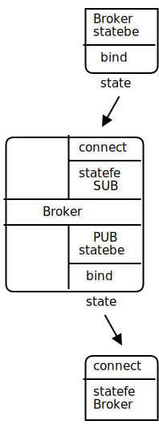

# 3장-고급 요청-응답 패턴(Advanced Request Reply Patterns)
;In Chapter 2 - Sockets and Patterns we worked through the basics of using ØMQ by developing a series of small applications, each time exploring new aspects of ØMQ. We'll continue this approach in this chapter as we explore advanced patterns built on top of ØMQ's core request-reply pattern.

2장-소켓 및 패턴에서 우리는 ØMQ의 새로운 측면에 대하여 일련의 작은 응용프로그램을 개발하여 ØMQ 기본적인 사용 방법을 살펴보았습니다. 3장에서는 ØMQ의 핵심 요청-응답 패턴 위에 만들어진 고급 패턴을 알아보며 작은 응용프로그램을 개발해 보겠습니다.

;We'll cover:
다루는 내용은 다음과 같습니다.

;* How the request-reply mechanisms work
;* How to combine REQ, REP, DEALER, and ROUTER sockets
;* How ROUTER sockets work, in detail
;* The load balancing pattern
;* Building a simple load balancing message broker
;* Designing a high-level API for ØMQ
;* Building an asynchronous request-reply server
;* A detailed inter-broker routing example

* 요청-응답 메커니즘의 작동 방법
* REQ, REP, DEALER 및 ROUTER 소켓 조합 방법
* 상세한 ROUTER 소켓 작동 방법
* 부하 분산 패턴
* 간단한 부하 분산 메시지 브로커 구축
* ØMQ를 위한 고급 API 설계
* 비동기 요청-응답 서버 구축
* 상세한 브로커 간 라우팅 예제

## 요청-응답 메커니즘(request-reply mechanisms)
;We already looked briefly at multipart messages. Let's now look at a major use case, which is reply message envelopes. An envelope is a way of safely packaging up data with an address, without touching the data itself. By separating reply addresses into an envelope we make it possible to write general purpose intermediaries such as APIs and proxies that create, read, and remove addresses no matter what the message payload or structure is.

이미 멀티파트 메시지를 간략히 알아보았습니다. 이제 주요 사용 사례인 응답 메시지 봉투를 알아보겠습니다. 봉투는 데이터 자체를 건드리지 않고 주소로 데이터를 안전하게 포장하는 방법입니다. 봉투에서 응답 주소를 분리하여 메시지 내용 또는 구조에 관계없이 주소를 생성, 읽기 및 제거하는 API 및 프록시와 같은 범용 중개자를 작성할 수 있습니다.

> [옮긴이] 멀티파트 메시지는 여러 개의 프레임들로 하나의 메시지를 구성함

;In the request-reply pattern, the envelope holds the return address for replies. It is how a ØMQ network with no state can create round-trip request-reply dialogs.

요청-응답 패턴에서 봉투는 응답을 위한 반송 주소를 가지고 있습니다. 이것은 상태가 없는 ØMQ 네트워크가 어떻게 왕복 요청-응답 대화를 수행하는 방법입니다.

;When you use REQ and REP sockets you don't even see envelopes; these sockets deal with them automatically. But for most of the interesting request-reply patterns, you'll want to understand envelopes and particularly ROUTER sockets. We'll work through this step-by-step.

REQ 및 REP 소켓을 사용하면 봉투들을 볼 수 조차 없습니다. REQ/REP 소켓들은 자동으로 봉투를 처리하지만 대부분의 흥미로운 요청-응답 패턴의 경우 특히 ROUTER 소켓에서 봉투를 이해하고 싶을 것입니다. 우리는 단계적으로 작업해 나가겠습니다.

### 간단한 응답 봉투(The Simple Reply Envelope)
;A request-reply exchange consists of a request message, and an eventual reply message. In the simple request-reply pattern, there's one reply for each request. In more advanced patterns, requests and replies can flow asynchronously. However, the reply envelope always works the same way.

요청-응답 교환은 요청 메시지와 이에 따른 응답 메시지로 구성됩니다. 간단한 요청-응답 패턴에는 각 요청에 대해 하나의 응답이 있습니다. 고급 패턴에서는 요청과 응답이 비동기적으로 동작할 수 있지만 응답 봉투는 항상 동일한 방식으로 동작합니다.

;The ØMQ reply envelope formally consists of zero or more reply addresses, followed by an empty frame (the envelope delimiter), followed by the message body (zero or more frames). The envelope is created by multiple sockets working together in a chain. We'll break this down.

ØMQ 응답 봉투는 공식적으로 0개 이상의 회신 주소, 공백 구분자, 메시지 본문(0개 이상의 프레임들)으로 구성됩니다. 봉투는 순차적으로 여러 소켓에 의해 생성되어 함께 동작합니다. 우리는 이것을 구체적으로 살펴보겠습니다.

;We'll start by sending "Hello" through a REQ socket. The REQ socket creates the simplest possible reply envelope, which has no addresses, just an empty delimiter frame and the message frame containing the "Hello" string. This is a two-frame message.

REQ 소켓을 통해 "Hello"를 보내는 것으로 시작하겠습니다. REQ 소켓은 주소가 없고 공백 구분자 프레임과 "Hello" 문자열이 포함된 메시지 프레임만 있는 가장 간단한 응답 봉투를 생성합니다. 이것은 2개의 프레임으로 구성된 메시지입니다.

그림 26 - 최소 봉투 요청(Request with Minimal Envelope)


;The REP socket does the matching work: it strips off the envelope, up to and including the delimiter frame, saves the whole envelope, and passes the "Hello" string up the application. Thus our original Hello World example used request-reply envelopes internally, but the application never saw them.

REP 소켓은 일치하는 작업을 수행합니다. 봉투에서 공백 구분자 프레임 제거하고 전체 봉투를 저장한 후 "Hello" 문자열을 응용프로그램에 전달합니다. 따라서 우리의 원래 Hello World 예제는 내부적으로 요청-응답 봉투를 처리하여 응용프로그램에서는 이를 보지 못했습니다.

;If you spy on the network data flowing between hwclient and hwserver, this is what you'll see: every request and every reply is in fact two frames, an empty frame and then the body. It doesn't seem to make much sense for a simple REQ-REP dialog. However you'll see the reason when we explore how ROUTER and DEALER handle envelopes.

hwclient와 hwserver 사이에 흐르는 네트워크 데이터를 감시한다면,  보게 될 것은 다음과 같습니다. : 모든 요청과 모든 응답은 사실 두 개의 프레임으로 "하나의 공백 프레임"과 "본문"입니다. 간단한 REQ-REP 대화에는 별 의미가 없는 것 같지만 ROUTER와 DEALER가 봉투를 다루는 방법을 살펴보면 그 이유를 알 수 있습니다.

### 확장된 응답 봉투(The Extended Reply Envelope)
;Now let's extend the REQ-REP pair with a ROUTER-DEALER proxy in the middle and see how this affects the reply envelope. This is the extended request-reply pattern we already saw in Chapter 2 - Sockets and Patterns. We can, in fact, insert any number of proxy steps. The mechanics are the same.

이제 REQ-REP 쌍 사이에 ROUTER-DEALER 프록시 두어 확장하고 이것이 응답 봉투에 어떤 영향을 주는지 알아보겠습니다. 이것은 확장된 요청-응답 패턴으로 "2장-소켓 및 패턴"에서 보았습니다. 실제로 프록시 단계를 원하는 만큼 삽입할 수 있습니다. 동작 방식은 동일합니다.

그림 27 - 확장된 요청-응답 패턴


;The proxy does this, in pseudo-code:

가상 코드에서 프록시는 아래와 같이 동작합니다.

```python
prepare context, frontend and backend sockets
while true:
    poll on both sockets
    if frontend had input:
        read all frames from frontend
        send to backend
    if backend had input:
        read all frames from backend
        send to frontend
```

;The ROUTER socket, unlike other sockets, tracks every connection it has, and tells the caller about these. The way it tells the caller is to stick the connection identity in front of each message received. An identity, sometimes called an address, is just a binary string with no meaning except "this is a unique handle to the connection". Then, when you send a message via a ROUTER socket, you first send an identity frame.

ROUTER 소켓은 다른 소켓과 달리 모든 연결을 추적하고 호출자에게 이에 대해 알려줍니다. 호출자에게 알리는 방법은 수신된 각 메시지 선두에 연결 식별자(ID)를 붙이는 것입니다. 때때로 주소라고도 할 수 있는 식별자(ID)는 "이것은 연결에 대한 고유한 핸들"이란 의미를 가진 이진 문자열(binary string)입니다. 그래서 ROUTER 소켓을 통해 메시지를 보낼 때 먼저 식별자(ID) 프레임을 보냅니다.

;The zmq_socket() man page describes it thus:

'zmq_socket()' 매뉴얼에서는 이와 같이 설명합니다.

;> When receiving messages a ZMQ_ROUTER socket shall prepend a message part containing the identity of the originating peer to the message before passing it to the application. Messages received are fair-queued from among all connected peers. When sending messages a ZMQ_ROUTER socket shall remove the first part of the message and use it to determine the identity of the peer the message shall be routed to.

메시지를 수신할 때 ZMQ_ROUTER 소켓은 메시지를 응용프로그램에 전달하기 전에 발신 상대의 식별자(ID)를 포함하는 메시지 부분을 메시지 선두에 추가해야 합니다. 수신된 메시지는 연결된 모든 상대 사이의 공정 대기열에 놓입니다. ZMQ_ROUTER 소켓에서 메시지를 보낼 때 메시지의 첫 번째 부분을 제거하고 이를 사용하여 메시지가 라우팅 될 상대의 식별자(ID)가 되게 합니다.

;As a historical note, ØMQ v2.2 and earlier use UUIDs as identities, and ØMQ v3.0 and later use short integers. There's some impact on network performance, but only when you use multiple proxy hops, which is rare. Mostly the change was to simplify building libzmq by removing the dependency on a UUID library.

지난 이야기지만, ØMQ v2.2 이전 버전의 식별자(ID)로 UUID를 사용하였으며, ØMQ 3.0 이후부터는 짧은 정수를 사용하고 있습니다.
이런 변화는 네트워크 성능을 개선하는 영향을 주지만, 다중 프록시 홉(hops)을 사용하는 경우는 영향은 미미한 것입니다.
주목할만한 영향은 libzmq에서 UUID 생성에 필요한 라이브러리에 의존성을 제거한 것입니다.

> [옮긴이] UUID(universally unique identifier)은 네트워크 상에서 서로 모르는 개체들을 식별하고 구별하기 위해서는 각각의 고유한 식별자로 32개의 십육진수(4bit)인 128 bits의 수로 표현됩니다(예 : 550e8400-e29b-41d4-a716-446655440000).

;Identies are a difficult concept to understand, but it's essential if you want to become a ØMQ expert. The ROUTER socket invents a random identity for each connection with which it works. If there are three REQ sockets connected to a ROUTER socket, it will invent three random identities, one for each REQ socket.

식별자들(IDs)은 이해하기 어려운 개념이지만 ØMQ 전문가가 되고 싶다면 필수입니다. ROUTER 소켓은 작동하는 각 연결에 대해 임의의 식별자(ID)를 만듭니다. ROUTER 소켓에 3개의 REQ 소켓이 연결되어 있는 경우 각각의 REQ 소켓에 대해 하나씩 3개의 임의의 ID를 생성합니다.

;So if we continue our worked example, let's say the REQ socket has a 3-byte identity ABC. Internally, this means the ROUTER socket keeps a hash table where it can search for ABC and find the TCP connection for the REQ socket.

동작 가능한 예제로 계속하면 REQ 소켓에 3 바이트 식별자(ID) ABC가 있다고 하면 내부적으로 ROUTER 소켓이 ABC를 검색할 수 있는 해쉬 테이블 가지고 REQ 소켓에 대한 TCP 연결을 찾을 수 있게 합니다.

;When we receive the message off the ROUTER socket, we get three frames.

ROUTER 소켓에서 메시지를 받으면 3개의 프레임을 얻습니다.

그림 28 - 주소가 있는 요청(Request with One Address)


;The core of the proxy loop is "read from one socket, write to the other", so we literally send these three frames out on the DEALER socket. If you now sniffed the network traffic, you would see these three frames flying from the DEALER socket to the REP socket. The REP socket does as before, strips off the whole envelope including the new reply address, and once again delivers the "Hello" to the caller.

프록시 루프의 핵심은 "한 소켓에서 읽고 다른 소켓에 쓰기"이므로, 문자 그대로 3개의 프레임을 DEALER 소켓으로 보냅니다.  네트워크 트래픽을 엿보기한다면 3개의 프레임이 DEALER 소켓에서 REP 소켓으로 이동하는 것을 볼 수 있습니다. REP 소켓은 이전과 마찬가지로 새 응답 주소를 포함하여 전체 봉투를 제거하고 다시 한번 호출자에게 "Hello"를 전달합니다.

;Incidentally the REP socket can only deal with one request-reply exchange at a time, which is why if you try to read multiple requests or send multiple replies without sticking to a strict recv-send cycle, it gives an error.

부수적으로 REP 소켓은 한 번에 하나의 요청-응답만 처리할 수 있으므로 엄격한 송/수신 주기를 지키지 않고 여러 개의 요청을 읽어 여러 개의 응답을 보내려고 하면 오류가 발생하는 원인입니다.

;You should now be able to visualize the return path. When hwserver sends "World" back, the REP socket wraps that with the envelope it saved, and sends a three-frame reply message across the wire to the DEALER socket.

이제 반환 경로를 시각화할 수 있습니다. `hwserver`가 "World"를 다시 보내면 REP 소켓은 저장한 봉투에 감싸고 네트워크를 통해 DEALER 소켓으로 3개 프레임(ID + empty delimiter + body) 응답 메시지를 보냅니다.

그림 29 - 주소가 있는 응답


;Now the DEALER reads these three frames, and sends all three out via the ROUTER socket. The ROUTER takes the first frame for the message, which is the ABC identity, and looks up the connection for this. If it finds that, it then pumps the next two frames out onto the wire.

DEALER는 3개의 프레임을 읽고 3개의 모든 프레임을 ROUTER 소켓에 전달됩니다.
ROUTER는 첫 번째 메시지 프레임을 읽고 ABC라는 ID에 해당하는 연결을 찾습니다. 연결을 찾으면 나머지 2개 프레임(empty delimiter + body)을 네트워크에 보냅니다.

그림 30 - 최소 응답 봉투(Reply with Minimal Envelope)


;The REQ socket picks this message up, and checks that the first frame is the empty delimiter, which it is. The REQ socket discards that frame and passes "World" to the calling application, which prints it out to the amazement of the younger us looking at ØMQ for the first time.

REQ 소켓은 전달된 메시지를 받아 첫 번째 프레임이 공백 구분자인지 확인하고 맞으면 REQ 소켓은 공백 구분자 프레임을 버리고 "World"를 호출한  응용프로그램에 전달합니다. 그러면 ØMQ를 시작했을 때의 놀라움으로 응용프로그램에서 "World"가 출력됩니다.

> [옮긴이] 송/수신시에 프레임 구성
  - 송신 : APP-["Hello"]-REQ-[""+"Hello"]-ROUTER-[ID+""+"Hello"]-DEALER-[ID+""+"Hello"]-REP-["Hello"]-APP
  - 수신 : APP-["World"]-REP-[ID+""+"World"]-DEALER-[ID+""+"World"]-ROUTER-[""+"World"]-REQ-["World"]-APP

> [옮긴이] 송/수신 시에 프레임 전달에 대한 테스트를 위하여 "test_frame.c"을 작성하였으며 czmq 라이브러리를 사용합니다.
- test_frame.c Hello World 예제 프로그램의 프레임 흐름

```cpp
//  Multithreaded Hello World server
#include "czmq.h"
#define NBR_THREADS 1
static void *
worker_routine (zctx_t *ctx) {
    //  Socket to talk to dispatcher    
    void *receiver = zsocket_new (ctx, ZMQ_REP);
    zsocket_connect (receiver, "inproc://workers");
    while (!zctx_interrupted) {
        zmsg_t *request = zmsg_recv (receiver);
        if(!request)
            break; // interrupted
        printf ("[REP-APP]Received request: \n");
        zmsg_dump (request);
        zmsg_destroy (&request);
        //  Do some 'work'
        zclock_sleep (1000);
        //  Send reply back to client
        zmsg_t *reply = zmsg_new (); 
        zmsg_addstr (reply, "World");   
        zmsg_send (&reply, receiver);
        zmsg_destroy (&reply);
    }
    zsocket_destroy(ctx, receiver);
    return NULL;
}

static void *
client_routine (zctx_t *ctx) {
    //  Socket to talk to dispatcher   
    void *sender = zsocket_new (ctx, ZMQ_REQ);
    zsocket_connect (sender, "inproc://clients");
    while (!zctx_interrupted) {        
        zmsg_t *request = zmsg_new (); 
        zmsg_addstr (request, "Hello");        
        //  Send request to worker
        zmsg_send (&request, sender);
        zmsg_destroy (&request);
        zmsg_t *reply = zmsg_recv (sender);
        printf ("[REQ-APP]Received reply: \n");
        zmsg_dump (reply);
        zmsg_destroy (&reply);
    }
    zsocket_destroy (ctx, sender);
    return NULL;
}

int main (void)
{
    zctx_t *ctx = zctx_new ();
    //  Socket to talk to clients
    void *frontend = zsocket_new (ctx, ZMQ_ROUTER);
    zsocket_bind (frontend, "inproc://clients");
    //  Socket to talk to workers
    void *backend = zsocket_new (ctx, ZMQ_DEALER);
    zsocket_bind (backend, "inproc://workers");

    int thread_nbr;
    //  Launch pool of client threads
    for (thread_nbr = 0; thread_nbr < NBR_THREADS; thread_nbr++) {        
        zthread_new (client_routine, ctx);
    }
   //  Launch pool of worker threads
    for (thread_nbr = 0; thread_nbr < NBR_THREADS; thread_nbr++) {        
        zthread_new (worker_routine, ctx);
    }
     //  Initialize poll set
    zmq_pollitem_t items [] = {
        { frontend, 0, ZMQ_POLLIN, 0 },
        { backend,  0, ZMQ_POLLIN, 0 }
    };   
    //  Connect work threads to client threads via a queue proxy
    while (!zctx_interrupted) {        
        zmq_poll (items, 2, -1);
        if (items [0].revents & ZMQ_POLLIN) {
            //  Process all parts of the message
            zmsg_t *message = zmsg_recv (frontend);
            if(!message)
                break; // interrupted
            printf ("[REQ-ROUTER]Received message: \n");
            zmsg_dump (message);
            zmsg_send (&message, backend);
            zmsg_destroy (&message);
        }
        if (items [1].revents & ZMQ_POLLIN) {
            zmsg_t *message = zmsg_recv (backend);
            if(!message)
                break; // interrupted
            printf ("[REP-DEALER]Received message: \n");
            zmsg_dump (message);
            zmsg_send (&message, frontend);
            zmsg_destroy (&message);
        }
    }
    zsocket_destroy (ctx, backend);
    zsocket_destroy (ctx, frontend);
    zctx_destroy (&ctx);
    return 0;
}
```
> [옮긴이] 빌드 및 테스트

~~~{.bash}
S D:\git_store\zguide-kr\examples\C> cl -EHsc test_frame.c libzmq.lib czmq.lib
PS D:\git_store\zguide-kr\examples\C> ./test_frame
[REQ-ROUTER]Received message:
D: 20-09-04 16:20:48 [005] 0080000029     --> ID
D: 20-09-04 16:20:48 [000]                --> 공백 구분자
D: 20-09-04 16:20:48 [005] Hello          --> 데이터
[REP-APP]Received request:
D: 20-09-04 16:20:48 [005] Hello          --> 데이터
[REP-DEALER]Received message:
D: 20-09-04 16:20:49 [005] 0080000029     --> ID
D: 20-09-04 16:20:49 [000]                --> 공백 구분자
D: 20-09-04 16:20:49 [005] World          --> 데이터
[REQ-APP]Received reply:
D: 20-09-04 16:20:49 [005] World          --> 데이터
...
~~~

### 이것이 좋은 이유는?(What's This Good For?)
;To be honest, the use cases for strict request-reply or extended request-reply are somewhat limited. For one thing, there's no easy way to recover from common failures like the server crashing due to buggy application code. We'll see more about this in Chapter 4 - Reliable Request-Reply Patterns. However once you grasp the way these four sockets deal with envelopes, and how they talk to each other, you can do very useful things. We saw how ROUTER uses the reply envelope to decide which client REQ socket to route a reply back to. Now let's express this another way:

솔직하게 엄격한 요청-응답 또는 확장된 요청-응답을 사용하는 경우는 다소 제한적입니다. 첫째, 오류가 있는 응용프로그램 코드로 인한 서버 실패와 같은 일반적인 오류로부터 쉽게 복구할 수 있는 방법이 없습니다. "4장-신뢰할 수 있는 요청-응답 패턴"에서 자세히 다루겠습니다. 하지만 4개의 소켓(REQ-ROUTER-DEALER-REP)이 봉투를 처리하는 방식과 서로 대화하는 방식을 파악하면 매우 유용한 작업을 수행할 수 있습니다. ROUTER가 응답 봉투를 사용하여 응답을 다시 라우팅 할 클라이언트 REQ 소켓을 결정하는 것을 보았습니다. 이제 다른 방식으로 표현해 보겠습니다.

;* Each time ROUTER gives you a message, it tells you what peer that came from, as an identity.
;* You can use this with a hash table (with the identity as key) to track new peers as they arrive.
;* ROUTER will route messages asynchronously to any peer connected to it, if you prefix the identity as the first frame of the message.

* ROUTER가 메시지를 줄 때마다, ROUTER는 식별자(ID)로 어떤 상대로부터 왔는지 알려줍니다.
* 응용프로그램에서 해쉬 테이블로 식별자(ID)를 관리하여 도착된 새로운 상대를 추적할 수 있습니다.
* 메시지의 첫 번째 프레임으로 식별자(ID)를 접두사로 지정하면, ROUTER는 연결된 모든 상대에 비동기로 메시지들을 라우팅합니다.

;ROUTER sockets don't care about the whole envelope. They don't know anything about the empty delimiter. All they care about is that one identity frame that lets them figure out which connection to send a message to.

ROUTER 소켓은 전체 봉투를 관여하지 않으며 공백 구분자에 대해서도 모릅니다. ROUTER 소켓이 관심을 갖는 것은 식별자(ID) 프레임으로 메시지를 보낼 연결(connection)을 아는 것입니다.

### 요청-응답 소켓 정리(Recap of Request-Reply Socket)
;Let's recap this:

정리하면 다음과 같습니다.

;* The REQ socket sends, to the network, an empty delimiter frame in front of the message data. REQ sockets are synchronous. REQ sockets always send one request and then wait for one reply. REQ sockets talk to one peer at a time. If you connect a REQ socket to multiple peers, requests are distributed to and replies expected from each peer one turn at a time.
;* The REP socket reads and saves all identity frames up to and including the empty delimiter, then passes the following frame or frames to the caller. REP sockets are synchronous and talk to one peer at a time. If you connect a REP socket to multiple peers, requests are read from peers in fair fashion, and replies are always sent to the same peer that made the last request.
;* The DEALER socket is oblivious to the reply envelope and handles this like any multipart message. DEALER sockets are asynchronous and like PUSH and PULL combined. They distribute sent messages among all connections, and fair-queue received messages from all connections.
;* The ROUTER socket is oblivious to the reply envelope, like DEALER. It creates identities for its connections, and passes these identities to the caller as a first frame in any received message. Conversely, when the caller sends a message, it uses the first message frame as an identity to look up the connection to send to. ROUTERS are asynchronous.

* REQ 소켓은 메시지 데이터 앞에 공백 구분자 프레임을 넣어 네트워크로 보냅니다. REQ 소켓은 동기식으로 REQ 소켓은 항상 하나의 요청을 보내고 하나의 응답을 기다립니다. REQ 소켓은 한 번에 하나의 상대와 통신합니다. REQ 소켓을 여러 상대에 연결하려면, 요청들은 한 번에 하나씩 각 상대에 분산되고 응답이 예상됩니다.
* REP 소켓은 모든 식별자(ID) 프레임과 공백 구분자를 읽고 저장한 다음 프레임을 호출자에게 전달합니다. REP 소켓은 동기식이며 한 번에 하나의 상대와 통신합니다. REP 소켓을 여러 개의 단말들에 연결하면 요청들은 상대로부터 공정한 형태로 읽히고, 응답은 항상 마지막 요청을 한 동일한 상대로 전송됩니다.
* DEALER 소켓은 응답 봉투를 인식하지 못하며 응답 봉투를 멀티파트 메시지처럼 처리합니다. DEALER 소켓은 비동기식이며 PUSH와 PULL이 결합된 것과 같으며 모든 연결 간에 보내진 메시지(ROUTER->DEALER)를 배포하고 모든 연결에서 받은 메시지(REP->DEALER)를 순서대로 공정 대기열에 보관합니다.
* ROUTER 소켓은 DEALER처럼 응답 봉투를 인식하지 못합니다. ROUTER는 연결에 대한 식별자(ID)를 만들고 수신된 메시지의 첫 번째 프레임으로 생성한 식별자(ID)를 호출자에게 전달합니다. 반대로 호출자가 메시지를 보낼 때 첫 번째 메시지 프레임을 식별자(ID)로 사용하여 보낼 연결을 찾습니다. ROUTER는 비동기로 동작합니다.

## 요청-응답 조합
;We have four request-reply sockets, each with a certain behavior. We've seen how they connect in simple and extended request-reply patterns. But these sockets are building blocks that you can use to solve many problems.

각각 특정 동작을 하는 4개의 요청-응답 소켓들(REQ, ROUTER, DELEAER, REP)이 있으며 그들이 단순하고 확장된 요청-응답 패턴들(request-reply patterns)로 연결되는 방법을 보았습니다. 이러한 소켓은 많은 문제를 해결하기 위해 사용될 수 있는 구성요소로 사용될 것입니다.

;These are the legal combinations:

규정된 조합은 다음과 같습니다.

* REQ에서 REP
* DEALER에서 REP
* REQ에서 ROUTER
* DEALER에서 ROUTER
* DEALER에서 DEALER
* ROUTER에서 ROUTER

;And these combinations are invalid (and I'll explain why):

다음 조합은 유효하지 않습니다(이유를 설명하겠습니다).

* REQ에서 REQ
* REQ에서 DEALER
* REP에서 REP
* REP에서 ROUTER

;Here are some tips for remembering the semantics. DEALER is like an asynchronous REQ socket, and ROUTER is like an asynchronous REP socket. Where we use a REQ socket, we can use a DEALER; we just have to read and write the envelope ourselves. Where we use a REP socket, we can stick a ROUTER; we just need to manage the identities ourselves.

의미를 상기하기 위한 몇 가지 팁들입니다. DEALER는 비동기 REQ 소켓과 같고 ROUTER는 비동기 REP 소켓과 같습니다. REQ 소켓을 사용하는 경우 DEALER를 사용할 수 있으며 봉투에 직접 읽고 쓸 수 있어야 합니다. REP 소켓을 사용하는 곳에 ROUTER를 사용할 수 있으며 식별자(ID) 프레임을 직접 관리해야 합니다.

;Think of REQ and DEALER sockets as "clients" and REP and ROUTER sockets as "servers". Mostly, you'll want to bind REP and ROUTER sockets, and connect REQ and DEALER sockets to them. It's not always going to be this simple, but it is a clean and memorable place to start.

REQ 및 DEALER 소켓을 "클라이언트"로, REP 및 ROUTER 소켓을 "서버"로 생각하십시오. 대부분 REP 및 ROUTER 소켓을 서버처럼 바인딩하고 REQ 및 DEALER 소켓을 클라이언트처럼 연결하려고 합니다. 항상 이렇게 간단하지는 않지만 시작하기에 깨끗하고 기억에 남을 것입니다.

### REQ와 REP 조합
;We've already covered a REQ client talking to a REP server but let's take one aspect: the REQ client must initiate the message flow. A REP server cannot talk to a REQ client that hasn't first sent it a request. Technically, it's not even possible, and the API also returns an EFSM error if you try it.

이미 REP 서버와 통신하는 REQ 클라이언트를 다루었지만 한 가지 측면을 살펴보겠습니다. REQ 클라이언트는 메시지 흐름을 시작해야 하며 REP 서버는 처음에 요청을 하지 않은 REQ 클라이언트와 통신할 수 없습니다. 기술적으로도 불가능하며, REP 서버에서 API 호출을 시도하면 EFSM 오류도 반환합니다.

### DEALER와 REP 조합
;Now, let's replace the REQ client with a DEALER. This gives us an asynchronous client that can talk to multiple REP servers. If we rewrote the "Hello World" client using DEALER, we'd be able to send off any number of "Hello" requests without waiting for replies.

이제 DEALER로 REQ 클라이언트를 바꾸며 여러 REP 서버들과 통신할 수 있는 비동기 클라이언트(asynchronous client)로 제공할 수 있습니다. DEALER를 사용하여 "Hello World" 클라이언트를 다시 작성하면 응답을 기다리지 않고 "Hello"요청을 얼마든지 보낼 수 있습니다.

;When we use a DEALER to talk to a REP socket, we must accurately emulate the envelope that the REQ socket would have sent, or the REP socket will discard the message as invalid. So, to send a message, we:

DEALER를 사용하여 REP 소켓과 통신할 때, REQ 소켓이 보낸 봉투(empty delimiter + body)를 정확하게 모방하며 그렇지 않으면 REP 소켓이 잘못된 메시지로 버립니다. 따라서 메시지를 보내려면 :

;* Send an empty message frame with the MORE flag set; then
;* Send the message body.

* MORE 플래그가 설정된 빈 메시지 프레임을 보내고
* 메시지 본문을 보냅니다.

;And when we receive a message, we:

그리고 REP 소켓에서 메시지를 받으면

;* Receive the first frame and if it's not empty, discard the whole message;
;* Receive the next frame and pass that to the application.

* 첫 번째 프레임을 받고 비어 있지 않으면 전체 메시지를 버립니다.
* 다음 프레임을 수신하고 응용프로그램에 전달합니다.

### REQ와 ROUTER 조합
;In the same way that we can replace REQ with DEALER, we can replace REP with ROUTER. This gives us an asynchronous server that can talk to multiple REQ clients at the same time. If we rewrote the "Hello World" server using ROUTER, we'd be able to process any number of "Hello" requests in parallel. We saw this in the Chapter 2 - Sockets and Patterns mtserver example.

REQ를 DEALER로 대체하는 것과 같이 REP를 ROUTER로 대체할 수 있습니다. 여러 REQ 클라이언트와 동시에 통신할 수 있는 비동기 서버를 제공합니다. ROUTER를 사용하여 "Hello World" 서버를 다시 작성하면 여러 "Hello" 요청을 병렬로 처리할 수 있습니다. 이것을 "2장-소켓 및 패턴"에서 mtserver 예제를 보았습니다.

> [옮긴이] mtserver 예제는 여러 개(예 : 10개)의 hwclient 요청을 ROUTER 소켓(asynchronous server)에서 받아 프록시(zmq_proxy())로 DEALER 소켓으로 전달하면 5개의 worker 스레드들이 받아 응답하는 형태입니다.

> [옮긴이] mtserver 예제에서는 worker에 대하여서만 스레드 구성하였으나, 다음 예제에서는 client도 스레드로 구성하여 테스트하였습니다.

- mtserver_client.c : 다중 서버와 클라이언트 스레드를 통한 테스트

```cpp
//  Multithreaded Hello World server

#include "zhelpers.h"
#include <pthread.h>
#ifndef _WIN32
#include <unistd.h>
#endif

static void *
client_routine (void *context) {
    //  Socket to talk to dispatcher
    void *sender = zmq_socket (context, ZMQ_REQ);
    zmq_connect (sender, "inproc://clients");

    while (1) {
        s_send (sender, "Hello");
        char *string = s_recv (sender);
        printf ("Received reply: [%s]\n", string);
        free (string);
    }
    zmq_close (sender);
    return NULL;
}

static void *
worker_routine (void *context) {
    //  Socket to talk to dispatcher
    void *receiver = zmq_socket (context, ZMQ_REP);
    zmq_connect (receiver, "inproc://workers");

    while (1) {
        char *string = s_recv (receiver);
        printf ("Received request: [%s]\n", string);
        free (string);
        //  Do some 'work'
        s_sleep (1000);
        //  Send reply back to client
        s_send (receiver, "World");
    }
    zmq_close (receiver);
    return NULL;
}

int main (void)
{
    void *context = zmq_ctx_new ();

    //  Socket to talk to clients
    void *clients = zmq_socket (context, ZMQ_ROUTER);
    zmq_bind (clients, "inproc://clients");

    //  Socket to talk to workers
    void *workers = zmq_socket (context, ZMQ_DEALER);
    zmq_bind (workers, "inproc://workers");

     //  Launch pool of client threads
    int thread_nbr;
    for (thread_nbr = 0; thread_nbr < 5; thread_nbr++) {
        pthread_t client;
        pthread_create (&client, NULL, client_routine, context);
    }   

    //  Launch pool of worker threads
    for (thread_nbr = 0; thread_nbr < 5; thread_nbr++) {
        pthread_t worker;
        pthread_create (&worker, NULL, worker_routine, context);
    }
    //  Connect work threads to client threads via a queue proxy
    zmq_proxy (clients, workers, NULL);

    //  We never get here, but clean up anyhow
    zmq_close (clients);
    zmq_close (workers);
    zmq_ctx_destroy (context);
    return 0;
}
```
> [옮긴이] 빌드 및 테스트

~~~{.bash}
PS D:\git_store\zguide-kr\examples\C> cl -EHsc mtserver_client.c libzmq.lib pthreadVC2.lib

PS D:\git_store\zguide-kr\examples\C> ./mtserver_client
Received request: [Hello]
Received request: [Hello]
Received reply: [World]
Received request: [Hello]
Received reply: [World]
Received request: [Hello]
Received request: [Hello]
Received reply: [World]
Received reply: [World]
...
~~~

;We can use ROUTER in two distinct ways:

ROUTER 소켓은 두 가지 사용법이 있습니다.

;* As a proxy that switches messages between frontend and backend sockets.
;* As an application that reads the message and acts on it.

* 프론트엔드와 백엔드 소켓들 간에 메시지를 전환하는 프록시로 사용
* 응용프로그램으로 메시지를 읽고 그에 따라 행동하도록 사용

;In the first case, the ROUTER simply reads all frames, including the artificial identity frame, and passes them on blindly. In the second case the ROUTER must know the format of the reply envelope it's being sent. As the other peer is a REQ socket, the ROUTER gets the identity frame, an empty frame, and then the data frame.

첫 번째 경우 ROUTER는 단순히 인위적인 식별자(ID) 프레임을 포함한 모든 프레임들을 읽고 맹목적으로 전달합니다. 두 번째 경우 ROUTER는 전송된 응답 봉투의 형식을 알아야 합니다. 다른 상대가 REQ 소켓이므로 ROUTER는 식별자 프레임(ID), 공백 프레임(empty delimiter) 및 데이터 프레임(body)을 가져옵니다.


### DEALER와 ROUTER 조합
;Now we can switch out both REQ and REP with DEALER and ROUTER to get the most powerful socket combination, which is DEALER talking to ROUTER. It gives us asynchronous clients talking to asynchronous servers, where both sides have full control over the message formats.

이제 REQ와 REP를 DEALER 및 ROUTER로 전환하여 가장 강력한 소켓 조합을 얻을 수 있습니다. DEALER는 ROUTER와 통신합니다. 이것은 비동기 클라이언트들(DEALER)가 비동기 서버들(ROUTER)와 통신하여 양측에서 메시지 형식을 완전히 제어하게 합니다.

;Because both DEALER and ROUTER can work with arbitrary message formats, if you hope to use these safely, you have to become a little bit of a protocol designer. At the very least you must decide whether you wish to emulate the REQ/REP reply envelope. It depends on whether you actually need to send replies or not.

DEALER와 ROUTER는 임의의 메시지 형식으로 작업할 수 있기 때문에 안전하게 사용하려면  프로토콜 디자이너가 되어야 합니다. 최소한 REQ/REP 응답 봉투를 모방할지 여부를 결정해야 합니다. 실제로 답장을 보내야 하는지 여부에 따라 다릅니다.

### DEALER와 DEALER 조합
;You can swap a REP with a ROUTER, but you can also swap a REP with a DEALER, if the DEALER is talking to one and only one peer.

REP를 ROUTER와 교체할 수 있지만, DEALER가 단 하나의 상대와 통신하는 경우 DEALER를 REP로 교체할 수 있습니다.

;When you replace a REP with a DEALER, your worker can suddenly go full asynchronous, sending any number of replies back. The cost is that you have to manage the reply envelopes yourself, and get them right, or nothing at all will work. We'll see a worked example later. Let's just say for now that DEALER to DEALER is one of the trickier patterns to get right, and happily it's rare that we need it.

REP를 DEALER로 교체하면 작업자가 갑자기 전체 비동기식으로 전환되어 원하는 수의 응답을 다시 보낼 수 있습니다. 이에 따른 대가는 응답 봉투를 직접 관리하고 올바르게 처리해야 해야 하며 그렇지 않으면 아무것도 작동하지 않습니다. 나중에 작동되는 예제를 보겠습니다. 지금 당장은 DEALER와 DEALER가 제대로 작동하기에는 까다로운 패턴 중 하나이며 다행히도 우리가 필요로 하는 경우는 드뭅니다.

### ROUTER와 ROUTER 조합
;This sounds perfect for N-to-N connections, but it's the most difficult combination to use. You should avoid it until you are well advanced with ØMQ. We'll see one example it in the Freelance pattern in Chapter 4 - Reliable Request-Reply Patterns, and an alternative DEALER to ROUTER design for peer-to-peer work in Chapter 8 - A Framework for Distributed Computing.

이것은 N 대 N 연결에 완벽하게 들리지만 사용하기 가장 어려운 조합입니다. ØMQ에 익숙해질 때까지 피해야 합니다. "4장-신뢰할 수 있는 요청-응답 패턴"의 프리랜서 패턴에서 한 가지 예제를 보겠으며, "8장 - 분산 컴퓨팅을 위한 프레임워크"에서 P2P(peer-to-peer) 작업을 위한 ROUTER 설계를 대체하는 DEALER 설계를 보겠습니다.

### 잘못된 조합(Invalid Combinations)
;Mostly, trying to connect clients to clients, or servers to servers is a bad idea and won't work. However, rather than give general vague warnings, I'll explain in detail:

대부분의 경우 클라이언트를 클라이언트에 연결하거나, 서버를 서버에 연결하는 것은 나쁜 생각이며 동작하지 않습니다. 그러나 일반적으로 모호한 경고를 하기보다는 자세히 설명하겠습니다.

;* REQ to REQ: both sides want to start by sending messages to each other, and this could only work if you timed things so that both peers exchanged messages at the same time. It hurts my brain to even think about it.
;* REQ to DEALER: you could in theory do this, but it would break if you added a second REQ because DEALER has no way of sending a reply to the original peer. Thus the REQ socket would get confused, and/or return messages meant for another client.
;* REP to REP: both sides would wait for the other to send the first message.
;* REP to ROUTER: the ROUTER socket can in theory initiate the dialog and send a properly-formatted request, if it knows the REP socket has connected and it knows the identity of that connection. It's messy and adds nothing over DEALER to ROUTER.

* REQ와 REQ 조합 : 양측은 서로에게 메시지를 보내는 것으로 시작하기를 원하며, 두 피어가 동시에 메시지를 교환하도록 시간을 정한 경우에만 작동합니다. 생각만 해도 머리가 아픕니다.
* REQ와 DEALER 조합 : 이론적으로는 이것을 할 수 있지만, DEALER에 두 번째 REQ를 추가하면 원래 상대에게 답장을 보낼 방법이 없기 때문에 REQ와 DEALER 간의 통신은 중단됩니다. 따라서 REQ 소켓은 혼란스럽고 다른 클라이언트를 위한 메시지를 반환합니다.
* REP와 REP 조합 : 양측은 상대방이 첫 번째 메시지를 보내기를 기다립니다.
* REP와 ROUTER 조합 : ROUTER 소켓은 이론적으로 REP 소켓이 연결되어 있고 해당 연결된 식별자(ID)를 알고 있는 경우 통신을 시작하고 적절한 형식의 요청을 할 수 있지만, 그것은 지저분하고 ROUTER와 DEALER 위에 아무것도 추가하지 않습니다.

;The common thread in this valid versus invalid breakdown is that a ØMQ socket connection is always biased towards one peer that binds to an endpoint, and another that connects to that. Further, that which side binds and which side connects is not arbitrary, but follows natural patterns. The side which we expect to "be there" binds: it'll be a server, a broker, a publisher, a collector. The side that "comes and goes" connects: it'll be clients and workers. Remembering this will help you design better ØMQ architectures.

ØMQ의 올바른 소켓의 조합에 대해 일반적인 사항은 항상 어느 한쪽이 단말에 바인딩하고 다른 쪽에서는 연결한다는 것입니다.
추가로, 어느 쪽에서 바인드를 하거나 연결을 해도 상관없지만 자연스러운 패턴을 따라야 합니다.
"확실(정적)한 존재"임이 기대되는 측면이 바인드를 실시해 : 서버, 브로커, 발행자, 수집가가 될 것입니다. '희미(동적)한 존재'는 연결을 실시해 :클라이언트와 작업자가 될 것입니다.
이를 기억해두면 더 좋은 ØMQ 아키텍처를 설계하는 데 도움이 됩니다.

## ROUTER 소켓 알아보기(Exploring ROUTER Sockets)
;Let's look at ROUTER sockets a little closer. We've already seen how they work by routing individual messages to specific connections. I'll explain in more detail how we identify those connections, and what a ROUTER socket does when it can't send a message.

ROUTER 소켓을 좀 더 자세히 보겠습니다. ROUTER가 개별 메시지를 특정 연결들로 라우팅하는 것을 보았습니다. 이러한 연결들을 식별하는 방법과 메시지를 보낼 수 없는 경우 ROUTER 소켓이 수행하는 작업에 대해 자세히 설명하겠습니다.

### 식별자(Identities)와 주소(addresses)
;The identity concept in ØMQ refers specifically to ROUTER sockets and how they identify the connections they have to other sockets. More broadly, identities are used as addresses in the reply envelope. In most cases, the identity is arbitrary and local to the ROUTER socket: it's a lookup key in a hash table. Independently, a peer can have an address that is physical (a network endpoint like "tcp://192.168.55.117:5670") or logical (a UUID or email address or other unique key).

ØMQ에서 식별자(ID)의 개념은 ROUTER 소켓이 다른 소켓에 대한 연결을 식별하는 방법입니다. 더 광범위하게, 식별자들(IDs)은 응답 봉투의 주소로 사용됩니다.
대부분의 경우, 식별자(ID)는 로컬에서 ROUTER 소켓에 대한 해쉬 테이블의 색인 키로 사용됩니다.
독자적으로 상대는 물리적인 주소(네트워크의 단말 "tcp : //192.168.55.117 : 5670")와 논리적인 주소(UUID 혹은 이메일 주소, 다른 고유한 키)를 가질 수 있습니다.

;An application that uses a ROUTER socket to talk to specific peers can convert a logical address to an identity if it has built the necessary hash table. Because ROUTER sockets only announce the identity of a connection (to a specific peer) when that peer sends a message, you can only really reply to a message, not spontaneously talk to a peer.

ROUTER 소켓을 사용하여 특정 상대와 통신하는 응용프로그램은 해쉬 테이블을 구축한 경우 논리 주소를 식별자(ID)로 변환할 수 있습니다. ROUTER 소켓은 상대가 메시지를 보낼 때 연결의 식별자(ID)만 알리기 때문에, 단지 상대에게 메시지로 응답할 수 있을 뿐이지, 자발적으로 상대와 통신할 수 없습니다.

;This is true even if you flip the rules and make the ROUTER connect to the peer rather than wait for the peer to connect to the ROUTER. However you can force the ROUTER socket to use a logical address in place of its identity. The zmq_setsockopt reference page calls this setting the socket identity. It works as follows:

이는 규칙을 뒤집고 상대가 ROUTER에 연결될 때까지 기다리지 않고 ROUTER를 상대에 연결하는 경우에도 마찬가지입니다. 그러나 ROUTER 소켓이 식별자(ID) 대신 논리 주소를 사용하도록 강제할 수 있습니다. `zmq_setsockopt()` 참조 페이지는 소켓 식별자(ID) 설정하는 방법이 설명되어 있으며 다음과 같이 작동합니다.

;* The peer application sets the ZMQ_IDENTITY option of its peer socket (DEALER or REQ) before binding or connecting.
;* Usually the peer then connects to the already-bound ROUTER socket. But the ROUTER can also connect to the peer.
;* At connection time, the peer socket tells the router socket, "please use this identity for this connection".
;* If the peer socket doesn't say that, the router generates its usual arbitrary random identity for the connection.
;* The ROUTER socket now provides this logical address to the application as a prefix identity frame for any messages coming in from that peer.
;* The ROUTER also expects the logical address as the prefix identity frame for any outgoing messages.

* ROUTER에 바인딩 혹은 연결하려는 상대 응용프로그램 소켓(DEALER 또는 REQ)에서 대한 옵션 ZMQ_IDENTITY 옵션을 설정합니다.
* 일반적으로 상대는 이미 바인딩된 ROUTER 소켓에 연결합니다. 그러나 ROUTER도 상대에 연결할 수도 있습니다.
* 연결 수행 시, 상대 소켓(REQ 혹은 DEALER)은 ROUTER 소켓에 "연결에 대한 식별자(ID)로 사용하십시오"라고 알려줍니다.
* 상대 소켓(REQ 혹은 DEALER)이 그렇게 하지 않으면, ROUTER는 연결에 대해 일반적인 임의의 식별자(ID)를 생성합니다.
* 이제 ROUTER 소켓은 해당 상대에서 들어오는 모든 메시지에 대하여 접두사 식별자 프레임으로 논리 주소를 응용프로그램에 제공합니다.
* ROUTER는 모든 보내는 메시지에 대하여서도 접두사 식별자 프레임을 논리 주소로 사용됩니다.

> [옮긴이] `zmq_setsockopt (client, ZMQ_IDENTITY, "PEER1", 5);`

;Here is a simple example of two peers that connect to a ROUTER socket, one that imposes a logical address "PEER2":

다음은 ROUTER 소켓에 연결하는 2개의 상대의 간단한 예입니다. 하나는 논리적 주소 "PEER2"를 부과합니다.

identity.c: 식별자 검사

```cpp
//  Demonstrate request-reply identities

#include "zhelpers.h"

int main (void) 
{
    void *context = zmq_ctx_new ();
    void *sink = zmq_socket (context, ZMQ_ROUTER);
    zmq_bind (sink, "inproc://example");

    //  First allow ØMQ to set the identity
    void *anonymous = zmq_socket (context, ZMQ_REQ);
    zmq_connect (anonymous, "inproc://example");
    s_send (anonymous, "ROUTER uses a generated 5 byte identity");
    s_dump (sink);

    //  Then set the identity ourselves
    void *identified = zmq_socket (context, ZMQ_REQ);
    zmq_setsockopt (identified, ZMQ_IDENTITY, "PEER2", 5);
    zmq_connect (identified, "inproc://example");
    s_send (identified, "ROUTER socket uses REQ's socket identity");
    s_dump (sink);

    zmq_close (sink);
    zmq_close (anonymous);
    zmq_close (identified);
    zmq_ctx_destroy (context);
    return 0;
}
```

수행 결과는 다음과 같습니다.
~~~{.bash}
----------------------------------------
[005] 006B8B4567
[000]
[026] ROUTER uses a generated UUID
----------------------------------------
[005] PEER2
[000]
[038] ROUTER uses REQ's socket identity
~~~

> [옮긴이] `s_dump()`는 `zhelpers.h`에 정의된 함수로 전달된 소켓에서 수신된 메시지의 내용을 멀티파트 메시지로 모두 출력하는 함수입니다.

```cpp
//  Receives all message parts from socket, prints neatly
//
static void
s_dump (void *socket)
{
    int rc;

    zmq_msg_t message;
    rc = zmq_msg_init (&message);
    assert (rc == 0);

    puts ("----------------------------------------");
    //  Process all parts of the message
    do {
        int size = zmq_msg_recv (&message, socket, 0);
        assert (size >= 0);

        //  Dump the message as text or binary
        char *data = (char*)zmq_msg_data (&message);
        assert (data != 0);
        int is_text = 1;
        int char_nbr;
        for (char_nbr = 0; char_nbr < size; char_nbr++) {
            if ((unsigned char) data [char_nbr] < 32
                || (unsigned char) data [char_nbr] > 126) {
                is_text = 0;
            }
        }

        printf ("[%03d] ", size);
        for (char_nbr = 0; char_nbr < size; char_nbr++) {
            if (is_text) {
                printf ("%c", data [char_nbr]);
            } else {
                printf ("%02X", (unsigned char) data [char_nbr]);
            }
        }
        printf ("\n");
    } while (zmq_msg_more (&message));

    rc = zmq_msg_close (&message);
    assert (rc == 0);
}
```
> [옮긴이] 빌드 및 테스트

~~~{.bash}
PS D:\git_store\zguide-kr\examples\C> cl -EHsc identity.c libzmq.lib

PS D:\git_store\zguide-kr\examples\C> ./identity
----------------------------------------
[005] 0080000029
[000]
[039] ROUTER uses a generated 5 byte identity
----------------------------------------
[005] PEER2
[000]
[040] ROUTER socket uses REQ's socket identity
~~~

### ROUTER 오류 처리
;ROUTER sockets do have a somewhat brutal way of dealing with messages they can't send anywhere: they drop them silently. It's an attitude that makes sense in working code, but it makes debugging hard. The "send identity as first frame" approach is tricky enough that we often get this wrong when we're learning, and the ROUTER's stony silence when we mess up isn't very constructive.

ROUTER 소켓은 어디에도 보낼 수 없는 메시지들를 처리하는 다소 무식한 방법을 가지고 있습니다 : 조용히 메시지들을 버리기. 동작하는 코드에서 의미가 있는 태도이지만 디버깅을 어렵게 만듭니다. "첫 번째 프레임으로 식별자(ID) 보내기" 접근은 우리가 학습할 때 종종 실수할 정도로 까다로우며 ROUTER의 바위 같은 침묵은 그다지 건설적이지 않습니다.

;Since ØMQ v3.2 there's a socket option you can set to catch this error: ZMQ_ROUTER_MANDATORY. Set that on the ROUTER socket and then when you provide an unroutable identity on a send call, the socket will signal an EHOSTUNREACH error.

ØMQ v3.2부터는 소켓 옵션을 설정하여 오류를 잡을 수 있습니다 : `ZMQ_ROUTER_MANDATORY`. ROUTER 소켓에 설정한 다음 상대(REQ 혹은 DEALER)로 메시지를 전송(send) 시 라우팅할 수 없는 식별자를 만나면 ROUTER 소켓에서 `EHOSTUNREACH` 오류를 알립니다.

## 부하 분산 패턴(The Load Balancing Pattern)
;Now let's look at some code. We'll see how to connect a ROUTER socket to a REQ socket, and then to a DEALER socket. These two examples follow the same logic, which is a load balancing pattern. This pattern is our first exposure to using the ROUTER socket for deliberate routing, rather than simply acting as a reply channel.

이제 몇 가지 코드를 살펴보겠습니다. ROUTER 소켓을 REQ 소켓에 연결 한 다음 DEALER 소켓에 연결하는 방법을 살펴보겠습니다(REQ-ROUTER-DEALER). 2개의 예제는 부하 분산 패턴과 동일한 처리 방법을 따릅니다. 이 패턴은 단순히 응답 채널 역할을 하는 것보다 계획적인 라우팅을 위해 ROUTER 소켓을 사용하는 첫 번째 사례입니다.

;The load balancing pattern is very common and we'll see it several times in this book. It solves the main problem with simple round robin routing (as PUSH and DEALER offer) which is that round robin becomes inefficient if tasks do not all roughly take the same time.

부하 분산 패턴은 매우 일반적이며 이 책에서 여러 번 보았습니다. 간단한 라운드 로빈 라우팅(PUSH 및 DEALER 제공하는 것처럼)으로 주요 문제를 해결하였지만 라운드 로빈은 작업의 처리 시간이 고르지 않은 경우 비효율적이 될 수 있습니다.

;It's the post office analogy. If you have one queue per counter, and you have some people buying stamps (a fast, simple transaction), and some people opening new accounts (a very slow transaction), then you will find stamp buyers getting unfairly stuck in queues. Just as in a post office, if your messaging architecture is unfair, people will get annoyed.

우체국에 비유하면, 카운터 당 대기열이 하나 있고 우표를 사는 사람(빠르고 간단한 거래)이 있고 새 계정을 여는 사람(매우 느린 거래)이 있다면 우표 구매자가 대기열에 부당하게 기다리는 것을 발견하게 될 것입니다. 우체국에서와 마찬가지로 메시징 아키텍처가 불공평하면 사람들은 짜증을 낼 것입니다.

;The solution in the post office is to create a single queue so that even if one or two counters get stuck with slow work, other counters will continue to serve clients on a first-come, first-serve basis.

우체국에 대한 솔루션은 업무 처리 특성에 따라 느린 작업에 하나 또는 두 개의 카운터을 생성하고, 그 외의 작업은 다른 카운터가 선착순으로 클라이언트에게 서비스를 제공하도록 단일 대기열을 만드는 것입니다.

;One reason PUSH and DEALER use the simplistic approach is sheer performance. If you arrive in any major US airport, you'll find long queues of people waiting at immigration. The border patrol officials will send people in advance to queue up at each counter, rather than using a single queue. Having people walk fifty yards in advance saves a minute or two per passenger. And because every passport check takes roughly the same time, it's more or less fair. This is the strategy for PUSH and DEALER: send work loads ahead of time so that there is less travel distance.

 단순한 접근 방식의 PUSH와 DEALER를 사용하는 한 가지 이유는 순수한 성능 때문입니다. 미국의 주요 공항에 도착하면 이민국에서 사람들이 줄을 서서 기다리는 것을 볼 수 있습니다. 국경 순찰대원은 단일 대기열을 사용하는 대신 각 카운터로 미리 사람들을 보내 대기하게 합니다. 사람들이 미리 50야드를 걷게 하여 승객당 1~2분 시간을 절약 가능한 것은 모든 여권 검사는 거의 같은 시간이 걸리기에 다소 공정합니다. 이것이 PUSH 및 DEALER의 전략입니다. 이동 거리가 줄어들도록 미리 작업 부하를 보냅니다.

;This is a recurring theme with ØMQ: the world's problems are diverse and you can benefit from solving different problems each in the right way. The airport isn't the post office and one size fits no one, really well.

이것은 ØMQ에서 되풀이되는 주제입니다 : 세계의 문제는 다양하며 올바른 방법으로 각각 다른 문제를 해결함으로써 이익을 얻을 수 있습니다. 공항은 우체국이 아니며 문제의 규모가 다릅니다.

;Let's return to the scenario of a worker (DEALER or REQ) connected to a broker (ROUTER). The broker has to know when the worker is ready, and keep a list of workers so that it can take the least recently used worker each time.

브로커(ROUTER)에 연결된 작업자(DEALER 또는 REQ) 시나리오로 돌아가 보겠습니다. 브로커는 작업자가 언제 준비되었는지 알고 있어야 하며, 매번 최저사용빈도(LRU) 작업자를 선택할 수 있도록 작업자 목록을 유지해야 합니다.

> [옮긴이] LRU(least recently used)는 최저사용빈도의 의미로 오랫동안 사용되지 않은 대상을 선택하는 알고리즘입니다.

;The solution is really simple, in fact: workers send a "ready" message when they start, and after they finish each task. The broker reads these messages one-by-one. Each time it reads a message, it is from the last used worker. And because we're using a ROUTER socket, we get an identity that we can then use to send a task back to the worker.

솔루션은 실제로 간단합니다. 작업자가 시작할 때와 각 작업을 완료한 후에 "ready" 메시지를 보냅니다. 브로커는 이러한 메시지를 하나씩 읽습니다. 메시지를 읽을 때마다 마지막으로 사용한 작업자가 보낸 것입니다. 그리고 우리는 ROUTER 소켓을 사용하기 때문에 작업자에게 작업을 회신할 수 있는 ID가 있습니다.

;It's a twist on request-reply because the task is sent with the reply, and any response for the task is sent as a new request. The following code examples should make it clearer.

작업에 대한 결과는 응답이 보내지고, 새로운 작업 요청에 따라 작업에 대한 응답은 보내지기 때문에 요청-응답에 대한 응용입니다. 이들을 이해하기 위하여 예제 코드로 구현하겠습니다.

### ROUTER 브로커와 REQ 작업자

;Here is an example of the load balancing pattern using a ROUTER broker talking to a set of REQ workers:

일련의 REQ 작업자들과 통신하는 ROUTER 브로커를 사용하는 부하 분산 패턴의 예입니다.

rtreq.c: ROUTER와 REQ 통신

```cpp
// 2015-01-16T09:56+08:00
//  ROUTER-to-REQ example

#include "zhelpers.h"
#include <pthread.h>

#define NBR_WORKERS 10

static void *
worker_task(void *args)
{
    void *context = zmq_ctx_new();
    void *worker = zmq_socket(context, ZMQ_REQ);

#if (defined (WIN32))
    s_set_id(worker, (intptr_t)args);
#else
    s_set_id(worker);          //  Set a printable identity.
#endif

    zmq_connect(worker, "tcp://localhost:5671");

    int total = 0;
    while (1) {
        //  Tell the broker we're ready for work
        s_send(worker, "Hi Boss");

        //  Get workload from broker, until finished
        char *workload = s_recv(worker);
        int finished = (strcmp(workload, "Fired!") == 0);
        free(workload);
        if (finished) {
            printf("Completed: %d tasks\n", total);
            break;
        }
        total++;

        //  Do some random work
        s_sleep(randof(500) + 1);
    }
    zmq_close(worker);
    zmq_ctx_destroy(context);
    return NULL;
}

//  .split main task
//  While this example runs in a single process, that is only to make
//  it easier to start and stop the example. Each thread has its own
//  context and conceptually acts as a separate process.

int main(void)
{
    void *context = zmq_ctx_new();
    void *broker = zmq_socket(context, ZMQ_ROUTER);

    zmq_bind(broker, "tcp://*:5671");
    srandom((unsigned)time(NULL));

    int worker_nbr;
    for (worker_nbr = 0; worker_nbr < NBR_WORKERS; worker_nbr++) {
        pthread_t worker;
        pthread_create(&worker, NULL, worker_task, (void *)(intptr_t)worker_nbr);
    }
    //  Run for five seconds and then tell workers to end
    int64_t end_time = s_clock() + 5000;
    int workers_fired = 0;
    while (1) {
        //  Next message gives us least recently used worker
        char *identity = s_recv(broker);
        s_sendmore(broker, identity);
        free(identity);
        free(s_recv(broker));     //  Envelope delimiter
        free(s_recv(broker));     //  Response from worker
        s_sendmore(broker, "");

        //  Encourage workers until it's time to fire them
        if (s_clock() < end_time)
            s_send(broker, "Work harder");
        else {
            s_send(broker, "Fired!");
            if (++workers_fired == NBR_WORKERS)
                break;
        }
    }
    zmq_close(broker);
    zmq_ctx_destroy(context);
    return 0;
}
```

;The example runs for five seconds and then each worker prints how many tasks they handled. If the routing worked, we'd expect a fair distribution of work:

예제는 5초 동안 실행된 다음 각 작업자가 처리한 작업의 개수를 출력합니다. ROUTER 소켓을 통한 부하 분산으로 REQ 요청을 처리하면 작업의 공정한 분배를 기대할 수 있습니다.

```
Completed: 20 tasks
Completed: 18 tasks
Completed: 21 tasks
Completed: 23 tasks
Completed: 19 tasks
Completed: 21 tasks
Completed: 17 tasks
Completed: 17 tasks
Completed: 25 tasks
Completed: 19 tasks
```

;To talk to the workers in this example, we have to create a REQ-friendly envelope consisting of an identity plus an empty envelope delimiter frame.

예제에서 작업자와 통신하기 위하여 식별자(ID)와 공백 구분자 프레임으로 REQ-적합한 봉투를 생성해야 했습니다.

그림 31 - REQ에 대한 라우팅 봉투(Routing Envelope for REQ)


> [옮긴이] rtreq에 대하여 REQ 작업자에게 스레드 식별자(ID)를 출력하도록 수정하면 다음과 같습니다.

```cpp
// 2015-01-16T09:56+08:00
//  ROUTER-to-REQ example

#include "zhelpers.h"
#include <pthread.h>

#define NBR_WORKERS 10

static void *
worker_task(void *args)
{
    void *context = zmq_ctx_new();
    void *worker = zmq_socket(context, ZMQ_REQ);

#if (defined (WIN32))
    s_set_id(worker, (intptr_t)args);
#else
    s_set_id(worker);          //  Set a printable identity.
#endif

    zmq_connect(worker, "tcp://localhost:5671");

    int total = 0;
    while (1) {
        //  Tell the broker we're ready for work
        s_send(worker, "Hi Boss");

        //  Get workload from broker, until finished
        char *workload = s_recv(worker);
        int finished = (strcmp(workload, "Fired!") == 0);
        free(workload);
        if (finished) {
            printf("[%Id] Completed: %d tasks\n", (intptr_t)args, total);
            break;
        }
        total++;

        //  Do some random work
        s_sleep(randof(500) + 1);
    }
    zmq_close(worker);
    zmq_ctx_destroy(context);
    return NULL;
}

//  .split main task
//  While this example runs in a single process, that is only to make
//  it easier to start and stop the example. Each thread has its own
//  context and conceptually acts as a separate process.

int main(void)
{
    void *context = zmq_ctx_new();
    void *broker = zmq_socket(context, ZMQ_ROUTER);

    zmq_bind(broker, "tcp://*:5671");
    srandom((unsigned)time(NULL));

    int worker_nbr;
    for (worker_nbr = 0; worker_nbr < NBR_WORKERS; worker_nbr++) {
        pthread_t worker;
        pthread_create(&worker, NULL, worker_task, (void *)(intptr_t)worker_nbr);
    }
    //  Run for five seconds and then tell workers to end
    int64_t end_time = s_clock() + 5000;
    int workers_fired = 0;
    while (1) {
        //  Next message gives us least recently used worker
        char *identity = s_recv(broker);
        free(s_recv(broker));     //  Envelope delimiter
        free(s_recv(broker));     //  Response from worker
        s_sendmore(broker, identity);
        free(identity);
        s_sendmore(broker, "");
        //  Encourage workers until it's time to fire them
        if (s_clock() < end_time)
            s_send(broker, "Work harder");
        else {
            s_send(broker, "Fired!");
            if (++workers_fired == NBR_WORKERS)
                break;
        }
    }
    zmq_close(broker);
    zmq_ctx_destroy(context);
    return 0;
}
```

> [옮긴이] 빌드 및 테스트

~~~{.bash}
PS D:\git_store\zguide-kr\examples\C> cl -EHsc rtreq.c libzmq.lib pthreadVC2.lib

PS D:\git_store\zguide-kr\examples\C> ./rtreq
[2] Completed: 22 tasks
[8] Completed: 22 tasks
[7] Completed: 22 tasks
[9] Completed: 22 tasks
[0] Completed: 22 tasks
[4] Completed: 22 tasks
[6] Completed: 22 tasks
[1] Completed: 22 tasks
[5] Completed: 22 tasks
[3] Completed: 22 tasks
~~~

> [옮긴이] mtserver_client 예제에서는 REQ 클라이언트 스레드들과 REP 작업자 스레드들과 ROUTER-DEALER 간에 `zmq_proxy()`을 통해 그대로 전달하여, 식별자(ID) 및 공백 구분자 프레임 없이 데이터만으로 통신이 가능했습니다.
위의 예제는 ROUTER 소켓에서 받은 데이터를 직접 다루기 때문에 3개의 프레임들(ID + empty delimiter + body) 처리가 필요합니다.

### ROUTER 브로커와 DEALER 작업자
;Anywhere you can use REQ, you can use DEALER. There are two specific differences:

어디서든 REQ를 사용할 수 있는 곳이면 DEALER를 사용할 수 있습니다. 2개의 구체적인 차이점이 있습니다 :

;* The REQ socket always sends an empty delimiter frame before any data frames; the DEALER does not.
;* The REQ socket will send only one message before it receives a reply; the DEALER is fully asynchronous.

* REQ 소켓은 모든 데이터 프레임 앞에 공백 구분자 프레임을 보냅니다. DEALER는 그렇지 않습니다.
* REQ 소켓은 응답을 받기 전에 하나의 요청 메시지만 보냅니다. DEALER는 완전히 비동기적입니다.

;The synchronous versus asynchronous behavior has no effect on our example because we're doing strict request-reply. It is more relevant when we address recovering from failures, which we'll come to in Chapter 4 - Reliable Request-Reply Patterns.

동기와 비동기 동작은 엄격한 요청-응답을 수행하기 때문에 예제에 영향을 미치지 않습니다. 이는 "4장-신뢰할 수 있는 요청-응답 패턴"에서 다루며 오류 복구를 처리할 때 더 관련이 있습니다.

;Now let's look at exactly the same example but with the REQ socket replaced by a DEALER socket:

이제 똑같은 예제지만 REQ 소켓이 DEALER 소켓으로 대체되었습니다.

rtdealer.c: ROUTER에서 DEALER

```cpp
// 2015-02-27T11:40+08:00
//  ROUTER-to-DEALER example

#include "zhelpers.h"
#include <pthread.h>
#define NBR_WORKERS 10

static void *
worker_task(void *args)
{
    void *context = zmq_ctx_new();
    void *worker = zmq_socket(context, ZMQ_DEALER);

#if (defined (WIN32))
    s_set_id(worker, (intptr_t)args);
#else
    s_set_id(worker);          //  Set a printable identity
#endif

    zmq_connect (worker, "tcp://localhost:5671");

    int total = 0;
    while (1) {
        //  Tell the broker we're ready for work
        s_sendmore(worker, "");
        s_send(worker, "Hi Boss");

        //  Get workload from broker, until finished
        free(s_recv(worker));     //  Envelope delimiter
        char *workload = s_recv(worker);
        //  .skip
        int finished = (strcmp(workload, "Fired!") == 0);
        free(workload);
        if (finished) {
            printf("[%d] Completed: %d tasks\n", (int)args, total);
            break;
        }
        total++;

        //  Do some random work
        s_sleep(randof(500) + 1);
    }
    zmq_close(worker);
    zmq_ctx_destroy(context);
    return NULL;
}

//  .split main task
//  While this example runs in a single process, that is just to make
//  it easier to start and stop the example. Each thread has its own
//  context and conceptually acts as a separate process.

int main(void)
{
    void *context = zmq_ctx_new();
    void *broker = zmq_socket(context, ZMQ_ROUTER);

    zmq_bind(broker, "tcp://*:5671");
    srandom((unsigned)time(NULL));

    int worker_nbr;
    for (worker_nbr = 0; worker_nbr < NBR_WORKERS; worker_nbr++) {
        pthread_t worker;
        pthread_create(&worker, NULL, worker_task, (void *)(intptr_t)worker_nbr);
    }
    //  Run for five seconds and then tell workers to end
    int64_t end_time = s_clock() + 5000;
    int workers_fired = 0;
    while (1) {
        //  Next message gives us least recently used worker
        char *identity = s_recv(broker);
        s_sendmore(broker, identity);
        free(identity);
        free(s_recv(broker));     //  Envelope delimiter
        free(s_recv(broker));     //  Response from worker
        s_sendmore(broker, "");

        //  Encourage workers until it's time to fire them
        if (s_clock() < end_time)
            s_send(broker, "Work harder");
        else {
            s_send(broker, "Fired!");
            if (++workers_fired == NBR_WORKERS)
                break;
        }
    }
    zmq_close(broker);
    zmq_ctx_destroy(context);
    return 0;
}
//  .until
```

> [옮긴이] 빌드 및 테스트

~~~{.bash}
PS D:\git_store\zguide-kr\examples\C> cl -EHsc rtdealer.c libzmq.lib pthreadVC2.lib
PS D:\git_store\zguide-kr\examples\C> ./rtdealer
[9] Completed: 22 tasks
[7] Completed: 22 tasks
[3] Completed: 22 tasks
[1] Completed: 22 tasks
[5] Completed: 22 tasks
[0] Completed: 22 tasks
[4] Completed: 22 tasks
[8] Completed: 22 tasks
[6] Completed: 22 tasks
[2] Completed: 22 tasks
~~~

> [옮긴이] rtreq 예제에서 REQ 소켓을 사용한 작업자에서는 공백 구분자 없이 데이터만 송/수신하였지만, DEALER 사용한 작업자에서는 공백 구분자와 데이터 프레임을 송/수신하였습니다. main() 함수의 소스는 변경이 없지만 작업자 스레드에서 공백 구분자를 송/수신하도록 변경되었습니다.

;The code is almost identical except that the worker uses a DEALER socket, and reads and writes that empty frame before the data frame. This is the approach I use when I want to keep compatibility with REQ workers.

작업자가 DEALER 소켓을 사용하고 데이터 프레임 이전에 공백 구분자를 읽고 쓴다는 점을 제외하면 코드는 거의 동일합니다. 이것은 REQ 작업자와의 호환성을 유지하기 위한 접근 방식입니다.

;However, remember the reason for that empty delimiter frame: it's to allow multihop extended requests that terminate in a REP socket, which uses that delimiter to split off the reply envelope so it can hand the data frames to its application.

DEALER에서 공백 구분자 프레임을 넣은 이유를 기억하십시오. REP 소켓에서 종료되는 다중도약 네트워크 확장 요청을 허용하여 응답 봉투에서 공백 구분자를 분리하여 데이터 프레임을 응용프로그램에 전달할 수 있습니다.

> [옮긴이] 다중도약 네트워크(multihop network)는 고정되어 있거나 이동하는 단말들을 도약해 무선통신 네트워크를 효율적으로 구성하는 기술. 이 기술은 네트워크를 확장하지 않아도 가청 범위를 넓힐 수 있게 합니다.

;If we never need to pass the message along to a REP socket, we can simply drop the empty delimiter frame at both sides, which makes things simpler. This is usually the design I use for pure DEALER to ROUTER protocols.

메시지가 REP 소켓을 경유하지 않는다면 양쪽에 공백 구분자 프레임을 생략할 수 있으며 이렇게 함으로 간단합니다. 이것은 순수한 DEALER와 ROUTER 프로토콜을 이용하고 싶은 경우에 일반적인 설계 방법입니다.

### 부하 분산 메시지 브로커(A Load Balancing Message Broker)
;The previous example is half-complete. It can manage a set of workers with dummy requests and replies, but it has no way to talk to clients. If we add a second frontend ROUTER socket that accepts client requests, and turn our example into a proxy that can switch messages from frontend to backend, we get a useful and reusable tiny load balancing message broker.

이전 예제까지 절반 정도 완성되었습니다. 일련의 작업자들을 더미 요청 및 응답으로 관리할 수 있지만 클라이언트와 통신할 방법은 없습니다. 클라이언트 요청을 수락하는 두 번째 프론트엔드 ROUTER 소켓을 추가하고 이전 예제를 프론트엔드에서 백엔드로 메시지를 전환할 수 있는 프록시로 바꾸면, 유용하고 재사용 가능한 작은 부하 분산 메시지 브로커을 가지게 됩니다.

그림 32 - 부하 분산 브로커(Load Balancing Broker)


;This broker does the following:

이 브로커는 다음과 같은 작업을 수행합니다.

;* Accepts connections from a set of clients.
;* Accepts connections from a set of workers.
;* Accepts requests from clients and holds these in a single queue.
;* Sends these requests to workers using the load balancing pattern.
;* Receives replies back from workers.
;* Sends these replies back to the original requesting client.

* 일련의 클라이언트들로부터의 연결을 받습니다.
* 일련의 작업자들로부터의 연결을 받습니다.
* 클라이언트의 요청을 받고 단일 대기열에 보관합니다.
* 부하 분산 패턴을 사용하여 이러한 요청들을 작업자에게 보냅니다.
* 작업자들로부터 응답을 받습니다.
* 이러한 응답을 원래 요청한 클라이언트로 다시 보냅니다.

;The broker code is fairly long, but worth understanding:

브로커 코드는 상당히 길지만 이해할 가치가 있습니다.

lbbroker.c: 부하 분산 브로커

```cpp
//  Load-balancing broker
//  Clients and workers are shown here in-process

#include "zhelpers.h"
#include <pthread.h>
#define NBR_CLIENTS 10
#define NBR_WORKERS 3

//  Dequeue operation for queue implemented as array of anything
#define DEQUEUE(q) memmove (&(q)[0], &(q)[1], sizeof(q) - sizeof(q[0]))

//  Basic request-reply client using REQ socket
//  Because s_send and s_recv can't handle ØMQ binary identities, we
//  set a printable text identity to allow routing.
//
static void *
client_task(void *args)
{
    void *context = zmq_ctx_new();
    void *client = zmq_socket(context, ZMQ_REQ);

#if (defined (WIN32))
    s_set_id(client, (intptr_t)args);
    zmq_connect(client, "tcp://localhost:5672"); // frontend
#else
    s_set_id(client); // Set a printable identity
    zmq_connect(client, "ipc://frontend.ipc");
#endif

    //  Send request, get reply
    s_send(client, "HELLO");
    char *reply = s_recv(client);
    printf("Client: %s\n", reply);
    free(reply);
    zmq_close(client);
    zmq_ctx_destroy(context);
    return NULL;
}

//  .split worker task
//  While this example runs in a single process, that is just to make
//  it easier to start and stop the example. Each thread has its own
//  context and conceptually acts as a separate process.
//  This is the worker task, using a REQ socket to do load-balancing.
//  Because s_send and s_recv can't handle ØMQ binary identities, we
//  set a printable text identity to allow routing.

static void *
worker_task(void *args)
{
    void *context = zmq_ctx_new();
    void *worker = zmq_socket(context, ZMQ_REQ);

#if (defined (WIN32))
    s_set_id(worker, (intptr_t)args);
    zmq_connect(worker, "tcp://localhost:5673"); // backend
#else
    s_set_id(worker);
    zmq_connect(worker, "ipc://backend.ipc");
#endif

    //  Tell broker we're ready for work
    s_send(worker, "READY");

    while (1) {
        //  Read and save all frames until we get an empty frame
        //  In this example there is only 1, but there could be more
        char *identity = s_recv(worker);
        char *empty = s_recv(worker);
        assert(*empty == 0);
        free(empty);

        //  Get request, send reply
        char *request = s_recv(worker);
        printf("Worker: %s\n", request);
        free(request);

        s_sendmore(worker, identity);
        s_sendmore(worker, "");
        s_send(worker, "OK");
        free(identity);
    }
    zmq_close(worker);
    zmq_ctx_destroy(context);
    return NULL;
}

//  .split main task
//  This is the main task. It starts the clients and workers, and then
//  routes requests between the two layers. Workers signal READY when
//  they start; after that we treat them as ready when they reply with
//  a response back to a client. The load-balancing data structure is 
//  just a queue of next available workers.

int main(void)
{
    //  Prepare our context and sockets
    void *context = zmq_ctx_new();
    void *frontend = zmq_socket(context, ZMQ_ROUTER);
    void *backend = zmq_socket(context, ZMQ_ROUTER);

#if (defined (WIN32))
    zmq_bind(frontend, "tcp://*:5672"); // frontend
    zmq_bind(backend, "tcp://*:5673"); // backend
#else
    zmq_bind(frontend, "ipc://frontend.ipc");
    zmq_bind(backend, "ipc://backend.ipc");
#endif

    int client_nbr;
    for (client_nbr = 0; client_nbr < NBR_CLIENTS; client_nbr++) {
        pthread_t client;
        pthread_create(&client, NULL, client_task, (void *)(intptr_t)client_nbr);
    }
    int worker_nbr;
    for (worker_nbr = 0; worker_nbr < NBR_WORKERS; worker_nbr++) {
        pthread_t worker;
        pthread_create(&worker, NULL, worker_task, (void *)(intptr_t)worker_nbr);
    }
    //  .split main task body
    //  Here is the main loop for the least-recently-used queue. It has two
    //  sockets; a frontend for clients and a backend for workers. It polls
    //  the backend in all cases, and polls the frontend only when there are
    //  one or more workers ready. This is a neat way to use ØMQ's own queues
    //  to hold messages we're not ready to process yet. When we get a client
    //  request, we pop the next available worker and send the request to it,
    //  including the originating client identity. When a worker replies, we
    //  requeue that worker and forward the reply to the original client
    //  using the reply envelope.

    //  Queue of available workers
    int available_workers = 0;
    char *worker_queue[10];

    while (1) {
        zmq_pollitem_t items[] = {
                { backend, 0, ZMQ_POLLIN, 0 },
                { frontend, 0, ZMQ_POLLIN, 0 }
        };
        //  Poll frontend only if we have available workers
        int rc = zmq_poll(items, available_workers ? 2 : 1, -1);
        if (rc == -1)
            break;              //  Interrupted

        //  Handle worker activity on backend
        if (items[0].revents & ZMQ_POLLIN) {
            //  Queue worker identity for load-balancing
            char *worker_id = s_recv(backend);
            assert(available_workers < NBR_WORKERS);
            worker_queue[available_workers++] = worker_id;

            //  Second frame is empty
            char *empty = s_recv(backend);
            assert(empty[0] == 0);
            free(empty);

            //  Third frame is READY or else a client reply identity
            char *client_id = s_recv(backend);

            //  If client reply, send rest back to frontend
            if (strcmp(client_id, "READY") != 0) {
                empty = s_recv(backend);
                assert(empty[0] == 0);
                free(empty);
                char *reply = s_recv(backend);
                s_sendmore(frontend, client_id);
                s_sendmore(frontend, "");
                s_send(frontend, reply);
                free(reply);
                if (--client_nbr == 0)
                    break;      //  Exit after N messages
            }
            free(client_id);
        }
        //  .split handling a client request
        //  Here is how we handle a client request:

        if (items[1].revents & ZMQ_POLLIN) {
            //  Now get next client request, route to last-used worker
            //  Client request is [identity][empty][request]
            char *client_id = s_recv(frontend);
            char *empty = s_recv(frontend);
            assert(empty[0] == 0);
            free(empty);
            char *request = s_recv(frontend);

            s_sendmore(backend, worker_queue[0]);
            s_sendmore(backend, "");
            s_sendmore(backend, client_id);
            s_sendmore(backend, "");
            s_send(backend, request);

            free(client_id);
            free(request);

            //  Dequeue and drop the next worker identity
            free(worker_queue[0]);
            DEQUEUE(worker_queue);
            available_workers--;
        }
    }
    zmq_close(frontend);
    zmq_close(backend);
    zmq_ctx_destroy(context);
    return 0;
}
```

> [옮긴이] 빌드 및 테스트

~~~{.bash}
PS D:\git_store\zguide-kr\examples\C> cl -EHsc lbbroker.c libzmq.lib pthreadVC2.lib

PS D:\git_store\zguide-kr\examples\C> ./lbbroker
Worker: HELLO
Worker: HELLO
Worker: HELLO
Client: OK
Worker: HELLO
Client: OK
Worker: HELLO
Worker: HELLO
Client: OK
Client: OK
Worker: HELLO
Worker: HELLO
Client: OK
Client: OK
Worker: HELLO
Client: OK
Worker: HELLO
Client: OK
Client: OK
Client: OK
~~~

> [옮긴이] 송/수신 시 구조
  - 송신 : APP(client)->REQ->ROUTER(frontend)->ROUTER(backend)->REQ->APP(worker)
  - 수신 : APP(worker)->REQ->ROUTER(backend)->ROUTER(frontend)->REQ->APP(client)

> [옮긴이] 송/수신 시에 멀티파트 메시지 구성
  - 송신 : CLIENT-["HELLO"]->REQ-[""+"HELLO"]->ROUTER(frontend)-[CID+""+"HELLO"]->ROUTER(backend)-[WID+""+CID+""+"HELLO"]->REQ-[CID+""+"HELLO"]->WORKER
  - 수신 : WORKER-[CID+""+"OK"]->REQ-[WID+""+CID+""+"OK"]->ROUTER(backend)->[CID+""+"OK"]->ROUTER(frontend)-[""+"OK"]->REQ-["OK"]-CLIENT

> [옮긴이] dequeue 매크로에서 사용된 memmove() 함수는 source가 가리키는 곳부터 num 바이트만큼을 destination이 가리키는 곳으로 옮기는 역할을 수행하며, 큐(queue)의 q(0)에 q(1)부터 정해진 크기(sizeof(q)-sizeof(q[0]))의 데이터가 복사됩니다.

```cpp
#include <string.h>  // C++ 에서는 <cstring>
void* memmove(void* destination, const void* source, size_t num);
```

> [옮긴이] 클라이언트와 작업자 스레드에서 식별자(ID)를 지정하지 않을 경우, ØMQ에서 ROUTER에서 자체 생성하고 바이너리 ID 형태로 `s_send()`, `s_recv()`에서 처리할 수 없습니다.

;The difficult part of this program is (a) the envelopes that each socket reads and writes, and (b) the load balancing algorithm. We'll take these in turn, starting with the message envelope formats.

이 프로그램의 어려운 부분은 (a)각 소켓이 읽고 쓰는 봉투들과 (b)부하 분배 알고리즘입니다. 메시지 봉투 형식부터 시작하여 차례로 설명하겠습니다.

;Let's walk through a full request-reply chain from client to worker and back. In this code we set the identity of client and worker sockets to make it easier to trace the message frames. In reality, we'd allow the ROUTER sockets to invent identities for connections. Let's assume the client's identity is "CLIENT" and the worker's identity is "WORKER". The client application sends a single frame containing "Hello".

클라이언트에서 작업자와 전체 요청-응답 체인을 추적하도록 하겠습니다. 이 코드에서는 메시지 프레임을 더 쉽게 추적할 수 있도록 클라이언트 및 작업자 소켓의 식별자(ID)를 설정합니다. 실제로 ROUTER 소켓이 연결을 위한 식별자들(IDs)를 만들게 하였으며, 클라이언트의 ID는 "CLIENT"라 하고 작업자의 ID는 "WORKER"라고 가정하고 클라이언트 응용프로그램은 단일 프레임의 "Hello"를 보냅니다.

그림 33 - 클라이언트가 보낸 메시지(Message that Client Sends)


;Because the REQ socket adds its empty delimiter frame and the ROUTER socket adds its connection identity, the proxy reads off the frontend ROUTER socket the client address, empty delimiter frame, and the data part.

REQ 소켓이 공백 구분자 프레임을 추가하고 ROUTER 소켓이 연결 식별자(ID)를 추가하기 때문에 프록시는 프론트엔드 ROUTER 소켓에서 클라이언트 주소(ID), 공백 구분자 프레임(emtpty delimiter), 데이터 부분(body)을 읽습니다.

그림 34 -  프론트엔드가 받는 메시지(Message Coming in on Frontend)


;The broker sends this to the worker, prefixed by the address of the chosen worker, plus an additional empty part to keep the REQ at the other end happy.

그리고 브로커는 다른 쪽 끝에서 REQ를 유지하기 위해 선택된 작업자 식별자(ID)와 공백 구분자를 클라이언트로부터 전달된 메시지의 앞에 추가하여 작업자에게 전송합니다.

그림 35 - 백엔드로 보내는 메시지(Message Send to Backend)


;This complex envelope stack gets chewed up first by the backend ROUTER socket, which removes the first frame. Then the REQ socket in the worker removes the empty part, and provides the rest to the worker application.

이 복잡한 봉투 스택은 백엔드 ROUTER 소켓에 의해 첫 번째 프레임(Worker ID)을 제거되고 작업자의 REQ 소켓은 공백 구분자을 제거하고 나머지는 작업자 응용 프로그램에 제공합니다.

그림 36 - 작업자에게 전달되는 메시지(Message Delivered to Worker)


;The worker has to save the envelope (which is all the parts up to and including the empty message frame) and then it can do what's needed with the data part. Note that a REP socket would do this automatically, but we're using the REQ-ROUTER pattern so that we can get proper load balancing.

작업자는 봉투(빈 메시지 프레임까지 포함하는 모든 부분)를 저장하며 데이터 부분으로 필요한 것을 할 수 있습니다. REP 소켓은 이 작업을 자동으로 수행하지만, REQ-ROUTER 패턴을 사용함으로 적절한 부하 분산을 할 수 있는 것에 주목하시기 바랍니다.

;On the return path, the messages are the same as when they come in, i.e., the backend socket gives the broker a message in five parts, and the broker sends the frontend socket a message in three parts, and the client gets a message in one part.

반대 방향으로는 메시지는 들어왔을 때와 동일합니다. 즉, 백엔드 소켓은 브로커에게 다섯 부분으로 메시지(WORKER ID + EMPTY + CLIENT ID + EMPTY + BODY)를 제공하고 브로커는 프론트엔드 소켓에 세 부분으로 메시지(CLIENT ID + EMPTY + BODY)를 보내고 클라이언트는 하나의 데이터 프레임(BODY) 메시지만 받습니다. 

;Now let's look at the load balancing algorithm. It requires that both clients and workers use REQ sockets, and that workers correctly store and replay the envelope on messages they get. The algorithm is:

이제 부하 분산 알고리즘을 보겠습니다. 모든 클라이언트와 작업자가 REQ 소켓을 사용하고 작업자가 받은 메시지의 봉투를 올바르게 저장하고 응답해야 합니다. 알고리즘은 다음과 같습니다.

;* Create a pollset that always polls the backend, and polls the frontend only if there are one or more workers available.
;* Poll for activity with infinite timeout.
;* If there is activity on the backend, we either have a "ready" message or a reply for a client. In either case, we store the worker address (the first part) on our worker queue, and if the rest is a client reply, we send it back to that client via the frontend.
;* If there is activity on the frontend, we take the client request, pop the next worker (which is the last used), and send the request to the backend. This means sending the worker address, empty part, and then the three parts of the client request.

* 항상 백엔드를 폴링하는 zmq_pollitem_t 구조체의 배열을 통해 하나 이상의 작업자가 가용한 경우에만 프론트엔드를 폴링합니다(`zmq_poll(items, available_workers ? 2 : 1, -)`).
* 폴링 제한시간은 설정하지 않습니다.
* 백엔드의 활동은 작업자가 기동하여 "READY" 메시지나 클라이언트에 대한 응답이 있으면 작업자 대기열(`worker_queue[10]`)에 작업자 주소(WORKER_ID)를 저장하고 나머지(CLIENT ID + EMPTY + BODY)가 클라이언트 응답인 경우 프론트엔드를 통해 해당 클라이언트로 다시 전송합니다.
* 프론트엔드의 활동은 클라이언트 요청을 받으면 다음 작업자 식별자(ID, 마지막으로 사용된 작업자)를 가져와(DEQUEUE) 요청을 백엔드로 보냅니다. 이것은 작업자 주소(WORKER_ID), 공백 구분자 및 데이터의 3개의 프레임을 전송하는 것을 의미합니다.

;You should now see that you can reuse and extend the load balancing algorithm with variations based on the information the worker provides in its initial "ready" message. For example, workers might start up and do a performance self test, then tell the broker how fast they are. The broker can then choose the fastest available worker rather than the oldest.

이제 작업자가 초기 "READY"메시지에서 제공하는 정보를 기반한 수정안으로 부하 분산 알고리즘을 재사용하고 확장할 수 있음을 알아야 합니다. 예를 들어 작업자는 시작하여 자체 성능 테스트를 수행하여 브로커에게 얼마나 빠른지 알려 줄 수 있습니다. 그러면 브로커는 가장 오래된 작업자가 아닌 가장 빠른 가용한 작업자를 선택할 수 있습니다.

## ØMQ 고급 API(A High-Level API for ØMQ)

;We're going to push request-reply onto the stack and open a different area, which is the ØMQ API itself. There's a reason for this detour: as we write more complex examples, the low-level ØMQ API starts to look increasingly clumsy. Look at the core of the worker thread from our load balancing broker:

요청-응답을 패턴에 대한 화제를 벗어나 ØMQ API 자신에 대하여 보도록 하겠습니다. 이러한 우회하는 이유가 있습니다. 우리가 더 복잡한 예제를 작성함에 따라 저수준 ØMQ API가 점점 다루기 힘들기 시작합니다. 로드 밸런싱 브로커에서 작업자 스레드의 핵심 처리 방법은 다음과 같습니다.
```cpp
while (true) {
    // Get one address frame and empty delimiter
    char *address = s_recv (worker);
    char *empty = s_recv (worker);
    assert (*empty == 0);
    free (empty);

    // Get request, send reply
    char *request = s_recv (worker);
    printf ("Worker: %s\n", request);
    free (request);

    s_sendmore (worker, address);
    s_sendmore (worker, "");
    s_send (worker, "OK");
    free (address);
}
```

;That code isn't even reusable because it can only handle one reply address in the envelope, and it already does some wrapping around the ØMQ API. If we used the libzmq simple message API this is what we'd have to write:

이 코드를 재사용할 수 없는 이유는 봉투에서 하나의 응답 주소만 처리하며 이미 ØMQ API를 일부 감싸두었기((`zhelpers.h` 파일에서 정의) 때문입니다. 단순 메시지 API(libzmq)를 사용했다면 다음과 같이 작성해야 합니다.

```cpp
while (true) {
    // Get one address frame and empty delimiter
    char address [255];
    int address_size = zmq_recv (worker, address, 255, 0);
    if (address_size == -1)
        break;

    char empty [1];
    int empty_size = zmq_recv (worker, empty, 1, 0);
    zmq_recv (worker, &empty, 0);
    assert (empty_size <= 0);
    if (empty_size == -1)
        break;

    // Get request, send reply
    char request [256];
    int request_size = zmq_recv (worker, request, 255, 0);
    if (request_size == -1)
        return NULL;
    request [request_size] = 0;
    printf ("Worker: %s\n", request);

    zmq_send (worker, address, address_size, ZMQ_SNDMORE);
    zmq_send (worker, empty, 0, ZMQ_SNDMORE);
    zmq_send (worker, "OK", 2, 0);
}
```

;And when code is too long to write quickly, it's also too long to understand. Up until now, I've stuck to the native API because, as ØMQ users, we need to know that intimately. But when it gets in our way, we have to treat it as a problem to solve.

코드가 빨리 작성하기에는 너무 길고 이해하기도 너무 길어집니다. 지금까지 ØMQ 사용자로서 그것을 자세히 알아야 하기 때문에 저수준 API를 고수했습니다. 그러나 어려움이 된다면 해결해야 할 문제로 다루어야 합니다.

;We can't of course just change the ØMQ API, which is a documented public contract on which thousands of people agree and depend. Instead, we construct a higher-level API on top based on our experience so far, and most specifically, our experience from writing more complex request-reply patterns.

물론 수천 명의 사람들이 동의하고 의존하는 문서화된 공개 규약인 ØMQ API을 변경할 수는 없습니다. 대신에 지금까지의 경험, 특히 복잡한 요청-응답 패턴 작성 경험을 기반으로 상위 수준의 API(higher-level API)를 만들 수 있습니다.

;What we want is an API that lets us receive and send an entire message in one shot, including the reply envelope with any number of reply addresses. One that lets us do what we want with the absolute least lines of code.

우리가 원하는 것은 회신 주소의 개수에 상관없이 응답 봉투를 포함하여, 전체 메시지를 한방에 송/수신할 수 있는 API이며, 최소한의 코드 작성으로 우리가 원하는 것을 할 수 있어야 합니다.

;Making a good message API is fairly difficult. We have a problem of terminology: ØMQ uses "message" to describe both multipart messages, and individual message frames. We have a problem of expectations: sometimes it's natural to see message content as printable string data, sometimes as binary blobs. And we have technical challenges, especially if we want to avoid copying data around too much.

좋은 메시지 API를 만드는 것은 상당히 어렵습니다. 용어 문제가 있습니다 : ØMQ는 멀티파트 메시지들과 개별 메시지 프레임들에 대하여 "메시지"를 사용합니다.  우리에게는 기대하는 데이터 타입이 다르다는 문제도 있습니다 : 메시지 내용이 출력 가능한 문자열 데이터로, 때로는 이진 블록으로 나올 수도 있으며 기술적인 문제로 거대한 데이터를 복사하지 않고 보낼 수도 있습니다.

;The challenge of making a good API affects all languages, though my specific use case is C. Whatever language you use, think about how you could contribute to your language binding to make it as good (or better) than the C binding I'm going to describe.

좋은 API를 만드는 문제는 모든 개발 언어에 영향을 미칩니다. 이 책에서의 사용 사례는 C 언어입니다. 어떤 개발 언어를 사용하든 언어 바인딩(binding)이 C 바인딩보다 좋게(또는 더 나은) 만들 수 있도록 고민이 필요합니다.

### 고급 API의 특징(Features of Higher-Level API)
;My solution is to use three fairly natural and obvious concepts: string (already the basis for our s_send and s_recv) helpers, frame (a message frame), and message (a list of one or more frames). Here is the worker code, rewritten onto an API using these concepts:

고급 API는 3개의 알기 쉬운 개념을 이용합니다. :
* 문자열 도우미(이미 `zhelpers.h`에서 `s_send()`, `s_recv()` 사용) 
* 프레임(메시지 프레임) 및
* 메시지(하나 이상의 프레임 목록)이며 다음은 이러한 개념을 사용하여 다시 작성된 작업자 코드입니다.

```cpp
while (true) {
    zmsg_t *msg = zmsg_recv (worker);
    zframe_reset (zmsg_last (msg), "OK", 2);
    zmsg_send (&msg, worker);
}
```

;Cutting the amount of code we need to read and write complex messages is great: the results are easy to read and understand. Let's continue this process for other aspects of working with ØMQ. Here's a wish list of things I'd like in a higher-level API, based on my experience with ØMQ so far:

복잡한 메시지를 읽고 쓰는데 필요한 코드의 양을 줄이는 것은 굉장합니다: 결과는 읽고 이해하기 편해졌습니다. ØMQ 작업의 다른 측면을 고려해서 계속하겠습니다. 지금까지 ØMQ에 대한 경험에 기반한 고급 API의 요구 사항 목록은 다음과 같습니다.

;* Automatic handling of sockets. I find it cumbersome to have to close sockets manually, and to have to explicitly define the linger timeout in some (but not all) cases. It'd be great to have a way to close sockets automatically when I close the context.
;* Portable thread management. Every nontrivial ØMQ application uses threads, but POSIX threads aren't portable. So a decent high-level API should hide this under a portable layer.
;* Piping from parent to child threads. It's a recurrent problem: how to signal between parent and child threads. Our API should provide a ØMQ message pipe (using PAIR sockets and inproc automatically.
;* Portable clocks. Even getting the time to a millisecond resolution, or sleeping for some milliseconds, is not portable. Realistic ØMQ applications need portable clocks, so our API should provide them.
;* A reactor to replace zmq_poll(). The poll loop is simple, but clumsy. Writing a lot of these, we end up doing the same work over and over: calculating timers, and calling code when sockets are ready. A simple reactor with socket readers and timers would save a lot of repeated work.
;* Proper handling of Ctrl-C. We already saw how to catch an interrupt. It would be useful if this happened in all applications.

* 소켓 자동 처리. 
수동으로 소켓을 닫고, 일부(전부는 아님) 경우에 명시적으로 제한시간(linger timeout)을 정하는 것은 번거롭습니다. 컨텍스트를 닫을 때 자동으로 소켓을 닫는 방법이 있으면 좋을 것입니다.
* 이식 가능한 스레드 관리. 
주요 ØMQ 응용프로그램은 스레드를 사용하지만 POSIX 스레드는 다른 운영체제에는 이식 가능하지 않습니다. 좋은 고급 API는 이식 가능한 계층을 만들어 세부 기능은 숨겨야 합니다.
* 부모와 자식 스레드들 간의 통신.
부모와 자신 스레드들 간의 통신 방법은 반복되는 문제입니다. 고급 API는 ØMQ 메시지 파이프를 제공해야 합니다(자동으로 PAIR 소켓과 inproc 사용).
* 이식 가능한 시간. 
시간을 밀리초 단위의 해상도나 수 밀리초 간 대기 설정하는 것은 이식성이 없습니다. 현실적인 ØMQ 응용프로그램은 이식 가능한 시간이 필요하며, 고급 API에서 제공해야 합니다.
* `zmq_poll()`을 대체할 리엑터. 
폴링 루프는 간단하지만 어색합니다. 이것들을 많이 사용하면 동일한 작업을 반복해서 수행합니다 : 타이머를 계산, 소켓이 준비되면 코드를 호출. 소켓 리더와 타이머가 있는 소켓 리엑터로 많은 반복 작업을 줄일 수 있습니다.
* Ctrl-C의 적절한 처리. 
우리는 이미 인터럽트를 처리 방법을 보았습니다. 이러한 처리가 모든 응용프로그램에서 가능하면 유용합니다.

### CZMQ 고급 API
;Turning this wish list into reality for the C language gives us CZMQ, a ØMQ language binding for C. This high-level binding, in fact, developed out of earlier versions of the examples. It combines nicer semantics for working with ØMQ with some portability layers, and (importantly for C, but less for other languages) containers like hashes and lists. CZMQ also uses an elegant object model that leads to  lovely code.

요구 사항을 실제 C 언어에 구현하면 ØMQ 언어 바인딩인 CZMQ가 됩니다. 사실이 고급 바인딩(`zhelpers.h`)은 이전 버전의 예제에서도 개발되었습니다. ØMQ로 이식 가능한 계층을 통해 쉬운 사용과 해쉬 테이블 및 목록과 같은 자료 구조를 가진 컨테이너(C 개발언어)도 제공합니다. CZMQ는 또한 우아한 객체 모델 사용하여 멋진 코딩으로 이끌어줍니다.

> [옮긴이] ØMQ 4.3.2에서 CZMQ API을 사용하기 위하여 CZMQ 4.x가 존재하지만 가이드의 예제를 수행하기에는 기능이 변경되어 사용하기 어렵습니다(예 : zthread가 zactor로 기능이 승계되었지만 사용 방법이 다름).
CZMQ 3.0.2를 설치할 경우 가이드 예제들 수행 가능합니다.
CZMQ 3.0.2 소스는(https://github.com/zeromq/czmq/releases/tag/v3.0.2)에서 받을 수 있으며 Visual Studio 2017에서 빌드(czmq.dll, czmq.lib 생성)하여 테스트 수행합니다.

;Here is the load balancing broker rewritten to use a higher-level API (CZMQ for the C case):

다음은 ØMQ 고급 API(C의 경우 CZMQ)를 사용하여 재작성된 부하 분산 브로커입니다.

lbbroker2.c: CZMQ을 사용한 부하 분산 브로커

```cpp
//  Load-balancing broker
//  Demonstrates use of the CZMQ API

#include "czmq.h"

#define NBR_CLIENTS 10
#define NBR_WORKERS 3
#define WORKER_READY   "READY"      //  Signals worker is ready

//  Basic request-reply client using REQ socket
//
static void *
client_task(void *args)
{
	zctx_t *ctx = zctx_new();
	void *client = zsocket_new(ctx, ZMQ_REQ);

#if (defined (WIN32))
	zsocket_connect(client, "tcp://localhost:5672"); // frontend
#else
	zsocket_connect(client, "ipc://frontend.ipc");
#endif

	//  Send request, get reply
	zstr_send(client, "HELLO");
	char *reply = zstr_recv(client);
	if (reply) {
		printf("Client: %s\n", reply);
		free(reply);
	}

	zctx_destroy(&ctx);
	return NULL;
}

//  Worker using REQ socket to do load-balancing
//
static void *
worker_task(void *args)
{
	zctx_t *ctx = zctx_new();
	void *worker = zsocket_new(ctx, ZMQ_REQ);

#if (defined (WIN32))
	zsocket_connect(worker, "tcp://localhost:5673"); // backend
#else
	zsocket_connect(worker, "ipc://backend.ipc");
#endif

	//  Tell broker we're ready for work
	zframe_t *frame = zframe_new(WORKER_READY, strlen(WORKER_READY));
	zframe_send(&frame, worker, 0);

	//  Process messages as they arrive
	while (true) {
		zmsg_t *msg = zmsg_recv(worker);
		if (!msg)
			break;              //  Interrupted
		zframe_print(zmsg_last(msg), "Worker: ");
		zframe_reset(zmsg_last(msg), "OK", 2);
		zmsg_send(&msg, worker);
	}
	zctx_destroy(&ctx);
	return NULL;
}

//  .split main task
//  Now we come to the main task. This has the identical functionality to
//  the previous {{lbbroker}} broker example, but uses CZMQ to start child 
//  threads, to hold the list of workers, and to read and send messages:

int main(void)
{
	zctx_t *ctx = zctx_new();
	void *frontend = zsocket_new(ctx, ZMQ_ROUTER);
	void *backend = zsocket_new(ctx, ZMQ_ROUTER);

	// IPC doesn't yet work on MS Windows.
#if (defined (WIN32))
	zsocket_bind(frontend, "tcp://*:5672");
	zsocket_bind(backend, "tcp://*:5673");
#else
	zsocket_bind(frontend, "ipc://frontend.ipc");
	zsocket_bind(backend, "ipc://backend.ipc");
#endif

	int client_nbr;
	for (client_nbr = 0; client_nbr < NBR_CLIENTS; client_nbr++)
		zthread_new(client_task, NULL);
	int worker_nbr;
	for (worker_nbr = 0; worker_nbr < NBR_WORKERS; worker_nbr++)
		zthread_new(worker_task, NULL);

	//  Queue of available workers
	zlist_t *workers = zlist_new();

	//  .split main load-balancer loop
	//  Here is the main loop for the load balancer. It works the same way
	//  as the previous example, but is a lot shorter because CZMQ gives
	//  us an API that does more with fewer calls:
	while (true) {
		zmq_pollitem_t items[] = {
				{ backend, 0, ZMQ_POLLIN, 0 },
				{ frontend, 0, ZMQ_POLLIN, 0 }
		};
		//  Poll frontend only if we have available workers
		int rc = zmq_poll(items, zlist_size(workers) ? 2 : 1, -1);
		if (rc == -1)
			break;              //  Interrupted

		//  Handle worker activity on backend
		if (items[0].revents & ZMQ_POLLIN) {
			//  Use worker identity for load-balancing
			zmsg_t *msg = zmsg_recv(backend);
			if (!msg)
				break;          //  Interrupted

#if 0
			// zmsg_unwrap is DEPRECATED as over-engineered, poor style
			zframe_t *identity = zmsg_unwrap(msg);
#else
			zframe_t *identity = zmsg_pop(msg);
			zframe_t *delimiter = zmsg_pop(msg);
			zframe_destroy(&delimiter); 
#endif

			zlist_append(workers, identity);

			//  Forward message to client if it's not a READY
			zframe_t *frame = zmsg_first(msg);
			if (memcmp(zframe_data(frame), WORKER_READY, strlen(WORKER_READY)) == 0) {
				zmsg_destroy(&msg);
			} else {
				zmsg_send(&msg, frontend);
				if (--client_nbr == 0)
					break; // Exit after N messages
			}
		}
		if (items[1].revents & ZMQ_POLLIN) {
			//  Get client request, route to first available worker
			zmsg_t *msg = zmsg_recv(frontend);
			if (msg) {
#if 0
				// zmsg_wrap is DEPRECATED as unsafe
				zmsg_wrap(msg, (zframe_t *)zlist_pop(workers));
#else
				zmsg_pushmem(msg, NULL, 0); // delimiter
				zmsg_push(msg, (zframe_t *)zlist_pop(workers));
#endif

				zmsg_send(&msg, backend);
			}
		}
	}
	//  When we're done, clean up properly
	while (zlist_size(workers)) {
		zframe_t *frame = (zframe_t *)zlist_pop(workers);
		zframe_destroy(&frame);
	}
	zlist_destroy(&workers);
	zctx_destroy(&ctx);
	return 0;
}
```

;One thing CZMQ provides is clean interrupt handling. This means that Ctrl-C will cause any blocking ØMQ call to exit with a return code -1 and errno set to EINTR. The high-level recv methods will return NULL in such cases. So, you can cleanly exit a loop like this:

CZMQ가 제공하는 기능 중 하나는 깔끔함 인터럽트 처리입니다. Ctrl-C는  차단 ØMQ API 호출이 반환 코드 -1 및 EINTR로 errno을 설정하고 종료하게 합니다. 이러한 경우 CZMQ의 `recv()` 메서드는 NULL을 반환하여 다음과 같이 루프를 깔끔하게 종료할 수 있습니다.

```cpp
while (true) {
    zstr_send (client, "Hello");
    char *reply = zstr_recv (client);
    if (!reply)
        break; // Interrupted
    printf ("Client: %s\n", reply);
    free (reply);
    sleep (1);
}
```

;Or, if you're calling zmq_poll(), test on the return code:

또는 `zmq_poll()`을 호출하여 반환 코드를 테스트합니다.

```cpp
if (zmq_poll (items, 2, 1000 * 1000) == -1)
    break; // Interrupted
```
> [옮긴이] lbbroker2에서의 `zmq_poll()` 인터럽트 처리는 다음과 같습니다.

```cpp
		//  Poll frontend only if we have available workers
		int rc = zmq_poll(items, zlist_size(workers) ? 2 : 1, -1);
		if (rc == -1)
			break;              //  Interrupted
```
;The previous example still uses zmq_poll(). So how about reactors? The CZMQ zloop reactor is simple but functional. It lets you:

이전 예제는 여전히 `zmq_poll()`을 사용합니다. 그렇다면 리엑터는 어떻게 된 것일까요? CZMQ `zloop` 리엑터는 간단하지만 기능적이며 다음의 것을 수행할 수 있습니다.

;* Set a reader on any socket, i.e., code that is called whenever the socket has input.
;* Cancel a reader on a socket.
;* Set a timer that goes off once or multiple times at specific intervals.
;* Cancel a timer.

* 소켓에 처리 함수(`zloop_reader()`)를 설정합니다. 즉, 소켓에 입력이 있을 때마다 호출되는 코드입니다.
* 소켓에서 처리 함수(`zloop_reader()`)를 취소합니다.
* 특정 간격으로 한번 또는 여러 번 꺼지는 타이머를 설정합니다.
* 타이머를 취소합니다.

;zloop of course uses zmq_poll() internally. It rebuilds its poll set each time you add or remove readers, and it calculates the poll timeout to match the next timer. Then, it calls the reader and timer handlers for each socket and timer that need attention.

zloop는 내부적으로 `zmq_poll()`을 사용합니다. 처리 함수(`zloop_reader()`)를 추가하거나 제거할 때마다 폴링 세트를 재구축되고, 다음 타이머와 일치하도록 폴링 제한시간을 계산합니다. 그리고 주의가 필요한 각 소켓 및 타이머에 대한 처리 함수(`zloop_reader()`)와 타이머 함수(`zloop_timer()`)를 호출합니다.

;When we use a reactor pattern, our code turns inside out. The main logic looks like this:

리액터 패턴을 사용하면 기존 코드가 변경되며 루프(`while(true)`)가 제거됩니다.. 주요 논리는 다음과 같습니다.

```cpp
zloop_t *reactor = zloop_new ();
zloop_reader (reactor, self->backend, s_handle_backend, self);
zloop_start (reactor);
zloop_destroy (&reactor);
```

;The actual handling of messages sits inside dedicated functions or methods. You may not like the style—it's a matter of taste. What it does help with is mixing timers and socket activity. In the rest of this text, we'll use zmq_poll() in simpler cases, and zloop in more complex examples.

메시지의 실제 처리는 전용 함수 또는 메서드 내에 있으며(`s_handle_frontend()`, `s_handle_backend()`) 이런 형태로 마음에 들지 않을 수 있습니다 : 그것은 취향의 문제입니다. 이 패턴은 타이머 처리와 소켓의 처리가 섞여 있는 경우에 도움이 됩니다. 이 책의 예제에서 간단한 경우 `zmq_poll()`을 사용하고 복잡한 경우 `zloop`를 사용하겠습니다.

;Here is the load balancing broker rewritten once again, this time to use zloop:

아래 예제는 재작성된 부하 분산 브로커입니다. 이번에는 `zloop`를 사용합니다.

lbbroker3.c: zloop을 사용한 부하 분산 브로커

```cpp
//  Load-balancing broker
//  Demonstrates use of the CZMQ API and reactor style
//
//  The client and worker tasks are identical from the previous example.
//  .skip

#include "czmq.h"
#define NBR_CLIENTS 10
#define NBR_WORKERS 3
#define WORKER_READY   "\001"      //  Signals worker is ready

//  Basic request-reply client using REQ socket
//
static void *
client_task (void *args)
{
    zctx_t *ctx = zctx_new ();
    void *client = zsocket_new (ctx, ZMQ_REQ);
    zsocket_connect (client, "ipc://frontend.ipc");

    //  Send request, get reply
    while (true) {
        zstr_send (client, "HELLO");
        char *reply = zstr_recv (client);
        if (!reply)
            break;
        printf ("Client: %s\n", reply);
        free (reply);
        s_sleep (1);
    }
    zctx_destroy (&ctx);
    return NULL;
}

//  Worker using REQ socket to do load-balancing
//
static void *
worker_task (void *args)
{
    zctx_t *ctx = zctx_new ();
    void *worker = zsocket_new (ctx, ZMQ_REQ);
    zsocket_connect (worker, "ipc://backend.ipc");

    //  Tell broker we're ready for work
    zframe_t *frame = zframe_new (WORKER_READY, 1);
    zframe_send (&frame, worker, 0);

    //  Process messages as they arrive
    while (true) {
        zmsg_t *msg = zmsg_recv (worker);
        if (!msg)
            break;              //  Interrupted
        //zframe_print (zmsg_last (msg), "Worker: ");
        zframe_reset (zmsg_last (msg), "OK", 2);
        zmsg_send (&msg, worker);
    }
    zctx_destroy (&ctx);
    return NULL;
}

//  .until
//  Our load-balancer structure, passed to reactor handlers
typedef struct {
    void *frontend;             //  Listen to clients
    void *backend;              //  Listen to workers
    zlist_t *workers;           //  List of ready workers
} lbbroker_t;

//  .split reactor design
//  In the reactor design, each time a message arrives on a socket, the
//  reactor passes it to a handler function. We have two handlers; one
//  for the frontend, one for the backend:

//  Handle input from client, on frontend
int s_handle_frontend (zloop_t *loop, zmq_pollitem_t *poller, void *arg)
{
    lbbroker_t *self = (lbbroker_t *) arg;
    zmsg_t *msg = zmsg_recv (self->frontend);
    if (msg) {
        zmsg_wrap (msg, (zframe_t *) zlist_pop (self->workers));
        zmsg_send (&msg, self->backend);

        //  Cancel reader on frontend if we went from 1 to 0 workers
        if (zlist_size (self->workers) == 0) {
            zmq_pollitem_t poller = { self->frontend, 0, ZMQ_POLLIN };
            zloop_poller_end (loop, &poller);
        }
    }
    return 0;
}

//  Handle input from worker, on backend
int s_handle_backend (zloop_t *loop, zmq_pollitem_t *poller, void *arg)
{
    //  Use worker identity for load-balancing
    lbbroker_t *self = (lbbroker_t *) arg;
    zmsg_t *msg = zmsg_recv (self->backend);
    if (msg) {
        zframe_t *identity = zmsg_unwrap (msg);
        zlist_append (self->workers, identity);

        //  Enable reader on frontend if we went from 0 to 1 workers
        if (zlist_size (self->workers) == 1) {
            zmq_pollitem_t poller = { self->frontend, 0, ZMQ_POLLIN };
            zloop_poller (loop, &poller, s_handle_frontend, self);
        }
        //  Forward message to client if it's not a READY
        zframe_t *frame = zmsg_first (msg);
        if (memcmp (zframe_data (frame), WORKER_READY, 1) == 0)
            zmsg_destroy (&msg);
        else
            zmsg_send (&msg, self->frontend);
    }
    return 0;
}

//  .split main task
//  And the main task now sets up child tasks, then starts its reactor.
//  If you press Ctrl-C, the reactor exits and the main task shuts down.
//  Because the reactor is a CZMQ class, this example may not translate
//  into all languages equally well.

int main (void)
{
    zctx_t *ctx = zctx_new ();
    lbbroker_t *self = (lbbroker_t *) zmalloc (sizeof (lbbroker_t));
    self->frontend = zsocket_new (ctx, ZMQ_ROUTER);
    self->backend = zsocket_new (ctx, ZMQ_ROUTER);
    zsocket_bind (self->frontend, "ipc://frontend.ipc");
    zsocket_bind (self->backend, "ipc://backend.ipc");

    int client_nbr;
    for (client_nbr = 0; client_nbr < NBR_CLIENTS; client_nbr++)
        zthread_new (client_task, NULL);
    int worker_nbr;
    for (worker_nbr = 0; worker_nbr < NBR_WORKERS; worker_nbr++)
        zthread_new (worker_task, NULL);

    //  Queue of available workers
    self->workers = zlist_new ();

    //  Prepare reactor and fire it up
    zloop_t *reactor = zloop_new ();
    zmq_pollitem_t poller = { self->backend, 0, ZMQ_POLLIN };
    zloop_poller (reactor, &poller, s_handle_backend, self);
    zloop_start  (reactor);
    zloop_destroy (&reactor);

    //  When we're done, clean up properly
    while (zlist_size (self->workers)) {
        zframe_t *frame = (zframe_t *) zlist_pop (self->workers);
        zframe_destroy (&frame);
    }
    zlist_destroy (&self->workers);
    zctx_destroy (&ctx);
    free (self);
    return 0;
}
```
> [옮긴이] 위의 코드에서는 ipc(프로세스 간) 소켓을 사용하였지만 원도우 환경에서는 사용 불가하여 TCP 변경하고 `sleep()`함수도 `czmq.h`의 `zclock_sleep()`을 사용하도록 변경하였습니다.

```cpp
//  Load-balancing broker
//  Demonstrates use of the CZMQ API and reactor style
//
//  The client and worker tasks are identical from the previous example.
//  .skip

#include "czmq.h"
#define NBR_CLIENTS 10
#define NBR_WORKERS 3
#define WORKER_READY   "\001"      //  Signals worker is ready

//  Basic request-reply client using REQ socket
//
static void *
client_task (void *args)
{
    zctx_t *ctx = zctx_new ();
    void *client = zsocket_new (ctx, ZMQ_REQ);
    zsocket_connect (client, "tcp://localhost:5672");

    //  Send request, get reply
    while (true) {
        zstr_send (client, "HELLO");
        char *reply = zstr_recv (client);
        if (!reply)
            break;
        printf ("Client: %s\n", reply);
        free (reply);
        zclock_sleep(1000);
    }
    zctx_destroy (&ctx);
    return NULL;
}

//  Worker using REQ socket to do load-balancing
//
static void *
worker_task (void *args)
{
    zctx_t *ctx = zctx_new ();
    void *worker = zsocket_new (ctx, ZMQ_REQ);
    zsocket_connect (worker, "tcp://localhost:5673");

    //  Tell broker we're ready for work
    zframe_t *frame = zframe_new (WORKER_READY, 1);
    zframe_send (&frame, worker, 0);

    //  Process messages as they arrive
    while (true) {
        zmsg_t *msg = zmsg_recv (worker);
        if (!msg)
            break;              //  Interrupted
        zframe_print (zmsg_last (msg), "Worker: ");
        zframe_reset (zmsg_last (msg), "OK", 2);
        zmsg_send (&msg, worker);
    }
    zctx_destroy (&ctx);
    return NULL;
}

//  .until
//  Our load-balancer structure, passed to reactor handlers
typedef struct {
    void *frontend;             //  Listen to clients
    void *backend;              //  Listen to workers
    zlist_t *workers;           //  List of ready workers
} lbbroker_t;

//  .split reactor design
//  In the reactor design, each time a message arrives on a socket, the
//  reactor passes it to a handler function. We have two handlers; one
//  for the frontend, one for the backend:

//  Handle input from client, on frontend
int s_handle_frontend (zloop_t *loop, zmq_pollitem_t *poller, void *arg)
{
    lbbroker_t *self = (lbbroker_t *) arg;
    zmsg_t *msg = zmsg_recv (self->frontend);
    if (msg) {
        zmsg_wrap (msg, (zframe_t *) zlist_pop (self->workers));
        zmsg_send (&msg, self->backend);

        //  Cancel reader on frontend if we went from 1 to 0 workers
        if (zlist_size (self->workers) == 0) {
            zmq_pollitem_t poller = { self->frontend, 0, ZMQ_POLLIN };
            zloop_poller_end (loop, &poller);
        }
    }
    return 0;
}

//  Handle input from worker, on backend
int s_handle_backend (zloop_t *loop, zmq_pollitem_t *poller, void *arg)
{
    //  Use worker identity for load-balancing
    lbbroker_t *self = (lbbroker_t *) arg;
    zmsg_t *msg = zmsg_recv (self->backend);
    if (msg) {
        zframe_t *identity = zmsg_unwrap (msg);
        zlist_append (self->workers, identity);

        //  Enable reader on frontend if we went from 0 to 1 workers
        if (zlist_size (self->workers) == 1) {
            zmq_pollitem_t poller = { self->frontend, 0, ZMQ_POLLIN };
            zloop_poller (loop, &poller, s_handle_frontend, self);
        }
        //  Forward message to client if it's not a READY
        zframe_t *frame = zmsg_first (msg);
        if (memcmp (zframe_data (frame), WORKER_READY, 1) == 0)
            zmsg_destroy (&msg);
        else
            zmsg_send (&msg, self->frontend);
    }
    return 0;
}

//  .split main task
//  And the main task now sets up child tasks, then starts its reactor.
//  If you press Ctrl-C, the reactor exits and the main task shuts down.
//  Because the reactor is a CZMQ class, this example may not translate
//  into all languages equally well.

int main (void)
{
    zctx_t *ctx = zctx_new ();
    lbbroker_t *self = (lbbroker_t *) zmalloc (sizeof (lbbroker_t));
    self->frontend = zsocket_new (ctx, ZMQ_ROUTER);
    self->backend = zsocket_new (ctx, ZMQ_ROUTER);
    zsocket_bind (self->frontend, "tcp://*:5672");
    zsocket_bind (self->backend, "tcp://*:5673");

    int client_nbr;
    for (client_nbr = 0; client_nbr < NBR_CLIENTS; client_nbr++)
        zthread_new (client_task, NULL);
    int worker_nbr;
    for (worker_nbr = 0; worker_nbr < NBR_WORKERS; worker_nbr++)
        zthread_new (worker_task, NULL);

    //  Queue of available workers
    self->workers = zlist_new ();

    //  Prepare reactor and fire it up
    zloop_t *reactor = zloop_new ();
    zmq_pollitem_t poller = { self->backend, 0, ZMQ_POLLIN };
    zloop_poller (reactor, &poller, s_handle_backend, self);
    zloop_start  (reactor);
    zloop_destroy (&reactor);

    //  When we're done, clean up properly
    while (zlist_size (self->workers)) {
        zframe_t *frame = (zframe_t *) zlist_pop (self->workers);
        zframe_destroy (&frame);
    }
    zlist_destroy (&self->workers);
    zctx_destroy (&ctx);
    free (self);
    return 0;
}
```
> [옮긴이] 빌드 및 테스트

~~~{.bash}
PS D:\git_store\zguide-kr\examples\C> cl -EHsc lbbroker3.c libzmq.lib czmq.lib
PS D:\git_store\zguide-kr\examples\C> ./lbbroker3
D: 20-08-11 16:06:07 Worker: [005] HELLO
D: 20-08-11 16:06:07 Worker: [005] HELLO
Client: OK
D: 20-08-11 16:06:07 Worker: [005] HELLO
Client: OK
D: 20-08-11 16:06:07 Worker: [005] HELLO
Client: OK
D: 20-08-11 16:06:07 Worker: [005] HELLO
Client: OK
D: 20-08-11 16:06:07 Worker: [005] HELLO
Client: OK
Client: OK
...
~~~

;Getting applications to properly shut down when you send them Ctrl-C can be tricky. If you use the zctx class it'll automatically set up signal handling, but your code still has to cooperate. You must break any loop if zmq_poll returns -1 or if any of the zstr_recv, zframe_recv, or zmsg_recv methods return NULL. If you have nested loops, it can be useful to make the outer ones conditional on !zctx_interrupted.

응용프로그램에 Ctrl-C로 보낼 때 제대로 종료되도록 하는 것은 까다로울 수 있습니다. zctx 클래스를 사용하면 자동으로 신호 처리가 설정하지만 코드는 여전히 협력해야 합니다. `zmq_poll()`이 -1을 반환하거나 `zstr_recv()`, `zframe_recv()` 또는 `zmsg_recv()` 메서드가 NULL을 반환하는 경우 모든 루프를 중단해야 합니다. 중첩 루프가 있는 경우 바깥쪽 루프의 조건문으로 `!zctx_interrupted` 설정하는 것도 유용합니다.

;If you're using child threads, they won't receive the interrupt. To tell them to shutdown, you can either:

자식 스레드들을 사용하는 경우, 자식 스레드들은 인터럽트를 받지 못하기 때문에 종료하기 위하여 다음 중 하나를 수행할 수 있습니다.

;* Destroy the context, if they are sharing the same context, in which case any blocking calls they are waiting on will end with ETERM.
;* Send them shutdown messages, if they are using their own contexts. For this you'll need some socket plumbing.

* 자식 스레드들과 동일한 컨텍스트를 공유(예 : PAIR 소켓)하는 경우 컨텍스트를 파기합니다. 이 경우 대기중인 모든 차단 호출은 ETERM으로 끝납니다.
* 자식 스레드들이 자신의 컨텍스트를 사용하는 경우 종료 메시지를 보냅니다. 이를 위해서는 소켓 간의 연결이 필요합니다.

## 비동기 클라이언트/서버 패턴(The Asynchronous Client/Server Pattern)
;In the ROUTER to DEALER example, we saw a 1-to-N use case where one server talks asynchronously to multiple workers. We can turn this upside down to get a very useful N-to-1 architecture where various clients talk to a single server, and do this asynchronously.

ROUTER에서 DEALER 예제에서 하나의 서버가 여러 작업자들과 비동기적으로 통신하는 1 대 N 사용 사례(mtserver와 hwclient(REQ) 사례)를 보았습니다. 역으로 다양한 클라이언트들이 단일 서버와 비동기식으로 통신하고 매우 유용한 N-to-1 아키텍처를 사용할 수 있습니다.

그림 37 - 비동기 클라이언트/서버(Asynchronous Client/Server)


;Here's how it works:

동작 방식은 다음과 같습니다.

;* Clients connect to the server and send requests.
;* For each request, the server sends 0 or more replies.
;* Clients can send multiple requests without waiting for a reply.
;* Servers can send multiple replies without waiting for new requests.

* 클라이언트는 서버에 연결하여 요청을 보냅니다.
* 각 요청에 대해 서버는 0개 이상의 응답을 보냅니다.
* 클라이언트는 응답을 기다리지 않고 여러 요청들을 보낼 수 있습니다.
* 서버는 새로운 요청을 기다리지 않고 여러 응답들을 보낼 수 있습니다.

;Here's code that shows how this works:

동작 방식에 대한 소스 코드는 다음과 같습니다.

asyncsrv.c: 비동기 클라이언트(N)/서버(1)

```cpp
//  Asynchronous client-to-server (DEALER to ROUTER)
//
//  While this example runs in a single process, that is to make
//  it easier to start and stop the example. Each task has its own
//  context and conceptually acts as a separate process.

#include "czmq.h"

//  This is our client task
//  It connects to the server, and then sends a request once per second
//  It collects responses as they arrive, and it prints them out. We will
//  run several client tasks in parallel, each with a different random ID.

static void *
client_task (void *args)
{
    zctx_t *ctx = zctx_new ();
    void *client = zsocket_new (ctx, ZMQ_DEALER);

    //  Set random identity to make tracing easier
    char identity [10];
    sprintf (identity, "%04X-%04X", randof (0x10000), randof (0x10000));
    zsocket_set_identity (client, identity);
    zsocket_connect (client, "tcp://localhost:5570");

    zmq_pollitem_t items [] = { { client, 0, ZMQ_POLLIN, 0 } };
    int request_nbr = 0;
    while (true) {
        //  Tick once per second, pulling in arriving messages
        int centitick;
        for (centitick = 0; centitick < 100; centitick++) {
            zmq_poll (items, 1, 10 * ZMQ_POLL_MSEC);
            if (items [0].revents & ZMQ_POLLIN) {
                zmsg_t *msg = zmsg_recv (client);
                zframe_print (zmsg_last (msg), identity);
                zmsg_destroy (&msg);
            }
        }
        zstr_sendf (client, "request #%d", ++request_nbr);
    }
    zctx_destroy (&ctx);
    return NULL;
}

//  .split server task
//  This is our server task.
//  It uses the multithreaded server model to deal requests out to a pool
//  of workers and route replies back to clients. One worker can handle
//  one request at a time but one client can talk to multiple workers at
//  once.

static void server_worker (void *args, zctx_t *ctx, void *pipe);

void *server_task (void *args)
{
    //  Frontend socket talks to clients over TCP
    zctx_t *ctx = zctx_new ();
    void *frontend = zsocket_new (ctx, ZMQ_ROUTER);
    zsocket_bind (frontend, "tcp://*:5570");

    //  Backend socket talks to workers over inproc
    void *backend = zsocket_new (ctx, ZMQ_DEALER);
    zsocket_bind (backend, "inproc://backend");

    //  Launch pool of worker threads, precise number is not critical
    int thread_nbr;
    for (thread_nbr = 0; thread_nbr < 5; thread_nbr++)
        zthread_fork (ctx, server_worker, NULL);

    //  Connect backend to frontend via a proxy
    zmq_proxy (frontend, backend, NULL);

    zctx_destroy (&ctx);
    return NULL;
}

//  .split worker task
//  Each worker task works on one request at a time and sends a random number
//  of replies back, with random delays between replies:

static void
server_worker (void *args, zctx_t *ctx, void *pipe)
{
    void *worker = zsocket_new (ctx, ZMQ_DEALER);
    zsocket_connect (worker, "inproc://backend");

    while (true) {
        //  The DEALER socket gives us the reply envelope and message
        zmsg_t *msg = zmsg_recv (worker);
        zframe_t *identity = zmsg_pop (msg);
        zframe_t *content = zmsg_pop (msg);
        assert (content);
        zmsg_destroy (&msg);

        //  Send 0..4 replies back
        int reply, replies = randof (5);
        for (reply = 0; reply < replies; reply++) {
            //  Sleep for some fraction of a second
            zclock_sleep (randof (1000) + 1);
            zframe_send (&identity, worker, ZFRAME_REUSE + ZFRAME_MORE);
            zframe_send (&content, worker, ZFRAME_REUSE);
        }
        zframe_destroy (&identity);
        zframe_destroy (&content);
    }
}

//  The main thread simply starts several clients and a server, and then
//  waits for the server to finish.

int main (void)
{
    zthread_new (client_task, NULL);
    zthread_new (client_task, NULL);
    zthread_new (client_task, NULL);
    zthread_new (server_task, NULL);
    zclock_sleep (5 * 1000);    //  Run for 5 seconds then quit
    return 0;
}
```
> [옮긴이] 빌드 및 테스트

~~~{.bash}
PS D:\git_store\zguide-kr\examples\C> cl -EHsc asyncsrv.c libzmq.lib czmq.lib

PS D:\git_store\zguide-kr\examples\C> ./asyncsrv
PS D:\git_store\zguide-kr\examples\C>
~~~
> [옮긴이] 원도우 환경에서 테스트 수행 시 화면상에 아무것도 찍히지 않고 5초 후에 종료됩니다.
원인은 `main()`에서 클라이언트 스레드 호출 시 동시에 호출하였기 때문입니다.

```cpp
int main (void)
{
    zthread_new (client_task, NULL);
    zthread_new (client_task, NULL);
    zthread_new (client_task, NULL);
    ...
```
클라이언트의 아래 `randof()` 함수에서 ID가 동일하게 생성되었기 때문입니다.
```cpp
    ...
    //  Set random identity to make tracing easier
    char identity [10];
    sprintf (identity, "%04X-%04X", randof (0x10000), randof (0x10000));
    printf("client_task[%s]\n", identity);
    ...
```
~~~{.bash}
PS D:\git_store\zguide-kr\examples\C> ./asyncsrv
client_task[9046-0052]
client_task[9046-0052]
client_task[9046-0052]
~~~
위의 추가로 `srand()` 함수를 시간을 통하여 `randof()` 초기화를 수행하여도 클라이언트 스레드가 동시에 수행될 경우 같은 값이 되는 경우가 발생하였습니다.
```cpp
#include "zhelpers.h"
    ...
    //  Set random identity to make tracing easier
    char identity [10];
    srand(s_clock());
    sprintf (identity, "%04X-%04X", randof (0x10000), randof (0x10000));
    printf("client_task[%s]\n", identity);
    ...
```
아래 실행 결과에서는 2개의 스레드가 같은 ID가 되었습니다.
~~~{.bash}
PS D:\git_store\zguide-kr\examples\C> ./asyncsrv
client_task[C0B6-F58A]
client_task[C0B6-F58A]
client_task[14B0-F590]
D: 20-08-12 14:31:24 C0B6-F58A[010] request #3
~~~
이를 해결하기 위하여 client thread 실행 시에 100 msec의 시간 간격을 두고 시작하게 합니다.
```cpp
int main (void)
{
    zthread_new (client_task, NULL);
    s_sleep(100);
    zthread_new (client_task, NULL);
    s_sleep(100);
    zthread_new (client_task, NULL);
    s_sleep(100);
    ...
```
테스트 수행 결과는 다음과 같습니다.
~~~{.bash}
PS D:\git_store\zguide-kr\examples\C> ./asyncsrv
client_task[BEC0-E8C8]
client_task[87DC-EB6A]
client_task[B95C-EDAE]
D: 20-08-12 14:37:22 B95C-EDAE[010] request #2
D: 20-08-12 14:37:23 B95C-EDAE[010] request #2
D: 20-08-12 14:37:24 BEC0-E8C8[010] request #3
D: 20-08-12 14:37:24 87DC-EB6A[010] request #3
D: 20-08-12 14:37:24 B95C-EDAE[010] request #3
~~~

> [옮긴이] 수정된 전체 aysncsrv.c 전체 코드는 다음과 같습니다.

```cpp
//  Asynchronous client-to-server (DEALER to ROUTER)
//
//  While this example runs in a single process, that is to make
//  it easier to start and stop the example. Each task has its own
//  context and conceptually acts as a separate process.

#include "czmq.h"
#include "zhelpers.h"

//  This is our client task
//  It connects to the server, and then sends a request once per second
//  It collects responses as they arrive, and it prints them out. We will
//  run several client tasks in parallel, each with a different random ID.

static void *
client_task (void *args)
{
    zctx_t *ctx = zctx_new ();
    void *client = zsocket_new (ctx, ZMQ_DEALER);

    //  Set random identity to make tracing easier
    char identity [10];
    srand(s_clock());
    sprintf (identity, "%04X-%04X", randof (0x10000), randof (0x10000));
    printf("client_task[%s]\n", identity);
    zsocket_set_identity (client, identity);
    zsocket_connect (client, "tcp://localhost:5570");

    zmq_pollitem_t items [] = { { client, 0, ZMQ_POLLIN, 0 } };
    int request_nbr = 0;
    while (true) {
        //  Tick once per second, pulling in arriving messages
        int centitick;
        for (centitick = 0; centitick < 100; centitick++) {
            zmq_poll (items, 1, 10 * ZMQ_POLL_MSEC);
            if (items [0].revents & ZMQ_POLLIN) {
                zmsg_t *msg = zmsg_recv (client);
                zframe_print (zmsg_last (msg), identity);
                zmsg_destroy (&msg);
            }
        }
        zstr_sendf (client, "request #%d", ++request_nbr);
    }
    zctx_destroy (&ctx);
    return NULL;
}

//  .split server task
//  This is our server task.
//  It uses the multithreaded server model to deal requests out to a pool
//  of workers and route replies back to clients. One worker can handle
//  one request at a time but one client can talk to multiple workers at
//  once.

static void server_worker (void *args, zctx_t *ctx, void *pipe);

void *server_task (void *args)
{
    //  Frontend socket talks to clients over TCP
    zctx_t *ctx = zctx_new ();
    void *frontend = zsocket_new (ctx, ZMQ_ROUTER);
    zsocket_bind (frontend, "tcp://*:5570");

    //  Backend socket talks to workers over inproc
    void *backend = zsocket_new (ctx, ZMQ_DEALER);
    zsocket_bind (backend, "inproc://backend");

    //  Launch pool of worker threads, precise number is not critical
    int thread_nbr;
    for (thread_nbr = 0; thread_nbr < 5; thread_nbr++)
        zthread_fork (ctx, server_worker, NULL);

    //  Connect backend to frontend via a proxy
    zmq_proxy (frontend, backend, NULL);

    zctx_destroy (&ctx);
    return NULL;
}

//  .split worker task
//  Each worker task works on one request at a time and sends a random number
//  of replies back, with random delays between replies:

static void
server_worker (void *args, zctx_t *ctx, void *pipe)
{
    void *worker = zsocket_new (ctx, ZMQ_DEALER);
    zsocket_connect (worker, "inproc://backend");

    while (true) {
        //  The DEALER socket gives us the reply envelope and message
        zmsg_t *msg = zmsg_recv (worker);
        zframe_t *identity = zmsg_pop (msg);
        zframe_t *content = zmsg_pop (msg);
        assert (content);
        zmsg_destroy (&msg);

        //  Send 0..4 replies back
        int reply, replies = randof (5);
        for (reply = 0; reply < replies; reply++) {
            //  Sleep for some fraction of a second
            zclock_sleep (randof (1000) + 1);
            zframe_send (&identity, worker, ZFRAME_REUSE + ZFRAME_MORE);
            zframe_send (&content, worker, ZFRAME_REUSE);
        }
        zframe_destroy (&identity);
        zframe_destroy (&content);
    }
}

//  The main thread simply starts several clients and a server, and then
//  waits for the server to finish.

int main (void)
{
    zthread_new (client_task, NULL);
    s_sleep(100);
    zthread_new (client_task, NULL);
    s_sleep(100);
    zthread_new (client_task, NULL);
    s_sleep(100);
    zthread_new (server_task, NULL);
    zclock_sleep (5 * 1000);    //  Run for 5 seconds then quit
    return 0;
}
```

;The example runs in one process, with multiple threads simulating a real multiprocess architecture. When you run the example, you'll see three clients (each with a random ID), printing out the replies they get from the server. Look carefully and you'll see each client task gets 0 or more replies per request.

이 예제는 다중 프로세스 아키텍처를 시뮬레이션하여 멀티스레드를 사용하여 하나의 프로세스에서 실행됩니다. 예제를 실행하면 서버에서 받은 응답을 출력하는 3개의 클라이언트 (각각 임의의 식별자(ID)가 있음)가 표시됩니다. 주의 깊게 살펴보면 각 클라이언트 작업이 요청당 0개 이상의 응답을 받는 것을 볼 수 있습니다.

;Some comments on this code:

이 코드에 대한 설명입니다.

;* The clients send a request once per second, and get zero or more replies back. To make this work using zmq_poll(), we can't simply poll with a 1-second timeout, or we'd end up sending a new request only one second after we received the last reply. So we poll at a high frequency (100 times at 1/100th of a second per poll), which is approximately accurate.
;* The server uses a pool of worker threads, each processing one request synchronously. It connects these to its frontend socket using an internal queue. It connects the frontend and backend sockets using a zmq_proxy() call.

* 클라이언트는 초당 한 번씩 요청을 보내고 0개 이상의 응답을받습니다. `zmq_poll()`을 사용하여 작업을 수행하기 위해, 단순히 1초 제한시간으로 폴링할 수 없으며 마지막 응답을 받은 후 1초 후에 새 요청을 보내게 됩니다. 그래서 우리는 높은 빈도(1초당 100회 폴링(1/100초(100밀리초) 간격))로 폴링합니다. 이는 거의 정확합니다.
* 서버는 작업자 스레드 풀(pool)을 사용하여 각 스레드가 하나의 요청을 동기적으로 처리합니다. 클라이언트(DEALER)는 내부 대기열을 사용하여 프론트엔드 소켓(ROUTER)에 연결하고 작업자(DEALER)도 내부 대기열을 사용하여 백엔드 소켓(DEALER)에 연결합니다. `zmq_proxy()` 호출하여 프런트 엔드와 백엔드 소켓 간에 통신하도록 합니다.

그림 38 - 비동기 서버 상세(Detail of Asynchronous Server)


;Note that we're doing DEALER to ROUTER dialog between client and server, but internally between the server main thread and workers, we're doing DEALER to DEALER. If the workers were strictly synchronous, we'd use REP. However, because we want to send multiple replies, we need an async socket. We do not want to route replies, they always go to the single server thread that sent us the request.

클라이언트와 서버간에 DEALER와 ROUTER 통신을 수행하고 있지만, 서버 메인 스레드와 작업자 스레드들 간에는 내부적으로  DEALER와 DEALER를 수행하고 있습니다. REP 소켓을 사용했듯이 작업자들은 엄격하게 동기식입니다. 하지만 여러 회신을 보내려고 하기 때문에 비동기 소켓이 필요합니다. 회신들을 각 응답에 대하여 직접 라우팅하지 않기 위해서, 항상 요청을 보낸 단일 서버 스레드로 가게 합니다.

;Let's think about the routing envelope. The client sends a message consisting of a single frame. The server thread receives a two-frame message (original message prefixed by client identity). We send these two frames on to the worker, which treats it as a normal reply envelope, returns that to us as a two frame message. We then use the first frame as an identity to route the second frame back to the client as a reply.

라우팅 봉투에 대해 생각해 봅시다. 클라이언트는 단일 프레임으로 구성된 메시지를 보냅니다. 서버 스레드는 2개 프레임 메시지(CLINT ID + DATA)를 받습니다. 2개 프레임을 작업자에게 보내면 일반 응답 봉투로 취급하고 2개 프레임 메시지(CLINT ID + DATA)로 반환합니다. 그러면 작업자는 첫 번째 프레임을 라우팅할 ID(CLIENT ID)로 두 번째 프레임을 클라이언트에 대한 응답으로 사용합니다.

;It looks something like this:

이것은 아래와 같이 보입니다.

```
     client          server       frontend       worker
   [ DEALER ]<---->[ ROUTER <----> DEALER <----> DEALER ]
             1 part         2 parts       2 parts
```

;Now for the sockets: we could use the load balancing ROUTER to DEALER pattern to talk to workers, but it's extra work. In this case, a DEALER to DEALER pattern is probably fine: the trade-off is lower latency for each request, but higher risk of unbalanced work distribution. Simplicity wins in this case.

이제 소켓들에 대해 : 부하 분산 ROUTER와 DEALER 패턴을 작업자들 간의 통신에 사용할 수 있었지만 추가 작업이 있습니다. 이 경우 DEALER와 DEALER 패턴은 괜찮겠지만 단점은 각 요청에 대한 지연시간가 짧지만 작업 분산이 평준화되지 않을 위험이 있습니다. 이 경우 단순화시켜 대응합니다.

;When you build servers that maintain stateful conversations with clients, you will run into a classic problem. If the server keeps some state per client, and clients keep coming and going, eventually it will run out of resources. Even if the same clients keep connecting, if you're using default identities, each connection will look like a new one.

클라이언트와 통신 상태를 유지하는 서버를 구축할 때 고전적인 문제가 발생합니다. 서버가 클라이언트에 대한 통신 상태를 유지하지만, 클라이언트는 '희미(동적)한 존재(comes and goes)'지만 연결을 유지할 경우 결국 서버 자원은 부족하게 됩니다. 기본 식별자(ID)를 사용하여 동일한 클라이언트들이 계속 연결을 유지하더라도 각 연결은 새로운 연결처럼 보입니다.

;We cheat in the above example by keeping state only for a very short time (the time it takes a worker to process a request) and then throwing away the state. But that's not practical for many cases. To properly manage client state in a stateful asynchronous server, you have to:

위의 예제를 매우 짧은 시간(작업자가 요청을 처리하는 데 걸리는 시간) 동안만 통신 상태를 유지 한 다음 통신 상태를 버리는 방식으로 문제를 해결할 수 있습니다. 그러나 해결안은 많은 경우에 실용적이지 않습니다. 상태 기반 비동기 서버에서 클라이언트 상태를 적절하게 관리하려면 다음의 작업을 수행해야 합니다.

;* Do heartbeating from client to server. In our example, we send a request once per second, which can reliably be used as a heartbeat.
;* Store state using the client identity (whether generated or explicit) as key.
;* Detect a stopped heartbeat. If there's no request from a client within, say, two seconds, the server can detect this and destroy any state it's holding for that client.

* 일정 시간 간격으로 클라이언트에서 서버로 심박을 보냅니다. 위의 예제에서는 클라이언트에서 1초당 한번 요청을 보냈으며, 심박으로 신뢰할 수 있게 사용할 수 있습니다.
* 클라이언트 식별자(ID)를 키로 사용하여 상태를 저장합니다.
* 클라이언트로부터 중단된 심박을 감지합니다. 클라이언트로부터 일정 시간(예 : 2초) 동안 요청이 없으면 서버는 이를 감지하고 해당 클라이언트에 대해 보유하고 있는 모든 상태를 폐기할 수 있습니다.

## 동작 예제 : 브로커 간 라우팅(Inter-Broker Routing)
;Let's take everything we've seen so far, and scale things up to a real application. We'll build this step-by-step over several iterations. Our best client calls us urgently and asks for a design of a large cloud computing facility. He has this vision of a cloud that spans many data centers, each a cluster of clients and workers, and that works together as a whole. Because we're smart enough to know that practice always beats theory, we propose to make a working simulation using ØMQ. Our client, eager to lock down the budget before his own boss changes his mind, and having read great things about ØMQ on Twitter, agrees.

지금까지 본 모든 것을 가져와 실제 응용프로그램으로 확장해 보겠습니다. 여러 번의 반복을 거처 단계별로 구축하겠습니다. 우량(VIP) 고객이 긴급하게 전화를 걸어 대규모 클라우드 컴퓨팅 시설의 설계를 요청합니다. 고객의 클라우드에 대한 비전은 많은 데이터 센터에 퍼져 있는 각 클라이언트들과 작업자들이 클러스터를 통해 하나로 동작하는 있습니다. 우리는 실전이 항상 이론을 능가한다는 것을 알만큼 똑똑하기 때문에 ØMQ를 사용하여 동작하는 시뮬레이션을 만들겠습니다. 우리의 고객은 자신의 상사가 마음을 바꾸기 전에 예산을 확정하기 바라며, 트위터에서 ØMQ에 대한 훌륭한 정보를 읽은 것 같습니다.

### 상세한 요구 사항(Establishing the Details)
;Several espressos later, we want to jump into writing code, but a little voice tells us to get more details before making a sensational solution to entirely the wrong problem. "What kind of work is the cloud doing?", we ask.

몇 잔의 에스프레소를 마시고 코드 작성에 뛰어들고 싶지만, 전체적으로 잘못된 문제에 대한 놀라운 해결책을 제공하기 전에, 자세한 사항을 확인하라고 마음속에서 무언가의 속삭임 있습니다. 그래서 고객에서 "클라우드로 어떤 일을 하고 싶으시나요?"라고 묻습니다.

;The client explains:

고객의 요구사항은 다음과 같습니다.

;* Workers run on various kinds of hardware, but they are all able to handle any task. There are several hundred workers per cluster, and as many as a dozen clusters in total.
;* Clients create tasks for workers. Each task is an independent unit of work and all the client wants is to find an available worker, and send it the task, as soon as possible. There will be a lot of clients and they'll come and go arbitrarily.
;* The real difficulty is to be able to add and remove clusters at any time. A cluster can leave or join the cloud instantly, bringing all its workers and clients with it.
;* If there are no workers in their own cluster, clients' tasks will go off to other available workers in the cloud.
;* Clients send out one task at a time, waiting for a reply. If they don't get an answer within X seconds, they'll just send out the task again. This isn't our concern; the client API does it already.
;* Workers process one task at a time; they are very simple beasts. If they crash, they get restarted by whatever script started them.

* 작업자는 다양한 종류의 하드웨어에서 실행되지만, 어떤 작업도 처리할 수 있어야 합니다. 클러스터당 수백 개의 작업자가 있고 대략 12개의 클러스터가 있습니다.
* 클라이언트는 작업자에게 작업을 요청합니다. 각 작업은 독립적인 작업 단위로 클라이언트는 가용한 작업자를 찾아 가능한 한 빨리 작업을 보내려고 합니다. 많은 클라이언트가 존재하며 임의적으로 왔다 갔다 합니다.
* 클라우드에서 진짜 어려운 것은 클러스터를 언제든지 추가하고 제거할 수 있어야 하는 것입니다. 클러스터는 속해 있는 모든 작업자와 클라이언트들을 함께 즉시 클라우드를 떠나거나 합류할 수 있습니다.
* 자체 클러스터에 작업자가 없는 경우, 클라이언트의 작업은 클라우드에서 가용한 다른 작업자에게 전달됩니다.
* 클라이언트는 한 번에 하나의 작업을 보내 응답을 기다립니다. 제한시간(X초) 내에 응답을 받지 못하면 작업을 다시 전송합니다. 이것은 우리의 고려사항은 아니며 클라이언트 API가 이미 수행하고 있습니다.
* 작업자들은 한 번에 하나의 작업을 처리합니다. 그들은 매우 단순하게 작업을 처리합니다. 작업자들의 수행이 중단되면 그들을 기동한 스크립트에 의해 재시작됩니다.

;So we double-check to make sure that we understood this correctly:

위에서 설명한 것을 제대로 이해했는지 다시 확인합니다.

;* "There will be some kind of super-duper network interconnect between clusters, right?", we ask. The client says, "Yes, of course, we're not idiots."
;* "What kind of volumes are we talking about?", we ask. The client replies, "Up to a thousand clients per cluster, each doing at most ten requests per second. Requests are small, and replies are also small, no more than 1K bytes each."

* "클러스터들 간에 일종의 초고속 네트워크 상호 연결이 있을 것입니다. 맞습니까?" 고객은 "예, 물론 우리는 바보가 아닙니다."라고 말합니다.
* "통신 규모는 어느 정도입니까?"라고 묻습니다. 고객은 "클러스터 당 최대 1,000개의 클라이언트들, 각 클라이언트는 초당 최대 10 개의 요청을 수행합니다. 요청은 작고 응답도 각각 1KB 이하로 작습니다."라고 응답합니다(20 Mbytes=20,000,000 bytes=1(Cluster) * 1,000(clients) * 10(requests) * 1,000(bytes) * 2(send/recv)).

;So we do a little calculation and see that this will work nicely over plain TCP. 2,500 clients x 10/second x 1,000 bytes x 2 directions = 50MB/sec or 400Mb/sec, not a problem for a 1Gb network.

그러면 고객의 요구 사항에 대하여 약간의 계산을 하고 이것이 일반 TCP상에서 작동할지 확인합니다. 클라이언트들 2,500 개 x 10/초(request) x 1,000바이트(date) x 2방향(send/recv) = 50 MBytes/초 또는 400 Mbit/초, 1Gb 대역폭의 TCP 네트워크에는 문제가 되지 않습니다.

;It's a straightforward problem that requires no exotic hardware or protocols, just some clever routing algorithms and careful design. We start by designing one cluster (one data center) and then we figure out how to connect clusters together.

이것은 간단한 문제로 특별한 하드웨어나 통신규약들이 필요하지 않고 다소 영리한 라우팅 알고리즘과 신중한 설계만 필요로 합니다. 먼저 하나의 클러스터(하나의 데이터 센터)를 설계하고 클러스터를 함께 연결하는 방법을 알아보겠습니다.

### 단일 클러스터 아키텍처(Architecture of a Single Cluster)
;Workers and clients are synchronous. We want to use the load balancing pattern to route tasks to workers. Workers are all identical; our facility has no notion of different services. Workers are anonymous; clients never address them directly. We make no attempt here to provide guaranteed delivery, retry, and so on.

작업자들과 클라이언트들은 동기적으로 동작합니다. 부하 분산 패턴을 사용하여 작업들을 작업자들에게 전달하기 원하며 작업자들은 모두 동일한 기능을 수행합니다. 데이터센터에는 작업자는 익명이며 특정 서비스에 대한 개념이 없습니다. 클라이언트들은 직접 주소를 지정하지 않습니다.
재시도(제한시간(X초) 내에 응답을 받지 못하면 클라이언트에서 작업을 다시 전송)가 자동으로 이루어지므로 통신에 대한 보증은 언급하지 않아도 좋을 것입니다.

;For reasons we already examined, clients and workers won't speak to each other directly. It makes it impossible to add or remove nodes dynamically. So our basic model consists of the request-reply message broker we saw earlier.

우리가 이미 보았듯이 클라이언트들과 작업자들은 서로 직접 통신하지 않습니다. 동적으로 노드들을 추가하거나 제거하는 것이 불가능합니다. 따라서 우리의 기본 모델은 이전에 살펴본 요청-응답 메시지 브로커로 구성됩니다.

그림 39 - 클러스터 아키텍처


### 다중 클러스터로 확장(Scaling to Mutiple Clusters)
;Now we scale this out to more than one cluster. Each cluster has a set of clients and workers, and a broker that joins these together.

이제 하나 이상의 클러스터로 확장합니다. 각 클러스터에는 일련의 클라이언트들 및 작업자들(workers)이 있으며 이들을 함께 결합하는 브로커(broker)가 있습니다.

그림 40 -  다중 클러스터


;The question is: how do we get the clients of each cluster talking to the workers of the other cluster? There are a few possibilities, each with pros and cons:

여기서 질문입니다 :  각 클러스터에 속해 있는 클라이언트들이 다른 클러스터의 작업자들과 통신하는 방법은 어떻게 될까요? 여기 몇 가지 방법이 있으며 각각 장단점이 있습니다.

;* Clients could connect directly to both brokers. The advantage is that we don't need to modify brokers or workers. But clients get more complex and become aware of the overall topology. If we want to add a third or forth cluster, for example, all the clients are affected. In effect we have to move routing and failover logic into the clients and that's not nice.
;* Workers might connect directly to both brokers. But REQ workers can't do that, they can only reply to one broker. We might use REPs but REPs don't give us customizable broker-to-worker routing like load balancing does, only the built-in load balancing. That's a fail; if we want to distribute work to idle workers, we precisely need load balancing. One solution would be to use ROUTER sockets for the worker nodes. Let's label this "Idea #1".
;* Brokers could connect to each other. This looks neatest because it creates the fewest additional connections. We can't add clusters on the fly, but that is probably out of scope. Now clients and workers remain ignorant of the real network topology, and brokers tell each other when they have spare capacity. Let's label this "Idea #2".

* 클라이언트들은 직접 양쪽 브로커에 연결할 수 있습니다. 장점은 브로커들과 작업자들을 수정할 필요가 없습니다. 그러나 클라이언트들은 더 복잡해지고 전체 토폴로지를 알아야 합니다. 예를 들어 세 번째 또는 네 번째 클러스터를 추가하려는 경우 모든 클라이언트들이 영향을 받습니다. 영향으로 클라이언트의 라우팅 및 장애조치 로직을 변경해야 하며 좋지 않습니다.
* 작업자들은 직접 양쪽 브로커에 연결하려 하려 하지만 REQ 작업자는 하나의 브로커에만 응답할 수 있어 그렇게 할 수 없습니다. REP를 사용하려 하지만 REP는 부하 분산처럼 사용자 지정 가능한 브로커와 작업자 간 라우팅을 제공하지 않고 내장된 부하 분산만 제공하여 잘못된 것입니다. 유휴 작업자에게 작업을 분배하려면 정확하게 부하 분산이 필요합니다. 유일한 해결책은 작업자 노드들에 대해 ROUTER 소켓을 사용하는 것입니다. 이것을 "아이디어# 1"로 명명하겠습니다.
* 브로커들은 상호 간에 연결할 수 있습니다. 가장 적은 추가 연결을 생성하여 가장 깔끔해 보입니다. 동적으로 클러스터를 추가하기 어려우며 허용 범위를 벗어난 것 같습니다. 이제 클라이언트들과 작업자들은 실제 네트워크 토폴로지를 모르게 하고 브로커들 간에는 여유 용량이 있을 때 서로에게 알립니다. 이것을 "아이디어 #2"로 명명하겠습니다.

;Let's explore Idea #1. In this model, we have workers connecting to both brokers and accepting jobs from either one.

아이디어 #1을 분석해 보겠습니다. 이 모델에서는 작업자들이 양쪽 브로커들에 연결하고 하나의 브로커에서 작업을 수락합니다.

그림 41 - 아이디어#1 : 교차 연결된 작업자


;It looks feasible. However, it doesn't provide what we wanted, which was that clients get local workers if possible and remote workers only if it's better than waiting. Also workers will signal "ready" to both brokers and can get two jobs at once, while other workers remain idle. It seems this design fails because again we're putting routing logic at the edges.

좋은 방법으로 보이지만 우리가 원하는 것을 제공하지 않습니다. 클라이언트들은 가능하면 로컬 작업자들을 얻고 기다리는 것보다 더 나은 경우에만 원격 작업자를 얻습니다. 또한 작업자들은 양쪽 브로커들에게 "준비(READY)"신호를 보내고 다른 작업자는 유휴 상태로 있는 동안 한 번에 두 개의 작업들을 받을 수 있습니다. 이 디자인은 잘못된 것 같으며 원인은 다시 우리가 양쪽 말단에 라우팅 로직 넣어야 하기 때문입니다.

;So, idea #2 then. We interconnect the brokers and don't touch the clients or workers, which are REQs like we're used to.

그럼, 아이디어# 2에서 우리는 브로커들을 상호 연결하고 우리가 익숙한 REQ 소켓을 사용하는 클라이언트들과 또는 작업자들을 손대지는 않습니다.

그림 42 - 상호 통신하는 브로커(Broker Talking to Each Other)


;This design is appealing because the problem is solved in one place, invisible to the rest of the world. Basically, brokers open secret channels to each other and whisper, like camel traders, "Hey, I've got some spare capacity. If you have too many clients, give me a shout and we'll deal".

이 디자인은 문제가 한 곳에서 해결되고 나머지 곳에서는 보이지 않기 때문에 매력적입니다. 기본적으로 브로커들은 서로에게 비밀 채널들을 열고 낙타 상인처럼 속삭입니다. "이봐, 나는 여유가 좀 있는데 클라이언트들이 너무 많을 경우 알려 주시면 우리가 대응하겠습니다."

;In effect it is just a more sophisticated routing algorithm: brokers become subcontractors for each other. There are other things to like about this design, even before we play with real code:

사실 이것은 더 복잡한 라우팅 알고리즘 일뿐입니다 : 브로커들은 서로를 위해 하청업체가 됩니다. 실제 코드를 작성하기 전에 이와 같은 설계를 좋아할 점들이 있습니다.

;* It treats the common case (clients and workers on the same cluster) as default and does extra work for the exceptional case (shuffling jobs between clusters).
;* It lets us use different message flows for the different types of work. That means we can handle them differently, e.g., using different types of network connection.
;* It feels like it would scale smoothly. Interconnecting three or more brokers doesn't get overly complex. If we find this to be a problem, it's easy to solve by adding a super-broker.

* 일반적인 경우(동일한 클러스터의 클라이언트들과 작업자들)를 기본으로 하고 예외적인 경우(클러스터들 간 작업을 섞음)에 대한 추가 작업을 수행합니다.
* 다른 유형의 작업에 대해 다른 메시지 흐름을 사용하게 합니다. 다르게 처리하게 하기 위함으로 예를 들면 서로 다른 유형의 네트워크 연결을 사용합니다.
* 부드럽게 확장할 수 있습니다. 3개 이상의 브로커들간의 상호 연결하는 것은 다소 복잡하게 되지만, 이것이 문제라고 판단되면 하나의 슈퍼 브로커를 추가하여 쉽게 해결할 수 있습니다.

;We'll now make a worked example. We'll pack an entire cluster into one process. That is obviously not realistic, but it makes it simple to simulate, and the simulation can accurately scale to real processes. This is the beauty of ØMQ—you can design at the micro-level and scale that up to the macro-level. Threads become processes, and then become boxes and the patterns and logic remain the same. Each of our "cluster" processes contains client threads, worker threads, and a broker thread.

이제 동작하는 예제를 만들겠습니다. 전체 클러스터를 하나의 프로세스로 압축합니다. 분명히 현실적이지는 않지만 시뮬레이션하기에는 단순하고 만들어 시뮬레이션을 정확하게 실제 프로세스들로 확장 할 수 있습니다. 이것이 ØMQ의 아름다움입니다 - 미시 수준에서 설계하고 거시 수준까지 확장 할 수 있습니다. 스레드들은 프로세스들이 된 다음 하드웨어 머신들로 점차 거시적으로 확장 가능 하지만, 패턴들과 논리는 동일하게 유지됩니다. 각 "클러스터" 프로세스들에는 클라이언트 스레드들, 작업자 스레드들 및 브로커 스레드가 포함됩니다.

;We know the basic model well by now:

이제 기본 모델을 잘 알게 되었습니다.

;* The REQ client (REQ) threads create workloads and pass them to the broker (ROUTER).
;* The REQ worker (REQ) threads process workloads and return the results to the broker (ROUTER).
;* The broker queues and distributes workloads using the load balancing pattern.

* REQ 클라이언트 스레드들은 작업부하들을 생성하여 브로커(ROUTER)로 전달합니다.
* REQ 작업자 스레드들은 작업부하들을 처리하고 결과들을 브로커(ROUTER)로 반환합니다.
* 브로커는 부하 분산 패턴을 사용하여 작업부하들을 대기열에 넣고 분배합니다.

### 페더레이션 및 피어 연결(Federation Versus Peering))
;There are several possible ways to interconnect brokers. What we want is to be able to tell other brokers, "we have capacity", and then receive multiple tasks. We also need to be able to tell other brokers, "stop, we're full". It doesn't need to be perfect; sometimes we may accept jobs we can't process immediately, then we'll do them as soon as possible.

브로커들을 상호 연결하는 방법에는 여러 가지가 있습니다. 우리가 원하는 것은 다른 브로커들에게 "우리는 여유 용량이 있어"라고 말한 다음 여러 작업들을 받는 것입니다. 또한 우리는 다른 브로커들에게 "그만, 우리는 여유 용량이 없어"라고 말할 수 있어야 합니다. 완벽할 필요는 없으며, 때로는 즉시 처리할 수 없는 작업들을 받은 다음 가능한 한 빨리 처리합니다.

;The simplest interconnect is federation, in which brokers simulate clients and workers for each other. We would do this by connecting our frontend to the other broker's backend socket. Note that it is legal to both bind a socket to an endpoint and connect it to other endpoints.

가장 쉬운 상호 연결은 연합(Federation)이며, 브로커들이 클라이언트들과  작업자들을 서로 시뮬레이션하는 것입니다. 이를 수행하기 위해 프론트엔드를 다른 브로커의 백엔드소켓에 연결합니다. 한 소켓을 단말에 바인딩하고 다른 단말에 연결이 모두 가능한지 확인하십시오.

그럼 43 - 연합 모델에서 교차 연결된 브로커들


;This would give us simple logic in both brokers and a reasonably good mechanism: when there are no clients, tell the other broker "ready", and accept one job from it. The problem is also that it is too simple for this problem. A federated broker would be able to handle only one task at a time. If the broker emulates a lock-step client and worker, it is by definition also going to be lock-step, and if it has lots of available workers they won't be used. Our brokers need to be connected in a fully asynchronous fashion.

연합은 브로커들과 타당하고 좋은 처리 방식을 가진 단순한 로직을 제공합니다. 클라이언트들이 없을 때 다른 브로커에게 "준비(READY)"라고 알리고 하나의 작업을 받아들입니다. 유일한 문제는 이것이 너무 단순하다는 것입니다. 연합된 브로커는 한 번에 하나의 작업만 처리할 수 있습니다. 브로커가 잠금 단계 클라이언트와 작업자로 하게 되면 정의상 잠금 단계가 되며, 비록 많은 작업자들이 있어도 동시에 사용할 수 없습니다. 우리의 브로커들은 완전히 비동기적으로 연결되어야 합니다.

> [옮긴이] 잠근 단계 통신규약(lock-step protocol)은 동기식 요청-응답과 같이 클라이언트가 하나의 요청을 하면, 작업자가 요청을 받아 처리하고 응답할 때까지 대기하는 방식입니다. 특정 작업자들에 대하여 응답이 지연되는 현상이 발생하면 시스템의 자원 활용도 및 성능은 저하됩니다. 해결 방법으로는 요청에 대한 응답 지연 시 제한시간을 두거나, 비동기 요청-응답 처리가 있습니다.

;The federation model is perfect for other kinds of routing, especially service-oriented architectures (SOAs), which route by service name and proximity rather than load balancing or round robin. So don't dismiss it as useless, it's just not right for all use cases.

페더레이션 모델은 다른 종류의 라우팅, 특히 부하 분산이나 라운드 로빈보다는 서비스 이름 및 근접성에 따라 라우팅하는 서비스 지향 아키텍처들(SOAs)에 적합합니다. 모든 용도에 적응하는 가능한 것은 아니지만 용도에 따라 사용할 수 있습니다.

;Instead of federation, let's look at a peering approach in which brokers are explicitly aware of each other and talk over privileged channels. Let's break this down, assuming we want to interconnect N brokers. Each broker has (N - 1) peers, and all brokers are using exactly the same code and logic. There are two distinct flows of information between brokers:

연합 대신 상대 연결 방식에서는 브로커들이 서로를 명시적으로 인식하고 제한된 채널들을 통해 통신합니다.  상세히 설명하면 N개의 브로커들이 상호 연결한다고 가정하면, 각 브로커에는 (N-1) 개의 상대가 있으며 모든 브로커들은 정확히 동일한 코드와 로직을 사용합니다. 브로커들 간에는 2개의 고유한 정보 흐름이 있습니다.

;* Each broker needs to tell its peers how many workers it has available at any time. This can be fairly simple information—just a quantity that is updated regularly. The obvious (and correct) socket pattern for this is pub-sub. So every broker opens a PUB socket and publishes state information on that, and every broker also opens a SUB socket and connects that to the PUB socket of every other broker to get state information from its peers.
;* Each broker needs a way to delegate tasks to a peer and get replies back, asynchronously. We'll do this using ROUTER sockets; no other combination works. Each broker has two such sockets: one for tasks it receives and one for tasks it delegates. If we didn't use two sockets, it would be more work to know whether we were reading a request or a reply each time. That would mean adding more information to the message envelope.

* [상대 정보] 각 브로커는 언제든지 가용한 작업자 수를 상대들에게 알려야 합니다. 이것은 매우 간단한 정보로 일정 시간 간격으로 변경되는 수량 정보입니다. 발행-구독이 명백하고(정확한) 소켓 패턴입니다. 따라서 모든 브로커들은 PUB 소켓을 열어 상태 정보를 발행하고 모든 브로커들은 SUB 소켓도 열어 다른 모든 브로커들의 PUB 소켓에 연결하여 상대들의 상태 정보를 받습니다.
* [작업 위임/작업 수신] 각 브로커는 작업을 상대에게 위임하고 비동기적으로 응답들을 받을 수 있는 방법이 필요합니다. ROUTER 소켓을 사용하여 작업을 수행하며 다른 조합은 적용할 수 없습니다. 각 브로커에는 2개의 ROUTER 소켓을 가지고 하나는 작업들 수신용이고 다른 하나는 작업들 위임용입니다. 2개의 소켓을 사용하지 않는다면 매번 요청을 읽었는지 응답을 읽었는지에 알기 위해 더 많은 작업이 필요합니다. 이는 메시지 봉투에 더 많은 정보를 추가하는 것을 의미합니다.

;And there is also the flow of information between a broker and its local clients and workers.

그리고 클러스터에는 브로커와 클라이언트들 및 작업자들 간에 정보 흐름이 있습니다.

### 명명식(The Naming Ceremony)
;Three flows x two sockets for each flow = six sockets that we have to manage in the broker. Choosing good names is vital to keeping a multisocket juggling act reasonably coherent in our minds. Sockets do something and what they do should form the basis for their names. It's about being able to read the code several weeks later on a cold Monday morning before coffee, and not feel any pain.

2개의 소켓들 x 3개의 흐름들 = 6개의 소켓으로 브로커에서 관리해야 합니다. 다중 소켓으로 다양한 소켓 유형이 섞여 있는 브로커에서 좋은 이름을 고른 것은 우리의 마음을 일관성 있게 유지하는 데 중요합니다. 소켓은 그들의 이름을 통해 무엇을 하는지 알 수 있어야 합니다. 몇 주 후에 추운 월요일 아침 커피를 마시기 전에, 코드를 읽으며 고통을 느끼지 않기 위해서입니다.

;Let's do a shamanistic naming ceremony for the sockets. The three flows are:

소켓에 대한 샤머니즘적인 명명식을 하겠습니다. 세 가지 흐름은 다음과 같습니다.

> [옮긴이] 샤머니즘(shamanism)은 초자연적인 존재와 직접적으로 소통하는 샤먼을 중심으로 하는 주술이나 종교입니다.

;* A local request-reply flow between the broker and its clients and workers.
;* A cloud request-reply flow between the broker and its peer brokers.
;* A state flow between the broker and its peer brokers.

* [local] 브로커와 클라이언트들 및 작업자들 간의 로컬 요청-응답(Workload flow) 흐름.
* [cloud] 브로커와 상대 브로커들 간의 클라우드 요청-응답(Task deligation) 흐름.
* [state] 브로커와 상대 브로커들 간의 상태 흐름(State flow)

;Finding meaningful names that are all the same length means our code will align nicely. It's not a big thing, but attention to details helps. For each flow the broker has two sockets that we can orthogonally call the frontend and backend. We've used these names quite often. A frontend receives information or tasks. A backend sends those out to other peers. The conceptual flow is from front to back (with replies going in the opposite direction from back to front).

길이가 모두 같은 의미 있는 이름을 찾으면 코드가 잘 정렬되며 중요한 사항은 아니지만 세부 사항에 주의 깊게 살피는데 도움이 됩니다. 브로커의 각 흐름에는 2개의 소켓이 있으며 프론트엔드와 백엔드를 호출입니다. 우리는 이 이름들을 자주 사용했습니다. 프론트엔드는 정보 또는 작업들을 받습니다. 백엔드는 이를 다른 상대들로 보냅니다. 개념적 흐름은 앞에서 뒤로 진행됩니다(응답들은 뒤에서 앞으로 반대 방향으로 진행됩니다.).

;So in all the code we write for this tutorial, we will use these socket names:

본 입문서에서는 작성하는 모든 코드에서 다음 소켓 이름들을 사용합니다.

;* localfe and localbe for the local flow.
;* cloudfe and cloudbe for the cloud flow.
;* statefe and statebe for the state flow.

* 「local」 로컬에 작업부하 처리에 사용되는 localfe와 localbe
* 「cloud」 클라우드의 작업 위임/응답 처리에 사용되는 cloudfe와 cloudbe
* 「state」 브로커들간의 상태(작업자의 개수 전달)를 확인하기 위해 사용되는 statefe와 statebe

;For our transport and because we're simulating the whole thing on one box, we'll use ipc for everything. This has the advantage of working like tcp in terms of connectivity (i.e., it's a disconnected transport, unlike inproc), yet we don't need IP addresses or DNS names, which would be a pain here. Instead, we will use ipc endpoints called something-local, something-cloud, and something-state, where something is the name of our simulated cluster.

전송 방식은 ipc를 사용하는 것은 하나의 박스에서 모든 것을 시뮬레이션하기 때문입니다. 이것은 연결 측면에서 tcp처럼 작동한다는 장점이 있지만(즉, inproc과는 달리 연결이 끊어진 전송방식) 어려울 수 있는 IP 주소나 DNS 이름이 필요하지 않지만 ipc 단말들로 무언가-로컬(something-local), 무언가-클라우드(something-cloud) 및 무언가-상태(something-state)라는 불리는 것을 사용합니다. 여기서 무언가(something)는 시뮬레이션하는 클러스터의 이름입니다.

;You might be thinking that this is a lot of work for some names. Why not call them s1, s2, s3, s4, etc.? The answer is that if your brain is not a perfect machine, you need a lot of help when reading code, and we'll see that these names do help. It's easier to remember "three flows, two directions" than "six different sockets".

이것은 일부 이름들에 대한 과분한 작업이라고 생각할 수 있습니다. 왜 그들을 s1, s2, s3, s4 등으로 부르지 않을까요? 대답은 당신의 두뇌가 완벽한 기계가 아니라면 코드를 읽을 때 많은 도움이 필요하며 우리는 의미 있는 이름들이 도움이 된다는 것을 알게 되었습니다. "6개의 다른 소켓"보다는 "3개의 흐름, 2개의 방향"으로 기억하는 것이 더 쉽습니다.

그림 44 - 브로커 소켓 배열(피어링)


;Note that we connect the cloudbe in each broker to the cloudfe in every other broker, and likewise we connect the statebe in each broker to the statefe in every other broker.

각 브로커의 cloudbe에 다른 모든 브로커들의 cloudfe에 연결하고 마찬가지로 각 브로커의 statebe에 다른 모든 브로커들의 statefe에 연결합니다.

### 상태 흐름에 대한 기본 작업(Prototyping the State Flow)
;Because each socket flow has its own little traps for the unwary, we will test them in real code one-by-one, rather than try to throw the whole lot into code in one go. When we're happy with each flow, we can put them together into a full program. We'll start with the state flow.

각 소켓 흐름은 방심한 사람들에게 고유의 함정들이 있기 때문에, 한 번에 전체를 코드로 구축하기보다는 각 소켓에 대하여 하나씩 실제 코드로 테스트합니다. 각 흐름이 만족스러우면 전체 프로그램으로 통합할 수 있습니다. 상태 흐름(state flow)부터 시작하겠습니다.

그림 45 - 상태 흐름(The State Flow)



;Here is how this works in code:
상태 흐름이 코드상에서 동작하는 방식입니다.

peering1.c: state flow에 대한 기본작업

```cpp
//  Broker peering simulation (part 1)
//  Prototypes the state flow

#include "czmq.h"

int main (int argc, char *argv [])
{
    //  First argument is this broker's name
    //  Other arguments are our peers' names
    //
    if (argc < 2) {
        printf ("syntax: peering1 me {you}...\n");
        return 0;
    }
    char *self = argv [1];
    printf ("I: preparing broker at %s...\n", self);
    srandom ((unsigned) time (NULL));

    zctx_t *ctx = zctx_new ();
    
    //  Bind state backend to endpoint
    void *statebe = zsocket_new (ctx, ZMQ_PUB);
    zsocket_bind (statebe, "ipc://%s-state.ipc", self);
    
    //  Connect statefe to all peers
    void *statefe = zsocket_new (ctx, ZMQ_SUB);
    zsocket_set_subscribe (statefe, "");
    int argn;
    for (argn = 2; argn < argc; argn++) {
        char *peer = argv [argn];
        printf ("I: connecting to state backend at '%s'\n", peer);
        zsocket_connect (statefe, "ipc://%s-state.ipc", peer);
    }
    //  .split main loop
    //  The main loop sends out status messages to peers, and collects
    //  status messages back from peers. The zmq_poll timeout defines
    //  our own heartbeat:

    while (true) {
        //  Poll for activity, or 1 second timeout
        zmq_pollitem_t items [] = { { statefe, 0, ZMQ_POLLIN, 0 } };
        int rc = zmq_poll (items, 1, 1000 * ZMQ_POLL_MSEC);
        if (rc == -1)
            break;              //  Interrupted

        //  Handle incoming status messages
        if (items [0].revents & ZMQ_POLLIN) {
            char *peer_name = zstr_recv (statefe);
            char *available = zstr_recv (statefe);
            printf ("%s - %s workers free\n", peer_name, available);
            free (peer_name);
            free (available);
        }
        else {
            //  Send random values for worker availability
            zstr_sendm (statebe, self);
            zstr_sendf (statebe, "%d", randof (10));
        }
    }
    zctx_destroy (&ctx);
    return EXIT_SUCCESS;
}
```

;Notes about this code:

이 코드에서 주의할 사항은 다음과 같습니다.

;* Each broker has an identity that we use to construct ipc endpoint names. A real broker would need to work with TCP and a more sophisticated configuration scheme. We'll look at such schemes later in this book, but for now, using generated ipc names lets us ignore the problem of where to get TCP/IP addresses or names.
;* We use a zmq_poll() loop as the core of the program. This processes incoming messages and sends out state messages. We send a state message only if we did not get any incoming messages and we waited for a second. If we send out a state message each time we get one in, we'll get message storms.
;* We use a two-part pub-sub message consisting of sender address and data. Note that we will need to know the address of the publisher in order to send it tasks, and the only way is to send this explicitly as a part of the message.
;* We don't set identities on subscribers because if we did then we'd get outdated state information when connecting to running brokers.
;* We don't set a HWM on the publisher, but if we were using ØMQ v2.x that would be a wise idea.

* 각 브로커에는 식별자(ID)를 가지며 ipc 단말 이름들을 구성하는 데 사용합니다. 실제 브로커는 TCP상에서 동작하며 좀 더 복잡한 구성체계로 작업해야 합니다. 이 책의 뒷부분에서 보겠지만, 지금은 생성된 ipc 이름을 사용하여 TCP/IP 주소 또는 이름으로 발생하는 문제를 무시할 수 있습니다.
* 우리는 프로그램의 핵심으로 `zmq_poll()` 루프를 사용합니다. `zmq_poll()`을 통해 들어오는 메시지들을 처리하고 상태 메시지들을 보냅니다. 수신 메시지들을 1초 동안 받지 못할 경우 상태 메시지를 보냅니다. 메시지를 받을 때마다 상태 메시지를 보내면 다른 브로커들에서 많은 메시지를 처리(상태 메시지 받고/상태 메시지 보내고) 해야 합니다.
* 우리는 발신자 주소와 데이터로 구성된 2개 부분으로 구성된 pub-sub 메시지를 사용합니다. 작업을 보내려면 발행자의 주소를 알아야 하기 때문에 한 가지 방법으로 메시지의 일부로 명시적으로 포함하여 보내는 것입니다.
* 실행 중인 브로커들에 연결할 때 오래된 상태 정보를 받을 수 있기 때문에 구독자들에 식별자(ID)를 설정하지 않습니다.
* 우리는 발행자에게 HWM을 설정하지 않았지만 ØMQ v2.x를 사용한다면 설정하는 것이 좋습니다.

;We can build this little program and run it three times to simulate three clusters. Let's call them DC1, DC2, and DC3 (the names are arbitrary). We run these three commands, each in a separate window:

프로그램을 빌드하고 3개의 클러스터를 시뮬레이션하기 위해 세 번 실행합니다. DC1, DC2 및 DC3(임의적인 이름임)이라고 부르며, 이 3개 명령들을 별도의 창에서 실행합니다.

```
peering1 DC1 DC2 DC3  #  Start DC1 and connect to DC2 and DC3
peering1 DC2 DC1 DC3  #  Start DC2 and connect to DC1 and DC3
peering1 DC3 DC1 DC2  #  Start DC3 and connect to DC1 and DC2
```

;You'll see each cluster report the state of its peers, and after a few seconds they will all happily be printing random numbers once per second. Try this and satisfy yourself that the three brokers all match up and synchronize to per-second state updates.

프로그램들을 실행하면 각 클러스터가 상대 클러스터의 상태를 보고하는 것을 볼 수 있으며, 몇 초 후 그들은 모두 즐겁게 1초당 한 번씩 난수(0~9)를 출력합니다. 이것을 시도하고 3개의 브로커가 모두 일치하고 1초당 상태 변경정보에 동기화됨을 확인하시기 바랍니다.

;In real life, we'd not send out state messages at regular intervals, but rather whenever we had a state change, i.e., whenever a worker becomes available or unavailable. That may seem like a lot of traffic, but state messages are small and we've established that the inter-cluster connections are super fast.

실제로는 우리는 정기적으로 상태 메시지를 보내는 것이 아니라 상태가 변경될 때(예 : 작업자가 가용하거나 비가용하거나) 메시지를 보냅니다. 메시지로 인한 많은 통신 트래픽이 발생할 것 같지만, 상태 메시지의 크기는 작으며 내부 클러스터 간 연결 설정으로 매우 빠릅니다.

;If we wanted to send state messages at precise intervals, we'd create a child thread and open the statebe socket in that thread. We'd then send irregular state updates to that child thread from our main thread and allow the child thread to conflate them into regular outgoing messages. This is more work than we need here.

정확한 시간 간격으로 상태 메시지들을 보내려면 자식 스레드를 만들고 자식 스레드에서 statebe 소켓을 열어 메인 스레드에서 자식 스레드로 가용한 작업자의 변경 정보를 보내고 자식 스레드는 정기적인 메시지와 함께 상대 클러스터들에게 보내도록 합니다. 

> [옮긴이] 원도우 환경에서는 ipc를 사용할 수 없기 때문에 inproc나 tcp로 코드를 변경하여 테스트가 필요합니다.
peering1의 경우 여러 개의 프로세스들을 실행하여 프로세스 간 통신(ipc)하도록 설계되어 있어 프로세스 내(inproc)로 변경할 경우 각 스레드들 간에 컨텍스트가 공유될 수 있도록 수정 필요합니다.
 - 프로세스 간 통신이 가능하도록 tcp로 변경하여 테스트를 수행합니다.
tcp 소켓을 사용하도록 변경된 `peering1_tcp.c`입니다.

```cpp
//  Broker peering simulation (part 1)
//  Prototypes the state flow

#include "czmq.h"

int main (int argc, char *argv [])
{
    //  First argument is this broker's name
    //  Other arguments are our peers' names
    //
    if (argc < 2) {
        printf ("syntax: peering1 me {you}...\n");
        return 0;
    }
    char *self = argv [1];
    printf ("I: preparing broker at %s...\n", self);
    srandom ((unsigned) time (NULL));

    zctx_t *ctx = zctx_new ();
    
    //  Bind state backend to endpoint
    void *statebe = zsocket_new (ctx, ZMQ_PUB);
    zsocket_bind (statebe, "tcp://*:%s", self);
    
    //  Connect statefe to all peers
    void *statefe = zsocket_new (ctx, ZMQ_SUB);
    zsocket_set_subscribe (statefe, "");
    int argn;
    for (argn = 2; argn < argc; argn++) {
        char *peer = argv [argn];
        printf ("I: connecting to state backend at '%s'\n", peer);
        zsocket_connect (statefe, "tcp://localhost:%s", peer);
    }
    //  .split main loop
    //  The main loop sends out status messages to peers, and collects
    //  status messages back from peers. The zmq_poll timeout defines
    //  our own heartbeat:

    while (true) {
        //  Poll for activity, or 1 second timeout
        zmq_pollitem_t items [] = { { statefe, 0, ZMQ_POLLIN, 0 } };
        int rc = zmq_poll (items, 1, 1000 * ZMQ_POLL_MSEC);
        if (rc == -1)
            break;              //  Interrupted

        //  Handle incoming status messages
        if (items [0].revents & ZMQ_POLLIN) {
            char *peer_name = zstr_recv (statefe);
            char *available = zstr_recv (statefe);
            printf ("%s - %s workers free\n", peer_name, available);
            free (peer_name);
            free (available);
        }
        else {
            //  Send random values for worker availability
            zstr_sendm (statebe, self);
            zstr_sendf (statebe, "%d", randof (10));
        }
    }
    zctx_destroy (&ctx);
    return EXIT_SUCCESS;
}
```

> [옮긴이] 빌드 및 테스트

~~~{.bash}
PS D:\git_store\zguide-kr\examples\C> cl -EHsc peering1_tcp.c libzmq.lib czmq.lib

PS D:\git_store\zguide-kr\examples\C> ./peering1_tcp 5555 5556 5557
I: preparing broker at 5555...
I: connecting to state backend at '5556'
I: connecting to state backend at '5557'
5556 - 4 workers free
5556 - 1 workers free
5556 - 9 workers free
5556 - 2 workers free
...
PS D:\git_store\zguide-kr\examples\C> ./peering1_tcp 5556 5555 5557
I: preparing broker at 5556...
I: connecting to state backend at '5555'
I: connecting to state backend at '5557'
5555 - 2 workers free
5555 - 4 workers free
5555 - 7 workers free
5555 - 0 workers free
5555 - 1 workers free
...
PS D:\git_store\zguide-kr\examples\C> ./peering1_tcp 5557 5556 5555
I: preparing broker at 5557...
I: connecting to state backend at '5556'
I: connecting to state backend at '5555'
5556 - 8 workers free
5556 - 2 workers free
5555 - 8 workers free
5556 - 7 workers free
5555 - 7 workers free
~~~

[옮긴이] inproc를 사용하여 스레드간 통신이 가능하도록 변경하여 테스트를 수행합니다.
inproc 소켓을 사용하도록 변경된 `peering1_inproc.c`입니다.

```cpp
//  Broker peering simulation (part 1)
//  Prototypes the state flow

#include "czmq.h"

static void
broker(char* argv[], zctx_t *ctx, void *pipe)
{
    //  First argument is this broker's name
    //  Other arguments are our peers' names
    //
    char *self = argv [1];
    printf ("I: preparing broker at %s...\n", self);
    srandom ((unsigned) time (NULL));
 
    //  Bind state backend to endpoint
    void *statebe = zsocket_new (ctx, ZMQ_PUB);
    zsocket_bind (statebe, "inproc://%s-state", self);
    
    //  Connect statefe to all peers
    void *statefe = zsocket_new (ctx, ZMQ_SUB);
    zsocket_set_subscribe (statefe, "");
    int argc = 0;
    while(argv[++argc]);
    for (int argn = 2; argn < argc; argn++) {
        char *peer = argv [argn];
        printf ("I: connecting to state backend at '%s'\n", peer);
        zsocket_connect (statefe, "inproc://%s-state", peer);
    }
    //  .split main loop
    //  The main loop sends out status messages to peers, and collects
    //  status messages back from peers. The zmq_poll timeout defines
    //  our own heartbeat:

    while (true) {
        //  Poll for activity, or 1 second timeout
        zmq_pollitem_t items [] = { { statefe, 0, ZMQ_POLLIN, 0 } };
        int rc = zmq_poll (items, 1, 1000 * ZMQ_POLL_MSEC);
        if (rc == -1)
            break;              //  Interrupted

        //  Handle incoming status messages
        if (items [0].revents & ZMQ_POLLIN) {
            char *peer_name = zstr_recv (statefe);
            char *available = zstr_recv (statefe);
            printf ("%s - %s workers free\n", peer_name, available);
            free (peer_name);
            free (available);
        }
        else {
            //  Send random values for worker availability
            zstr_sendm (statebe, self);
            zstr_sendf (statebe, "%d", randof (10));
        }
    }
}


int main (int argc, char *argv [])
{
    //  First argument is this broker's name
    //  Other arguments are our peers' names
    //
    if (argc < 2) {
        printf ("syntax: peering1 me {you}...\n");
        return 0;
    }    
    zctx_t *ctx = zctx_new ();
    zthread_fork (ctx, broker, argv);
    zclock_sleep(100);
    // Change the order
    int m,n;
    for(n=2; n < argc; n++){
        char *temp = strdup(argv[1]);
        for(m = 2; m < argc; m++)     
        {            
            argv[m-1] = argv[m];
        }
        argv[m-1] = temp;
        zthread_fork (ctx, broker, argv);
        zclock_sleep(100);
    }
    zclock_sleep (10 * 1000);    //  Run for 10 seconds then quit    
    zctx_destroy (&ctx);
    return EXIT_SUCCESS;
}
```

> [옮긴이] 빌드 및 테스트

~~~{.bash}
PS D:\git_store\zguide-kr\examples\C> cl -EHsc peering1_inproc.c libzmq.lib czmq.lib

I: preparing broker at me...
I: connecting to state backend at 'cat'
I: connecting to state backend at 'dog'
I: preparing broker at cat...
I: connecting to state backend at 'dog'
I: connecting to state backend at 'me'
I: preparing broker at dog...
I: connecting to state backend at 'me'
I: connecting to state backend at 'cat'
me - 3 workers free
me - 3 workers free
cat - 3 workers free
dog - 3 workers free
dog - 3 workers free
me - 5 workers free
cat - 3 workers free
...
~~~

### 로컬 및 클라우드 흐름에 대한 기본 작업
;Let's now prototype at the flow of tasks via the local and cloud sockets. This code pulls requests from clients and then distributes them to local workers and cloud peers on a random basis.

이제 로컬과 클라우드 소켓을 통해 작업들 흐름의 기본 작업을 수행하겠습니다. 이 코드는 클라이언트들과 상대 브로커들로부터 요청들 받아 무작위로 로컬 작업자들과 및 클라우드 상대들에 배포합니다.

그림 46 - 작업들의 흐름


;Before we jump into the code, which is getting a little complex, let's sketch the core routing logic and break it down into a simple yet robust design.

조금 복잡해지는 코드로 작성하기 전에 핵심 라우팅 로직을 그리면서 간단하면서도 안정된 설계를 하겠습니다.

;We need two queues, one for requests from local clients and one for requests from cloud clients. One option would be to pull messages off the local and cloud frontends, and pump these onto their respective queues. But this is kind of pointless because ØMQ sockets are queues already. So let's use the ØMQ socket buffers as queues.

2개의 대기열이 필요합니다. 하나는 로컬 클라이언트들의 요청을 위한 것이고 다른 하나는 클라우드 클라이언트들의 요청을 위한 것입니다. 한 가지 옵션은 로컬 및 클라우드 프론트엔드에서 메시지를 가져와서 각각의 대기열들에서 퍼내는 것이지만  ØMQ 소켓은 이미 대기열이 존재하여 무의미합니다. 따라서 ØMQ 소켓 버퍼들을 대기열들로 사용합니다.

;This was the technique we used in the load balancing broker, and it worked nicely. We only read from the two frontends when there is somewhere to send the requests. We can always read from the backends, as they give us replies to route back. As long as the backends aren't talking to us, there's no point in even looking at the frontends.

이것이 우리가 부하 분산 브로커(lbbroker)에서 사용한 기술이며 멋지게 동작했습니다. 요청을 보낼 곳(작업자들 혹은 상대 브로커들)이 있을 때만 2개의 프론트엔드들에서 읽습니다. 백엔드에서 요청에 대한 응답을 반환하므로 항상 백엔드 소켓을 읽을 수 있습니다. 백엔드가 우리와 통신하지 않는 한 프론트엔드를 감시할 필요가 없습니다.

> [옮긴이] 백엔드에서 처리 가능한 경우 프론트엔드로부터 요청을 받아 전달하며, 이전 예제(lbbroker)에서 처럼 작업자 대기열의 대기 상태를 보고 요청 처리할 수 있습니다.

;So our main loop becomes:

주요 처리 과정은 다음과 같습니다.

;* Poll the backends for activity. When we get a message, it may be "ready" from a worker or it may be a reply. If it's a reply, route back via the local or cloud frontend.
;* If a worker replied, it became available, so we queue it and count it.
;* While there are workers available, take a request, if any, from either frontend and route to a local worker, or randomly, to a cloud peer.

* 특정 작업을 수행하기 위해 백엔드를 폴링하면 수신한 메시지는 작업자의  "준비(READY)" 상태이거나 응답일 수 있습니다. 응답인 경우 로컬 클라이언트 프론트엔드(localfe) 혹은 클라우드 프론트엔드(cloudfe)를 통해 반환합니다.
* 작업자가 응답하면 사용할 수 있게 되었으므로 대기열에 넣고 큐의 크기를 하나 증가 시킵니다.
* 작업자들이 가용할 동안 프론트엔드에서 요청을 받아 로컬 작업자(localbe)에게 또는 무작위로 클라우드 상대(cloudbe)로 라우팅합니다.

;Randomly sending tasks to a peer broker rather than a worker simulates work distribution across the cluster. It's dumb, but that is fine for this stage.

작업자가 아닌 상대 브로커에 무작위로 작업을 보내는 것은 전체 클러스터에서 작업 분배를 시뮬레이션하기 위함입니다. 그다지 현명하지 않지만 이 단계에서는 괜찮습니다.

;We use broker identities to route messages between brokers. Each broker has a name that we provide on the command line in this simple prototype. As long as these names don't overlap with the ØMQ-generated UUIDs used for client nodes, we can figure out whether to route a reply back to a client or to a broker.


브로커 식별자(ID)를 사용하여 브로커들 간에 메시지를 전달합니다. 각 브로커에 있는 식별자(ID)는 단순한 프로그램 실행 명령에서 매개변수로 제공하는 이름입니다. 이러한 식별자(ID)는 클라이언트 노드들의 식별자(ID)와 중복되지 말아야 하며, 중복될 경우 응답을 클라이언트들 혹은 브로커로 반환할지 알 수 없습니다.

;Here is how this works in code. The interesting part starts around the comment "Interesting part".

여기에서 실제로 작동하는 코드입니다.
흥미로운 부분은 "Interesting part)"이라는 주석으로 시작됩니다.

peering2.c: local과 cloud 간 흐름의 기본 구현

```cpp
//  Broker peering simulation (part 2)
//  Prototypes the request-reply flow

#include "czmq.h"
#define NBR_CLIENTS 10
#define NBR_WORKERS 3
#define WORKER_READY   "\001"      //  Signals worker is ready

//  Our own name; in practice this would be configured per node
static char *self;

//  .split client task
//  The client task does a request-reply dialog using a standard
//  synchronous REQ socket:

static void *
client_task (void *args)
{
    zctx_t *ctx = zctx_new ();
    void *client = zsocket_new (ctx, ZMQ_REQ);
    zsocket_connect (client, "ipc://%s-localfe.ipc", self);

    while (true) {
        //  Send request, get reply
        zstr_send (client, "HELLO");
        char *reply = zstr_recv (client);
        if (!reply)
            break;              //  Interrupted
        printf ("Client: %s\n", reply);
        free (reply);
        sleep (1);
    }
    zctx_destroy (&ctx);
    return NULL;
}

//  .split worker task
//  The worker task plugs into the load-balancer using a REQ
//  socket:

static void *
worker_task (void *args)
{
    zctx_t *ctx = zctx_new ();
    void *worker = zsocket_new (ctx, ZMQ_REQ);
    zsocket_connect (worker, "ipc://%s-localbe.ipc", self);

    //  Tell broker we're ready for work
    zframe_t *frame = zframe_new (WORKER_READY, 1);
    zframe_send (&frame, worker, 0);

    //  Process messages as they arrive
    while (true) {
        zmsg_t *msg = zmsg_recv (worker);
        if (!msg)
            break;              //  Interrupted

        zframe_print (zmsg_last (msg), "Worker: ");
        zframe_reset (zmsg_last (msg), "OK", 2);
        zmsg_send (&msg, worker);
    }
    zctx_destroy (&ctx);
    return NULL;
}

//  .split main task
//  The main task begins by setting-up its frontend and backend sockets
//  and then starting its client and worker tasks:

int main (int argc, char *argv [])
{
    //  First argument is this broker's name
    //  Other arguments are our peers' names
    //
    if (argc < 2) {
        printf ("syntax: peering2 me {you}...\n");
        return 0;
    }
    self = argv [1];
    printf ("I: preparing broker at %s...\n", self);
    srandom ((unsigned) time (NULL));

    zctx_t *ctx = zctx_new ();

    //  Bind cloud frontend to endpoint
    void *cloudfe = zsocket_new (ctx, ZMQ_ROUTER);
    zsocket_set_identity (cloudfe, self);
    zsocket_bind (cloudfe, "ipc://%s-cloud.ipc", self);

    //  Connect cloud backend to all peers
    void *cloudbe = zsocket_new (ctx, ZMQ_ROUTER);
    zsocket_set_identity (cloudbe, self);
    int argn;
    for (argn = 2; argn < argc; argn++) {
        char *peer = argv [argn];
        printf ("I: connecting to cloud frontend at '%s'\n", peer);
        zsocket_connect (cloudbe, "ipc://%s-cloud.ipc", peer);
    }
    //  Prepare local frontend and backend
    void *localfe = zsocket_new (ctx, ZMQ_ROUTER);
    zsocket_bind (localfe, "ipc://%s-localfe.ipc", self);
    void *localbe = zsocket_new (ctx, ZMQ_ROUTER);
    zsocket_bind (localbe, "ipc://%s-localbe.ipc", self);

    //  Get user to tell us when we can start...
    printf ("Press Enter when all brokers are started: ");
    getchar ();

    //  Start local workers
    int worker_nbr;
    for (worker_nbr = 0; worker_nbr < NBR_WORKERS; worker_nbr++)
        zthread_new (worker_task, NULL);

    //  Start local clients
    int client_nbr;
    for (client_nbr = 0; client_nbr < NBR_CLIENTS; client_nbr++)
        zthread_new (client_task, NULL);

    // Interesting part
    //  .split request-reply handling
    //  Here, we handle the request-reply flow. We're using load-balancing
    //  to poll workers at all times, and clients only when there are one 
    //  or more workers available.

    //  Least recently used queue of available workers
    int capacity = 0;
    zlist_t *workers = zlist_new ();

    while (true) {
        //  First, route any waiting replies from workers
        zmq_pollitem_t backends [] = {
            { localbe, 0, ZMQ_POLLIN, 0 },
            { cloudbe, 0, ZMQ_POLLIN, 0 }
        };
        //  If we have no workers, wait indefinitely
        int rc = zmq_poll (backends, 2,
            capacity? 1000 * ZMQ_POLL_MSEC: -1);
        if (rc == -1)
            break;              //  Interrupted

        //  Handle reply from local worker
        zmsg_t *msg = NULL;
        if (backends [0].revents & ZMQ_POLLIN) {
            msg = zmsg_recv (localbe);
            if (!msg)
                break;          //  Interrupted
            zframe_t *identity = zmsg_unwrap (msg);
            zlist_append (workers, identity);
            capacity++;

            //  If it's READY, don't route the message any further
            zframe_t *frame = zmsg_first (msg);
            if (memcmp (zframe_data (frame), WORKER_READY, 1) == 0)
                zmsg_destroy (&msg);
        }
        //  Or handle reply from peer broker
        else
        if (backends [1].revents & ZMQ_POLLIN) {
            msg = zmsg_recv (cloudbe);
            if (!msg)
                break;          //  Interrupted
            //  We don't use peer broker identity for anything
            zframe_t *identity = zmsg_unwrap (msg);
            zframe_destroy (&identity);
        }
        //  Route reply to cloud if it's addressed to a broker
        for (argn = 2; msg && argn < argc; argn++) {
            char *data = (char *) zframe_data (zmsg_first (msg));
            size_t size = zframe_size (zmsg_first (msg));
            if (size == strlen (argv [argn])
            &&  memcmp (data, argv [argn], size) == 0)
                zmsg_send (&msg, cloudfe);
        }
        //  Route reply to client if we still need to
        if (msg)
            zmsg_send (&msg, localfe);

        //  .split route client requests
        //  Now we route as many client requests as we have worker capacity
        //  for. We may reroute requests from our local frontend, but not from 
        //  the cloud frontend. We reroute randomly now, just to test things
        //  out. In the next version, we'll do this properly by calculating
        //  cloud capacity:

        while (capacity) {
            zmq_pollitem_t frontends [] = {
                { localfe, 0, ZMQ_POLLIN, 0 },
                { cloudfe, 0, ZMQ_POLLIN, 0 }
            };
            rc = zmq_poll (frontends, 2, 0);
            assert (rc >= 0);
            int reroutable = 0;
            //  We'll do peer brokers first, to prevent starvation
            if (frontends [1].revents & ZMQ_POLLIN) {
                msg = zmsg_recv (cloudfe);
                reroutable = 0;
            }
            else
            if (frontends [0].revents & ZMQ_POLLIN) {
                msg = zmsg_recv (localfe);
                reroutable = 1;
            }
            else
                break;      //  No work, go back to backends

            //  If reroutable, send to cloud 20% of the time
            //  Here we'd normally use cloud status information
            //
            if (reroutable && argc > 2 && randof (5) == 0) {
                //  Route to random broker peer
                int peer = randof (argc - 2) + 2;
                zmsg_pushmem (msg, argv [peer], strlen (argv [peer]));
                zmsg_send (&msg, cloudbe);
            }
            else {
                zframe_t *frame = (zframe_t *) zlist_pop (workers);
                zmsg_wrap (msg, frame);
                zmsg_send (&msg, localbe);
                capacity--;
            }
        }
    }
    //  When we're done, clean up properly
    while (zlist_size (workers)) {
        zframe_t *frame = (zframe_t *) zlist_pop (workers);
        zframe_destroy (&frame);
    }
    zlist_destroy (&workers);
    zctx_destroy (&ctx);
    return EXIT_SUCCESS;
}
```

;Run this by, for instance, starting two instances of the broker in two windows:

2개의 창에서 2개의 브로커 인스턴스를 시작하며 실행합니다.

```
peering2 me you
peering2 you me
```

;Some comments on this code:

코드의 대한 설명입니다.

;* In the C code at least, using the zmsg class makes life much easier, and our code much shorter. It's obviously an abstraction that works. If you build ØMQ applications in C, you should use CZMQ.
;* Because we're not getting any state information from peers, we naively assume they are running. The code prompts you to confirm when you've started all the brokers. In the real case, we'd not send anything to brokers who had not told us they exist.

* 적어도 C 언어로 작성된 코드에서 zmsg 클래스를 사용하면 구현이 쉬워지고 코드는 훨씬 짧아집니다. zmsg는 동작 가능한 추상화입니다. C 언어로 ØMQ 응용프로그램을 개발할 경우 CZMQ 라이브러리를 사용해야 합니다.
* 우리는 상대로부터 어떤 상태 정보도 받지 못하기 때문에 그들이 동작 중이라고 가정합니다. 코드에서 처음에는 모든 브로커들이 실행 중인지 확인하며, 실제로 브로커들의 상태를 보내지 않으면 브로커에게 어떤 메시지도 전송하지 않습니다.

;You can satisfy yourself that the code works by watching it run forever. If there were any misrouted messages, clients would end up blocking, and the brokers would stop printing trace information. You can prove that by killing either of the brokers. The other broker tries to send requests to the cloud, and one-by-one its clients block, waiting for an answer.

정상적으로 실행되는 코드를 보면서 만족시킬 수 있습니다. 잘못 전달 된 메시지가 있는 경우 클라이언트는 결국 차단되고 브로커는 추적 정보 출력을 중지하며 브로커들을 중단함으로 확인할 수 있습니다.
다른 브로커가 클라우드에 요청을 보내고 클라이언트들은 하나씩 응답이 되돌아올 때까지 기다립니다.

> [옮긴이] 위의 프로그램을 TCP에서 구동할 수 있게 변경하였습니다.

```cpp
    static void *
    client_task (void *args){
    ...
        zsocket_connect (client, "ipc://%s-localfe.ipc", self);
    ...
    }
    static void *
    worker_task (void *args){
    ...
        zsocket_connect (worker, "ipc://%s-localbe.ipc", self);
    ...
    }
    int main (int argc, char *argv []){
    ...
        zsocket_bind (cloudfe, "ipc://%s-cloud.ipc", self);
    ...
        printf ("I: connecting to cloud frontend at '%d'\n", peer);
        zsocket_connect (cloudbe, "ipc://%s-cloud.ipc", peer);
    ...	
        zsocket_bind (localfe, "ipc://%s-localfe.ipc", self);
    ...	
        zsocket_bind (localbe, "ipc://%s-localbe.ipc", self);
    ...
    }
```
대응하는 TCP 포트를 지정하며 브로커의 peer 지정시에 주의가 필요합니다.
* localfe : self
* localbe : atoi(self) + 1
* couldfe : atoi(self) + 2
* couldbe : peer + 2
```cpp
    static void *
    client_task (void *args){
    ...
        zsocket_connect (client, "tcp://localhost:%s", self);
    ...
    }
    static void *
    worker_task (void *args){
    ...
        zsocket_connect (worker, "tcp://localhost:%d", atoi(self)+1);
    ...
    }
    int main (int argc, char *argv []){
    ...
        zsocket_bind (cloudfe, "tcp://*:%d", atoi(self)+2);
    ...
        printf ("I: connecting to cloud frontend at '%d'\n", atoi(peer)+2);
        zsocket_connect (cloudbe, "tcp://localhost:%d", atoi(peer)+2);
    ...	
        zsocket_bind (localfe, "tcp://*:%s", self);
    ...	
        zsocket_bind (localbe, "tcp://*:%d", atoi(self)+1);
    ...
    }
```

TCP 전송 방식으로 수정된 peering2_tcp.c 코드는 아래와 같습니다.
```cpp
//  Broker peering simulation (part 2)
//  Prototypes the request-reply flow

#include "czmq.h"
#include "zhelpers.h"
#define NBR_CLIENTS 10
#define NBR_WORKERS 3
#define WORKER_READY   "\001"      //  Signals worker is ready

//  Our own name; in practice this would be configured per node
static char *self;

//  .split client task
//  The client task does a request-reply dialog using a standard
//  synchronous REQ socket:

static void *
client_task (void *args)
{
    zctx_t *ctx = zctx_new ();
    void *client = zsocket_new (ctx, ZMQ_REQ);
    zsocket_connect (client, "tcp://localhost:%s", self);
    printf("client : tcp://localhost:%s\n", self);

    while (true) {
        //  Send request, get reply
        zstr_send (client, "HELLO");
        char *reply = zstr_recv (client);
        if (!reply)
            break;              //  Interrupted
        printf ("Client: %s\n", reply);
        free (reply);
        s_sleep (1000);
    }
    zctx_destroy (&ctx);
    return NULL;
}

//  .split worker task
//  The worker task plugs into the load-balancer using a REQ
//  socket:

static void *
worker_task (void *args)
{
    zctx_t *ctx = zctx_new ();
    void *worker = zsocket_new (ctx, ZMQ_REQ);
    zsocket_connect (worker, "tcp://localhost:%d", atoi(self)+1);
    printf("worker : tcp://localhost:%d\n", atoi(self)+1);

    //  Tell broker we're ready for work
    zframe_t *frame = zframe_new (WORKER_READY, 1);
    zframe_send (&frame, worker, 0);

    //  Process messages as they arrive
    while (true) {
        zmsg_t *msg = zmsg_recv (worker);
        if (!msg)
            break;              //  Interrupted

        zframe_print (zmsg_last (msg), "Worker: ");
        zframe_reset (zmsg_last (msg), "OK", 2);
        zmsg_send (&msg, worker);
    }
    zctx_destroy (&ctx);
    return NULL;
}

//  .split main task
//  The main task begins by setting-up its frontend and backend sockets
//  and then starting its client and worker tasks:

int main (int argc, char *argv [])
{
    //  First argument is this broker's name
    //  Other arguments are our peers' names
    //
    if (argc < 2) {
        printf ("syntax: peering2 me {you}...\n");
        return 0;
    }
    self = argv [1];
    printf ("I: preparing broker at %s...\n", self);
    srandom ((unsigned) time (NULL));

    zctx_t *ctx = zctx_new ();

    //  Bind cloud frontend to endpoint
    void *cloudfe = zsocket_new (ctx, ZMQ_ROUTER);
    zsocket_set_identity (cloudfe, self);
    zsocket_bind (cloudfe, "tcp://*:%d", atoi(self)+2);
    printf("cloudfe : tcp://*:%d\n", atoi(self)+2);

    //  Connect cloud backend to all peers
    void *cloudbe = zsocket_new (ctx, ZMQ_ROUTER);
    zsocket_set_identity (cloudbe, self);
    int argn;
    for (argn = 2; argn < argc; argn++) {
        char *peer = argv [argn];
        printf ("I: connecting to cloud frontend at '%d'\n", atoi(peer)+2);
        zsocket_connect (cloudbe, "tcp://localhost:%d", atoi(peer)+2);
        printf("cloudbe : tcp://localhost:%d\n", atoi(peer)+2);
    }
    //  Prepare local frontend and backend
    void *localfe = zsocket_new (ctx, ZMQ_ROUTER);
    zsocket_bind (localfe, "tcp://*:%s", self);
    printf("localfe : tcp://*:%s\n", self);
    void *localbe = zsocket_new (ctx, ZMQ_ROUTER);
    zsocket_bind (localbe, "tcp://*:%d", atoi(self)+1);
    printf("localbe : tcp://*:%d\n", atoi(self)+1);

    //  Get user to tell us when we can start...
    printf ("Press Enter when all brokers are started: ");
    getchar ();

    //  Start local workers
    int worker_nbr;
    for (worker_nbr = 0; worker_nbr < NBR_WORKERS; worker_nbr++)
        zthread_new (worker_task, NULL);

    //  Start local clients
    int client_nbr;
    for (client_nbr = 0; client_nbr < NBR_CLIENTS; client_nbr++)
        zthread_new (client_task, NULL);

    // Interesting part
    //  .split request-reply handling
    //  Here, we handle the request-reply flow. We're using load-balancing
    //  to poll workers at all times, and clients only when there are one 
    //  or more workers available.

    //  Least recently used queue of available workers
    int capacity = 0;
    zlist_t *workers = zlist_new ();

    while (true) {
        //  First, route any waiting replies from workers
        zmq_pollitem_t backends [] = {
            { localbe, 0, ZMQ_POLLIN, 0 },
            { cloudbe, 0, ZMQ_POLLIN, 0 }
        };
        //  If we have no workers, wait indefinitely
        int rc = zmq_poll (backends, 2,
            capacity? 1000 * ZMQ_POLL_MSEC: -1);
        if (rc == -1)
            break;              //  Interrupted

        //  Handle reply from local worker
        zmsg_t *msg = NULL;
        if (backends [0].revents & ZMQ_POLLIN) {
            msg = zmsg_recv (localbe);
            if (!msg)
                break;          //  Interrupted
            zframe_t *identity = zmsg_unwrap (msg);
            zframe_print (zmsg_last (msg), "Worker: ");
            zlist_append (workers, identity);
            capacity++;

            //  If it's READY, don't route the message any further
            zframe_t *frame = zmsg_first (msg);
            if (memcmp (zframe_data (frame), WORKER_READY, 1) == 0)
                zmsg_destroy (&msg);
        }
        //  Or handle reply from peer broker
        else
        if (backends [1].revents & ZMQ_POLLIN) {
            msg = zmsg_recv (cloudbe);
            if (!msg)
                break;          //  Interrupted
            //  We don't use peer broker identity for anything
            zframe_t *identity = zmsg_unwrap (msg);
            zframe_destroy (&identity);
        }
        //  Route reply to cloud if it's addressed to a broker
        for (argn = 2; msg && argn < argc; argn++) {
            char *data = (char *) zframe_data (zmsg_first (msg));
            size_t size = zframe_size (zmsg_first (msg));
            if (size == strlen (argv [argn])
            &&  memcmp (data, argv [argn], size) == 0)
                zmsg_send (&msg, cloudfe);
        }
        //  Route reply to client if we still need to
        if (msg)
            zmsg_send (&msg, localfe);

        //  .split route client requests
        //  Now we route as many client requests as we have worker capacity
        //  for. We may reroute requests from our local frontend, but not from 
        //  the cloud frontend. We reroute randomly now, just to test things
        //  out. In the next version, we'll do this properly by calculating
        //  cloud capacity:

        while (capacity) {
            zmq_pollitem_t frontends [] = {
                { localfe, 0, ZMQ_POLLIN, 0 },
                { cloudfe, 0, ZMQ_POLLIN, 0 }
            };
            rc = zmq_poll (frontends, 2, 0);
            assert (rc >= 0);
            int reroutable = 0;
            //  We'll do peer brokers first, to prevent starvation
            if (frontends [1].revents & ZMQ_POLLIN) {
                msg = zmsg_recv (cloudfe);
                reroutable = 0;
            }
            else
            if (frontends [0].revents & ZMQ_POLLIN) {
                msg = zmsg_recv (localfe);
                reroutable = 1;
            }
            else
                break;      //  No work, go back to backends

            //  If reroutable, send to cloud 20% of the time
            //  Here we'd normally use cloud status information
            //
            if (reroutable && argc > 2 && randof (5) == 0) {
                //  Route to random broker peer
                int peer = randof (argc - 2) + 2;
                zmsg_pushmem (msg, argv [peer], strlen (argv [peer]));
                zmsg_send (&msg, cloudbe);
            }
            else {
                zframe_t *frame = (zframe_t *) zlist_pop (workers);
                zmsg_wrap (msg, frame);
                zmsg_send (&msg, localbe);
                capacity--;
            }
        }
    }
    //  When we're done, clean up properly
    while (zlist_size (workers)) {
        zframe_t *frame = (zframe_t *) zlist_pop (workers);
        zframe_destroy (&frame);
    }
    zlist_destroy (&workers);
    zctx_destroy (&ctx);
    return EXIT_SUCCESS;
}
```
> [옮긴이] 빌드 및 테스트
- 수행시 각 포트 번호 간의 간격을 주고 실행합니다.

~~~{.bash}
PS D:\git_store\zguide-kr\examples\C> cl -EHsc peering2_tcp.c libzmq.lib czmq.lib

PS D:\git_store\zguide-kr\examples\C> ./peering2_tcp 5560 5570
I: preparing broker at 5560...
cloudfe : tcp://*:5562
I: connecting to cloud frontend at '5572'
cloudbe : tcp://localhost:5572
localfe : tcp://*:5560
localbe : tcp://*:5561
Press Enter when all brokers are started:
client : tcp://localhost:5560
client : tcp://localhost:5560
worker : tcp://localhost:5561
...
D: 20-08-14 17:17:52 Worker: [001] 01
client : tcp://localhost:5560
D: 20-08-14 17:17:52 Worker: [001] 01
D: 20-08-14 17:17:52 Worker: [005] HELLO
D: 20-08-14 17:17:52 Worker: [001] 01
D: 20-08-14 17:17:52 Worker: [005] HELLO
D: 20-08-14 17:17:52 Worker: [002] OK
D: 20-08-14 17:17:52 Worker: [005] HELLO
D: 20-08-14 17:17:52 Worker: [002] OK
Client: OK
...

PS D:\git_store\zguide-kr\examples\C> ./peering2_tcp 5570 5560
I: preparing broker at 5570...
cloudfe : tcp://*:5572
I: connecting to cloud frontend at '5562'
cloudbe : tcp://localhost:5562
localfe : tcp://*:5570
localbe : tcp://*:5571
Press Enter when all brokers are started:
worker : tcp://localhost:5571
worker : tcp://localhost:5571
client : tcp://localhost:5570
...
D: 20-08-14 17:17:54 Worker: [001] 01
D: 20-08-14 17:17:54 Worker: [001] 01
D: 20-08-14 17:17:54 Worker: [005] HELLO
D: 20-08-14 17:17:54 Worker: [001] 01
D: 20-08-14 17:17:54 Worker: [005] HELLO
D: 20-08-14 17:17:54 Worker: [002] OK
D: 20-08-14 17:17:54 Worker: [005] HELLO
D: 20-08-14 17:17:54 Worker: [002] OK
D: 20-08-14 17:17:54 Worker: [005] HELLO
D: 20-08-14 17:17:54 Worker: [002] OK
D: 20-08-14 17:17:54 Worker: [005] HELLO
D: 20-08-14 17:17:54 Worker: [002] OK
D: 20-08-14 17:17:54 Worker: [005] HELLO
Client: OK
~~~

> [옮긴이] inproc 전송 방식으로 수정된 peering2_inproc.c 코드는 아래와 같습니다.
peering2_inproc.c : inproc로 스레드간 통신으로 변경된 로컬 및 클라우드 작업 분배합니다.

```cpp
//  Broker peering simulation (part 2)
//  Prototypes the request-reply flow

#include "czmq.h"
#define NBR_CLIENTS 10
#define NBR_WORKERS 3
#define WORKER_READY   "\001"      //  Signals worker is ready

//  .split client task
//  The client task does a request-reply dialog using a standard
//  synchronous REQ socket:

static void
client_task (char* argv[], zctx_t *ctx, void *pipe)
{
    char *self = argv [1];
    void *client = zsocket_new (ctx, ZMQ_REQ);
    zsocket_connect (client, "inproc://%s-localfe", self);

    while (true) {
        //  Send request, get reply
        zstr_send (client, "HELLO");
        char *reply = zstr_recv (client);
        if (!reply)
            break;              //  Interrupted
        printf ("[%s]Client: %s\n", self, reply);
        free (reply);
        zclock_sleep (1000);
    }
}

//  .split worker task
//  The worker task plugs into the load-balancer using a REQ
//  socket:

static void 
worker_task (char* argv[], zctx_t *ctx, void *pipe)
{
    char *self = argv [1];
    void *worker = zsocket_new (ctx, ZMQ_REQ);
    zsocket_connect (worker, "inproc://%s-localbe", self);

    //  Tell broker we're ready for work
    zframe_t *frame = zframe_new (WORKER_READY, 1);
    zframe_send (&frame, worker, 0);

    //  Process messages as they arrive
    while (true) {
        zmsg_t *msg = zmsg_recv (worker);
        if (!msg)
            break;              //  Interrupted   
        char msgbuffer[20];
        sprintf(msgbuffer, "[%s] Workers : ", self);     
        zframe_print (zmsg_last (msg), msgbuffer);
        zframe_reset (zmsg_last (msg), "OK", 2);
        zmsg_send (&msg, worker);
    }
}

//  broker task
//  The main task begins by setting-up its frontend and backend sockets
//  and then starting its client and worker tasks:

static void
broker(char* argv[], zctx_t *ctx, void *pipe)
{
    //  First argument is this broker's name
    //  Other arguments are our peers' names
    //
    char *self = argv [1];
    printf ("I: preparing broker at %s...\n", self);
    srandom ((unsigned) time (NULL));

    //  Bind cloud frontend to endpoint
    void *cloudfe = zsocket_new (ctx, ZMQ_ROUTER);
    zsocket_set_identity (cloudfe, self);
    zsocket_bind (cloudfe, "inproc://%s-cloud", self);

    //  Connect cloud backend to all peers
    void *cloudbe = zsocket_new (ctx, ZMQ_ROUTER);
    zsocket_set_identity (cloudbe, self);
    int argc = 0;
    while(argv[++argc]);
    for (int argn = 2; argn < argc; argn++) {
        char *peer = argv [argn];
        printf ("I: connecting to cloud frontend at '%s'\n", peer);
        zsocket_connect (cloudbe, "inproc://%s-cloud", peer);
    }
    //  Prepare local frontend and backend
    void *localfe = zsocket_new (ctx, ZMQ_ROUTER);
    zsocket_bind (localfe, "inproc://%s-localfe", self);
    void *localbe = zsocket_new (ctx, ZMQ_ROUTER);
    zsocket_bind (localbe, "inproc://%s-localbe", self);

    //  Get user to tell us when we can start...
 //   printf ("Press Enter when all brokers are started: ");
 //   getchar ();

    //  Start local workers
    int worker_nbr;
    for (worker_nbr = 0; worker_nbr < NBR_WORKERS; worker_nbr++)
        zthread_fork (ctx, worker_task, argv);

    //  Start local clients
    int client_nbr;
    for (client_nbr = 0; client_nbr < NBR_CLIENTS; client_nbr++)
        zthread_fork (ctx, client_task, argv);

    // Interesting part
    //  .split request-reply handling
    //  Here, we handle the request-reply flow. We're using load-balancing
    //  to poll workers at all times, and clients only when there are one 
    //  or more workers available.

    //  Least recently used queue of available workers
    int capacity = 0;
    zlist_t *workers = zlist_new ();

    while (true) {
        //  First, route any waiting replies from workers
        zmq_pollitem_t backends [] = {
            { localbe, 0, ZMQ_POLLIN, 0 },
            { cloudbe, 0, ZMQ_POLLIN, 0 }
        };
        //  If we have no workers, wait indefinitely
        int rc = zmq_poll (backends, 2,
            capacity? 1000 * ZMQ_POLL_MSEC: -1);
        if (rc == -1)
            break;              //  Interrupted

        //  Handle reply from local worker
        zmsg_t *msg = NULL;
        if (backends [0].revents & ZMQ_POLLIN) {
            msg = zmsg_recv (localbe);
            if (!msg)
                break;          //  Interrupted
            zframe_t *identity = zmsg_unwrap (msg);
            zlist_append (workers, identity);
            capacity++;

            //  If it's READY, don't route the message any further
            zframe_t *frame = zmsg_first (msg);
            if (memcmp (zframe_data (frame), WORKER_READY, 1) == 0)
                zmsg_destroy (&msg);
        }
        //  Or handle reply from peer broker
        else
        if (backends [1].revents & ZMQ_POLLIN) {
            msg = zmsg_recv (cloudbe);
            if (!msg)
                break;          //  Interrupted
            //  We don't use peer broker identity for anything
            zframe_t *identity = zmsg_unwrap (msg);
            zframe_destroy (&identity);
        }
        //  Route reply to cloud if it's addressed to a broker
        for (int argn = 2; msg && argn < argc; argn++) {
            char *data = (char *) zframe_data (zmsg_first (msg));
            size_t size = zframe_size (zmsg_first (msg));
            if (size == strlen (argv [argn])
            &&  memcmp (data, argv [argn], size) == 0)
                zmsg_send (&msg, cloudfe);
        }
        //  Route reply to client if we still need to
        if (msg)
            zmsg_send (&msg, localfe);

        //  .split route client requests
        //  Now we route as many client requests as we have worker capacity
        //  for. We may reroute requests from our local frontend, but not from 
        //  the cloud frontend. We reroute randomly now, just to test things
        //  out. In the next version, we'll do this properly by calculating
        //  cloud capacity:

        while (capacity) {
            zmq_pollitem_t frontends [] = {
                { localfe, 0, ZMQ_POLLIN, 0 },
                { cloudfe, 0, ZMQ_POLLIN, 0 }
            };
            rc = zmq_poll (frontends, 2, 0);
            assert (rc >= 0);
            int reroutable = 0;
            //  We'll do peer brokers first, to prevent starvation
            if (frontends [1].revents & ZMQ_POLLIN) {
                msg = zmsg_recv (cloudfe);
                reroutable = 0;
            }
            else
            if (frontends [0].revents & ZMQ_POLLIN) {
                msg = zmsg_recv (localfe);
                reroutable = 1;
            }
            else
                break;      //  No work, go back to backends

            //  If reroutable, send to cloud 20% of the time
            //  Here we'd normally use cloud status information
            //
            if (reroutable && argc > 2 && randof (5) == 0) {
                //  Route to random broker peer
                int peer = randof (argc - 2) + 2;
                zmsg_pushmem (msg, argv [peer], strlen (argv [peer]));
                zmsg_send (&msg, cloudbe);
            }
            else {
                zframe_t *frame = (zframe_t *) zlist_pop (workers);
                zmsg_wrap (msg, frame);
                zmsg_send (&msg, localbe);
                capacity--;
            }
        }
    }
    //  When we're done, clean up properly
    while (zlist_size (workers)) {
        zframe_t *frame = (zframe_t *) zlist_pop (workers);
        zframe_destroy (&frame);
    }
    zlist_destroy (&workers);    
}
int main (int argc, char *argv [])
{
    //  First argument is this broker's name
    //  Other arguments are our peers' names
    //
    if (argc < 2) {
        printf ("syntax: peering1 me {you}...\n");
        return 0;
    }    
    zctx_t *ctx = zctx_new ();
    zthread_fork (ctx, broker, argv);
    zclock_sleep(100);
    // Change the order
    int m,n;
    for(n=2; n < argc; n++){
        char *temp = strdup(argv[1]);
        for(m = 2; m < argc; m++)     
        {            
            argv[m-1] = argv[m];
        }
        argv[m-1] = temp;
        zthread_fork (ctx, broker, argv);
        zclock_sleep(100);
    }
    zclock_sleep (10 * 1000);    //  Run for 10 seconds then quit    
    zctx_destroy (&ctx);
    return EXIT_SUCCESS;
}
```
> [옮긴이] 빌드 및 테스트

~~~{.bash}
PS D:\git_store\zguide-kr\examples\C> cl -EHsc peering2_inproc.c libzmq.lib czmq.lib

PS D:\git_store\zguide-kr\examples\C> ./peering2_inproc dog cat
I: preparing broker at dog...
I: connecting to cloud frontend at 'cat'
D: 20-09-07 11:11:32 [dog] Workers : [005] HELLO
D: 20-09-07 11:11:32 [dog] Workers : [005] HELLO
[dog]Client: OK
D: 20-09-07 11:11:32 [dog] Workers : [005] HELLO
[dog]Client: OK
D: 20-09-07 11:11:32 [dog] Workers : [005] HELLO
[dog]Client: OK
D: 20-09-07 11:11:32 [dog] Workers : [005] HELLO
[dog]Client: OK
D: 20-09-07 11:11:32 [dog] Workers : [005] HELLO
[dog]Client: OK
D: 20-09-07 11:11:32 [dog] Workers : [005] HELLO
[dog]Client: OK
D: 20-09-07 11:11:32 [dog] Workers : [005] HELLO
D: 20-09-07 11:11:32 [dog] Workers : [005] HELLO
[dog]Client: OK
D: 20-09-07 11:11:32 [dog] Workers : [005] HELLO
[dog]Client: OK
[dog]Client: OK
[dog]Client: OK
I: preparing broker at cat...
I: connecting to cloud frontend at 'dog'
D: 20-09-07 11:11:32 [cat] Workers : [005] HELLO
D: 20-09-07 11:11:32 [cat] Workers : [005] HELLO
[cat]Client: OK
D: 20-09-07 11:11:32 [cat] Workers : [005] HELLO
[cat]Client: OK
D: 20-09-07 11:11:32 [cat] Workers : [005] HELLO
[cat]Client: OK
D: 20-09-07 11:11:32 [cat] Workers : [005] HELLO
[cat]Client: OK
D: 20-09-07 11:11:32 [cat] Workers : [005] HELLO
[cat]Client: OK
D: 20-09-07 11:11:32 [cat] Workers : [005] HELLO
[cat]Client: OK
D: 20-09-07 11:11:32 [cat] Workers : [005] HELLO
[cat]Client: OK
~~~

### 결합하기(Putting it All Together)
;Let's put this together into a single package. As before, we'll run an entire cluster as one process. We're going to take the two previous examples and merge them into one properly working design that lets you simulate any number of clusters.

위의 예제들을 하나의 패키지로 합치겠습니다. 이전에는 전체 클러스터를 하나의 프로세스로 실행합니다. 2가지 예제를 가져와서 하나로 병합하여 원하는 수의 클러스터들을 시뮬레이션할 수 있도록 하겠습니다.

;This code is the size of both previous prototypes together, at 270 LoC. That's pretty good for a simulation of a cluster that includes clients and workers and cloud workload distribution. Here is the code:

이 코드는 270줄로 이전 2개의 예제를 합친 크기입니다. 이는 클라이언트들과 작업자들 및 클라우드 작업부하를 분산시키는 클러스터 시뮬레이션에 좋습니다.
다음은 코드입니다.

peering3.c: 클로스터 전체 시뮬레이션

```cpp
//  Broker peering simulation (part 3)
//  Prototypes the full flow of status and tasks

#include "czmq.h"
#define NBR_CLIENTS 10
#define NBR_WORKERS 5
#define WORKER_READY   "\001"      //  Signals worker is ready

//  Our own name; in practice, this would be configured per node
static char *self;

//  .split client task
//  This is the client task. It issues a burst of requests and then
//  sleeps for a few seconds. This simulates sporadic activity; when
//  a number of clients are active at once, the local workers should
//  be overloaded. The client uses a REQ socket for requests and also
//  pushes statistics to the monitor socket:

static void *
client_task (void *args)
{
    zctx_t *ctx = zctx_new ();
    void *client = zsocket_new (ctx, ZMQ_REQ);
    zsocket_connect (client, "ipc://%s-localfe.ipc", self);
    void *monitor = zsocket_new (ctx, ZMQ_PUSH);
    zsocket_connect (monitor, "ipc://%s-monitor.ipc", self);

    while (true) {
        sleep (randof (5));
        int burst = randof (15);
        while (burst--) {
            char task_id [5];
            sprintf (task_id, "%04X", randof (0x10000));

            //  Send request with random hex ID
            zstr_send (client, task_id);

            //  Wait max ten seconds for a reply, then complain
            zmq_pollitem_t pollset [1] = { { client, 0, ZMQ_POLLIN, 0 } };
            int rc = zmq_poll (pollset, 1, 10 * 1000 * ZMQ_POLL_MSEC);
            if (rc == -1)
                break;          //  Interrupted

            if (pollset [0].revents & ZMQ_POLLIN) {
                char *reply = zstr_recv (client);
                if (!reply)
                    break;              //  Interrupted
                //  Worker is supposed to answer us with our task id
                assert (streq (reply, task_id));
                zstr_sendf (monitor, "%s", reply);
                free (reply);
            }
            else {
                zstr_sendf (monitor,
                    "E: CLIENT EXIT - lost task %s", task_id);
                return NULL;
            }
        }
    }
    zctx_destroy (&ctx);
    return NULL;
}

//  .split worker task
//  This is the worker task, which uses a REQ socket to plug into the
//  load-balancer. It's the same stub worker task that you've seen in 
//  other examples:

static void *
worker_task (void *args)
{
    zctx_t *ctx = zctx_new ();
    void *worker = zsocket_new (ctx, ZMQ_REQ);
    zsocket_connect (worker, "ipc://%s-localbe.ipc", self);

    //  Tell broker we're ready for work
    zframe_t *frame = zframe_new (WORKER_READY, 1);
    zframe_send (&frame, worker, 0);

    //  Process messages as they arrive
    while (true) {
        zmsg_t *msg = zmsg_recv (worker);
        if (!msg)
            break;              //  Interrupted

        //  Workers are busy for 0/1 seconds
        sleep (randof (2));
        zmsg_send (&msg, worker);
    }
    zctx_destroy (&ctx);
    return NULL;
}

//  .split main task
//  The main task begins by setting up all its sockets. The local frontend
//  talks to clients, and our local backend talks to workers. The cloud
//  frontend talks to peer brokers as if they were clients, and the cloud
//  backend talks to peer brokers as if they were workers. The state
//  backend publishes regular state messages, and the state frontend
//  subscribes to all state backends to collect these messages. Finally,
//  we use a PULL monitor socket to collect printable messages from tasks:

int main (int argc, char *argv [])
{
    //  First argument is this broker's name
    //  Other arguments are our peers' names
    if (argc < 2) {
        printf ("syntax: peering3 me {you}...\n");
        return 0;
    }
    self = argv [1];
    printf ("I: preparing broker at %s...\n", self);
    srandom ((unsigned) time (NULL));

    //  Prepare local frontend and backend
    zctx_t *ctx = zctx_new ();
    void *localfe = zsocket_new (ctx, ZMQ_ROUTER);
    zsocket_bind (localfe, "ipc://%s-localfe.ipc", self);

    void *localbe = zsocket_new (ctx, ZMQ_ROUTER);
    zsocket_bind (localbe, "ipc://%s-localbe.ipc", self);

    //  Bind cloud frontend to endpoint
    void *cloudfe = zsocket_new (ctx, ZMQ_ROUTER);
    zsocket_set_identity (cloudfe, self);
    zsocket_bind (cloudfe, "ipc://%s-cloud.ipc", self);
    
    //  Connect cloud backend to all peers
    void *cloudbe = zsocket_new (ctx, ZMQ_ROUTER);
    zsocket_set_identity (cloudbe, self);
    int argn;
    for (argn = 2; argn < argc; argn++) {
        char *peer = argv [argn];
        printf ("I: connecting to cloud frontend at '%s'\n", peer);
        zsocket_connect (cloudbe, "ipc://%s-cloud.ipc", peer);
    }
    //  Bind state backend to endpoint
    void *statebe = zsocket_new (ctx, ZMQ_PUB);
    zsocket_bind (statebe, "ipc://%s-state.ipc", self);

    //  Connect state frontend to all peers
    void *statefe = zsocket_new (ctx, ZMQ_SUB);
    zsocket_set_subscribe (statefe, "");
    for (argn = 2; argn < argc; argn++) {
        char *peer = argv [argn];
        printf ("I: connecting to state backend at '%s'\n", peer);
        zsocket_connect (statefe, "ipc://%s-state.ipc", peer);
    }
    //  Prepare monitor socket
    void *monitor = zsocket_new (ctx, ZMQ_PULL);
    zsocket_bind (monitor, "ipc://%s-monitor.ipc", self);

    //  .split start child tasks
    //  After binding and connecting all our sockets, we start our child
    //  tasks - workers and clients:

    int worker_nbr;
    for (worker_nbr = 0; worker_nbr < NBR_WORKERS; worker_nbr++)
        zthread_new (worker_task, NULL);

    //  Start local clients
    int client_nbr;
    for (client_nbr = 0; client_nbr < NBR_CLIENTS; client_nbr++)
        zthread_new (client_task, NULL);

    //  Queue of available workers
    int local_capacity = 0;
    int cloud_capacity = 0;
    zlist_t *workers = zlist_new ();

    //  .split main loop
    //  The main loop has two parts. First, we poll workers and our two service
    //  sockets (statefe and monitor), in any case. If we have no ready workers,
    //  then there's no point in looking at incoming requests. These can remain 
    //  on their internal ØMQ queues:

    while (true) {
        zmq_pollitem_t primary [] = {
            { localbe, 0, ZMQ_POLLIN, 0 },
            { cloudbe, 0, ZMQ_POLLIN, 0 },
            { statefe, 0, ZMQ_POLLIN, 0 },
            { monitor, 0, ZMQ_POLLIN, 0 }
        };
        //  If we have no workers ready, wait indefinitely
        int rc = zmq_poll (primary, 4,
            local_capacity? 1000 * ZMQ_POLL_MSEC: -1);
        if (rc == -1)
            break;              //  Interrupted

        //  Track if capacity changes during this iteration
        int previous = local_capacity;
        zmsg_t *msg = NULL;     //  Reply from local worker

        if (primary [0].revents & ZMQ_POLLIN) {
            msg = zmsg_recv (localbe);
            if (!msg)
                break;          //  Interrupted
            zframe_t *identity = zmsg_unwrap (msg);
            zlist_append (workers, identity);
            local_capacity++;

            //  If it's READY, don't route the message any further
            zframe_t *frame = zmsg_first (msg);
            if (memcmp (zframe_data (frame), WORKER_READY, 1) == 0)
                zmsg_destroy (&msg);
        }
        //  Or handle reply from peer broker
        else
        if (primary [1].revents & ZMQ_POLLIN) {
            msg = zmsg_recv (cloudbe);
            if (!msg)
                break;          //  Interrupted
            //  We don't use peer broker identity for anything
            zframe_t *identity = zmsg_unwrap (msg);
            zframe_destroy (&identity);
        }
        //  Route reply to cloud if it's addressed to a broker
        for (argn = 2; msg && argn < argc; argn++) {
            char *data = (char *) zframe_data (zmsg_first (msg));
            size_t size = zframe_size (zmsg_first (msg));
            if (size == strlen (argv [argn])
            &&  memcmp (data, argv [argn], size) == 0)
                zmsg_send (&msg, cloudfe);
        }
        //  Route reply to client if we still need to
        if (msg)
            zmsg_send (&msg, localfe);

        //  .split handle state messages
        //  If we have input messages on our statefe or monitor sockets, we
        //  can process these immediately:

        if (primary [2].revents & ZMQ_POLLIN) {
            char *peer = zstr_recv (statefe);
            char *status = zstr_recv (statefe);
            cloud_capacity = atoi (status);
            free (peer);
            free (status);
        }
        if (primary [3].revents & ZMQ_POLLIN) {
            char *status = zstr_recv (monitor);
            printf ("%s\n", status);
            free (status);
        }
        //  .split route client requests
        //  Now route as many clients requests as we can handle. If we have
        //  local capacity, we poll both localfe and cloudfe. If we have cloud
        //  capacity only, we poll just localfe. We route any request locally
        //  if we can, else we route to the cloud.

        while (local_capacity + cloud_capacity) {
            zmq_pollitem_t secondary [] = {
                { localfe, 0, ZMQ_POLLIN, 0 },
                { cloudfe, 0, ZMQ_POLLIN, 0 }
            };
            if (local_capacity)
                rc = zmq_poll (secondary, 2, 0);
            else
                rc = zmq_poll (secondary, 1, 0);
            assert (rc >= 0);

            if (secondary [0].revents & ZMQ_POLLIN)
                msg = zmsg_recv (localfe);
            else
            if (secondary [1].revents & ZMQ_POLLIN)
                msg = zmsg_recv (cloudfe);
            else
                break;      //  No work, go back to primary

            if (local_capacity) {
                zframe_t *frame = (zframe_t *) zlist_pop (workers);
                zmsg_wrap (msg, frame);
                zmsg_send (&msg, localbe);
                local_capacity--;
            }
            else {
                //  Route to random broker peer
                int peer = randof (argc - 2) + 2;
                zmsg_pushmem (msg, argv [peer], strlen (argv [peer]));
                zmsg_send (&msg, cloudbe);
            }
        }
        //  .split broadcast capacity
        //  We broadcast capacity messages to other peers; to reduce chatter,
        //  we do this only if our capacity changed.

        if (local_capacity != previous) {
            //  We stick our own identity onto the envelope
            zstr_sendm (statebe, self);
            //  Broadcast new capacity
            zstr_sendf (statebe, "%d", local_capacity);
        }
    }
    //  When we're done, clean up properly
    while (zlist_size (workers)) {
        zframe_t *frame = (zframe_t *) zlist_pop (workers);
        zframe_destroy (&frame);
    }
    zlist_destroy (&workers);
    zctx_destroy (&ctx);
    return EXIT_SUCCESS;
}
```

;It's a nontrivial program and took about a day to get working. These are the highlights:

적당히 큰 프로그램으로 코드를 작성하는데 대략 하루가 걸렸습니다. 주목할 점은 다음과 같습니다.

;* The client threads detect and report a failed request. They do this by polling for a response and if none arrives after a while (10 seconds), printing an error message.
;* Client threads don't print directly, but instead send a message to a monitor socket (PUSH) that the main loop collects (PULL) and prints off. This is the first case we've seen of using ØMQ sockets for monitoring and logging; this is a big use case that we'll come back to later.
;* Clients simulate varying loads to get the cluster 100% at random moments, so that tasks are shifted over to the cloud. The number of clients and workers, and delays in the client and worker threads control this. Feel free to play with them to see if you can make a more realistic simulation.
;* The main loop uses two pollsets. It could in fact use three: information, backends, and frontends. As in the earlier prototype, there is no point in taking a frontend message if there is no backend capacity.

* 클라이언트 스레드들은 실패한 요청을 감지하고 보고 합니다. 응답을 기다리면서 잠시 후(약 10초) 아무것도 도착하지 않으면 오류 메시지를 출력합니다.
* 클라이언트 스레드들은 직접 인쇄하지 않고 대신 모니터 PUSH 소켓에 메시지를 보내면 메인의 PULL 소켓이 수집하고 출력합니다. 이것은 모니터링 및 로깅을 위해 ØMQ 소켓을 사용한 첫 번째 사례였습니다. 이 방법은 중요하므로 나중에 자세히 설명합니다.
* 클라이언트는 다양한 부하를 시뮬레이션하며 임의의 순간에 클러스터의 부하가 100%가 되면 작업을 클라우드로 옮기게 합니다. 시뮬레이션 부하는 클라이언트들 및 작업자들의 수와 클라이언트 및 작업자 스레드들의 지연으로 제어합니다. 보다 현실적인 시뮬레이션을 위해 시뮬레이션 부하를 조정해 보시기 바랍니다.
* 메인 루프는 2개의 `zmq_pollitem_t`를 사용합니다. 실제로 정보, 백엔드 및 프론트엔드의 3가지를 사용합니다. 이전 기본 작업에서와 같이 백엔드에 처리 용량이 없으면 프런트 엔드 메시지를 받지 않습니다.

;These are some of the problems that arose during development of this program:

다음은 프로그램을 개발하면서 발생한 몇 가지 문제들입니다.

;* Clients would freeze, due to requests or replies getting lost somewhere. Recall that the ROUTER socket drops messages it can't route. The first tactic here was to modify the client thread to detect and report such problems. Secondly, I put zmsg_dump() calls after every receive and before every send in the main loop, until the origin of the problems was clear.
;* The main loop was mistakenly reading from more than one ready socket. This caused the first message to be lost. I fixed that by reading only from the first ready socket.
;* The zmsg class was not properly encoding UUIDs as C strings. This caused UUIDs that contain 0 bytes to be corrupted. I fixed that by modifying zmsg to encode UUIDs as printable hex strings.

* 어딘가에서 요청들이나 응답들이 잃게 되어 클라이언트들이 멈출 수 있습니다. ROUTER 소켓은 전달할 수 없는 메시지들을 삭제합니다. 여기서 첫 번째 전략은 이러한 문제를 감지하고 보고하도록 클라이언트 스레드를 수정하는 것입니다. 둘째, 문제의 원인이 명확해질 때까지 메인 루프에서 모든 수신 후와 모든 송신 전에 `zmsg_dump()` 호출을 넣었습니다.
* 메인 루프가 하나 이상의 준비된 소켓들에서 잘못 읽게 되면 첫 번째 메시지가 유실되었습니다. 첫 번째 준비된 소켓에서만 읽음으로써 문제를 해결했습니다.
* zmsg 클래스가 UUID를 C 문자열로 제대로 인코딩하지 못했습니다. 이로 인해 UUID가 손상되어 0 바이트가 되었습니다. UUID를 출력 가능한 16진수 문자열로 인코딩하기 위해 zmsg를 수정하였습니다.

;This simulation does not detect disappearance of a cloud peer. If you start several peers and stop one, and it was broadcasting capacity to the others, they will continue to send it work even if it's gone. You can try this, and you will get clients that complain of lost requests. The solution is twofold: first, only keep the capacity information for a short time so that if a peer does disappear, its capacity is quickly set to zero. Second, add reliability to the request-reply chain. We'll look at reliability in the next chapter.

이 시뮬레이션은 클라스터 상대의 사라짐을 감지하지 않습니다. 여러 클러스터 상대들을 시작하고 하나(다른 상대들에게 작업자 수를 브로드캐스팅 수행함)를 중지하면, 다른 상대들은 사라진 상대에게 계속해서 작업을 보냅니다. 당신은 이것을 시도할 경우 분실된 요청들에 대해 불평(10초 대기 동안 응답이 오지 않으면 오류 메시지 출력)하는 클라이언트들을 확인할 수 있습니다. 해결책은 2개입니다. 첫째, 용량 정보(작업자 수)를 잠시 동안만 유지하여 상대가 사라지면 용량이 빠르게 0으로 설정합니다. 둘째, 요청-응답 체인에 신뢰성을 추가합니다. 다음 장에서 안정성에 대하여 설명하겠습니다.

> [옮긴이] peering3.c는 ipc 전송 방식을 사용하여 원도우에서 사용 가능한 tcp 전송 방식으로 변경하겠습니다. 변경을 위하여 바인드와 연결에 사용되는 포트 번호를 지정합니다.
* localfe : self
* localbe : atoi(self)+1
* cloudfe : atoi(self)+2
* cloudbe : atoi(peer)+2
* monitor : atoi(self)+2
* statefe : atoi(peer)+2
* statebe : atoi(self)+4
- 변경된 코드(peering3_tcp.c)는 다음과 같습니다.

```cpp
//  Broker peering simulation (part 3)
//  Prototypes the full flow of status and tasks

#include "czmq.h"
#include "zhelpers.h"
#define NBR_CLIENTS 10
#define NBR_WORKERS 5
#define WORKER_READY   "\001"      //  Signals worker is ready

//  Our own name; in practice, this would be configured per node
static char *self;

//  .split client task
//  This is the client task. It issues a burst of requests and then
//  sleeps for a few seconds. This simulates sporadic activity; when
//  a number of clients are active at once, the local workers should
//  be overloaded. The client uses a REQ socket for requests and also
//  pushes statistics to the monitor socket:

static void *
client_task (void *args)
{
    zctx_t *ctx = zctx_new ();
    void *client = zsocket_new (ctx, ZMQ_REQ);
    zsocket_connect (client, "tcp://localhost:%s", self);
    printf("[d]client : tcp://localhost:%s\n", self);
    void *monitor = zsocket_new (ctx, ZMQ_PUSH);
    zsocket_connect (monitor, "tcp://localhost:%d", atoi(self)+3);
    printf("[d]monitor : tcp://localhost:%d\n", atoi(self)+3);
    while (true) {
        s_sleep (randof (5)*1000);
        int burst = randof (15);
        while (burst--) {
            char task_id [5];
            sprintf (task_id, "%04X", randof (0x10000));

            //  Send request with random hex ID
            zstr_send (client, task_id);

            //  Wait max ten seconds for a reply, then complain
            zmq_pollitem_t pollset [1] = { { client, 0, ZMQ_POLLIN, 0 } };
            int rc = zmq_poll (pollset, 1, 10 * 1000 * ZMQ_POLL_MSEC);
            if (rc == -1)
                break;          //  Interrupted

            if (pollset [0].revents & ZMQ_POLLIN) {
                char *reply = zstr_recv (client);
                if (!reply)
                    break;              //  Interrupted  
                //  Worker is supposed to answer us with our task id
                assert (streq (reply, task_id));
                zstr_sendf (monitor, "CLIENT recived reply : %s", reply);
                free (reply);
            }
            else {
                zstr_sendf (monitor,
                    "E: CLIENT EXIT - lost task %s", task_id);
                return NULL;
            }
        }
    }
    zctx_destroy (&ctx);
    return NULL;
}

//  .split worker task
//  This is the worker task, which uses a REQ socket to plug into the
//  load-balancer. It's the same stub worker task that you've seen in 
//  other examples:

static void *
worker_task (void *args)
{
    zctx_t *ctx = zctx_new ();
    void *worker = zsocket_new (ctx, ZMQ_REQ);
    zsocket_connect (worker, "tcp://localhost:%d", atoi(self)+1);
    printf("[d]worker : tcp://localhost:%d\n", atoi(self)+1);
    //  Tell broker we're ready for work
    zframe_t *frame = zframe_new (WORKER_READY, 1);
    zframe_send (&frame, worker, 0);

    //  Process messages as they arrive
    while (true) {
        zmsg_t *msg = zmsg_recv (worker);
        if (!msg)
            break;              //  Interrupted

        //  Workers are busy for 0/1 seconds
        s_sleep (randof (2)*1000);
        zmsg_send (&msg, worker);
    }
    zctx_destroy (&ctx);
    return NULL;
}

//  .split main task
//  The main task begins by setting up all its sockets. The local frontend
//  talks to clients, and our local backend talks to workers. The cloud
//  frontend talks to peer brokers as if they were clients, and the cloud
//  backend talks to peer brokers as if they were workers. The state
//  backend publishes regular state messages, and the state frontend
//  subscribes to all state backends to collect these messages. Finally,
//  we use a PULL monitor socket to collect printable messages from tasks:

int main (int argc, char *argv [])
{
    //  First argument is this broker's name
    //  Other arguments are our peers' names
    if (argc < 2) {
        printf ("syntax: peering3 me {you}...\n");
        return 0;
    }
    self = argv [1];
    printf ("I: preparing broker at %s...\n", self);
    srandom ((unsigned) time (NULL));

    //  Prepare local frontend and backend
    zctx_t *ctx = zctx_new ();
    void *localfe = zsocket_new (ctx, ZMQ_ROUTER);
    zsocket_bind (localfe, "tcp://*:%s", self);
    printf("[d]localfe : tcp://*:%s\n",self);

    void *localbe = zsocket_new (ctx, ZMQ_ROUTER);
    zsocket_bind (localbe, "tcp://*:%d", atoi(self)+1);
    printf("[d]localbe : tcp://*:%d\n", atoi(self)+1);

    //  Bind cloud frontend to endpoint
    void *cloudfe = zsocket_new (ctx, ZMQ_ROUTER);
    zsocket_set_identity (cloudfe, self);
    zsocket_bind (cloudfe, "tcp://*:%d", atoi(self)+2);
    printf("[d]cloudfe : tcp://*:%d\n", atoi(self)+2);
    
    //  Connect cloud backend to all peers
    void *cloudbe = zsocket_new (ctx, ZMQ_ROUTER);
    zsocket_set_identity (cloudbe, self);
    int argn;
    for (argn = 2; argn < argc; argn++) {
        char *peer = argv [argn];
        printf ("I: connecting to cloud frontend at '%d'\n", atoi(peer)+2);
        zsocket_connect (cloudbe, "tcp://localhost:%d", atoi(peer)+2);
        printf("[d]cloudbe : tcp://localhost:%d\n", atoi(peer)+2);
    }
    //  Bind state backend to endpoint
    void *statebe = zsocket_new (ctx, ZMQ_PUB);
    zsocket_bind (statebe, "tcp://*:%d", atoi(self)+4);
    printf("[d]statebe : tcp://*:%d\n", atoi(self)+4);

    //  Connect state frontend to all peers
    void *statefe = zsocket_new (ctx, ZMQ_SUB);
    zsocket_set_subscribe (statefe, "");
    for (argn = 2; argn < argc; argn++) {
        char *peer = argv [argn];
        printf ("I: connecting to state backend at '%d'\n", atoi(peer)+4);
        zsocket_connect (statefe, "tcp://localhost:%d", atoi(peer)+4);
        printf("[d]statefe : tcp://localhost:%d\n", atoi(peer)+4);
    }
    //  Prepare monitor socket
    void *monitor = zsocket_new (ctx, ZMQ_PULL);
    zsocket_bind (monitor, "tcp://*:%d", atoi(self)+3);
    printf("[d]monitor : tcp://*:%d\n", atoi(self)+3);

    //  .split start child tasks
    //  After binding and connecting all our sockets, we start our child
    //  tasks - workers and clients:

    int worker_nbr;
    for (worker_nbr = 0; worker_nbr < NBR_WORKERS; worker_nbr++)
        zthread_new (worker_task, NULL);

    //  Start local clients
    int client_nbr;
    for (client_nbr = 0; client_nbr < NBR_CLIENTS; client_nbr++)
        zthread_new (client_task, NULL);

    //  Queue of available workers
    int local_capacity = 0;
    int cloud_capacity = 0;
    zlist_t *workers = zlist_new ();

    //  .split main loop
    //  The main loop has two parts. First, we poll workers and our two service
    //  sockets (statefe and monitor), in any case. If we have no ready workers,
    //  then there's no point in looking at incoming requests. These can remain 
    //  on their internal ØMQ queues:

    while (true) {
        zmq_pollitem_t primary [] = {
            { localbe, 0, ZMQ_POLLIN, 0 },
            { cloudbe, 0, ZMQ_POLLIN, 0 },
            { statefe, 0, ZMQ_POLLIN, 0 },
            { monitor, 0, ZMQ_POLLIN, 0 }
        };
        //  If we have no workers ready, wait indefinitely
        int rc = zmq_poll (primary, 4,
            local_capacity? 1000 * ZMQ_POLL_MSEC: -1);
        if (rc == -1)
            break;              //  Interrupted

        //  Track if capacity changes during this iteration
        int previous = local_capacity;
        zmsg_t *msg = NULL;     //  Reply from local worker

        if (primary [0].revents & ZMQ_POLLIN) {
            msg = zmsg_recv (localbe);
            if (!msg)
                break;          //  Interrupted
            zframe_t *identity = zmsg_unwrap (msg);
            zlist_append (workers, identity);
            local_capacity++;

            //  If it's READY, don't route the message any further
            zframe_t *frame = zmsg_first (msg);
            if (memcmp (zframe_data (frame), WORKER_READY, 1) == 0)
                zmsg_destroy (&msg);
        }
        //  Or handle reply from peer broker
        else
        if (primary [1].revents & ZMQ_POLLIN) {
            msg = zmsg_recv (cloudbe);
            if (!msg)
                break;          //  Interrupted
            //  We don't use peer broker identity for anything
            zframe_t *identity = zmsg_unwrap (msg);
            zframe_destroy (&identity);
        }
        //  Route reply to cloud if it's addressed to a broker
        for (argn = 2; msg && argn < argc; argn++) {
            char *data = (char *) zframe_data (zmsg_first (msg));
            size_t size = zframe_size (zmsg_first (msg));
            if (size == strlen (argv [argn])
            &&  memcmp (data, argv [argn], size) == 0)
                zmsg_send (&msg, cloudfe);
        }
        //  Route reply to client if we still need to
        if (msg)
            zmsg_send (&msg, localfe);

        //  .split handle state messages
        //  If we have input messages on our statefe or monitor sockets, we
        //  can process these immediately:

        if (primary [2].revents & ZMQ_POLLIN) {
            char *peer = zstr_recv (statefe);
            char *status = zstr_recv (statefe);
            cloud_capacity = atoi (status);
            free (peer);
            free (status);
        }
        if (primary [3].revents & ZMQ_POLLIN) {
            char *status = zstr_recv (monitor);
            printf ("%s\n", status);
            free (status);
        }
        //  .split route client requests
        //  Now route as many clients requests as we can handle. If we have
        //  local capacity, we poll both localfe and cloudfe. If we have cloud
        //  capacity only, we poll just localfe. We route any request locally
        //  if we can, else we route to the cloud.

        while (local_capacity + cloud_capacity) {
            zmq_pollitem_t secondary [] = {
                { localfe, 0, ZMQ_POLLIN, 0 },
                { cloudfe, 0, ZMQ_POLLIN, 0 }
            };
            if (local_capacity)
                rc = zmq_poll (secondary, 2, 0);
            else
                rc = zmq_poll (secondary, 1, 0);
            assert (rc >= 0);

            if (secondary [0].revents & ZMQ_POLLIN)
                msg = zmsg_recv (localfe);
            else
            if (secondary [1].revents & ZMQ_POLLIN)
                msg = zmsg_recv (cloudfe);
            else
                break;      //  No work, go back to primary

            if (local_capacity) {
                zframe_t *frame = (zframe_t *) zlist_pop (workers);
                zmsg_wrap (msg, frame);
                zmsg_send (&msg, localbe);
                local_capacity--;
            }
            else {
                //  Route to random broker peer
                int peer = randof (argc - 2) + 2;
                zmsg_pushmem (msg, argv [peer], strlen (argv [peer]));
                zmsg_send (&msg, cloudbe);
            }
        }
        //  .split broadcast capacity
        //  We broadcast capacity messages to other peers; to reduce chatter,
        //  we do this only if our capacity changed.

        if (local_capacity != previous) {
            //  We stick our own identity onto the envelope
            zstr_sendm (statebe, self);
            //  Broadcast new capacity
            zstr_sendf (statebe, "%d", local_capacity);
        }
    }
    //  When we're done, clean up properly
    while (zlist_size (workers)) {
        zframe_t *frame = (zframe_t *) zlist_pop (workers);
        zframe_destroy (&frame);
    }
    zlist_destroy (&workers);
    zctx_destroy (&ctx);
    return EXIT_SUCCESS;
}
```

> [옮긴이] 빌드 및 테스트

~~~{.bash}
PS C:\Users\zzedd>  cd D:\git_store\zguide-kr\examples\C
PS D:\git_store\zguide-kr\examples\C> cl -EHsc peering3_tcp.c libzmq.lib czmq.lib
PS D:\git_store\zguide-kr\examples\C> ./peering3_tcp 5560 5570
I: preparing broker at 5560...
[d]localfe : tcp://*:5560
[d]localbe : tcp://*:5561
[d]cloudfe : tcp://*:5562
I: connecting to cloud frontend at '5572'
[d]cloudbe : tcp://localhost:5572
[d]statebe : tcp://*:5564
I: connecting to state backend at '5574'
[d]statefe : tcp://localhost:5574
[d]monitor : tcp://*:5563
[d]worker : tcp://localhost:5561
...
[d]monitor : tcp://localhost:5563
[d]client : tcp://localhost:5560
CLIENT recived reply : 317C
[d]monitor : tcp://localhost:5563
[d]monitor : tcp://localhost:5563
CLIENT recived reply : CF08
CLIENT recived reply : 317C
[d]monitor : tcp://localhost:5563
CLIENT recived reply : 317C
CLIENT recived reply : 317C
CLIENT recived reply : 317C
CLIENT recived reply : CF08
...

PS D:\git_store\zguide-kr\examples\C> ./peering3_tcp 5570 5560
I: preparing broker at 5570...
[d]localfe : tcp://*:5570
[d]localbe : tcp://*:5571
[d]cloudfe : tcp://*:5572
I: connecting to cloud frontend at '5562'
[d]cloudbe : tcp://localhost:5562
[d]statebe : tcp://*:5574
I: connecting to state backend at '5564'
[d]statefe : tcp://localhost:5564
[d]monitor : tcp://*:5573
[d]client : tcp://localhost:5570
[d]worker : tcp://localhost:5571
[d]client : tcp://localhost:5570
...
[d]monitor : tcp://localhost:5573
[d]monitor : tcp://localhost:5573
CLIENT recived reply : 317C
CLIENT recived reply : CF08
[d]monitor : tcp://localhost:5573
CLIENT recived reply : 317C
CLIENT recived reply : 317C
CLIENT recived reply : 317C
~~~

> [옮긴이] Inproc를 사용할 수 있도록 변경된 코드(peering3_tcp.c)는 다음과 같습니다.

```cpp
//  Broker peering simulation (part 3)
//  Prototypes the full flow of status and tasks

#include "czmq.h"
#define NBR_CLIENTS 10
#define NBR_WORKERS 5
#define WORKER_READY   "\001"      //  Signals worker is ready

//  .split client task
//  This is the client task. It issues a burst of requests and then
//  sleeps for a few seconds. This simulates sporadic activity; when
//  a number of clients are active at once, the local workers should
//  be overloaded. The client uses a REQ socket for requests and also
//  pushes statistics to the monitor socket:

static void
client_task (char* argv[], zctx_t *ctx, void *pipe)
{
    char *self = argv [1];
    void *client = zsocket_new (ctx, ZMQ_REQ);
    zsocket_connect (client, "inproc://%s-localfe", self);
    void *monitor = zsocket_new (ctx, ZMQ_PUSH);
    zsocket_connect (monitor, "inproc://%s-monitor", self);

    while (true) {
        zclock_sleep (randof (5));
        int burst = randof (15);
        while (burst--) {
            char task_id [5];
            sprintf (task_id, "%04X", randof (0x10000));

            //  Send request with random hex ID
            zstr_send (client, task_id);

            //  Wait max ten seconds for a reply, then complain
            zmq_pollitem_t pollset [1] = { { client, 0, ZMQ_POLLIN, 0 } };
            int rc = zmq_poll (pollset, 1, 10 * 1000 * ZMQ_POLL_MSEC);
            if (rc == -1)
                break;          //  Interrupted

            if (pollset [0].revents & ZMQ_POLLIN) {
                char *reply = zstr_recv (client);
                if (!reply)
                    break;              //  Interrupted
                //  Worker is supposed to answer us with our task id
                assert (streq (reply, task_id));
                zstr_sendf (monitor, "[%s] Client received :  %s", self, reply);
                free (reply);
            }
            else {
                zstr_sendf (monitor,
                    "E: CLIENT EXIT - lost task %s", task_id);
                return;
            }
        }
    }
}

//  .split worker task
//  This is the worker task, which uses a REQ socket to plug into the
//  load-balancer. It's the same stub worker task that you've seen in 
//  other examples:

static void 
worker_task (char* argv[], zctx_t *ctx, void *pipe)
{
    char *self = argv [1];
    void *worker = zsocket_new (ctx, ZMQ_REQ);
    zsocket_connect (worker, "inproc://%s-localbe", self);
    void *monitor = zsocket_new (ctx, ZMQ_PUSH);
    zsocket_connect (monitor, "inproc://%s-monitor", self);

    //  Tell broker we're ready for work
    zframe_t *frame = zframe_new (WORKER_READY, 1);
    zframe_send (&frame, worker, 0);

    //  Process messages as they arrive
    while (true) {
        zmsg_t *msg = zmsg_recv (worker);
        if (!msg)
            break;              //  Interrupted
        
        char *msgbuffer = zframe_strdup(zmsg_last (msg));
        zstr_sendf (monitor, "[%s] Worker received :  %s", self, msgbuffer);        
        free(msgbuffer);
        //  Workers are busy for 0/1 seconds
        zclock_sleep (randof (2));    
        zmsg_send (&msg, worker);
    }
}

//  .split main task
//  The main task begins by setting up all its sockets. The local frontend
//  talks to clients, and our local backend talks to workers. The cloud
//  frontend talks to peer brokers as if they were clients, and the cloud
//  backend talks to peer brokers as if they were workers. The state
//  backend publishes regular state messages, and the state frontend
//  subscribes to all state backends to collect these messages. Finally,
//  we use a PULL monitor socket to collect printable messages from tasks:

static void
broker(char* argv[], zctx_t *ctx, void *pipe)
{
    char *self = argv [1];
    printf ("I: preparing broker at %s...\n", self);
    srandom ((unsigned) time (NULL));

    //  Prepare local frontend and backend
    void *localfe = zsocket_new (ctx, ZMQ_ROUTER);
    zsocket_bind (localfe, "inproc://%s-localfe", self);

    void *localbe = zsocket_new (ctx, ZMQ_ROUTER);
    zsocket_bind (localbe, "inproc://%s-localbe", self);

    //  Bind cloud frontend to endpoint
    void *cloudfe = zsocket_new (ctx, ZMQ_ROUTER);
    zsocket_set_identity (cloudfe, self);
    zsocket_bind (cloudfe, "inproc://%s-cloud", self);
    
    //  Connect cloud backend to all peers
    void *cloudbe = zsocket_new (ctx, ZMQ_ROUTER);
    zsocket_set_identity (cloudbe, self);
    int argc = 0;
    while(argv[++argc]);
    for (int argn = 2; argn < argc; argn++) {
        char *peer = argv [argn];
        printf ("[%s] I: connecting to cloud frontend at '%s'\n", self, peer);
        zsocket_connect (cloudbe, "inproc://%s-cloud", peer);
    }
    //  Bind state backend to endpoint
    void *statebe = zsocket_new (ctx, ZMQ_PUB);
    zsocket_bind (statebe, "inproc://%s-state", self);

    //  Connect state frontend to all peers
    void *statefe = zsocket_new (ctx, ZMQ_SUB);
    zsocket_set_subscribe (statefe, "");
    for (int argn = 2; argn < argc; argn++) {
        char *peer = argv [argn];
        printf ("[%s] I: connecting to state backend at '%s'\n", self, peer);
        zsocket_connect (statefe, "inproc://%s-state", peer);
    }
    //  Prepare monitor socket
    void *monitor = zsocket_new (ctx, ZMQ_PULL);
    zsocket_bind (monitor, "inproc://%s-monitor", self);

    //  .split start child tasks
    //  After binding and connecting all our sockets, we start our child
    //  tasks - workers and clients:

    int worker_nbr;
    for (worker_nbr = 0; worker_nbr < NBR_WORKERS; worker_nbr++)
        zthread_fork (ctx, worker_task, argv);

    //  Start local clients
    int client_nbr;
    for (client_nbr = 0; client_nbr < NBR_CLIENTS; client_nbr++)
        zthread_fork (ctx, client_task, argv);

    //  Queue of available workers
    int local_capacity = 0;
    int cloud_capacity = 0;
    zlist_t *workers = zlist_new ();

    //  .split main loop
    //  The main loop has two parts. First, we poll workers and our two service
    //  sockets (statefe and monitor), in any case. If we have no ready workers,
    //  then there's no point in looking at incoming requests. These can remain 
    //  on their internal 0MQ queues:

    while (true) {
        zmq_pollitem_t primary [] = {
            { localbe, 0, ZMQ_POLLIN, 0 },
            { cloudbe, 0, ZMQ_POLLIN, 0 },
            { statefe, 0, ZMQ_POLLIN, 0 },
            { monitor, 0, ZMQ_POLLIN, 0 }
        };
        //  If we have no workers ready, wait indefinitely
        int rc = zmq_poll (primary, 4,
            local_capacity? 1000 * ZMQ_POLL_MSEC: -1);
        if (rc == -1)
            break;              //  Interrupted

        //  Track if capacity changes during this iteration
        int previous = local_capacity;
        zmsg_t *msg = NULL;     //  Reply from local worker

        if (primary [0].revents & ZMQ_POLLIN) {
            msg = zmsg_recv (localbe);
            if (!msg)
                break;          //  Interrupted
            zframe_t *identity = zmsg_unwrap (msg);
            zlist_append (workers, identity);
            local_capacity++;

            //  If it's READY, don't route the message any further
            zframe_t *frame = zmsg_first (msg);
            if (memcmp (zframe_data (frame), WORKER_READY, 1) == 0)
                zmsg_destroy (&msg);
        }
        //  Or handle reply from peer broker
        else
        if (primary [1].revents & ZMQ_POLLIN) {
            msg = zmsg_recv (cloudbe);
            if (!msg)
                break;          //  Interrupted
            //  We don't use peer broker identity for anything
            zframe_t *identity = zmsg_unwrap (msg);
            zframe_destroy (&identity);
        }
        //  Route reply to cloud if it's addressed to a broker
        for (int argn = 2; msg && argn < argc; argn++) {
            char *data = (char *) zframe_data (zmsg_first (msg));
            size_t size = zframe_size (zmsg_first (msg));
            if (size == strlen (argv [argn])
            &&  memcmp (data, argv [argn], size) == 0)
                zmsg_send (&msg, cloudfe);
        }
        //  Route reply to client if we still need to
        if (msg)
            zmsg_send (&msg, localfe);

        //  .split handle state messages
        //  If we have input messages on our statefe or monitor sockets, we
        //  can process these immediately:

        if (primary [2].revents & ZMQ_POLLIN) {
            char *peer = zstr_recv (statefe);
            char *status = zstr_recv (statefe);
            cloud_capacity = atoi (status);
            free (peer);
            free (status);
        }
        if (primary [3].revents & ZMQ_POLLIN) {
            char *status = zstr_recv (monitor);
            printf ("%s\n", status);
            free (status);
        }
        //  .split route client requests
        //  Now route as many clients requests as we can handle. If we have
        //  local capacity, we poll both localfe and cloudfe. If we have cloud
        //  capacity only, we poll just localfe. We route any request locally
        //  if we can, else we route to the cloud.

        while (local_capacity + cloud_capacity) {
            zmq_pollitem_t secondary [] = {
                { localfe, 0, ZMQ_POLLIN, 0 },
                { cloudfe, 0, ZMQ_POLLIN, 0 }
            };
            if (local_capacity)
                rc = zmq_poll (secondary, 2, 0);
            else
                rc = zmq_poll (secondary, 1, 0);
            assert (rc >= 0);

            if (secondary [0].revents & ZMQ_POLLIN)
                msg = zmsg_recv (localfe);
            else
            if (secondary [1].revents & ZMQ_POLLIN)
                msg = zmsg_recv (cloudfe);
            else
                break;      //  No work, go back to primary

            if (local_capacity) {
                zframe_t *frame = (zframe_t *) zlist_pop (workers);
                zmsg_wrap (msg, frame);
                zmsg_send (&msg, localbe);
                local_capacity--;
            }
            else {
                //  Route to random broker peer
                int peer = randof (argc - 2) + 2;
                zmsg_pushmem (msg, argv [peer], strlen (argv [peer]));
                zmsg_send (&msg, cloudbe);
            }
        }
        //  .split broadcast capacity
        //  We broadcast capacity messages to other peers; to reduce chatter,
        //  we do this only if our capacity changed.

        if (local_capacity != previous) {
            //  We stick our own identity onto the envelope
            zstr_sendm (statebe, self);
            //  Broadcast new capacity
            zstr_sendf (statebe, "%d", local_capacity);
        }
    }
    //  When we're done, clean up properly
    while (zlist_size (workers)) {
        zframe_t *frame = (zframe_t *) zlist_pop (workers);
        zframe_destroy (&frame);
    }
    zlist_destroy (&workers);
}

int main (int argc, char *argv [])
{
    //  First argument is this broker's name
    //  Other arguments are our peers' names
    if (argc < 2) {
        printf ("syntax: peering3_inproc me {you}...\n");
        return 0;
    }    
    zctx_t *ctx = zctx_new ();
    zthread_fork (ctx, broker, argv);
    zclock_sleep(100);
    // Change the order
    int m,n;
    for(n=2; n < argc; n++){
        char *temp = strdup(argv[1]);
        for(m = 2; m < argc; m++)     
        {            
            argv[m-1] = argv[m];
        }
        argv[m-1] = temp;
        zthread_fork (ctx, broker, argv);
        zclock_sleep(100);
    }
    zclock_sleep (10 * 1000);    //  Run for 10 seconds then quit    
    zctx_destroy (&ctx);
    return EXIT_SUCCESS;
}
```

> [옮긴이] 빌드 및 테스트(peering3_inproc.c)

~~~{.bash}
PS D:\git_store\zguide-kr\examples\C> ./peering3_inproc dog cat fox
I: preparing broker at dog...
[dog] I: connecting to cloud frontend at 'cat'
[dog] I: connecting to cloud frontend at 'fox'
[dog] I: connecting to state backend at 'cat'
[dog] I: connecting to state backend at 'fox'
I: preparing broker at cat...
[cat] I: connecting to cloud frontend at 'fox'
[dog] Worker received :  59AC
[cat] I: connecting to cloud frontend at 'dog'
[cat] I: connecting to state backend at 'fox'
[dog] Worker received :  59AC
[cat] I: connecting to state backend at 'dog'
I: preparing broker at fox...
[fox] I: connecting to cloud frontend at 'dog'
[dog] Client received :  EB34
[cat] Client received :  317C
[fox] I: connecting to cloud frontend at 'cat'
[fox] I: connecting to state backend at 'dog'
[dog] Worker received :  0240
[fox] I: connecting to state backend at 'cat'
...
~~~