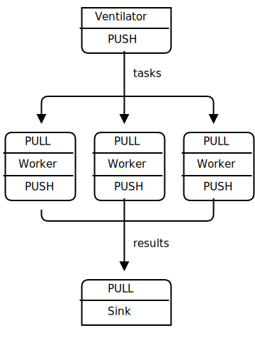
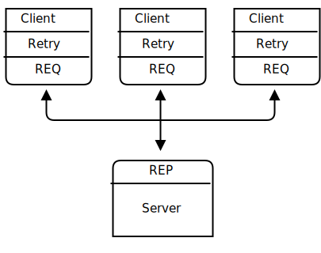
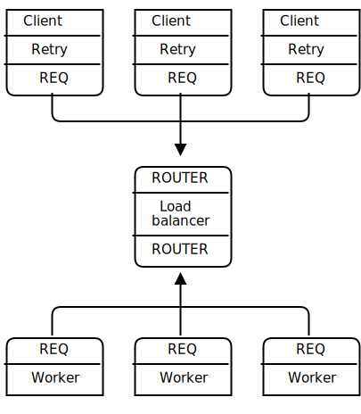
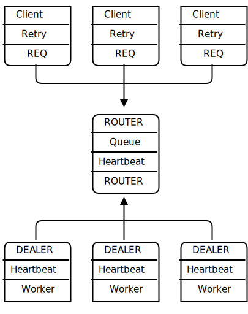
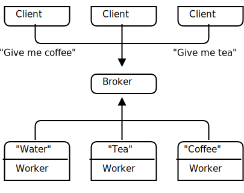
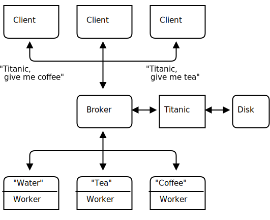
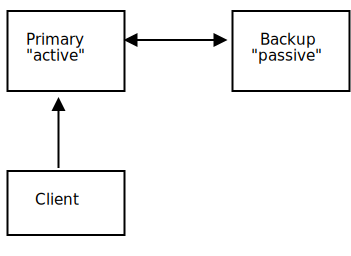
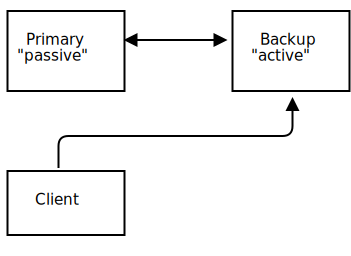
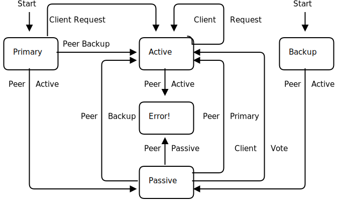
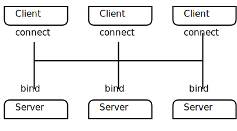

# 4장-신뢰할 수 있는 요청-응답 패턴(Reliable Request Reply Patterns)
;Chapter 3 - Advanced Request-Reply Patterns covered advanced uses of ØMQ's request-reply pattern with working examples. This chapter looks at the general question of reliability and builds a set of reliable messaging patterns on top of ØMQ's core request-reply pattern.

"3장-고급 요청-응답 패턴"은 ØMQ의 요청-응답 패턴의 고급 사용 방법을 예제와 함께 다루었습니다. 이 장에서는 신뢰성에 대한 일반적인 요구 사항을 보고 ØMQ의 핵심 요청-응답 패턴상에서 일련의 신뢰할 수 있는 메시징 패턴을 구축합니다.

;In this chapter, we focus heavily on user-space request-reply patterns, reusable models that help you design your own ØMQ architectures:

이 장에서는 사용자관점의 요청-응답 패턴에 중점을 두고 있으며, 자체 ØMQ 아키텍처를 설계하는 데 도움이 되는 재사용 가능한 모델입니다.

;* The Lazy Pirate pattern: reliable request-reply from the client side
;* The Simple Pirate pattern: reliable request-reply using load balancing
;* The Paranoid Pirate pattern: reliable request-reply with heartbeating
;* The Majordomo pattern: service-oriented reliable queuing
;* The Titanic pattern: disk-based/disconnected reliable queuing
;* The Binary Star pattern: primary-backup server failover
;* The Freelance pattern: brokerless reliable request-reply

* 게으른 해적 패턴 : 클라이언트 측의 신뢰할 수 있는 요청-응답
* 단순한 해적 패턴 : 부하 분산을 사용한 신뢰할 수 있는 요청-응답
* 편집증 해적 패턴 : 심박을 통한 신뢰할 수 있는 요청-응답
* 집사(majordomo) 패턴 : 서비스 지향 신뢰할 수 있는 메세지 대기열
* 타이타닉 패턴 : 디스크 기반 / 연결 해제된 신뢰할 수 있는 메세지 대기열
* 바이너리 스타 패턴 : 기본-백업 서버 장애조치
* 프리랜서 패턴 : 브로커 없는 신뢰할 수 있는 요청 응답

## 신뢰성이란 무엇인가?(What is "Reliability"?)
;Most people who speak of "reliability" don't really know what they mean. We can only define reliability in terms of failure. That is, if we can handle a certain set of well-defined and understood failures, then we are reliable with respect to those failures. No more, no less. So let's look at the possible causes of failure in a distributed ØMQ application, in roughly descending order of probability:

"신뢰성"에 대해 말하는 대부분의 사람들은 의미하는 바를 모릅니다. 신뢰성은 장애의 관점에서만 정의할 수 있습니다. 즉, 일련의 잘 정의되고 이해된 장애를 다룰 수 있다면 이러한 장애의 관점에서 신뢰성이 있다고 할 수 있습니다. 그 이상도 이하도 아닙니다. 따라서 분산된 ØMQ 응용프로그램에서 가능한 장애 원인을 발생 확률에 따라 내림차순(확률이 높은 순)으로 보겠습니다.

;* Application code is the worst offender. It can crash and exit, freeze and stop responding to input, run too slowly for its input, exhaust all memory, and so on.
;* System code--such as brokers we write using ØMQ--can die for the same reasons as application code. System code should be more reliable than application code, but it can still crash and burn, and especially run out of memory if it tries to queue messages for slow clients.
;* Message queues can overflow, typically in system code that has learned to deal brutally with slow clients. When a queue overflows, it starts to discard messages. So we get "lost" messages.
;* Hardware can fail and take with it all the processes running on that box.
;* Networks can fail in exotic ways, e.g., some ports on a switch may die and those parts of the network become inaccessible.
;* Entire data centers can be struck by lightning, earthquakes, fire, or more mundane power or cooling failures.

* 응용프로그램 코드가 최악의 범죄자입니다. 충돌, 종료, 멈춤, 입력에 대한 무응답, 입력 처리 지연, 메모리 고갈 등이 발생할 수 있습니다.
* 시스템 코드 -- ØMQ의 시스템 코드를 사용하여 작성한 브로커는 응용프로그램 코드와 같은 이유로 죽을 수 있습니다. 시스템 코드는 응용프로그램 코드보다 더 신뢰할 수 있어야 하지만 여전히 충돌 및 잘못될 수 있으며 특히 느린 클라이언트에 대한 메시지를 대기열에 넣으려고 하면 메모리가 부족할 수 있습니다.
* 메시지 대기열 초과로 인한 메시지 유실, 메시지 대기열은 초과될 수 있으며 보통 느린 클라이언트들과 함께 동작하는 브로커(시스템 코드)에 기인합니다. 대기열이 초과되면 메시지를 버리기 시작하여 메시지 "유실"이 발생합니다.
* 하드웨어 장애 -- 하드웨어는 장애가 발생하면 박스에서 실행되는 모든 프로세스들도 영향을 받게 됩니다.
* 네트워크 장애 -- 네트워크는 색다르게 장애가 발생합니다. 예를 들어 스위치의 일부 포트가 죽거나 네트워크 상의 일부 지점에 접근할 수 없게 됩니다.
* 전체 데이터 센터 장애 -- 데이터 센터는 번개, 지진, 화재, 일상적인 전력 장애, 냉각 장애로 영향을 받을 수 있습니다.

;To make a software system fully reliable against all of these possible failures is an enormously difficult and expensive job and goes beyond the scope of this book.

소프트웨어 시스템을 완전히 신뢰할 수 있게 만들어 이러한 모든 가능한 장애에 대응하게 하는 것은 엄청나게 어렵고 비용이 많이 드는 작업이며 이 책의 범위를 벗어납니다.

;Because the first five cases in the above list cover 99.9% of real world requirements outside large companies (according to a highly scientific study I just ran, which also told me that 78% of statistics are made up on the spot, and moreover never to trust a statistic that we didn't falsify ourselves), that's what we'll examine. If you're a large company with money to spend on the last two cases, contact my company immediately! There's a large hole behind my beach house waiting to be converted into an executive swimming pool.

위 목록의 5개 사례는 대기업을 제외한 실제 요구사항의 99.9%를 해당됩니다(과학적 연구에 따르면 통계의 78%가 즉석해서 만들어진 것으며, 조작되지 않은 통계는 믿을 수 없게 합니다.). 대기업에 속해 있고 마지막 2가지 사안(네트워크, 데이터 센터)에 지출할 돈이 있다면 즉시 저희 회사(iMatix)에 연락 주시기 바랍니다. 저의 별장 뒷편의 공간을 호화로운 수영장으로 바꾸기를 기다리고 있습니다.

## 신뢰성 설계(Designing Reliability)
;So to make things brutally simple, reliability is "keeping things working properly when code freezes or crashes", a situation we'll shorten to "dies". However, the things we want to keep working properly are more complex than just messages. We need to take each core ØMQ messaging pattern and see how to make it work (if we can) even when code dies.

주제를 단순화하면, 신뢰성은 "코드가 멈추거나 충돌할 때 정상 동작하게 유지"하는 것이며 이런 장애 상황을 "죽음"으로 줄여 이야기합니다. 그러나 우리가 정상 동작하고 싶은 것은 단순한 메시지보다 더 복잡합니다. 우리는 각각의 핵심 ØMQ 메시징 패턴을 통해 코드가 죽더라도 동작하는 방법을 살펴보겠습니다.

;Let's take them one-by-one:

하나씩 살펴보겠습니다.

;* Request-reply: if the server dies (while processing a request), the client can figure that out because it won't get an answer back. Then it can give up in a huff, wait and try again later, find another server, and so on. As for the client dying, we can brush that off as "someone else's problem" for now.
;* Pub-sub: if the client dies (having gotten some data), the server doesn't know about it. Pub-sub doesn't send any information back from client to server. But the client can contact the server out-of-band, e.g., via request-reply, and ask, "please resend everything I missed". As for the server dying, that's out of scope for here. Subscribers can also self-verify that they're not running too slowly, and take action (e.g., warn the operator and die) if they are.
;* Pipeline: if a worker dies (while working), the ventilator doesn't know about it. Pipelines, like the grinding gears of time, only work in one direction. But the downstream collector can detect that one task didn't get done, and send a message back to the ventilator saying, "hey, resend task 324!" If the ventilator or collector dies, whatever upstream client originally sent the work batch can get tired of waiting and resend the whole lot. It's not elegant, but system code should really not die often enough to matter.

* 요청-응답 : 서버가(요청을 처리하는 동안) 죽으면, 클라이언트는 응답을 받지 못하기 때문에 장애를 알 수 있습니다. 그런 다음 잠시 대기하다가 다시 시도하거나 다른 서버를 찾는 등의 작업을 수행할 수 있습니다. 클라이언트가 죽는 거에 대해서는, 지금은 "다른 무엇인가의 문제"로 제외합니다.
* 발행-구독 : 클라이언트가 죽으면(일부 데이터를 얻음) 서버는 클라이언트가 죽은 사실을 알지 못합니다. 발행-구독은 클라이언트에서 서버로 어떤 정보를 보내지 않기 때문입니다. 그러나 클라이언트는 새로운 경로(예 : 요청-응답)로 서버에 접속하여 "내가 놓친 모든 것을 재전송해주십시오"라고 요구할 수 있습니다. 서버가 죽는 것은 이 책의 범위가 아닙니다. 구독자는 자신이 너무 느리게 동작하지 않는지 검증하면서, 느릴 경우 시스템 관리자에게 경고를 보내거나 자살할 수 있습니다.
* 파이프라인 : 작업자가(작업 중) 죽게 되면 선동가(이전 예제 : ventilator, worker, sink)는 알지 못합니다.  파이프라인은 흐르는 시간처럼 한 방향으로만 동작합니다. 그러나 하류 수집기(sink)는 하나의 작업이 완료되지 않았음을 감지하고 선동가에게 "이봐, 324 작업 다시 보내!"라는 메시지를 보낼 수 있습니다. 선동가 또는 수집기가 죽으면, 상류 클라이언트(worker)가 보낸 작업 배치는 대기하는 데 지쳐서 전체 데이터를 재전송할 수 있습니다. 우아하지는 않지만 시스템 코드는 문제가 될 만큼 자주 죽지는 않습니다.

> [옮긴이] 그림 5 - 병렬 파이프라인(parallel pipeline)



;In this chapter we'll focus on just on request-reply, which is the low-hanging fruit of reliable messaging.

이 장에서는 신뢰성 있는 메시징에서 요청-응답에만 초점을 맞출 것입니다.

;The basic request-reply pattern (a REQ client socket doing a blocking send/receive to a REP server socket) scores low on handling the most common types of failure. If the server crashes while processing the request, the client just hangs forever. If the network loses the request or the reply, the client hangs forever.

기본적인 요청-응답 패턴(하나의 REQ 클라이언트 소켓이 REP 서버 소켓에 동기식 송/수신)은 매우 일반적인 유형의 장애가 발생합니다. 요청을 처리하는 동안 서버가 충돌하거나 네트워크가 송/수신 데이터를 유실하면 클라이언트는 영원히 멈추게 됩니다. 

;Request-reply is still much better than TCP, thanks to ØMQ's ability to reconnect peers silently, to load balance messages, and so on. But it's still not good enough for real work. The only case where you can really trust the basic request-reply pattern is between two threads in the same process where there's no network or separate server process to die.

OMQ의 요청-응답 패턴은 TCP보다 훨씬 좋습니다. ØMQ는 자동으로 상대들을 다시 연결하고 메시지를 부하 분산하는 등의 기능을 제공합니다. 그러나 실상황에서는 충분하지 않습니다. 기본적인 요청-응답 패턴을 신뢰할 수 있는 유일한 경우는 동일 프로세스에 있는 2개의 스레드들 간이며 장애가 될 수 있는 네트워크 또는 독자적인 서버 프로세스가 없어야 합니다.

;However, with a little extra work, this humble pattern becomes a good basis for real work across a distributed network, and we get a set of reliable request-reply (RRR) patterns that I like to call the Pirate patterns (you'll eventually get the joke, I hope).

그러나 약간의 추가 작업으로 이 겸손한 패턴은 분산된 네트워크에서 실제 작업을 위한 좋은 기반이 되며, 일련의 신뢰성 있는 요청-응답(reliable request-reply, RRR) 패턴들을 만들어 해적 패턴들(Pirate patterns)이라고 부르겠습니다.(그냥 농담입니다.)

;There are, in my experience, roughly three ways to connect clients to servers. Each needs a specific approach to reliability:

경험상 클라이언트를 서버에 연결하는 방법에는 대략 3가지가 있습니다. 각각은 안정성에 대한 고유의 접근 방식이 필요합니다.

;* Multiple clients talking directly to a single server. Use case: a single well-known server to which clients need to talk. Types of failure we aim to handle: server crashes and restarts, and network disconnects.
;* Multiple clients talking to a broker proxy that distributes work to multiple workers. Use case: service-oriented transaction processing. Types of failure we aim to handle: worker crashes and restarts, worker busy looping, worker overload, queue crashes and restarts, and network disconnects.
;* Multiple clients talking to multiple servers with no intermediary proxies. Use case: distributed services such as name resolution. Types of failure we aim to handle: service crashes and restarts, service busy looping, service overload, and network disconnects.

* 여러 개의 클라이언트들이 단일 서버와 직접 통신합니다. 
  + 사용 사례: 잘 알려진 단일 서버에 클라이언트들이 통신해야 합니다. 
  + 처리할 장애 유형 : 서버 충돌 및 재시작, 네트워크 연결 끊김.
* 여러 개의 클라이언트들이 브로커와 통신하며 브로커는 여러 개의 작업자들에게 작업을 분배합니다.
  + 사용 사례 : 서비스 지향 트랜잭션 처리. 
  + 처리할 장애 유형 : 작업자 충돌 및 재시작, 작업자 바쁜 작업 처리, 작업자 과부하, 대기열 충돌 및 재시작, 네트워크 연결 끊김.
* 여러 개의 클라이언트가 브로커 없이 여러 개의 서버들과 통신합니다. 
  + 사용 사례 : 이름 확인과 같은 분산 서비스(예 : DNS). 
  + 처리할 장애 유형 : 서비스 충돌 및 재시작, 서비스 바쁜 작업 처리, 서비스 과부하 및 네트워크 연결 끊김.


;Each of these approaches has its trade-offs and often you'll mix them. We'll look at all three in detail.

각 접근 방식에는 장단점이 있으며 함께 사용하는 경우가 있습니다. 세 가지 모두 자세히 살펴보겠습니다.

## 클라이언트 측면의 신뢰성(게으른 해적 패턴(Lazy Pirate Pattern))
;We can get very simple reliable request-reply with some changes to the client. We call this the Lazy Pirate pattern. Rather than doing a blocking receive, we:

클라이언트 코드의 일부 변경하여 매우 간단하고 신뢰성 있는 요청-응답을 얻을 수 있습니다. 우리는 이것을 게으른 해적 패턴이라고 부릅니다. 수신 차단을 수행하는 대신 다음을 수행합니다. : 

;* Poll the REQ socket and receive from it only when it's sure a reply has arrived.
;* Resend a request, if no reply has arrived within a timeout period.
;* Abandon the transaction if there is still no reply after several requests.

* REQ 소켓을 폴링(poll)하고 응답이 도착했을 때만 수신합니다.
* 제한시간 내에 응답이 도착하지 않으면 요청을 재전송합니다.
* 여러 번의 요청들 후에도 여전히 응답이 없으면 트랜잭션을 포기합니다.

;If you try to use a REQ socket in anything other than a strict send/receive fashion, you'll get an error (technically, the REQ socket implements a small finite-state machine to enforce the send/receive ping-pong, and so the error code is called "EFSM"). This is slightly annoying when we want to use REQ in a pirate pattern, because we may send several requests before getting a reply.

엄격한 송/수신 방식 외에 클라이언트에서 REQ 소켓을 사용하려 하면 오류가 발생합니다 (기술적으로 REQ 소켓은 송/수신 핑-퐁(ping-pong)을 위해 작은 유한 상태 머신을 구현합니다. 오류 코드는 "EFSM"입니다.). 해적 패턴으로 REQ 소켓을 사용하는 것을 어렵게 하며, 해적 패턴에서는 답변을 받기 전에 여러 요청(재시도)을 보낼 수 있어야 하기 때문입니다.

;The pretty good brute force solution is to close and reopen the REQ socket after an error:

아주 무식한 방법으로 응답이 오기 전에 재요청 수행으로 인한 "EFSM" 오류가 발생하면 REQ 소켓을 닫고 다시 열어 요청하는 것입니다.

lpclient.c: 게으른 해적 클라이언트

```cpp
#include <czmq.h>
#define REQUEST_TIMEOUT 2500 // msecs, (>1000!)
#define REQUEST_RETRIES 3 // Before we abandon
#define SERVER_ENDPOINT "tcp://localhost:5555"

int main()
{
    zsock_t *client = zsock_new_req(SERVER_ENDPOINT);
    printf("I: Connecting to server...\n");
    assert(client);

    int sequence = 0;
    int retries_left = REQUEST_RETRIES;
    printf("Entering while loop...\n");
    while(retries_left) // interrupt needs to be handled
    {
        // We send a request, then we get a reply
        char request[10];
        sprintf(request, "%d", ++sequence);
        zstr_send(client, request);
        int expect_reply = 1;
        while(expect_reply)
        {
            printf("Expecting reply....\n");
            zmq_pollitem_t items [] = {{zsock_resolve(client), 0, ZMQ_POLLIN, 0}};
            printf("After polling\n");
            int rc = zmq_poll(items, 1, REQUEST_TIMEOUT * ZMQ_POLL_MSEC);
            printf("Polling Done.. \n");
            if (rc == -1)
                break; // Interrupted
            
            // Here we process a server reply and exit our loop if the
            // reply is valid. If we didn't get a reply we close the
            // client socket, open it again and resend the request. We
            // try a number times before finally abandoning:

            if (items[0].revents & ZMQ_POLLIN)
            {
                // We got a reply from the server, must match sequence
                char *reply = zstr_recv(client);
                if(!reply)
                    break; // interrupted
                if (atoi(reply) == sequence)
                {
                    printf("I: server replied OK (%s)\n", reply);
                    retries_left=REQUEST_RETRIES;
                    expect_reply = 0;
                }
                else
                {
                    printf("E: malformed reply from server: %s\n", reply);
                }
                free(reply);
            }
            else 
            {
                if(--retries_left == 0)
                {
                    printf("E: Server seems to be offline, abandoning\n");
                    break;
                }
                else
                {
                    printf("W: no response from server, retrying...\n");
                    zsock_destroy(&client);
                    printf("I: reconnecting to server...\n");
                    client = zsock_new_req(SERVER_ENDPOINT);
                    zstr_send(client, request);
                }
            }
        }
        zsock_destroy(&client);
        return 0;
    }
}
```

;Run this together with the matching server:

대응하는 서버를 함께 구동합니다.

lpserver.c: 게으른 해적 서버

```cpp
//  Lazy Pirate server
//  Binds REQ socket to tcp://*:5555
//  Like hwserver except:
//   - echoes request as-is
//   - randomly runs slowly, or exits to simulate a crash.

#include "zhelpers.h"
#ifndef _WIN32
#include <unistd.h>
#endif

int main (void)
{
    srandom ((unsigned) time (NULL));

    void *context = zmq_ctx_new ();
    void *server = zmq_socket (context, ZMQ_REP);
    zmq_bind (server, "tcp://*:5555");

    int cycles = 0;
    while (1) {
        char *request = s_recv (server);
        cycles++;

        //  Simulate various problems, after a few cycles
        if (cycles > 3 && randof (3) == 0) {
            printf ("I: simulating a crash\n");
            break;
        }
        else
        if (cycles > 3 && randof (3) == 0) {
            printf ("I: simulating CPU overload\n");
            s_sleep (2000);
        }
        printf ("I: normal request (%s)\n", request);
        s_sleep (1000);              //  Do some heavy work
        s_send (server, request);
        free (request);
    }
    zmq_close (server);
    zmq_ctx_destroy (context);
    return 0;
}

```
그림 47 - 게으른 해적 패턴(The Lazy Pirate Pattern)



;To run this test case, start the client and the server in two console windows. The server will randomly misbehave after a few messages. You can check the client's response. Here is typical output from the server:

이 테스트 케이스를 실행하려면 2개의 콘솔 창에서 클라이언트와 서버를 시작하십시오. 서버는 몇 개의 메시지들 받은 이후 무작위로 오동작합니다. 클라이언트의 응답을 확인할 수 있습니다. 다음은 서버부터의 전형적인 출력 예시입니다.

~~~{.bash}
I: normal request (1)
I: normal request (2)
I: normal request (3)
I: simulating CPU overload
I: normal request (4)
I: simulating a crash
~~~

;And here is the client's response:

클라이언트의 출력은 다음과 같습니다.

~~~{.bash}
I: connecting to server...
I: server replied OK (1)
I: server replied OK (2)
I: server replied OK (3)
W: no response from server, retrying...
I: connecting to server...
W: no response from server, retrying...
I: connecting to server...
E: server seems to be offline, abandoning
~~~

> [옮긴이] 윈도우 환경에서 구동 가능하도록 일부 수정(`sleep() 함수`)하고 서버(lpserver)를 수행하고 클라이언트(lpclient)를 구동하면 클라이언트는 1회 응답을 받고 종료됩니다.

~~~{.bash}
PS D:\git_store\zguide-kr\examples\C> ./lpserver
I: normal request (1)

PS D:\git_store\zguide-kr\examples\C> ./lpclient
I: Connecting to server...
Entering while loop...
Expecting reply....
After polling
Polling Done..
I: server replied OK (1)
~~~

> [옮긴이] 원인은 "lpclient.c"에서 `while(retries_left)` 루프 내에서 소켓을 제거하기 때문이며 루프 밖으로 빼내어 프로그램 종료 시에 수행하도록 수정이 필요합니다.

```cpp
    while(retries_left){
        ...
        zsock_destroy(&client);
        return 0;
    }
```
`zsock_destroy()` 함수의 수행 위치를 변경한 소스는 다음과 같습니다.
```cpp
#include <czmq.h>
#define REQUEST_TIMEOUT 2500 // msecs, (>1000!)
#define REQUEST_RETRIES 3 // Before we abandon
#define SERVER_ENDPOINT "tcp://localhost:5555"

int main()
{
    zsock_t *client = zsock_new_req(SERVER_ENDPOINT);
    printf("I: Connecting to server...\n");
    assert(client);

    int sequence = 0;
    int retries_left = REQUEST_RETRIES;
    printf("Entering while loop...\n");
    while(retries_left) // interrupt needs to be handled
    {
        // We send a request, then we get a reply
        char request[10];
        sprintf(request, "%d", ++sequence);
        zstr_send(client, request);
        int expect_reply = 1;
        while(expect_reply)
        {
            printf("Expecting reply....\n");
            zmq_pollitem_t items [] = {{zsock_resolve(client), 0, ZMQ_POLLIN, 0}};
            printf("After polling\n");
            int rc = zmq_poll(items, 1, REQUEST_TIMEOUT * ZMQ_POLL_MSEC);
            printf("Polling Done.. \n");
            if (rc == -1)
                break; // Interrupted
            
            // Here we process a server reply and exit our loop if the
            // reply is valid. If we didn't get a reply we close the
            // client socket, open it again and resend the request. We
            // try a number times before finally abandoning:

            if (items[0].revents & ZMQ_POLLIN)
            {
                // We got a reply from the server, must match sequence
                char *reply = zstr_recv(client);
                if(!reply)
                    break; // interrupted
                if (atoi(reply) == sequence)
                {
                    printf("I: server replied OK (%s)\n", reply);
                    retries_left=REQUEST_RETRIES;
                    expect_reply = 0;
                }
                else
                {
                    printf("E: malformed reply from server: %s\n", reply);
                }
                free(reply);
            }
            else 
            {
                if(--retries_left == 0)
                {
                    printf("E: Server seems to be offline, abandoning\n");
                    break;
                }
                else
                {
                    printf("W: no response from server, retrying...\n");
                    zsock_destroy(&client);
                    printf("I: reconnecting to server...\n");
                    client = zsock_new_req(SERVER_ENDPOINT);
                    zstr_send(client, request);
                }
            }
        }
    }
    zsock_destroy(&client);
    return 0;
}
```

> [옮긴이] 빌드 및 테스트

~~~{.bash}
PS D:\git_store\zguide-kr\examples\C> ./lpserver
I: normal request (1)
I: normal request (2)
I: normal request (3)
I: simulating a crash

PS D:\git_store\zguide-kr\examples\C> ./lpclient
I: Connecting to server...
Entering while loop...
Expecting reply....
After polling
Polling Done..
I: server replied OK (1)
Expecting reply....
After polling
Polling Done..
I: server replied OK (2)
Expecting reply....
After polling
Polling Done..
I: server replied OK (3)
Expecting reply....
After polling
Polling Done..
W: no response from server, retrying...
I: reconnecting to server...
Expecting reply....
After polling
Polling Done..
W: no response from server, retrying...
I: reconnecting to server...
Expecting reply....
After polling
Polling Done..
E: Server seems to be offline, abandoning
~~~

;The client sequences each message and checks that replies come back exactly in
 order: that no requests or replies are lost, and no replies come back more than once, or out of order. Run the test a few times until you're convinced that this mechanism actually works. You don't need sequence numbers in a production application; they just help us trust our design.

클라이언트는 각 메시지의 순서를 정하여 응답들이 순서에 따라 정확히 왔는지 확인합니다 :
요청들이나 응답들이 유실되지 않거나, 응답들이 한번 이상 반환되지 않거나, 순서가 맞지 않을 경우를 확인합니다. 이 동작 방식이 실제로 동작한다고 확신할 때까지 테스트를 수행하시기 바랍니다. 양산 응용프로그램에서는 순서 번호는 필요하지 않지만 설계를 신뢰하는 데 도움이 됩니다.

;The client uses a REQ socket, and does the brute force close/reopen because REQ sockets impose that strict send/receive cycle. You might be tempted to use a DEALER instead, but it would not be a good decision. First, it would mean emulating the secret sauce that REQ does with envelopes (if you've forgotten what that is, it's a good sign you don't want to have to do it). Second, it would mean potentially getting back replies that you didn't expect.

클라이언트는 REQ 소켓의 엄격한 송/수신 주기를 지키기 위하여 무식한 강제 종료/재오픈을 수행합니다. REQ 소켓(sync) 대신에 DEALER 소켓(async)을 사용하고 싶겠지만 좋은 결정은 아닙니다. 첫째, 그것은 REQ 소켓 봉투들 모방하는 것이 복잡하고(그것이 무엇인지 잊었다면, 그것을 하고 싶지 않은 좋은 징조입니다), 둘째, 예상하지 못한 응답들을 받을 가능성이 있습니다.

> [옮긴이] DEALER의 경우 멀티파트 메시지(multipart message) 형태로 첫 번째 파트는 공백 구분자(empty delimter), 두 번째 파트는 데이터(body)로 REP 소켓에 데이터 전송 필요합니다.

> [옮긴이] REP 대신에 DEALER 소켓을 사용하는 "hwclient2.c"는 다음과 같습니다.

```cpp
/**
**Hello World client
DEALER socket connect to tcp://localhost:5555
send "Hello" to server，expect receive "World"
*/
#include "zhelpers.h"
// #include <unistd.h>

int main (void)
{
	printf ("Connecting to hello world server...\n");
	void *context = zmq_ctx_new ();
	void *requester = zmq_socket (context, ZMQ_DEALER);
	zmq_connect (requester, "tcp://localhost:5555");
	int request_nbr;	//request number
	int reply_nbr = 0;  //receive respond number
	for (request_nbr = 0; request_nbr < 10; request_nbr++)
	{
		char buffer [10];
		memset(buffer,0,sizeof(buffer));
		printf ("Sending request msg: Hello NO=%d...\n", request_nbr+1);
		//send request msg to server
		s_sendmore(requester,"");  //send multi part msg,the first part is empty part
		zmq_send (requester, "Hello", 5, 0); //the second part is your request msg
		//receive reply msg
		int len;
		len = zmq_recv (requester, buffer, 10, 0);
		if(len == -1){
			printf("Error:%s\n", zmq_strerror(errno));
			exit(-1);
		}
		//if the first part you received is empty part,then continue receiving next part 
		if (strcmp(buffer,"") == 0){
			memset(buffer,0,sizeof(buffer));
			len = zmq_recv(requester, buffer, 10, 0);
			if(len == -1){
				printf("Error:%s\n", zmq_strerror(errno));
				exit(-1);
			}
			printf("Received respond msg: %s NO=%d\n\n", buffer,++reply_nbr);
		}
		//if the first part you received is not empty part,discard the whole ZMQ msg
		else{
			printf("Discard the ZMQ message!\n");
		}
	}
	zmq_close(requester);
	zmq_ctx_destroy (context);
	return 0;
}
```
> [옮긴이] 빌드 및 테스트 - hwserver는 REP소켓을 사용하며 수정 없이 사용 가능합니다.

~~~{.bash}
PS D:\git_store\zguide-kr\examples\C> ./hwserver
Received Hello
Received Hello
Received Hello
Received Hello
Received Hello
Received Hello
Received Hello
Received Hello
Received Hello
Received Hello

PS D:\git_store\zguide-kr\examples\C> ./hwclient2
Connecting to hello world server...
Sending Hello 0...
Received World 0
Sending Hello 1...
Received World 1
Sending Hello 2...
Received World 2
Sending Hello 3...
Received World 3
Sending Hello 4...
Received World 4
Sending Hello 5...
Received World 5
Sending Hello 6...
Received World 6
Sending Hello 7...
Received World 7
Sending Hello 8...
Received World 8
Sending Hello 9...
Received World 9
~~~

;Handling failures only at the client works when we have a set of clients talking to a single server. It can handle a server crash, but only if recovery means restarting that same server. If there's a permanent error, such as a dead power supply on the server hardware, this approach won't work. Because the application code in servers is usually the biggest source of failures in any architecture, depending on a single server is not a great idea.

클라이언트에서만 장애를 처리하는 것은 일련의 클라이언트들이 단일 서버와 통신하는 경우에만 동작합니다. 서버 장애를 처리할 수 있는 경우는 동일 서버를 재시작하여 복구하는 것을 의미합니다. 서버 하드웨어의 전원 공급 중단과 같은 영구적인 오류가 있는 경우 이 접근 방식이 동작하지 않습니다. 서버의 응용프로그램 코드는 보통 대부분의 아키텍처에서 가장 큰 장애 원인이므로 단일 서버에 의존하는 것은 좋은 생각이 아닙니다.

;So, pros and cons:

게으른 해적 패턴의 장단점은 다음과 같습니다.

;* Pro: simple to understand and implement.
;* Pro: works easily with existing client and server application code.
;* Pro: ØMQ automatically retries the actual reconnection until it works.
;* Con: doesn't failover to backup or alternate servers.

* 장점 : 이해와 구현이 간단합니다.
* 장점 : 기존 클라이언트 및 서버 응용프로그램 코드로 쉽게 동작합니다.
* 장점 : ØMQ는 동작할 때까지 자동으로 재연결을 재시도합니다.
* 단점 : 백업 또는 대체 서버들로 장애조치하지 않습니다.

> [옮긴이] 하나의 프로세스에서 게으른 해적 클라이언트(lpclient)와 서버(lpserver)를 구동하기 위한 예제는 다음과 같습니다(lppattern.c).
클라이언트와 서버의 숫자를 각각 1개로 하는 것에 주의 필요합니다.

```cpp
//  Lazy Pirate

#include <czmq.h>
#include "zhelpers.h"
#define NBR_CLIENTS 1
#define NBR_SERVERS 1
#define REQUEST_TIMEOUT 2500 // msecs, (>1000!)
#define REQUEST_RETRIES 3 // Before we abandon
#define SERVER_ENDPOINT "tcp://localhost:5555"

//  Lazy Pirate client using REQ socket
//
static void *
client_task (void *args)
{
    zsock_t *client = zsock_new_req(SERVER_ENDPOINT);
    printf("[C%Id] I: Connecting to server...\n", (intptr_t)args);
    assert(client);

    int sequence = 0;
    int retries_left = REQUEST_RETRIES;
    printf("[C%Id] Entering while loop...\n", (intptr_t)args);
    while(retries_left) // interrupt needs to be handled
    {
		char request[10];
        // We send a request, then we get a reply
        sprintf(request, "%d", ++sequence);
        zstr_send(client, request);
        int expect_reply = 1;
        while(expect_reply)
        {
            printf("[C%Id] Expecting reply....\n",  (intptr_t)args);
            zmq_pollitem_t items [] = {{zsock_resolve(client), 0, ZMQ_POLLIN, 0}};
            printf("[C%Id] After polling\n",  (intptr_t)args);
            int rc = zmq_poll(items, 1, REQUEST_TIMEOUT * ZMQ_POLL_MSEC);
            printf("[C%Id] Polling Done.. \n", (intptr_t)args);
            if (rc == -1)
                break; // Interrupted
            
            // Here we process a server reply and exit our loop if the
            // reply is valid. If we didn't get a reply we close the
            // client socket, open it again and resend the request. We
            // try a number times before finally abandoning:

            if (items[0].revents & ZMQ_POLLIN)
            {
                // We got a reply from the server, must match sequence
                char *reply = zstr_recv(client);
                if(!reply)
                    break; // interrupted
                if (atoi(reply) == sequence)
                {
                    printf("[C%Id] I: server replied OK (%s)\n", (intptr_t)args, reply);
                    retries_left=REQUEST_RETRIES;
                    expect_reply = 0;
                }
                else
                {
                    printf("[C%Id] E: malformed reply from server: %s\n",(intptr_t)args, reply);
                }
                free(reply);
            }
            else 
            {
                if(--retries_left == 0)
                {
                    printf("[C%Id] E: Server seems to be offline, abandoning\n", (intptr_t)args);
                    break;
                }
                else
                {
                    printf("[C%Id] W: no response from server, retrying...\n", (intptr_t)args);
                    zsock_destroy(&client);
                    printf("[C%Id] I: reconnecting to server...\n", (intptr_t)args);
                    client = zsock_new_req(SERVER_ENDPOINT);
                    zstr_send(client, request);
                }
            }
        }
    }
    zsock_destroy(&client);
    return NULL;
}

//  Lazy Pirate server using REQ socket
//
static void *
server_task (void *args)
{
    srandom ((unsigned) time (NULL));

    void *context = zmq_ctx_new ();
    void *server = zmq_socket (context, ZMQ_REP);
    zmq_bind (server, "tcp://*:5555");

    int cycles = 0;
    while (1) {
        char *request = s_recv (server);
        cycles++;

        //  Simulate various problems, after a few cycles
        if (cycles > 3 && randof (3) == 0) {
            printf ("[S%Id] I: simulating a crash\n",(intptr_t)args);
            break;
        }
        else
        if (cycles > 3 && randof (3) == 0) {
            printf ("[S%Id] I: simulating CPU overload\n",(intptr_t)args);
            s_sleep (2000);
        }
        printf ("[S%Id] I: normal request (%s)\n", (intptr_t)args, request);
        s_sleep (1000);              //  Do some heavy work
        s_send (server, request);
        free (request);
    }
    zmq_close (server);
    zmq_ctx_destroy (context);
    return NULL;
}

int main (void)
{
	int server_nbr;
	for (server_nbr = 0; server_nbr < NBR_SERVERS; server_nbr++)
        zthread_new (server_task, (void *)(intptr_t)server_nbr);
	
    int client_nbr;
    for (client_nbr = 0; client_nbr < NBR_CLIENTS; client_nbr++)
        zthread_new (client_task, (void *)(intptr_t)client_nbr);
	 zclock_sleep (60 * 1000);
    return 0;
}
```
> [옮긴이] 빌드 및 테스트 결과

~~~{.bash}
PS D:\git_store\zguide-kr\examples\C> ./lppattern
[C0] I: Connecting to server...
[C0] Entering while loop...
[C0] Expecting reply....
[C0] After polling
[S0] I: normal request (1)
[C0] Polling Done..
[C0] I: server replied OK (1)
[C0] Expecting reply....
[C0] After polling
[S0] I: normal request (2)
[C0] Polling Done..
[C0] I: server replied OK (2)
[C0] Expecting reply....
[C0] After polling
[S0] I: normal request (3)
[C0] Polling Done..
[C0] I: server replied OK (3)
[C0] Expecting reply....
[C0] After polling
[S0] I: normal request (4)
[C0] Polling Done..
[C0] I: server replied OK (4)
...
[C0] After polling
[S0] I: simulating CPU overload
[S0] I: normal request (9)
[C0] Polling Done..
[C0] W: no response from server, retrying...
[C0] I: reconnecting to server...
[C0] Expecting reply....
[C0] After polling
[S0] I: simulating a crash
[C0] Polling Done..
[C0] W: no response from server, retrying...
[C0] I: reconnecting to server...
[C0] Expecting reply....
[C0] After polling
[C0] Polling Done..
[C0] E: Server seems to be offline, abandoning
~~~

## 신뢰할 수 있는 큐잉(단순한 해적 패턴)
;Our second approach extends the Lazy Pirate pattern with a queue proxy that lets us talk, transparently, to multiple servers, which we can more accurately call "workers". We'll develop this in stages, starting with a minimal working model, the Simple Pirate pattern.

두 번째 접근 방식은 대기열 프록시를 사용하여 게으른 해적 패턴을 확장하여 투명하게 여러 대의 서버들과 통신하게 하며, 서버들은 좀 더 정확하게 "작업자들"라고 부를 수 있습니다. 최소한의 구동 모델인 단순한 해적 패턴부터 시작하여 단계별로 개발할 것입니다.

;In all these Pirate patterns, workers are stateless. If the application requires some shared state, such as a shared database, we don't know about it as we design our messaging framework. Having a queue proxy means workers can come and go without clients knowing anything about it. If one worker dies, another takes over. This is a nice, simple topology with only one real weakness, namely the central queue itself, which can become a problem to manage, and a single point of failure.

단순한 해적 패턴에서 작업자들은 상태 비저장입니다. 응용프로그램은 데이터베이스와 같이 공유 상태가 필요하지만 메시징 프레임워크를 설계할 당시에는 인지하지 못할 수도 있습니다. 대기열 프록시가 있다는 것은 클라이언트가 작업자들이 오가는 것을 인지하지 못하는 것을 의미합니다. 한 작업자가 죽을 경우, 다른 작업자가 인계받습니다. 이것은 멋지고 간단한 전송 방식이지만 하나의 실제 약점으로, 중앙 대기열 자체가 단일 실패 지점으로 관리해야 할 문제가 됩니다.

> [옮긴이] 상태 비저장(stateless)는 서버가 클라이언트의 이전 상태를 저장하지 않아 클라이언트의 이전 요청과도 무관한 각각의 요청을 독립적으로 처리하게 합니다.(예 : http)

그림 48 - 단순한 해적 패턴(The Simple Pirate Pattern)



;The basis for the queue proxy is the load balancing broker from Chapter 3 - Advanced Request-Reply Patterns. What is the very minimum we need to do to handle dead or blocked workers? Turns out, it's surprisingly little. We already have a retry mechanism in the client. So using the load balancing pattern will work pretty well. This fits with ØMQ's philosophy that we can extend a peer-to-peer pattern like request-reply by plugging naive proxies in the middle.

대기열 프록시의 기본은 "3장-고급 요청-응답 패턴"의 부하 분산 브로커입니다. "죽거나 차단된 작업자들을 처리하기 위해 최소한 해야 할 것은 무엇입니까?" 실제 해야 할 것은 의외로 적습니다. 우리는 이미 클라이언트들에서 재시도 기능을 부가한 적 있으며 따라서 부하 분산 패턴을 사용하면 꽤 잘 작동할 것입니다. 이것은 QMQ의 철학에 부합하며 P2P(peer-to-peer)와 같은 요청-응답 패턴 사이에 프록시를 추가하여 확장할 수 있습니다.

;We don't need a special client; we're still using the Lazy Pirate client. Here is the queue, which is identical to the main task of the load balancing broker:

여기에는 특별한 클라이언트가 필요하지 않습니다.
이전의 게으른 해적 클라이언트(lpclient)를 사용할 수 있으며, 대기열은 부하 분산 브로커의 기본 작업과 동일합니다 : 

spqueue.c: 단순한 해적 브로커

```cpp
//  Simple Pirate broker
//  This is identical to load-balancing pattern, with no reliability
//  mechanisms. It depends on the client for recovery. Runs forever.

#include "czmq.h"
#define WORKER_READY   "\001"      //  Signals worker is ready

int main (void)
{
    zctx_t *ctx = zctx_new ();
    void *frontend = zsocket_new (ctx, ZMQ_ROUTER);
    void *backend = zsocket_new (ctx, ZMQ_ROUTER);
    zsocket_bind (frontend, "tcp://*:5555");    //  For clients
    zsocket_bind (backend,  "tcp://*:5556");    //  For workers

    //  Queue of available workers
    zlist_t *workers = zlist_new ();
    
    //  The body of this example is exactly the same as lbbroker2.
    //  .skip
    while (true) {
        zmq_pollitem_t items [] = {
            { backend,  0, ZMQ_POLLIN, 0 },
            { frontend, 0, ZMQ_POLLIN, 0 }
        };
        //  Poll frontend only if we have available workers
        int rc = zmq_poll (items, zlist_size (workers)? 2: 1, -1);
        if (rc == -1)
            break;              //  Interrupted

        //  Handle worker activity on backend
        if (items [0].revents & ZMQ_POLLIN) {
            //  Use worker identity for load-balancing
            zmsg_t *msg = zmsg_recv (backend);
            if (!msg)
                break;          //  Interrupted
            zframe_t *identity = zmsg_unwrap (msg);
            zlist_append (workers, identity);

            //  Forward message to client if it's not a READY
            zframe_t *frame = zmsg_first (msg);
            if (memcmp (zframe_data (frame), WORKER_READY, 1) == 0)
                zmsg_destroy (&msg);
            else
                zmsg_send (&msg, frontend);
        }
        if (items [1].revents & ZMQ_POLLIN) {
            //  Get client request, route to first available worker
            zmsg_t *msg = zmsg_recv (frontend);
            if (msg) {
                zmsg_wrap (msg, (zframe_t *) zlist_pop (workers));
                zmsg_send (&msg, backend);
            }
        }
    }
    //  When we're done, clean up properly
    while (zlist_size (workers)) {
        zframe_t *frame = (zframe_t *) zlist_pop (workers);
        zframe_destroy (&frame);
    }
    zlist_destroy (&workers);
    zctx_destroy (&ctx);
    return 0;
    //  .until
}
```

;Here is the worker, which takes the Lazy Pirate server and adapts it for the load balancing pattern (using the REQ "ready" signaling):

다음은 작업자 코드로, 게으른 해적 서버(lpserver)를 가져 와서 부하분산 패턴에 맞게 적용하였습니다.(REQ 소켓 및 "준비(ready)" 신호 사용).

spworker.c: 단순한 해적 작업자

```cpp
//  Simple Pirate worker
//  Connects REQ socket to tcp://*:5556
//  Implements worker part of load-balancing

#include "czmq.h"
#include "zhelpers.h"
#define WORKER_READY   "\001"      //  Signals worker is ready

int main (void)
{
    zctx_t *ctx = zctx_new ();
    void *worker = zsocket_new (ctx, ZMQ_REQ);

    //  Set random identity to make tracing easier
    srandom ((unsigned) time (NULL));
    char identity [10];
    sprintf (identity, "%04X-%04X", randof (0x10000), randof (0x10000));
    zmq_setsockopt (worker, ZMQ_IDENTITY, identity, strlen (identity));
    zsocket_connect (worker, "tcp://localhost:5556");

    //  Tell broker we're ready for work
    printf ("I: (%s) worker ready\n", identity);
    zframe_t *frame = zframe_new (WORKER_READY, 1);
    zframe_send (&frame, worker, 0);

    int cycles = 0;
    while (true) {
        zmsg_t *msg = zmsg_recv (worker);
        if (!msg)
            break;              //  Interrupted

        //  Simulate various problems, after a few cycles
        cycles++;
        if (cycles > 3 && randof (5) == 0) {
            printf ("I: (%s) simulating a crash\n", identity);
            zmsg_destroy (&msg);
            break;
        }
        else
        if (cycles > 3 && randof (5) == 0) {
            printf ("I: (%s) simulating CPU overload\n", identity);
            s_sleep (3000);
            if (zctx_interrupted)
                break;
        }
        printf ("I: (%s) normal reply\n", identity);
        s_sleep (1000);              //  Do some heavy work
        zmsg_send (&msg, worker);
    }
    zctx_destroy (&ctx);
    return 0;
}
```

;To test this, start a handful of workers, a Lazy Pirate client, and the queue, in any order. You'll see that the workers eventually all crash and burn, and the client retries and then gives up. The queue never stops, and you can restart workers and clients ad nauseam. This model works with any number of clients and workers.

이를 테스트하려면 순서에 관계없이 여러 개의 작업자들, 게으른 해적 클라이언트(lpclient) 및 대기열(spqueue)을 시작하십시오. 그러면 결국 작업자들이 모두 중단되는 것을 볼 수 있으며 클라이언트는 재시도(3회)를 수행한 후 포기합니다. 대기열은 멈추지 않으며 작업자들과 클라이언트들을 계속해서 재시작할 수 있습니다. 이 모델은 어떤 수량의 클라이언트들과 작업자라도 함께 작동합니다.

> [옮긴이] 빌드 및 테스트

~~~{.bash}
PS D:\git_store\zguide-kr\examples\C> cl -EHsc spqueue.c libzmq.lib czmq.lib
PS D:\git_store\zguide-kr\examples\C> cl -EHsc spworker.c libzmq.lib czmq.lib

PS D:\git_store\zguide-kr\examples\C> ./spqueue

PS D:\git_store\zguide-kr\examples\C> ./spworker
I: (7B44-8FFC) worker ready
...
I: (7B44-8FFC) simulating a crash

PS D:\git_store\zguide-kr\examples\C> ./spworker
I: (DB7E-8FC8) worker ready
...
I: (DB7E-8FC8) simulating CPU overload

PS D:\git_store\zguide-kr\examples\C> ./lpclient
I: Connecting to server...
Entering while loop...
Expecting reply....
After polling
Polling Done..
I: server replied OK (1)
Expecting reply....
After polling
Polling Done..
...
I: server replied OK (21)
Expecting reply....
After polling
Polling Done..
W: no response from server, retrying...
I: reconnecting to server...
Expecting reply....
After polling
Polling Done..
I: server replied OK (22)
Expecting reply....
After polling
Polling Done..
...
W: no response from server, retrying...
I: reconnecting to server...
Expecting reply....
After polling
Polling Done..
W: no response from server, retrying...
I: reconnecting to server...
Expecting reply....
After polling
Polling Done..
E: Server seems to be offline, abandoning
~~~

> [옮긴이] 원도우 파워쉘(Powershell)에서 구동 중인 프로세스 검색 및 중지하는 방법은 다음과 같습니다.

~~~{.bash}
PS D:\git_store\zguide-kr\examples\C> tasklist | findstr spqueue
spqueue.exe                   9276 Console                    1      4,812 K
PS D:\git_store\zguide-kr\examples\C> stop-process -name spqueue
## "taskkill /F /IM" 사용할 수도 있음
PS D:\git_store\zguide-kr\examples\C> tasklist | findstr spqueue
~~~

> [옮긴이] 하나의 프로세스에서 게으른 해적 클라이언트(lpclient)와 단순한 해적 브로커(spqueue), 단순한 해적 작업자(spworker)를 구동하기 위한 예제는 다음과 같습니다(sppattern.c).
작업자 스레드 기동시 시간 간격을 없을 경우 ID가 모두 동일하게 생성되어 프로그램이 정상 동작하지 않습니다.

```cpp
//  Simple Pirate Pattern

#include <czmq.h>
#include "zhelpers.h"
#define NBR_CLIENTS 3
#define NBR_WORKERS 3
#define REQUEST_TIMEOUT 2500 // msecs, (>1000!)
#define REQUEST_RETRIES 3 // Before we abandon
#define FRONTEND "tcp://localhost:5555"
#define BACKEND "tcp://localhost:5556"
#define WORKER_READY   "\001"      //  Signals worker is ready


//  Lazy Pirate client using REQ socket
//
static void *
client_task (void *args)
{
    zsock_t *client = zsock_new_req(FRONTEND);
    printf("[C%Id] I: Connecting to server...\n", (intptr_t)args);
    assert(client);

    int sequence = 0;
    int retries_left = REQUEST_RETRIES;
    printf("[C%Id] Entering while loop...\n", (intptr_t)args);
    while(retries_left) // interrupt needs to be handled
    {
		char request[10];
        // We send a request, then we get a reply
        sprintf(request, "%d", ++sequence);
        zstr_send(client, request);
        int expect_reply = 1;
        while(expect_reply)
        {
            printf("[C%Id] Expecting reply....\n",  (intptr_t)args);
            zmq_pollitem_t items [] = {{zsock_resolve(client), 0, ZMQ_POLLIN, 0}};
            printf("[C%Id] After polling\n",  (intptr_t)args);
            int rc = zmq_poll(items, 1, REQUEST_TIMEOUT * ZMQ_POLL_MSEC);
            printf("[C%Id] Polling Done.. \n", (intptr_t)args);
            if (rc == -1)
                break; // Interrupted
            
            // Here we process a server reply and exit our loop if the
            // reply is valid. If we didn't get a reply we close the
            // client socket, open it again and resend the request. We
            // try a number times before finally abandoning:

            if (items[0].revents & ZMQ_POLLIN)
            {
                // We got a reply from the server, must match sequence
                char *reply = zstr_recv(client);
                if(!reply)
                    break; // interrupted
                if (atoi(reply) == sequence)
                {
                    printf("[C%Id] I: server replied OK (%s)\n", (intptr_t)args, reply);
                    retries_left=REQUEST_RETRIES;
                    expect_reply = 0;
                }
                else
                {
                    printf("[C%Id] E: malformed reply from server: %s\n",(intptr_t)args, reply);
                }
                free(reply);
            }
            else 
            {
                if(--retries_left == 0)
                {
                    printf("[C%Id] E: Server seems to be offline, abandoning\n", (intptr_t)args);
                    break;
                }
                else
                {
                    printf("[C%Id] W: no response from server, retrying...\n", (intptr_t)args);
                    zsock_destroy(&client);
                    printf("[C%Id] I: reconnecting to server...\n", (intptr_t)args);
                    client = zsock_new_req(FRONTEND);
                    zstr_send(client, request);
                }
            }
        }
    }
    zsock_destroy(&client);
    return NULL;
}

//  Lazy Pirate server using REQ socket
//
static void *
worker_task (void *args)
{
    zctx_t *ctx = zctx_new ();
    void *worker = zsocket_new (ctx, ZMQ_REQ);

    //  Set random identity to make tracing easier
    srand((unsigned) time (NULL));
    char identity [10];
    sprintf (identity, "%04X-%04X", randof (0x10000), randof (0x10000));
    zmq_setsockopt (worker, ZMQ_IDENTITY, identity, strlen (identity));
    zsocket_connect (worker, BACKEND);

    //  Tell broker we're ready for work
    printf ("[W%Id] I: (%s) worker ready\n", (intptr_t)args, identity);
    zframe_t *frame = zframe_new (WORKER_READY, 1);
    zframe_send (&frame, worker, 0);

    int cycles = 0;
    while (true) {
        zmsg_t *msg = zmsg_recv (worker);
        if (!msg)
            break;              //  Interrupted

        //  Simulate various problems, after a few cycles
        cycles++;
        if (cycles > 3 && randof (5) == 0) {
            printf ("[W%Id] I: (%s) simulating a crash\n", (intptr_t)args, identity);
            zmsg_destroy (&msg);
            break;
        }
        else
        if (cycles > 3 && randof (5) == 0) {
            printf ("[W%Id] I: (%s) simulating CPU overload\n", (intptr_t)args, identity);
            s_sleep (3000);
            if (zctx_interrupted)
                break;
        }
        printf ("[W%Id] I: (%s) normal reply\n", (intptr_t)args, identity);
        s_sleep (1000);              //  Do some heavy work
        zmsg_send (&msg, worker);
    }
    zctx_destroy (&ctx);
    return NULL;
}

int main (void)
{
	zctx_t *ctx = zctx_new ();
    void *frontend = zsocket_new (ctx, ZMQ_ROUTER);
    void *backend = zsocket_new (ctx, ZMQ_ROUTER);
    zsocket_bind (frontend, "tcp://*:5555");    //  For clients
    zsocket_bind (backend,  "tcp://*:5556");    //  For workers
	
	//  Queue of available workers
    zlist_t *workers = zlist_new ();
	
	int worker_nbr;
	for (worker_nbr = 0; worker_nbr < NBR_WORKERS; worker_nbr++){
        zthread_new (worker_task, (void *)(intptr_t)worker_nbr);
		s_sleep(1000);
	}
	
    int client_nbr;
    for (client_nbr = 0; client_nbr < NBR_CLIENTS; client_nbr++)
        zthread_new (client_task, (void *)(intptr_t)client_nbr);
	 
	     //  The body of this example is exactly the same as lbbroker2.
    //  .skip
    while (true) {
        zmq_pollitem_t items [] = {
            { backend,  0, ZMQ_POLLIN, 0 },
            { frontend, 0, ZMQ_POLLIN, 0 }
        };
        //  Poll frontend only if we have available workers
        int rc = zmq_poll (items, zlist_size (workers)? 2: 1, -1);
        if (rc == -1)
            break;              //  Interrupted

        //  Handle worker activity on backend
        if (items [0].revents & ZMQ_POLLIN) {
            //  Use worker identity for load-balancing
            zmsg_t *msg = zmsg_recv (backend);
            if (!msg)
                break;          //  Interrupted
            zframe_t *identity = zmsg_unwrap (msg);
            zlist_append (workers, identity);

            //  Forward message to client if it's not a READY
            zframe_t *frame = zmsg_first (msg);
            if (memcmp (zframe_data (frame), WORKER_READY, 1) == 0)
                zmsg_destroy (&msg);
            else
                zmsg_send (&msg, frontend);
        }
        if (items [1].revents & ZMQ_POLLIN) {
            //  Get client request, route to first available worker
            zmsg_t *msg = zmsg_recv (frontend);
            if (msg) {
                zmsg_wrap (msg, (zframe_t *) zlist_pop (workers));
                zmsg_send (&msg, backend);
            }
        }
    }
    //  When we're done, clean up properly
    while (zlist_size (workers)) {
        zframe_t *frame = (zframe_t *) zlist_pop (workers);
        zframe_destroy (&frame);
    }
    zlist_destroy (&workers);
    zctx_destroy (&ctx);
    return 0;
}
```
> [옮긴이] 빌드 및 테스트

~~~{.bash}
PS D:\git_store\zguide-kr\examples\C> cl -EHsc sppattern.c libzmq.lib czmq.lib

PS D:\git_store\zguide-kr\examples\C> ./sppattern
[W0] I: (3B32-C588) worker ready
[W1] I: (8F2A-C58E) worker ready
[W2] I: (E324-C594) worker ready
[C0] I: Connecting to server...
[C0] Entering while loop...
[C0] Expecting reply....
[C0] After polling
[W0] I: (3B32-C588) normal reply
[C2] I: Connecting to server...
[C2] Entering while loop...
[C2] Expecting reply....
[C2] After polling
[C1] I: Connecting to server...
[C1] Entering while loop...
[C1] Expecting reply....
...
[C2] E: Server seems to be offline, abandoning
...
[W1] I: (8F2A-C58E) simulating a crash
[C0] Polling Done..
[C0] E: Server seems to be offline, abandoning
...
[W2] I: (E324-C594) simulating a crash
...
[W0] I: (3B32-C588) simulating a crash
[C1] Polling Done..
[C1] E: Server seems to be offline, abandoning
~~~

## 튼튼한 큐잉(편집증 해적 패턴(Paranoid Pirate Pattern))

그림 49 - 편집증 해적 패턴



;The Simple Pirate Queue pattern works pretty well, especially because it's just a combination of two existing patterns. Still, it does have some weaknesses:

단순한 해적 대기열 패턴은 기존 2가지 기존 패턴(게으른 해적, 부하 분산 브로커)의 조합이기 때문에 잘 작동합니다. 하지만 몇 가지 약점이 있습니다.

;* It's not robust in the face of a queue crash and restart. The client will recover, but the workers won't. While ØMQ will reconnect workers' sockets automatically, as far as the newly started queue is concerned, the workers haven't signaled ready, so don't exist. To fix this, we have to do heartbeating from queue to worker so that the worker can detect when the queue has gone away.
;* The queue does not detect worker failure, so if a worker dies while idle, the queue can't remove it from its worker queue until the queue sends it a request. The client waits and retries for nothing. It's not a critical problem, but it's not nice. To make this work properly, we do heartbeating from worker to queue, so that the queue can detect a lost worker at any stage.

* [Heatbeat : Queue to Worker] 대기열 프록시 장애와 재시작의 경우 안정적이지 않습니다. 클라이언트는 복구되지만 작업자는 복구되지 않습니다. ØMQ는 작업자의 소켓을 자동으로 다시 연결하지만, 재시작된 대기열 프록시에 작업자는 준비(ready) 신호를 보내지 않았으므로 브로커의 리스트(zlist_t)상에 존재하지 않아  클라이언트의 요청을 처리할 수 없습니다. 이 문제를 해결하려면 대기열 프록시에서 작업자로 심박을 전송하여 작업자는 대기열 프록시가 장애가 일어난 시각을 알 수 있습니다.
*  [Heatbeat : Worker to Queue] 대기열 프록시는 작업자 장애를 감지하지 않으므로, 작업자가 유휴 상태에서 죽으면 클라이언트가 대기열 프록시로 요청을 보낼 때까지 죽은 작업자를 대기열 프록시(zlist_t)에서 제거할 수 없습니다. 클라이언트는 아무것도 기다리지 않고 재시도합니다. 중대한 문제는 아니지만 좋지 않습니다. 제대로 된 작업을 수행하려면, 작업자에서 대기열 프록시로 심박 전송하여 대기열 프록시가 모든 단계에서 죽은 작업자를 감지할 수 있습니다.

;We'll fix these in a properly pedantic Paranoid Pirate Pattern.

위의 약점을 보완하여 제대로 된 편집증 해적 패턴으로 수정하겠습니다.

;We previously used a REQ socket for the worker. For the Paranoid Pirate worker, we'll switch to a DEALER socket. This has the advantage of letting us send and receive messages at any time, rather than the lock-step send/receive that REQ imposes. The downside of DEALER is that we have to do our own envelope management (re-read Chapter 3 - Advanced Request-Reply Patterns for background on this concept).

이전 예제에서는 작업자(spworker)에 대해 REQ 소켓을 사용했지만, 편집증 해적 작업자의 경우 DEALER 소켓으로 바꿉니다. DEALER 소켓을 사용함으로 REQ의 잠금 단계 송/수신(sync) 대신에 언제든지 메시지 송/수신할(async) 수 있는 장점이 있습니다. DEALER 소켓의 단점은 봉투(empty delimiter + body) 관리가 필요합니다(이 개념에 대한 배경 지식은 "3장-고급 요청-응답 패턴"을 참조하시기 바랍니다.).

;We're still using the Lazy Pirate client. Here is the Paranoid Pirate queue proxy:

우리는 계속 게으른 해적 클라이언트를 사용하겠으며, 편집증 해적 대기열 프록시의 코드는 다음과 같습니다. 다음과 같습니다.

ppqueue.c: 편집증 해적 대기열

```cpp
//  Paranoid Pirate queue

#include "czmq.h"
#define HEARTBEAT_LIVENESS  3       //  3-5 is reasonable
#define HEARTBEAT_INTERVAL  1000    //  msecs

//  Paranoid Pirate Protocol constants
#define PPP_READY       "\001"      //  Signals worker is ready
#define PPP_HEARTBEAT   "\002"      //  Signals worker heartbeat

//  .split worker class structure
//  Here we define the worker class; a structure and a set of functions that
//  act as constructor, destructor, and methods on worker objects:

typedef struct {
    zframe_t *identity;         //  Identity of worker
    char *id_string;            //  Printable identity
    int64_t expiry;             //  Expires at this time
} worker_t;

//  Construct new worker
static worker_t *
s_worker_new (zframe_t *identity)
{
    worker_t *self = (worker_t *) zmalloc (sizeof (worker_t));
    self->identity = identity;
    self->id_string = zframe_strhex (identity);
    self->expiry = zclock_time ()
                 + HEARTBEAT_INTERVAL * HEARTBEAT_LIVENESS;
    return self;
}

//  Destroy specified worker object, including identity frame.
static void
s_worker_destroy (worker_t **self_p)
{
    assert (self_p);
    if (*self_p) {
        worker_t *self = *self_p;
        zframe_destroy (&self->identity);
        free (self->id_string);
        free (self);
        *self_p = NULL;
    }
}

//  .split worker ready method
//  The ready method puts a worker to the end of the ready list:

static void
s_worker_ready (worker_t *self, zlist_t *workers)
{
    worker_t *worker = (worker_t *) zlist_first (workers);
    while (worker) {
        if (streq (self->id_string, worker->id_string)) {
            zlist_remove (workers, worker);
            s_worker_destroy (&worker);
            break;
        }
        worker = (worker_t *) zlist_next (workers);
    }
    zlist_append (workers, self);
}

//  .split get next available worker
//  The next method returns the next available worker identity:

static zframe_t *
s_workers_next (zlist_t *workers)
{
    worker_t *worker = zlist_pop (workers);
    assert (worker);
    zframe_t *frame = worker->identity;
    worker->identity = NULL;
    s_worker_destroy (&worker);
    return frame;
}

//  .split purge expired workers
//  The purge method looks for and kills expired workers. We hold workers
//  from oldest to most recent, so we stop at the first alive worker:

static void
s_workers_purge (zlist_t *workers)
{
    worker_t *worker = (worker_t *) zlist_first (workers);
    while (worker) {
        if (zclock_time () < worker->expiry)
            break;              //  Worker is alive, we're done here

        zlist_remove (workers, worker);
        s_worker_destroy (&worker);
        worker = (worker_t *) zlist_first (workers);
    }
}

//  .split main task
//  The main task is a load-balancer with heartbeating on workers so we
//  can detect crashed or blocked worker tasks:

int main (void)
{
    zctx_t *ctx = zctx_new ();
    void *frontend = zsocket_new (ctx, ZMQ_ROUTER);
    void *backend = zsocket_new (ctx, ZMQ_ROUTER);
    zsocket_bind (frontend, "tcp://*:5555");    //  For clients
    zsocket_bind (backend,  "tcp://*:5556");    //  For workers

    //  List of available workers
    zlist_t *workers = zlist_new ();

    //  Send out heartbeats at regular intervals
    uint64_t heartbeat_at = zclock_time () + HEARTBEAT_INTERVAL;

    while (true) {
        zmq_pollitem_t items [] = {
            { backend,  0, ZMQ_POLLIN, 0 },
            { frontend, 0, ZMQ_POLLIN, 0 }
        };
        //  Poll frontend only if we have available workers
        int rc = zmq_poll (items, zlist_size (workers)? 2: 1,
            HEARTBEAT_INTERVAL * ZMQ_POLL_MSEC);
        if (rc == -1)
            break;              //  Interrupted

        //  Handle worker activity on backend
        if (items [0].revents & ZMQ_POLLIN) {
            //  Use worker identity for load-balancing
            zmsg_t *msg = zmsg_recv (backend);
            if (!msg)
                break;          //  Interrupted

            //  Any sign of life from worker means it's ready
            zframe_t *identity = zmsg_unwrap (msg);
            worker_t *worker = s_worker_new (identity);
            s_worker_ready (worker, workers);

            //  Validate control message, or return reply to client
            if (zmsg_size (msg) == 1) {
                zframe_t *frame = zmsg_first (msg);
                if (memcmp (zframe_data (frame), PPP_READY, 1)
                &&  memcmp (zframe_data (frame), PPP_HEARTBEAT, 1)) {
                    printf ("E: invalid message from worker");
                    zmsg_dump (msg);
                }
                zmsg_destroy (&msg);
            }
            else
                zmsg_send (&msg, frontend);
        }
        if (items [1].revents & ZMQ_POLLIN) {
            //  Now get next client request, route to next worker
            zmsg_t *msg = zmsg_recv (frontend);
            if (!msg)
                break;          //  Interrupted
            zframe_t *identity = s_workers_next (workers); 
            zmsg_prepend (msg, &identity);
            zmsg_send (&msg, backend);
        }
        //  .split handle heartbeating
        //  We handle heartbeating after any socket activity. First, we send
        //  heartbeats to any idle workers if it's time. Then, we purge any
        //  dead workers:
        if (zclock_time () >= heartbeat_at) {
            worker_t *worker = (worker_t *) zlist_first (workers);
            while (worker) {
                zframe_send (&worker->identity, backend,
                             ZFRAME_REUSE + ZFRAME_MORE);
                zframe_t *frame = zframe_new (PPP_HEARTBEAT, 1);
                zframe_send (&frame, backend, 0);
                worker = (worker_t *) zlist_next (workers);
            }
            heartbeat_at = zclock_time () + HEARTBEAT_INTERVAL;
        }
        s_workers_purge (workers);
    }
    //  When we're done, clean up properly
    while (zlist_size (workers)) {
        worker_t *worker = (worker_t *) zlist_pop (workers);
        s_worker_destroy (&worker);
    }
    zlist_destroy (&workers);
    zctx_destroy (&ctx);
    return 0;
}
```

;The queue extends the load balancing pattern with heartbeating of workers. Heartbeating is one of those "simple" things that can be difficult to get right. I'll explain more about that in a second.

대기열 프록시는 작업자들에게 심박 전송으로 부하 분산 패턴을 확장합니다. 심박은 바로 이해하기 어려운 "단순한(simple)" 것 중 하나입니다. 이에 대해서는 잠시 후에 설명하겠습니다.

;Here is the Paranoid Pirate worker:

다음 코드는 편집증 해적 작업자입니다.。

ppworker.c: 편집증 해적 작업자

```cpp
//  Paranoid Pirate worker

#include "czmq.h"
#include "zhelpers.h"
#define HEARTBEAT_LIVENESS  3       //  3-5 is reasonable
#define HEARTBEAT_INTERVAL  1000    //  msecs
#define INTERVAL_INIT       1000    //  Initial reconnect
#define INTERVAL_MAX       32000    //  After exponential backoff

//  Paranoid Pirate Protocol constants
#define PPP_READY       "\001"      //  Signals worker is ready
#define PPP_HEARTBEAT   "\002"      //  Signals worker heartbeat

//  Helper function that returns a new configured socket
//  connected to the Paranoid Pirate queue

static void *
s_worker_socket (zctx_t *ctx) {
    void *worker = zsocket_new (ctx, ZMQ_DEALER);
    zsocket_connect (worker, "tcp://localhost:5556");

    //  Tell queue we're ready for work
    printf ("I: worker ready\n");
    zframe_t *frame = zframe_new (PPP_READY, 1);
    zframe_send (&frame, worker, 0);

    return worker;
}

//  .split main task
//  We have a single task that implements the worker side of the
//  Paranoid Pirate Protocol (PPP). The interesting parts here are
//  the heartbeating, which lets the worker detect if the queue has
//  died, and vice versa:

int main (void)
{
    zctx_t *ctx = zctx_new ();
    void *worker = s_worker_socket (ctx);

    //  If liveness hits zero, queue is considered disconnected
    size_t liveness = HEARTBEAT_LIVENESS;
    size_t interval = INTERVAL_INIT;

    //  Send out heartbeats at regular intervals
    uint64_t heartbeat_at = zclock_time () + HEARTBEAT_INTERVAL;

    srandom ((unsigned) time (NULL));
    int cycles = 0;
    while (true) {
        zmq_pollitem_t items [] = { { worker,  0, ZMQ_POLLIN, 0 } };
        int rc = zmq_poll (items, 1, HEARTBEAT_INTERVAL * ZMQ_POLL_MSEC);
        if (rc == -1)
            break;              //  Interrupted

        if (items [0].revents & ZMQ_POLLIN) {
            //  Get message
            //  - 3-part envelope + content -> request
            //  - 1-part HEARTBEAT -> heartbeat
            zmsg_t *msg = zmsg_recv (worker);
            if (!msg)
                break;          //  Interrupted

            //  .split simulating problems
            //  To test the robustness of the queue implementation we 
            //  simulate various typical problems, such as the worker
            //  crashing or running very slowly. We do this after a few
            //  cycles so that the architecture can get up and running
            //  first:
            if (zmsg_size (msg) == 3) {
                cycles++;
                if (cycles > 3 && randof (5) == 0) {
                    printf ("I: simulating a crash\n");
                    zmsg_destroy (&msg);
                    break;
                }
                else
                if (cycles > 3 && randof (5) == 0) {
                    printf ("I: simulating CPU overload\n");
                    s_sleep (3000);
                    if (zctx_interrupted)
                        break;
                }
                printf ("I: normal reply\n");
                zmsg_send (&msg, worker);
                liveness = HEARTBEAT_LIVENESS;
                s_sleep (1000);              //  Do some heavy work
                if (zctx_interrupted)
                    break;
            }
            else
            //  .split handle heartbeats
            //  When we get a heartbeat message from the queue, it means the
            //  queue was (recently) alive, so we must reset our liveness
            //  indicator:
            if (zmsg_size (msg) == 1) {
                zframe_t *frame = zmsg_first (msg);
                if (memcmp (zframe_data (frame), PPP_HEARTBEAT, 1) == 0)
                    liveness = HEARTBEAT_LIVENESS;
                else {
                    printf ("E: invalid message\n");
                    zmsg_dump (msg);
                }
                zmsg_destroy (&msg);
            }
            else {
                printf ("E: invalid message\n");
                zmsg_dump (msg);
            }
            interval = INTERVAL_INIT;
        }
        else
        //  .split detecting a dead queue
        //  If the queue hasn't sent us heartbeats in a while, destroy the
        //  socket and reconnect. This is the simplest most brutal way of
        //  discarding any messages we might have sent in the meantime:
        if (--liveness == 0) {
            printf ("W: heartbeat failure, can't reach queue\n");
            printf ("W: reconnecting in %zd msec...\n", interval);
            zclock_sleep (interval);

            if (interval < INTERVAL_MAX)
                interval *= 2;
            zsocket_destroy (ctx, worker);
            worker = s_worker_socket (ctx);
            liveness = HEARTBEAT_LIVENESS;
        }
        //  Send heartbeat to queue if it's time
        if (zclock_time () > heartbeat_at) {
            heartbeat_at = zclock_time () + HEARTBEAT_INTERVAL;
            printf ("I: worker heartbeat\n");
            zframe_t *frame = zframe_new (PPP_HEARTBEAT, 1);
            zframe_send (&frame, worker, 0);
        }
    }
    zctx_destroy (&ctx);
    return 0;
}
```

;Some comments about this example:

예제에 대하여 부가적인 설명은 다음과 같습니다.

;* The code includes simulation of failures, as before. This makes it (a) very hard to debug, and (b) dangerous to reuse. When you want to debug this, disable the failure simulation.
;* The worker uses a reconnect strategy similar to the one we designed for the Lazy Pirate client, with two major differences: (a) it does an exponential back-off, and (b) it retries indefinitely (whereas the client retries a few times before reporting a failure).

* 코드에는 이전과 같이 장애 상황(crash, CPU overload)이 포함되어 있습니다. 이로 인해 (a)디버그 하기가 매우 어렵고,  (b)재사용하기가 위험합니다. 디버그 하기 위해서는 장애 상황 비활성화가 필요합니다.
* 작업자는 게으른 해적 클라이언트용으로 설계한 것과 유사한 재연결 전략을 사용합니다. 두 가지 주요 차이점이 있습니다. (a)지수 백오프(3회 응답 대기 후 "interval *= 2"하여 최대 32초간 대기)를 수행하고, (b)무한히 재시도합니다 (클라이언트는 실패를 보고하기 전에 2차례 재시도).

;Try the client, queue, and workers, such as by using a script like this:

아래의 bash 쉘스크립터를 통하여 클라이언트와 대기열 프로시, 작업자들을 시작합니다.

~~~ {.bash}
ppqueue &
for i in 1 2 3 4; do
    ppworker &
    sleep 1
done
lpclient &
~~~

;You should see the workers die one-by-one as they simulate a crash, and the client eventually give up. You can stop and restart the queue and both client and workers will reconnect and carry on. And no matter what you do to queues and workers, the client will never get an out-of-order reply: the whole chain either works, or the client abandons.

작업자들이 중단되면서 하나씩 죽는 것을 볼 수 있으며 클라이언트는 결국 포기합니다. 대기열 프록시를 중지하고 재시작하면 클라이언트와 작업자들이 다시 연결하여 동작합니다. 그리고 당신이 대기열 프록시와 작업자들에 대하여 무엇을 하든 클라이언트는 요청 순서에 어긋나는 응답을 받지 않을 것입니다 : 전체 체인(workers-queue-client)이 동작하거나 클라이언트가 포기합니다.

> [옮긴이] 빌드 및 테스트

~~~{.bash}
PS D:\git_store\zguide-kr\examples\C> cl -EHsc ppqueue.c libzmq.lib czmq.lib
PS D:\git_store\zguide-kr\examples\C> cl -EHsc ppworker.c libzmq.lib czmq.lib

S D:\git_store\zguide-kr\examples\C> ./ppqueue

PS D:\git_store\zguide-kr\examples\C> ./ppworker
I: worker ready
I: worker heartbeat
I: normal reply
I: worker heartbeat
I: normal reply
I: worker heartbeat
I: simulating CPU overload
I: normal reply
I: worker heartbeat
I: simulating a crash

PS D:\git_store\zguide-kr\examples\C> ./lpclient
I: Connecting to server...
Entering while loop...
Expecting reply....
After polling
Polling Done..
I: server replied OK (1)
Expecting reply....
After polling
Polling Done..
I: server replied OK (2)
Expecting reply....
After polling
Polling Done..
W: no response from server, retrying...
I: reconnecting to server...
Expecting reply....
After polling
Polling Done..
W: no response from server, retrying...
I: reconnecting to server...
Expecting reply....
After polling
Polling Done..
I: server replied OK (3)
Expecting reply....
After polling
Polling Done..
W: no response from server, retrying...
I: reconnecting to server...
Expecting reply....
After polling
Polling Done..
W: no response from server, retrying...
I: reconnecting to server...
Expecting reply....
After polling
Polling Done..
E: Server seems to be offline, abandoning
~~~

> [옮긴이] 브로커(ppqueue)와 작업자(ppworker) 및 클라이언트(lpclient)를 하나의 프로세스에서 동작하도록 변경한 코드(pppattern.c)는 다음과 같습니다.

```cpp
//  Simple Pirate Pattern

#include <czmq.h>
#include "zhelpers.h"
#define NBR_CLIENTS 3
#define NBR_WORKERS 3
#define REQUEST_TIMEOUT 2500 // msecs, (>1000!)
#define REQUEST_RETRIES 3 // Before we abandon
#define FRONTEND "tcp://localhost:5555"
#define BACKEND "tcp://localhost:5556"
#define WORKER_READY   "\001"      //  Signals worker is ready
#define HEARTBEAT_LIVENESS  3       //  3-5 is reasonable
#define HEARTBEAT_INTERVAL  1000    //  msecs
#define INTERVAL_INIT       1000    //  Initial reconnect
#define INTERVAL_MAX       32000    //  After exponential backoff

//  Paranoid Pirate Protocol constants
#define PPP_READY       "\001"      //  Signals worker is ready
#define PPP_HEARTBEAT   "\002"      //  Signals worker heartbeat

//  Lazy Pirate client using REQ socket
//
static void *
client_task (void *args)
{
    zsock_t *client = zsock_new_req(FRONTEND);
    printf("[C%Id] I: Connecting to server...\n", (intptr_t)args);
    assert(client);

    int sequence = 0;
    int retries_left = REQUEST_RETRIES;
    printf("[C%Id] Entering while loop...\n", (intptr_t)args);
    while(retries_left) // interrupt needs to be handled
    {
		char request[10];
        // We send a request, then we get a reply
        sprintf(request, "%d", ++sequence);
        zstr_send(client, request);
        int expect_reply = 1;
        while(expect_reply)
        {
            printf("[C%Id] Expecting reply....\n",  (intptr_t)args);
            zmq_pollitem_t items [] = {{zsock_resolve(client), 0, ZMQ_POLLIN, 0}};
            printf("[C%Id] After polling\n",  (intptr_t)args);
            int rc = zmq_poll(items, 1, REQUEST_TIMEOUT * ZMQ_POLL_MSEC);
            printf("[C%Id] Polling Done.. \n", (intptr_t)args);
            if (rc == -1)
                break; // Interrupted

            // Here we process a server reply and exit our loop if the
            // reply is valid. If we didn't get a reply we close the
            // client socket, open it again and resend the request. We
            // try a number times before finally abandoning:

            if (items[0].revents & ZMQ_POLLIN)
            {
                // We got a reply from the server, must match sequence
                char *reply = zstr_recv(client);
                if(!reply)
                    break; // interrupted
                if (atoi(reply) == sequence)
                {
                    printf("[C%Id] I: server replied OK (%s)\n", (intptr_t)args, reply);
                    retries_left=REQUEST_RETRIES;
                    expect_reply = 0;
                }
                else
                {
                    printf("[C%Id] E: malformed reply from server: %s\n",(intptr_t)args, reply);
                }
                free(reply);
            }
            else
            {
                if(--retries_left == 0)
                {
                    printf("[C%Id] E: Server seems to be offline, abandoning\n", (intptr_t)args);
                    break;
                }
                else
                {
                    printf("[C%Id] W: no response from server, retrying...\n", (intptr_t)args);
                    zsock_destroy(&client);
                    printf("[C%Id] I: reconnecting to server...\n", (intptr_t)args);
                    client = zsock_new_req(FRONTEND);
                    zstr_send(client, request);
                }
            }
        }
    }
    zsock_destroy(&client);
    return NULL;
}

//  Helper function that returns a new configured socket
//  connected to the Paranoid Pirate queue

static void *
s_worker_socket (zctx_t *ctx) {
    void *worker = zsocket_new (ctx, ZMQ_DEALER);
    zsocket_connect (worker, BACKEND);

    //  Tell queue we're ready for work
    printf ("I: worker ready\n");
    zframe_t *frame = zframe_new (PPP_READY, 1);
    zframe_send (&frame, worker, 0);

    return worker;
}

//  .split main task
//  We have a single task that implements the worker side of the
//  Paranoid Pirate Protocol (PPP). The interesting parts here are
//  the heartbeating, which lets the worker detect if the queue has
//  died, and vice versa:
//
static void *
worker_task (void *args)
{
  zctx_t *ctx = zctx_new ();
  void *worker = s_worker_socket (ctx);

  //  If liveness hits zero, queue is considered disconnected
  size_t liveness = HEARTBEAT_LIVENESS;
  size_t interval = INTERVAL_INIT;

  //  Send out heartbeats at regular intervals
  uint64_t heartbeat_at = zclock_time () + HEARTBEAT_INTERVAL;

  srandom ((unsigned) time (NULL));
  int cycles = 0;
  while (true) {
      zmq_pollitem_t items [] = { { worker,  0, ZMQ_POLLIN, 0 } };
      int rc = zmq_poll (items, 1, HEARTBEAT_INTERVAL * ZMQ_POLL_MSEC);
      if (rc == -1)
          break;              //  Interrupted

      if (items [0].revents & ZMQ_POLLIN) {
          //  Get message
          //  - 3-part envelope + content -> request
          //  - 1-part HEARTBEAT -> heartbeat
          zmsg_t *msg = zmsg_recv (worker);
          if (!msg)
              break;          //  Interrupted

          //  .split simulating problems
          //  To test the robustness of the queue implementation we
          //  simulate various typical problems, such as the worker
          //  crashing or running very slowly. We do this after a few
          //  cycles so that the architecture can get up and running
          //  first:
          if (zmsg_size (msg) == 3) {
              cycles++;
              if (cycles > 3 && randof (5) == 0) {
                  printf ("[W%Id] I: simulating a crash\n", (intptr_t)args);
                  zmsg_destroy (&msg);
                  break;
              }
              else
              if (cycles > 3 && randof (5) == 0) {
                  printf ("[W%Id] I: simulating CPU overload\n", (intptr_t)args);
                  s_sleep (3000);
                  if (zctx_interrupted)
                      break;
              }
              printf ("[W%Id] I: normal reply\n", (intptr_t)args);
              zmsg_send (&msg, worker);
              liveness = HEARTBEAT_LIVENESS;
              s_sleep (1000);              //  Do some heavy work
              if (zctx_interrupted)
                  break;
          }
          else
          //  .split handle heartbeats
          //  When we get a heartbeat message from the queue, it means the
          //  queue was (recently) alive, so we must reset our liveness
          //  indicator:
          if (zmsg_size (msg) == 1) {
              zframe_t *frame = zmsg_first (msg);
              if (memcmp (zframe_data (frame), PPP_HEARTBEAT, 1) == 0)
                  liveness = HEARTBEAT_LIVENESS;
              else {
                  printf ("[W%Id] E: invalid message\n", (intptr_t)args);
                  zmsg_dump (msg);
              }
              zmsg_destroy (&msg);
          }
          else {
              printf ("[W%Id] E: invalid message\n", (intptr_t)args);
              zmsg_dump (msg);
          }
          interval = INTERVAL_INIT;
      }
      else
      //  .split detecting a dead queue
      //  If the queue hasn't sent us heartbeats in a while, destroy the
      //  socket and reconnect. This is the simplest most brutal way of
      //  discarding any messages we might have sent in the meantime:
      if (--liveness == 0) {
          printf ("[W%Id] W: heartbeat failure, can't reach queue\n", (intptr_t)args);
          printf ("[W%Id] W: reconnecting in %zd msec...\n", (intptr_t)args, interval);
          zclock_sleep (interval);

          if (interval < INTERVAL_MAX)
              interval *= 2;
          zsocket_destroy (ctx, worker);
          worker = s_worker_socket (ctx);
          liveness = HEARTBEAT_LIVENESS;
      }
      //  Send heartbeat to queue if it's time
      if (zclock_time () > heartbeat_at) {
          heartbeat_at = zclock_time () + HEARTBEAT_INTERVAL;
          printf ("[W%Id] I: worker heartbeat\n", (intptr_t)args);
          zframe_t *frame = zframe_new (PPP_HEARTBEAT, 1);
          zframe_send (&frame, worker, 0);
      }
  }
  zctx_destroy (&ctx);
  return NULL;
}

//  .split worker class structure
//  Here we define the worker class; a structure and a set of functions that
//  act as constructor, destructor, and methods on worker objects:
typedef struct {
    zframe_t *identity;         //  Identity of worker
    char *id_string;            //  Printable identity
    int64_t expiry;             //  Expires at this time
} worker_t;

//  Construct new worker
static worker_t *
s_worker_new (zframe_t *identity)
{
    worker_t *self = (worker_t *) zmalloc (sizeof (worker_t));
    self->identity = identity;
    self->id_string = zframe_strhex (identity);
    self->expiry = zclock_time ()
                 + HEARTBEAT_INTERVAL * HEARTBEAT_LIVENESS;
    return self;
}

//  Destroy specified worker object, including identity frame.
static void
s_worker_destroy (worker_t **self_p)
{
    assert (self_p);
    if (*self_p) {
        worker_t *self = *self_p;
        zframe_destroy (&self->identity);
        free (self->id_string);
        free (self);
        *self_p = NULL;
    }
}

//  .split worker ready method
//  The ready method puts a worker to the end of the ready list:

static void
s_worker_ready (worker_t *self, zlist_t *workers)
{
    worker_t *worker = (worker_t *) zlist_first (workers);
    while (worker) {
        if (streq (self->id_string, worker->id_string)) {
            zlist_remove (workers, worker);
            s_worker_destroy (&worker);
            break;
        }
        worker = (worker_t *) zlist_next (workers);
    }
    zlist_append (workers, self);
}

//  .split get next available worker
//  The next method returns the next available worker identity:

static zframe_t *
s_workers_next (zlist_t *workers)
{
    worker_t *worker = zlist_pop (workers);
    assert (worker);
    zframe_t *frame = worker->identity;
    worker->identity = NULL;
    s_worker_destroy (&worker);
    return frame;
}

//  .split purge expired workers
//  The purge method looks for and kills expired workers. We hold workers
//  from oldest to most recent, so we stop at the first alive worker:

static void
s_workers_purge (zlist_t *workers)
{
    worker_t *worker = (worker_t *) zlist_first (workers);
    while (worker) {
        if (zclock_time () < worker->expiry)
            break;              //  Worker is alive, we're done here

        zlist_remove (workers, worker);
        s_worker_destroy (&worker);
        worker = (worker_t *) zlist_first (workers);
    }
}

//  .split main task
//  The main task is a load-balancer with heartbeating on workers so we
//  can detect crashed or blocked worker tasks:
int main (void)
{
  zctx_t *ctx = zctx_new ();
  void *frontend = zsocket_new (ctx, ZMQ_ROUTER);
  void *backend = zsocket_new (ctx, ZMQ_ROUTER);
  zsocket_bind (frontend, "tcp://*:5555");    //  For clients
  zsocket_bind (backend,  "tcp://*:5556");    //  For workers

  //  List of available workers
  zlist_t *workers = zlist_new ();

  //  Send out heartbeats at regular intervals
  uint64_t heartbeat_at = zclock_time () + HEARTBEAT_INTERVAL;

  int worker_nbr;
  for (worker_nbr = 0; worker_nbr < NBR_WORKERS; worker_nbr++){
    zthread_new (worker_task, (void *)(intptr_t)worker_nbr);
    s_sleep(1000);
  }

  int client_nbr;
  for (client_nbr = 0; client_nbr < NBR_CLIENTS; client_nbr++)
    zthread_new (client_task, (void *)(intptr_t)client_nbr);

  while (true) {
    zmq_pollitem_t items [] = {
      { backend,  0, ZMQ_POLLIN, 0 },
      { frontend, 0, ZMQ_POLLIN, 0 }
    };
    //  Poll frontend only if we have available workers
    int rc = zmq_poll (items, zlist_size (workers)? 2: 1,
      HEARTBEAT_INTERVAL * ZMQ_POLL_MSEC);
    if (rc == -1)
      break;              //  Interrupted

    //  Handle worker activity on backend
    if (items [0].revents & ZMQ_POLLIN) {
      //  Use worker identity for load-balancing
      zmsg_t *msg = zmsg_recv (backend);
      if (!msg)
        break;          //  Interrupted

      //  Any sign of life from worker means it's ready
      zframe_t *identity = zmsg_unwrap (msg);
      worker_t *worker = s_worker_new (identity);
      s_worker_ready (worker, workers);

      //  Validate control message, or return reply to client
      if (zmsg_size (msg) == 1) {
        zframe_t *frame = zmsg_first (msg);
        if (memcmp (zframe_data (frame), PPP_READY, 1)
          &&  memcmp (zframe_data (frame), PPP_HEARTBEAT, 1)) {
          printf ("E: invalid message from worker");
          zmsg_dump (msg);
        }
        zmsg_destroy (&msg);
      }
      else
        zmsg_send (&msg, frontend);
    }
    if (items [1].revents & ZMQ_POLLIN) {
      //  Now get next client request, route to next worker
      zmsg_t *msg = zmsg_recv (frontend);
      if (!msg)
        break;          //  Interrupted
      zframe_t *identity = s_workers_next (workers);
      zmsg_prepend (msg, &identity);
      zmsg_send (&msg, backend);
    }
    //  .split handle heartbeating
    //  We handle heartbeating after any socket activity. First, we send
    //  heartbeats to any idle workers if it's time. Then, we purge any
    //  dead workers:
    if (zclock_time () >= heartbeat_at) {
      worker_t *worker = (worker_t *) zlist_first (workers);
      while (worker) {
        zframe_send (&worker->identity, backend,
          ZFRAME_REUSE + ZFRAME_MORE);
        zframe_t *frame = zframe_new (PPP_HEARTBEAT, 1);
        zframe_send (&frame, backend, 0);
        worker = (worker_t *) zlist_next (workers);
      }
      heartbeat_at = zclock_time () + HEARTBEAT_INTERVAL;
    }
    s_workers_purge (workers);
  }
  //  When we're done, clean up properly
  while (zlist_size (workers)) {
    worker_t *worker = (worker_t *) zlist_pop (workers);
    s_worker_destroy (&worker);
  }
  zlist_destroy (&workers);
  zctx_destroy (&ctx);
  return 0;
}
```
> [옮긴이] 빌드 및 테스트 결과

~~~{.bash
PS D:\git_store\zguide-kr\examples\C> cl -EHsc pppattern.c libzmq.lib czmq.lib

PS D:\git_store\zguide-kr\examples\C> ./pppattern
I: worker ready
I: worker ready
[W0] I: worker heartbeat
[W1] I: worker heartbeat
I: worker ready
[W1] I: worker heartbeat
[C1] I: Connecting to server...
[C1] Entering while loop...
[C1] Expecting reply....
...
[C0] I: Connecting to server...
[C0] Entering while loop...
...
[C2] I: Connecting to server...
[C2] Entering while loop...
...
[W2] I: simulating a crash
...
[W0] I: simulating a crash
...
[W1] I: simulating a crash
[C1] Polling Done..
[C1] E: Server seems to be offline, abandoning
[C2] Polling Done..
[C2] W: no response from server, retrying...
[C2] I: reconnecting to server...
[C0] Polling Done..
[C0] W: no response from server, retrying...
[C0] I: reconnecting to server...
[C2] Expecting reply....
[C2] After polling
[C0] Expecting reply....
[C0] After polling
[C2] Polling Done..
[C2] E: Server seems to be offline, abandoning
[C0] Polling Done..
[C0] W: no response from server, retrying...
[C0] I: reconnecting to server...
[C0] Expecting reply....
[C0] After polling
[C0] Polling Done..
[C0] E: Server seems to be offline, abandoning

PS D:\git_store\zguide-kr\examples\C> stop-process -name pppattern
~~~

## 심박(Heartbeating)
;Heartbeating solves the problem of knowing whether a peer is alive or dead. This is not an issue specific to ØMQ. TCP has a long timeout (30 minutes or so), that means that it can be impossible to know whether a peer has died, been disconnected, or gone on a weekend to Prague with a case of vodka, a redhead, and a large expense account.

심박은 상대가 살아 있거나 죽었는지 알기 위한 문제를 해결합니다. 이것은 ØMQ에 한정된 문제가 아니며, TCP는 오랜 제한시간(30 분 정도)이 있어, 상대가 죽었는지, 연결이 끊어졌는지,  주말에 빨간 머리 아가씨와 프라하에 가서 보드카 한잔하는지 알 수가 없습니다.

;It's is not easy to get heartbeating right. When writing the Paranoid Pirate examples, it took about five hours to get the heartbeating working properly. The rest of the request-reply chain took perhaps ten minutes. It is especially easy to create "false failures", i.e., when peers decide that they are disconnected because the heartbeats aren't sent properly.

심박을 제대로 얻는 것은 쉽지 않습니다. 편집증 해적 예제를 작성할 때, 심박이 제대로 작동하게 하는데 약 5시간이 소요되었습니다. 나머지 요청-응답 체인은 약 10분이 소요되었습니다. 특히 심박이 제대로 전송되지 않으면 상대들은 연결 해제되었다고 판단하여 "거짓 장애"를 생성하기 쉽습니다.

;We'll look at the three main answers people use for heartbeating with ØMQ.

사람들이 ØMQ에서 심박에 사용하는 3가지 주요 해결책을 살펴보겠습니다.

### 무시하기(Shrugging It Off)
;The most common approach is to do no heartbeating at all and hope for the best. Many if not most ØMQ applications do this. ØMQ encourages this by hiding peers in many cases. What problems does this approach cause?

가장 일반적인 방법은 심박을 전혀 하지 않는 것입니다. 대부분의 ØMQ 응용프로그램은 아니지만 많은 응용프로그램이 이와 같이 합니다. 대다수의 경우 ØMQ는 상대들을 숨김으로 이를 권장합니다. 이 접근법은 어떤 문제들이 있을까요?

;* When we use a ROUTER socket in an application that tracks peers, as peers disconnect and reconnect, the application will leak memory (resources that the application holds for each peer) and get slower and slower.
;* When we use SUB- or DEALER-based data recipients, we can't tell the difference between good silence (there's no data) and bad silence (the other end died). When a recipient knows the other side died, it can for example switch over to a backup route.
;* If we use a TCP connection that stays silent for a long while, it will, in some networks, just die. Sending something (technically, a "keep-alive" more than a heartbeat), will keep the network alive.

* 상대방들과 연결을 유지하는 응용프로그램에서 ROUTER 소켓을 사용하면 상대들이 연결을 해제 및 재연결을 지속적으로 수행하면 응용프로그램의 메모리(응용프로그램이 각 상대에 대해 보유하는 자원) 누수가 발생하고 점차 느려집니다.
* SUB 혹은 DEALER 소켓 기반 데이터를 수신자들로 사용할 때, 우리는 좋은 침묵(데이터 없음)과 나쁜 침묵(상대방이 죽었음)의 차이를 구분할 수 없습니다. 수신자가 상대방이 죽었다는 것을 알게 되면 백업 경로로 전환하여 데이터 수신을 지속할 수 있습니다.
* TCP 연결을 사용하는 경우 오랫동안 비활성화가 되면, 연결이 끊어지는 경우가 있습니다. 무언가를 보내면(기술적으로는 심박보다 "keep-alive") 네트워크가 살아 있게 됩니다.

### 단방향 심박(One-Way Heartbeats)
;A second option is to send a heartbeat message from each node to its peers every second or so. When one node hears nothing from another within some timeout (several seconds, typically), it will treat that peer as dead. Sounds good, right? Sadly, no. This works in some cases but has nasty edge cases in others.

두 번째 옵션은 각 노드에서 1초마다 상대 노드들로 심박 메시지를 보내는 것입니다. 한 노드가 제한시간(보통 몇 초) 내에 다른 노드로부터 심박을 받지 못한다면 해당 상대를 죽은 것으로 처리됩니다. 이제 정말 좋은 것일까요? 이것은 잘 작동할 수도 있지만, 잘되지 않는 경우도 있습니다.

;For pub-sub, this does work, and it's the only model you can use. SUB sockets cannot talk back to PUB sockets, but PUB sockets can happily send "I'm alive" messages to their subscribers.

PUB-SUB 패턴이 단방향 심박을 사용할 수 있는 유일한 모델입니다.
SUB 소켓은 PUB 소켓에 메시지를 전송할 수 없지만, PUB 소켓은 구독자들에게 "I'm alive"라는 메시지를 보낼 수 있습니다.

;As an optimization, you can send heartbeats only when there is no real data to send. Furthermore, you can send heartbeats progressively slower and slower, if network activity is an issue (e.g., on mobile networks where activity drains the battery). As long as the recipient can detect a failure (sharp stop in activity), that's fine.

최적화를 고려하면, 실제 데이터가 없는 경우에만 심박를 보낼 수 있습니다. 또한 네트워크 활동이 문제인 경우(예 : 모바일 네트워크에서 통신으로 인해 배터리가 소모) 심박을 조금씩 느리게 보낼 수 있습니다. 수신자가 장애(통신의 급정지)를 감지할 수 있으면 괜찮습니다.

;Here are the typical problems with this design:

이러한 설계의 일반적인 문제는 다음과 같습니다.

;* It can be inaccurate when we send large amounts of data, as heartbeats will be delayed behind that data. If heartbeats are delayed, you can get false timeouts and disconnections due to network congestion. Thus, always treat any incoming data as a heartbeat, whether or not the sender optimizes out heartbeats.
;* While the pub-sub pattern will drop messages for disappeared recipients, PUSH and DEALER sockets will queue them. So if you send heartbeats to a dead peer and it comes back, it will get all the heartbeats you sent, which can be thousands. Whoa, whoa!
;* This design assumes that heartbeat timeouts are the same across the whole network. But that won't be accurate. Some peers will want very aggressive heartbeating in order to detect faults rapidly. And some will want very relaxed heartbeating, in order to let sleeping networks lie and save power.

* 많은 양의 데이터를 전송할 경우 해당 데이터로 인해 심박이 지연되므로 부정확할 수 있습니다. 심박이 지연되면 네트워크 정체로 인해 잘못된 제한시간과 연결 끊김이 발생할 수 있습니다. 따라서 발신자가 심박을 최적화 여부에 관계없이, 수신되는 데이터는 심박으로 취급합니다.
* PUB-SUB 패턴에서 사라진 수신자에 대한 메시지를 유실되는 동안, PUSH 및 DEALER 소켓은 메시지를 대기열에 넣습니다. 심박을 수신받는 상대가 죽었다가 다시 살아날 경우 대기열에 저장된 심박을 모두 받을 수 있습니다.
* 이 디자인은 심박 제한시간이 전체 네트워크에서 동일하다고 가정하지만 정확하진  않습니다. 일부 상대들은 장애를 신속하게 감지하기 위해 매우 공격적인 심박을 원할 것입니다. 그리고 일부는 네트워크를 수면 모드나 전력을 절약하기 위해서 매우 느슨한 심박을 원할 것입니다.

### 양방향 심박(PING-PONG Heartbeats)
;The third option is to use a ping-pong dialog. One peer sends a ping command to the other, which replies with a pong command. Neither command has any payload. Pings and pongs are not correlated. Because the roles of "client" and "server" are arbitrary in some networks, we usually specify that either peer can in fact send a ping and expect a pong in response. However, because the timeouts depend on network topologies known best to dynamic clients, it is usually the client that pings the server.

세 번째 옵션은 핑-퐁(ping-pong)처럼 대화하는 것입니다. 한 상대가 다른 상대에게 `ping` 명령을 보내면 `pong` 명령으로 응답합니다. 2개의 명령 모두 추가적인 데이터는 없으며, 핑(pings)과 퐁(pongs)은 상호 연관되지 않습니다. "클라이언트"와 "서버"의 역할은 일부 네트워크에서 임의적이므로 보통 상대들끼리 핑(ping)을 보내고 응답으로 퐁(pong)을 기대할 수 있습니다. 그러나 제한시간은 동적 클라이언트에 알려진 네트워크 전송 방식에 의존적이기 때문에, 일반적으로 클라이언트에서 서버에 `ping`명령을 수행합니다.

;This works for all ROUTER-based brokers. The same optimizations we used in the second model make this work even better: treat any incoming data as a pong, and only send a ping when not otherwise sending data.

이것은 모든 ROUTER 기반 브로커에서 동작하며, 두 번째 모델과 동일한 최적화를 사용하면  작업이 더욱 향상됩니다. 클라이언트로 수신되는 모든 데이터를 퐁(pong)으로 취급하고, 클라이언트에서 제한시간 내에 송신해야 할 데이터가 없는 경우 핑(ping)을 보냅니다.

### 편집증 해적 심박(Heartbeating for Paranoid Pirate)
;For Paranoid Pirate, we chose the second approach. It might not have been the simplest option: if designing this today, I'd probably try a ping-pong approach instead. However the principles are similar. The heartbeat messages flow asynchronously in both directions, and either peer can decide the other is "dead" and stop talking to it.

편집증 해적 패턴에게는 두 번째 접근 방식(단방향 심박)을 선택했습니다. 가장 간단한 옵션이 아닐 수도 있습니다: 오늘 이것을 설계한다면 아마 핑-퐁(ping-pong) 방식(양뱡향 심박)을 선택할 것 같습니다. 그러나 원칙들은 비슷합니다. 심박 메시지는 비동기적으로 양방향(quueu-to-worker, worker-to-queue)으로 흐르며, 어느 쪽 상대(queue 혹은 worker)도 다른 쪽이 "죽었다"고 판단하고 통신를 중지할 수 있습니다.

;In the worker, this is how we handle heartbeats from the queue:

작업자가 대기열 브로커로부터 심박(quueu-to-worker)을 처리하는 방법은 다음과 같습니다.

;* We calculate a liveness, which is how many heartbeats we can still miss before deciding the queue is dead. It starts at three and we decrement it each time we miss a heartbeat.
;* We wait, in the zmq_poll loop, for one second each time, which is our heartbeat interval.
;* If there's any message from the queue during that time, we reset our liveness to three.
;* If there's no message during that time, we count down our liveness.
;* If the liveness reaches zero, we consider the queue dead.
;* If the queue is dead, we destroy our socket, create a new one, and reconnect.
;* To avoid opening and closing too many sockets, we wait for a certain interval before reconnecting, and we double the interval each time until it reaches 32 seconds.

* 대기열 브로커가 죽었다고 결정하기 전에, 허용 가능한 최대 심박 수인 `liveness` 변수를 정합니다. 3(`HEARTBEAT_LIVENESS`)에서 시작하며 요청 데이터나 심박이 수신되지 않을 때(1초 간격)마다 -1씩 감소합니다.
* `zmq_poll()` 루프에서  1초(timeout) 동안 대기합니다. 이것이 심박 시간 간격입니다.
* `zmq_poll()` 대기 시간 동안 수신 메시지(요청, 심박)가 있으면, `liveness` 변수를 최대 심박 수(HEARTBEAT_LIVENESS로 재설정합니다.
* `zmq_poll()` 대기 시간 동안 메시지(요청, 심박)가 없으면,  `liveness` 변수를 -1 감소(--liveness) 시킵니다.
* `liveness` 가 0에 도달하면 대기열 브로커이 죽은 것으로 판단합니다.
* 대기열 브로커가 죽으면, 소켓을 제거(`zsocket_destroy()`)하고, 신규 소켓을 생성(`zsocket_new()`)하고 재연결(`zsocket_connect()`)합니다.
* 너무 많은 소켓을 열고 닫는 것을 방지하기 위해, 특정 시간간격 동안 대기 이후 재연결하며, 시간 간격은 32초(`INTERVAL_MAX`)에 도달 할 때까지 2배(`interval *= 2`) 늘립니다.

;And this is how we handle heartbeats to the queue:

다음은 대기열 브로커가 작업자의 심박(worker-to-queue)을 처리하는 방식입니다.

;* We calculate when to send the next heartbeat; this is a single variable because we're talking to one peer, the queue.
;* In the zmq_poll loop, whenever we pass this time, we send a heartbeat to the queue.

* 다음 심박을 보낼 때를 계산합니다. 작업자들과 브로커와 통신하고 있기 때문에 단일 변수(`heartbeat_at`)입니다.
* `zmq_poll()` 루프에서 시간을 지날 때마다 브로커에서 모든 작업자들로 심박를 보냅니다.

;Here's the essential heartbeating code for the worker:

아래는 작업자의 주요한 심박 처리 코드입니다.

```cpp
#define HEARTBEAT_LIVENESS 3 // 3-5 is reasonable
#define HEARTBEAT_INTERVAL 1000 // msecs
#define INTERVAL_INIT 1000 // Initial reconnect
#define INTERVAL_MAX 32000 // After exponential backoff

…
// If liveness hits zero, queue is considered disconnected
size_t liveness = HEARTBEAT_LIVENESS;
size_t interval = INTERVAL_INIT;

// Send out heartbeats at regular intervals
uint64_t heartbeat_at = zclock_time () + HEARTBEAT_INTERVAL;

while (true) {
    zmq_pollitem_t items [] = { { worker, 0, ZMQ_POLLIN, 0 } };
    int rc = zmq_poll (items, 1, HEARTBEAT_INTERVAL * ZMQ_POLL_MSEC);

    if (items [0].revents & ZMQ_POLLIN) {
        ...
        // Receive any message from queue
        liveness = HEARTBEAT_LIVENESS;
        interval = INTERVAL_INIT;
        ...
    }
    else
    if (--liveness == 0) {
        zclock_sleep (interval);
        if (interval < INTERVAL_MAX)
            interval *= 2;
        zsocket_destroy (ctx, worker);
        ...
        liveness = HEARTBEAT_LIVENESS;
    }
    // Send heartbeat to queue if it's time
    if (zclock_time () > heartbeat_at) {
        heartbeat_at = zclock_time () + HEARTBEAT_INTERVAL;
        // Send heartbeat message to queue
    }
}
```

;The queue does the same, but manages an expiration time for each worker.

대기열 브로커의 코드도 동일하지만 각 작업자들에 대한 유효시간(`heartbeat_at`)을 관리합니다.

;Here are some tips for your own heartbeating implementation:

아래는 심박 구현을 위한 몇 가지 조언들입니다.

;* Use zmq_poll or a reactor as the core of your application's main task.
;* Start by building the heartbeating between peers, test it by simulating failures, and then build the rest of the message flow. Adding heartbeating afterwards is much trickier.
;* Use simple tracing, i.e., print to console, to get this working. To help you trace the flow of messages between peers, use a dump method such as zmsg offers, and number your messages incrementally so you can see if there are gaps.
;* In a real application, heartbeating must be configurable and usually negotiated with the peer. Some peers will want aggressive heartbeating, as low as 10 msecs. Other peers will be far away and want heartbeating as high as 30 seconds.
;* If you have different heartbeat intervals for different peers, your poll timeout should be the lowest (shortest time) of these. Do not use an infinite timeout.
;* Do heartbeating on the same socket you use for messages, so your heartbeats also act as a keep-alive to stop the network connection from going stale (some firewalls can be unkind to silent connections).

* `zmq_poll()` 혹은 반응자(`zloop`)를 응용프로그램의 주요 작업의 핵심으로 사용합니다.
* 상대들 간에 심박을 구축하여, 장애 상황을 시뮬레이션 및 테스트 한 다음 나머지 메시지 흐름을 구축합니다. 나중에 심박을 추가하는 것은 다소 까다롭습니다.
* 작업을 수행하면서 간단한 추적 기능을 사용하여, 명령어창에 출력하게 합니다. 상대들 간에 메시지 흐름을 추적하려면 `zmsg`가 제공하는 `zmsg_dump()` 기능을 사용하고 차이가 있는지 확인할 수 있도록 점차 메시지들에 번호를 지정합니다.
* 실제 응용프로그램에서 심박은 구성 가능해야 하며 일반적으로 상대와 통신해야 합니다. 일부 상대들은 최소 10 msec의 간격의 공격적인 심박을 원하며, 멀리 떨어진 상대들은 최대 30초의 심박을 원합니다.
* 각 상대들마다 다른 심박 간격이 있는 경우, 폴링 제한시간은 이들 중 가장 낮은(가장 짧은 시간) 것이어야 합니다. 무한한 제한시간을 사용하지 마십시오.
* 메시지와 동일한 소켓에서 심박을 수행하면, 심박을 통해 네트워크 연결을 유지(keep-alive)하는 역할도 합니다(일부 불친절한 방화벽은 통신이 수행되지 않은 접속을 끊어 버리는 일이 있기 때문입니다).

## 계약과 통신규약(Contracts and Protocols)
;If you're paying attention, you'll realize that Paranoid Pirate is not interoperable with Simple Pirate, because of the heartbeats. But how do we define "interoperable"? To guarantee interoperability, we need a kind of contract, an agreement that lets different teams in different times and places write code that is guaranteed to work together. We call this a "protocol".

주의를 기울였다면 편집증 해적(PPP)은 단순한 해적 패턴(SPP)과 심박 때문에 상호 운영할 수 없다는 것을 알게 되었을 것입니다.  그러나 "상호 운용성(interoperability)"을 어떻게 정의할까요? 상호 운용성을 보장하려면, 일종의 계약(Contracts)이 필요하며 이러한 동의(agreement)를 통해 서로 다른 시간과 장소에 있는 서로 다른 팀들(사람들)이 동작이 보장되는 코드를 작성할 수 있게 합니다. 이를 "통신규약(Protocols)"이라고 합니다.

;It's fun to experiment without specifications, but that's not a sensible basis for real applications. What happens if we want to write a worker in another language? Do we have to read code to see how things work? What if we want to change the protocol for some reason? Even a simple protocol will, if it's successful, evolve and become more complex.

사양서(specifications) 없이 실험하는 것은 재미있지만, 실제 응용프로그램에서는 합리적인 기준이 아닙니다. 작업자를 다른 개발 언어로 작성하려면 어떻게 됩니까? 어떻게 동작하는지 보기 위해 소스 코드를 분석해야 하나요? 어떤 이유로 통신규약을 변경하려면 무엇을 해야 할까요? 원래는 간단한 통신규약도 통신규약이 보급에 따라 진화되어 복잡하게 됩니다.

;Lack of contracts is a sure sign of a disposable application. So let's write a contract for this protocol. How do we do that?

계약의 부제은 일회용 응용프로그램의 전락하는 확실한 신호입니다. 통신규약에 대한 계약을 작성해 봅시다. 어떻게 하나요?

;There's a wiki at rfc.zeromq.org that we made especially as a home for public ØMQ contracts.
;To create a new specification, register on the wiki if needed, and follow the instructions. It's fairly straightforward, though writing technical texts is not everyone's cup of tea.

공개 ØMQ 계약을 위한 홈으로 만든 위키(`rfc.zeromq.org`)가 있습니다.
새로운 사양서를 만들기 위해서 위키에 등록하고 지침을 따르며 이것은 상당히 간단하지만 기술적인 문서를 작성하는 것이 모든 사람에게 식은 죽먹기는 아닙니다.

;It took me about fifteen minutes to draft the new Pirate Pattern Protocol. It's not a big specification, but it does capture enough to act as the basis for arguments ("your queue isn't PPP compatible; please fix it!").

새로운 해적 패턴 통신규약을 작성하는 데 약 15분이 걸렸습니다. 큰 사양서는 아니지만 기본적인 행동 이해하는 데는 충실합니다. 예를 들어 편집증 해적 패턴 통신 규약에 대하여 다른 사람이 작성한 코드가 위배될 경우 "당신이 작성한 대기열 브로커는 편집증 해적 패턴과 호환되지 않습니다. 수정하십시오!"라고 말할 수 있습니다.

;Turning PPP into a real protocol would take more work:

편집증 해적 패턴을 실제 통신규약으로 바꾸려면 더 많은 작업이 필요합니다.

;* There should be a protocol version number in the READY command so that it's possible to distinguish between different versions of PPP.
;* Right now, READY and HEARTBEAT are not entirely distinct from requests and replies. To make them distinct, we would need a message structure that includes a "message type" part.

* `READY` 명령에 통신규약 버전 번호가 있어야 다른 버전의 편집증 해적 패턴을 구별할 수 있습니다.
* 현재 메시지들에서 `READY` 및 `HEARTBEAT`는 요청과 응답 메시지와 별 차이가 없습니다. 구별하기 위해 "메시지 유형" 부분에 포함하는 메시지 구조가 필요합니다.

## 서비스기반 신뢰성 있는 큐잉(집사(majordomo) 패턴)

그림 50 - 집사(majordomo) 패턴



;The nice thing about progress is how fast it happens when lawyers and committees aren't involved. The one-page MDP specification turns PPP into something more solid. This is how we should design complex architectures: start by writing down the contracts, and only then write software to implement them.

진보의 좋은 점은 변호사들과 위원회들이 관여하기 전에 빨리 진행하는 것입니다. 한 페이지짜리 MDP(Majordomo Protocol) 사양서는 PPP(Paranoid Pirate Protocol)를 보다 견고한 것으로 바꿉니다. 이것이 우리가 복잡한 아키텍처를 설계하는 방법입니다 : 계약서를 작성하는 것으로 시작하고 이를 구현할 소프트웨어를 작성합니다.

;The Majordomo Protocol (MDP) extends and improves on PPP in one interesting way: it adds a "service name" to requests that the client sends, and asks workers to register for specific services. Adding service names turns our Paranoid Pirate queue into a service-oriented broker. The nice thing about MDP is that it came out of working code, a simpler ancestor protocol (PPP), and a precise set of improvements that each solved a clear problem. This made it easy to draft.

MDP는 한 가지 흥미로운 방식으로 PPP를 확장하고 개선합니다: 클라이언트가 보내는 요청에 "서비스 이름"을 추가하고 작업자에게 특정 서비스에 등록하도록 요청합니다. 서비스 이름을 추가하면 편집증 해적 브로커가 서비스 지향 브로커로 바뀝니다. MDP의 좋은 점은 동작하는 코드가 있으며, 이전 통신규약(PPP)이 있으며, 명확한 문제를 해결한 정확한 일련의 개선 사례에서 나왔다는 것입니다. 이것으로 초안을 쉽게 작성할 수 있었습니다.

;To implement Majordomo, we need to write a framework for clients and workers. It's really not sane to ask every application developer to read the spec and make it work, when they could be using a simpler API that does the work for them.

MDP를 구현하려면 클라이언트와 작업자를 위한 프레임워크를 작성해야 합니다. 모든 응용프로그램 개발자에게 사양서를 읽고 코드로 구현하도록 요청하는 것은 어려운 일이기 때문에 쉽게 사용할 수 있는 API를 제공하는 것이 좋습니다.

;So while our first contract (MDP itself) defines how the pieces of our distributed architecture talk to each other, our second contract defines how user applications talk to the technical framework we're going to design.

첫 번째 계약(MDP 자체)은 분산 아키텍처의 각 부분들이 상호 통신 방식을 정의하고, 두 번째 계약은 사용자 응용프로그램과 MDP 기술 프레임워크와 통신하는 방식을 정의합니다.

;Majordomo has two halves, a client side and a worker side. Because we'll write both client and worker applications, we will need two APIs. Here is a sketch for the client API, using a simple object-oriented approach:

MDP에는 클라이언트 측과 작업자 측의 두 종류가 있습니다. 클라이언트 및 작업자 응용프로그램을 모두 작성할 것이므로 2개의 API가 필요합니다. 다음은 간단한 객체 지향 접근 방식을 사용하여 설계한 클라이언트 API입니다.

```cpp
mdcli_t *mdcli_new     (char *broker);
void     mdcli_destroy (mdcli_t **self_p);
zmsg_t  *mdcli_send    (mdcli_t *self, char *service, zmsg_t **request_p);
```

;That's it. We open a session to the broker, send a request message, get a reply message back, and eventually close the connection. Here's a sketch for the worker API:

이게 다입니다. 브로커에 대한 세션을 열고, 요청 메시지를 보내고, 응답 메시지를 받고, 결국 연결을 닫습니다. 
다음은 작업자 API에 대한 설계입니다.

```cpp
mdwrk_t *mdwrk_new     (char *broker,char *service);
void     mdwrk_destroy (mdwrk_t **self_p);
zmsg_t  *mdwrk_recv    (mdwrk_t *self, zmsg_t *reply);
```

;It's more or less symmetrical, but the worker dialog is a little different. The first time a worker does a recv(), it passes a null reply. Thereafter, it passes the current reply, and gets a new request.

클라이언트와 다소 대칭적이지만 작업자 통신 방식은 약간 다릅니다. 
작업자가 처음으로 `recv()`를 수행하면 null 응답이 전달되고 이후 현재 응답을 전달하고 새 요청을 받습니다.

;The client and worker APIs were fairly simple to construct because they're heavily based on the Paranoid Pirate code we already developed. Here is the client API:

클라이언트 및 작업자 API는 이미 개발 한 편집증 해적 코드를 기반으로 구성이 매우 단순하였습니다. 다음은 클라이언트 API입니다 :

mdcliapi.c: MDP 클라이언트 API

```cpp
//  mdcliapi class - Majordomo Protocol Client API
//  Implements the MDP/Worker spec at http://rfc.zeromq.org/spec:7.

#include "mdcliapi.h"

//  Structure of our class
//  We access these properties only via class methods

struct _mdcli_t {
    zctx_t *ctx;                //  Our context
    char *broker;
    void *client;               //  Socket to broker
    int verbose;                //  Print activity to stdout
    int timeout;                //  Request timeout
    int retries;                //  Request retries
};

//  Connect or reconnect to broker

void s_mdcli_connect_to_broker (mdcli_t *self)
{
    if (self->client)
        zsocket_destroy (self->ctx, self->client);
    self->client = zsocket_new (self->ctx, ZMQ_REQ);
    zmq_connect (self->client, self->broker);
    if (self->verbose)
        zclock_log ("I: connecting to broker at %s...", self->broker);
}

//  .split constructor and destructor
//  Here we have the constructor and destructor for our class:

//  Constructor

mdcli_t *
mdcli_new (char *broker, int verbose)
{
    assert (broker);

    mdcli_t *self = (mdcli_t *) zmalloc (sizeof (mdcli_t));
    self->ctx = zctx_new ();
    self->broker = strdup (broker);
    self->verbose = verbose;
    self->timeout = 2500;           //  msecs
    self->retries = 3;              //  Before we abandon

    s_mdcli_connect_to_broker (self);
    return self;
}

//  Destructor

void
mdcli_destroy (mdcli_t **self_p)
{
    assert (self_p);
    if (*self_p) {
        mdcli_t *self = *self_p;
        zctx_destroy (&self->ctx);
        free (self->broker);
        free (self);
        *self_p = NULL;
    }
}

//  .split configure retry behavior
//  These are the class methods. We can set the request timeout and number
//  of retry attempts before sending requests:

//  Set request timeout

void
mdcli_set_timeout (mdcli_t *self, int timeout)
{
    assert (self);
    self->timeout = timeout;
}

//  Set request retries

void
mdcli_set_retries (mdcli_t *self, int retries)
{
    assert (self);
    self->retries = retries;
}

//  .split send request and wait for reply
//  Here is the {{send}} method. It sends a request to the broker and gets
//  a reply even if it has to retry several times. It takes ownership of 
//  the request message, and destroys it when sent. It returns the reply
//  message, or NULL if there was no reply after multiple attempts:

zmsg_t *
mdcli_send (mdcli_t *self, char *service, zmsg_t **request_p)
{
    assert (self);
    assert (request_p);
    zmsg_t *request = *request_p;

    //  Prefix request with protocol frames
    //  Frame 1: "MDPCxy" (six bytes, MDP/Client x.y)
    //  Frame 2: Service name (printable string)
    zmsg_pushstr (request, service);
    zmsg_pushstr (request, MDPC_CLIENT);
    if (self->verbose) {
        zclock_log ("I: send request to '%s' service:", service);
        zmsg_dump (request);
    }
    int retries_left = self->retries;
    while (retries_left && !zctx_interrupted) {
        zmsg_t *msg = zmsg_dup (request);
        zmsg_send (&msg, self->client);

        zmq_pollitem_t items [] = {
            { self->client, 0, ZMQ_POLLIN, 0 }
        };
        //  .split body of send 
        //  On any blocking call, {{libzmq}} will return -1 if there was
        //  an error; we could in theory check for different error codes,
        //  but in practice it's OK to assume it was {{EINTR}} (Ctrl-C):
        
        int rc = zmq_poll (items, 1, self->timeout * ZMQ_POLL_MSEC);
        if (rc == -1)
            break;          //  Interrupted

        //  If we got a reply, process it
        if (items [0].revents & ZMQ_POLLIN) {
            zmsg_t *msg = zmsg_recv (self->client);
            if (self->verbose) {
                zclock_log ("I: received reply:");
                zmsg_dump (msg);
            }
            //  We would handle malformed replies better in real code
            assert (zmsg_size (msg) >= 3);

            zframe_t *header = zmsg_pop (msg);
            assert (zframe_streq (header, MDPC_CLIENT));
            zframe_destroy (&header);

            zframe_t *reply_service = zmsg_pop (msg);
            assert (zframe_streq (reply_service, service));
            zframe_destroy (&reply_service);

            zmsg_destroy (&request);
            return msg;     //  Success
        }
        else
        if (--retries_left) {
            if (self->verbose)
                zclock_log ("W: no reply, reconnecting...");
            s_mdcli_connect_to_broker (self);
        }
        else {
            if (self->verbose)
                zclock_log ("W: permanent error, abandoning");
            break;          //  Give up
        }
    }
    if (zctx_interrupted)
        printf ("W: interrupt received, killing client...\n");
    zmsg_destroy (&request);
    return NULL;
}
```

;Let's see how the client API looks in action, with an example test program that does 100K request-reply cycles:

클라이언트 API가 어떻게 동작하는지, 100,000번 요청-응답 주기들을 수행하는 예제 테스트 프로그램으로 살펴보겠습니다.

mdclient.c: MDP 클라이언트

```cpp
//  Majordomo Protocol client example
//  Uses the mdcli API to hide all MDP aspects

//  Lets us build this source without creating a library
#include "mdcliapi.c"

int main (int argc, char *argv [])
{
    int verbose = (argc > 1 && streq (argv [1], "-v"));
    mdcli_t *session = mdcli_new ("tcp://localhost:5555", verbose);

    int count;
    for (count = 0; count < 100000; count++) {
        zmsg_t *request = zmsg_new ();
        zmsg_pushstr (request, "Hello world");
        zmsg_t *reply = mdcli_send (session, "echo", &request);
        if (reply)
            zmsg_destroy (&reply);
        else
            break;              //  Interrupt or failure
    }
    printf ("%d requests/replies processed\n", count);
    mdcli_destroy (&session);
    return 0;
}
```
> [옮긴이] 빌드 및 테스트
테스트 수행 시 `-v` 옵션을 주게 되면 처리 현황에 대한 정보를 받을 수 있습니다. 
제한시간 2.5초 동안 2회 응답이 없어 프로그램은 종료합니다.

~~~{.bash}
PS D:\git_store\zguide-kr\examples\C> cl -EHsc mdclient.c libzmq.lib czmq.lib

PS D:\git_store\zguide-kr\examples\C> ./mdclient -v
20-08-19 09:50:10 I: connecting to broker at tcp://localhost:5555...
20-08-19 09:50:10 I: send request to 'echo' service:
D: 20-08-19 09:50:10 [006] MDPC01
D: 20-08-19 09:50:10 [004] echo
D: 20-08-19 09:50:10 [011] Hello world
20-08-19 09:50:12 W: no reply, reconnecting...
20-08-19 09:50:12 I: connecting to broker at tcp://localhost:5555...
20-08-19 09:50:15 W: no reply, reconnecting...
20-08-19 09:50:15 I: connecting to broker at tcp://localhost:5555...
20-08-19 09:50:17 W: permanent error, abandoning
0 requests/replies processed
~~~

;And here is the worker API:

다음은 작업자 API입니다.

mdwrkapi.c: MDP 작업자 API

```cpp
//  mdwrkapi class - Majordomo Protocol Worker API
//  Implements the MDP/Worker spec at http://rfc.zeromq.org/spec:7.

#include "mdwrkapi.h"

//  Reliability parameters
#define HEARTBEAT_LIVENESS  3       //  3-5 is reasonable

//  .split worker class structure
//  This is the structure of a worker API instance. We use a pseudo-OO
//  approach in a lot of the C examples, as well as the CZMQ binding:

//  Structure of our class
//  We access these properties only via class methods

struct _mdwrk_t {
    zctx_t *ctx;                //  Our context
    char *broker;
    char *service;
    void *worker;               //  Socket to broker
    int verbose;                //  Print activity to stdout

    //  Heartbeat management
    uint64_t heartbeat_at;      //  When to send HEARTBEAT
    size_t liveness;            //  How many attempts left
    int heartbeat;              //  Heartbeat delay, msecs
    int reconnect;              //  Reconnect delay, msecs

    int expect_reply;           //  Zero only at start
    zframe_t *reply_to;         //  Return identity, if any
};

//  .split utility functions
//  We have two utility functions; to send a message to the broker and
//  to (re)connect to the broker:

//  Send message to broker
//  If no msg is provided, creates one internally

static void
s_mdwrk_send_to_broker (mdwrk_t *self, char *command, char *option,
                        zmsg_t *msg)
{
    msg = msg? zmsg_dup (msg): zmsg_new ();

    //  Stack protocol envelope to start of message
    if (option)
        zmsg_pushstr (msg, option);
    zmsg_pushstr (msg, command);
    zmsg_pushstr (msg, MDPW_WORKER);
    zmsg_pushstr (msg, "");

    if (self->verbose) {
        zclock_log ("I: sending %s to broker",
            mdps_commands [(int) *command]);
        zmsg_dump (msg);
    }
    zmsg_send (&msg, self->worker);
}

//  Connect or reconnect to broker

void s_mdwrk_connect_to_broker (mdwrk_t *self)
{
    if (self->worker)
        zsocket_destroy (self->ctx, self->worker);
    self->worker = zsocket_new (self->ctx, ZMQ_DEALER);
    zmq_connect (self->worker, self->broker);
    if (self->verbose)
        zclock_log ("I: connecting to broker at %s...", self->broker);

    //  Register service with broker
    s_mdwrk_send_to_broker (self, MDPW_READY, self->service, NULL);

    //  If liveness hits zero, queue is considered disconnected
    self->liveness = HEARTBEAT_LIVENESS;
    self->heartbeat_at = zclock_time () + self->heartbeat;
}

//  .split constructor and destructor
//  Here we have the constructor and destructor for our mdwrk class:

//  Constructor

mdwrk_t *
mdwrk_new (char *broker,char *service, int verbose)
{
    assert (broker);
    assert (service);

    mdwrk_t *self = (mdwrk_t *) zmalloc (sizeof (mdwrk_t));
    self->ctx = zctx_new ();
    self->broker = strdup (broker);
    self->service = strdup (service);
    self->verbose = verbose;
    self->heartbeat = 2500;     //  msecs
    self->reconnect = 2500;     //  msecs

    s_mdwrk_connect_to_broker (self);
    return self;
}

//  Destructor

void
mdwrk_destroy (mdwrk_t **self_p)
{
    assert (self_p);
    if (*self_p) {
        mdwrk_t *self = *self_p;
        zctx_destroy (&self->ctx);
        free (self->broker);
        free (self->service);
        free (self);
        *self_p = NULL;
    }
}

//  .split configure worker
//  We provide two methods to configure the worker API. You can set the
//  heartbeat interval and retries to match the expected network performance.

//  Set heartbeat delay

void
mdwrk_set_heartbeat (mdwrk_t *self, int heartbeat)
{
    self->heartbeat = heartbeat;
}

//  Set reconnect delay

void
mdwrk_set_reconnect (mdwrk_t *self, int reconnect)
{
    self->reconnect = reconnect;
}

//  .split recv method
//  This is the {{recv}} method; it's a little misnamed because it first sends
//  any reply and then waits for a new request. If you have a better name
//  for this, let me know.

//  Send reply, if any, to broker and wait for next request.

zmsg_t *
mdwrk_recv (mdwrk_t *self, zmsg_t **reply_p)
{
    //  Format and send the reply if we were provided one
    assert (reply_p);
    zmsg_t *reply = *reply_p;
    assert (reply || !self->expect_reply);
    if (reply) {
        assert (self->reply_to);
        zmsg_wrap (reply, self->reply_to);
        s_mdwrk_send_to_broker (self, MDPW_REPLY, NULL, reply);
        zmsg_destroy (reply_p);
    }
    self->expect_reply = 1;

    while (true) {
        zmq_pollitem_t items [] = {
            { self->worker,  0, ZMQ_POLLIN, 0 } };
        int rc = zmq_poll (items, 1, self->heartbeat * ZMQ_POLL_MSEC);
        if (rc == -1)
            break;              //  Interrupted

        if (items [0].revents & ZMQ_POLLIN) {
            zmsg_t *msg = zmsg_recv (self->worker);
            if (!msg)
                break;          //  Interrupted
            if (self->verbose) {
                zclock_log ("I: received message from broker:");
                zmsg_dump (msg);
            }
            self->liveness = HEARTBEAT_LIVENESS;

            //  Don't try to handle errors, just assert noisily
            assert (zmsg_size (msg) >= 3);

            zframe_t *empty = zmsg_pop (msg);
            assert (zframe_streq (empty, ""));
            zframe_destroy (&empty);

            zframe_t *header = zmsg_pop (msg);
            assert (zframe_streq (header, MDPW_WORKER));
            zframe_destroy (&header);

            zframe_t *command = zmsg_pop (msg);
            if (zframe_streq (command, MDPW_REQUEST)) {
                //  We should pop and save as many addresses as there are
                //  up to a null part, but for now, just save one...
                self->reply_to = zmsg_unwrap (msg);
                zframe_destroy (&command);
                //  .split process message
                //  Here is where we actually have a message to process; we
                //  return it to the caller application:
                
                return msg;     //  We have a request to process
            }
            else
            if (zframe_streq (command, MDPW_HEARTBEAT))
                ;               //  Do nothing for heartbeats
            else
            if (zframe_streq (command, MDPW_DISCONNECT))
                s_mdwrk_connect_to_broker (self);
            else {
                zclock_log ("E: invalid input message");
                zmsg_dump (msg);
            }
            zframe_destroy (&command);
            zmsg_destroy (&msg);
        }
        else
        if (--self->liveness == 0) {
            if (self->verbose)
                zclock_log ("W: disconnected from broker - retrying...");
            zclock_sleep (self->reconnect);
            s_mdwrk_connect_to_broker (self);
        }
        //  Send HEARTBEAT if it's time
        if (zclock_time () > self->heartbeat_at) {
            s_mdwrk_send_to_broker (self, MDPW_HEARTBEAT, NULL, NULL);
            self->heartbeat_at = zclock_time () + self->heartbeat;
        }
    }
    if (zctx_interrupted)
        printf ("W: interrupt received, killing worker...\n");
    return NULL;
}
```

;Let's see how the worker API looks in action, with an example test program that implements an echo service:

작업자 API가 어떻게 동작하는지, 에코(echo) 서비스로 구현된 예제 테스트 프로그램으로 살펴보겠습니다.

mdworker.c: MDP 작업자

```cpp
//  Majordomo Protocol worker example
//  Uses the mdwrk API to hide all MDP aspects

//  Lets us build this source without creating a library
#include "mdwrkapi.c"

int main (int argc, char *argv [])
{
    int verbose = (argc > 1 && streq (argv [1], "-v"));
    mdwrk_t *session = mdwrk_new (
        "tcp://localhost:5555", "echo", verbose);

    zmsg_t *reply = NULL;
    while (true) {
        zmsg_t *request = mdwrk_recv (session, &reply);
        if (request == NULL)
            break;              //  Worker was interrupted
        reply = request;        //  Echo is complex... :-)
    }
    mdwrk_destroy (&session);
    return 0;
}
```

> [옮긴이] 빌드 및 테스트
- 작업자는 응답을 대기하며 제한시간에 응답이 없으면 활성(liveness)을 -1 감소하고 심박을 보내고, 활성(liveness)이 0 되면 재접속하고 계속 대기합니다(무한 반복).

~~~{.bash}
PS D:\git_store\zguide-kr\examples\C> cl -EHsc mdworker.c libzmq.lib czmq.lib
PS D:\git_store\zguide-kr\examples\C> ./mdworker -v
20-08-19 10:37:13 I: connecting to broker at tcp://localhost:5555...
20-08-19 10:37:13 I: sending READY to broker
D: 20-08-19 10:37:13 [000]
D: 20-08-19 10:37:13 [006] MDPW01
D: 20-08-19 10:37:13 [001] 01
D: 20-08-19 10:37:13 [004] echo
20-08-19 10:37:18 I: sending HEARTBEAT to broker
D: 20-08-19 10:37:18 [000]
D: 20-08-19 10:37:18 [006] MDPW01
D: 20-08-19 10:37:18 [001] 04
20-08-19 10:37:21 W: disconnected from broker - retrying...
20-08-19 10:37:23 I: connecting to broker at tcp://localhost:5555...
20-08-19 10:37:23 I: sending READY to broker
D: 20-08-19 10:37:23 [000]
D: 20-08-19 10:37:23 [006] MDPW01
D: 20-08-19 10:37:23 [001] 01
D: 20-08-19 10:37:23 [004] echo
20-08-19 10:37:26 I: sending HEARTBEAT to broker
D: 20-08-19 10:37:26 [000]
D: 20-08-19 10:37:26 [006] MDPW01
D: 20-08-19 10:37:26 [001] 04
20-08-19 10:37:31 W: disconnected from broker - retrying...
20-08-19 10:37:33 I: connecting to broker at tcp://localhost:5555...
...
~~~

;Here are some things to note about the worker API code:

작업자 API에 대하여 몇 가지 주의할 점은 다음과 같습니다.

;* The APIs are single-threaded. This means, for example, that the worker won't send heartbeats in the background. Happily, this is exactly what we want: if the worker application gets stuck, heartbeats will stop and the broker will stop sending requests to the worker.
;* The worker API doesn't do an exponential back-off; it's not worth the extra complexity.
;* The APIs don't do any error reporting. If something isn't as expected, they raise an assertion (or exception depending on the language). This is ideal for a reference implementation, so any protocol errors show immediately. For real applications, the API should be robust against invalid messages.

* API는 단일 스레드로 작업자가 백그라운드에서 심박을 보내지 않음을 의미합니다. 다행스럽게도 이것이 바로 우리가 원하는 것입니다: 작업자 응용프로그램이 중단되면 심박은 중지되고 브로커는 작업자에게 요청을 보내는 것을 중지합니다.
* 작업자 API는 지수 백-오프를 수행하지 않습니다. 복잡하게 할 필요가 없습니다.
* API는 오류보고를 수행하지 않습니다. 예상과 다르면 어설션(혹은 개발 언어에 따라 예외 처리)이 발생합니다. 임시 참조 구현에서는 이상적이며, 모든 통신규약 오류는 즉시 보여주어야 합니다. 실제 응용프로그램의 경우 API는 잘못된 메시지에 대하여 오류를 발생하고 종료하는 것이 아니라 예외 상황으로 처리하고 다음 메시지 처리가 필요합니다.

> [옮긴이] 지수 백 오프(exponential back-off)는 편집증 해적 패턴에서 작업자로 응답이 오지 않을 경우 활성(liveness)을 -1 감소시키면서 대기(sleep)하는 주기(interval)을 2^n으로 최대 32초까지 수행하는 기능입니다.

;You might wonder why the worker API is manually closing its socket and opening a new one, when ØMQ will automatically reconnect a socket if the peer disappears and comes back. Look back at the Simple Pirate and Paranoid Pirate workers to understand. Although ØMQ will automatically reconnect workers if the broker dies and comes back up, this isn't sufficient to re-register the workers with the broker. I know of at least two solutions. The simplest, which we use here, is for the worker to monitor the connection using heartbeats, and if it decides the broker is dead, to close its socket and start afresh with a new socket. The alternative is for the broker to challenge unknown workers when it gets a heartbeat from the worker and ask them to re-register. That would require protocol support.

ØMQ는 상대가 사라졌다가 돌아오면 자동으로 소켓을 재연결하지만, 작업자 API가 소켓을 수동으로 닫고 새 소켓을 여는 이유에 대하여 궁금할 것입니다.
이해하기 위해 단순한 해적(SPP)과 편집증 해적(PPP) 작업자들을 되돌아보면, ØMQ는 브로커가 죽고 다시 돌아오면 자동으로 작업자를 다시 연결하지만, 브로커에 작업자들을 재등록하기에는 충분하지 않습니다. 

> [옮긴이] 작업자에서 "READY" 신호를 통하여 브로커에 작업자를 등록하는 과정이 존재합니다.

적어도 두 가지 해결방안이 있습니다.
 - [작업자 측면] 여기서 사용하는 가장 간단한 방법은 작업자가 심박을 통하여 연결을 모니터링하다가 브로커가 죽었다고 판단되면 소켓을 닫고 새 소켓으로 시작하는 것입니다. 
 - [브로커 측면] 다른 방법은 브로커에 대한 것으로, 브로커가 알 수 없는 작업자로부터 심박을 받으면 작업자에게 재등록을 요청하는 것입니다. 통신규약상에 지원이 필요합니다.

;Now let's design the Majordomo broker. Its core structure is a set of queues, one per service. We will create these queues as workers appear (we could delete them as workers disappear, but forget that for now because it gets complex). Additionally, we keep a queue of workers per service.

이제 MDP 브로커를 설계하겠습니다. 핵심 구조는 일련의 대기열로 하나의 서비스에 하나의 대기열입니다.  작업자가 나타날 때 이러한 대기열들을 생성합니다(작업자들이 사라지면 제거할 수 있지만 복잡해지기 때문에 지금은 잊어버립니다). 또한 하나의 서비스에 작업자 대기열을 유지합니다.

;And here is the broker:

아래에 브로커 코드가 있습니다.

mdbroker.c: MDP 브로커

```cpp
//  Majordomo Protocol broker
//  A minimal C implementation of the Majordomo Protocol as defined in
//  http://rfc.zeromq.org/spec:7 and http://rfc.zeromq.org/spec:8.

#include "czmq.h"
#include "mdp.h"

//  We'd normally pull these from config data

#define HEARTBEAT_LIVENESS  3       //  3-5 is reasonable
#define HEARTBEAT_INTERVAL  2500    //  msecs
#define HEARTBEAT_EXPIRY    HEARTBEAT_INTERVAL * HEARTBEAT_LIVENESS

//  .split broker class structure
//  The broker class defines a single broker instance:

typedef struct {
    zctx_t *ctx;                //  Our context
    void *socket;               //  Socket for clients & workers
    int verbose;                //  Print activity to stdout
    char *endpoint;             //  Broker binds to this endpoint
    zhash_t *services;          //  Hash of known services
    zhash_t *workers;           //  Hash of known workers
    zlist_t *waiting;           //  List of waiting workers
    uint64_t heartbeat_at;      //  When to send HEARTBEAT
} broker_t;

static broker_t *
    s_broker_new (int verbose);
static void
    s_broker_destroy (broker_t **self_p);
static void
    s_broker_bind (broker_t *self, char *endpoint);
static void
    s_broker_worker_msg (broker_t *self, zframe_t *sender, zmsg_t *msg);
static void
    s_broker_client_msg (broker_t *self, zframe_t *sender, zmsg_t *msg);
static void
    s_broker_purge (broker_t *self);

//  .split service class structure
//  The service class defines a single service instance:

typedef struct {
    broker_t *broker;           //  Broker instance
    char *name;                 //  Service name
    zlist_t *requests;          //  List of client requests
    zlist_t *waiting;           //  List of waiting workers
    size_t workers;             //  How many workers we have
} service_t;

static service_t *
    s_service_require (broker_t *self, zframe_t *service_frame);
static void
    s_service_destroy (void *argument);
static void
    s_service_dispatch (service_t *service, zmsg_t *msg);

//  .split worker class structure
//  The worker class defines a single worker, idle or active:

typedef struct {
    broker_t *broker;           //  Broker instance
    char *id_string;            //  Identity of worker as string
    zframe_t *identity;         //  Identity frame for routing
    service_t *service;         //  Owning service, if known
    int64_t expiry;             //  When worker expires, if no heartbeat
} worker_t;

static worker_t *
    s_worker_require (broker_t *self, zframe_t *identity);
static void
    s_worker_delete (worker_t *self, int disconnect);
static void
    s_worker_destroy (void *argument);
static void
    s_worker_send (worker_t *self, char *command, char *option,
                   zmsg_t *msg);
static void
    s_worker_waiting (worker_t *self);

//  .split broker constructor and destructor
//  Here are the constructor and destructor for the broker:

static broker_t *
s_broker_new (int verbose)
{
    broker_t *self = (broker_t *) zmalloc (sizeof (broker_t));

    //  Initialize broker state
    self->ctx = zctx_new ();
    self->socket = zsocket_new (self->ctx, ZMQ_ROUTER);
    self->verbose = verbose;
    self->services = zhash_new ();
    self->workers = zhash_new ();
    self->waiting = zlist_new ();
    self->heartbeat_at = zclock_time () + HEARTBEAT_INTERVAL;
    return self;
}

static void
s_broker_destroy (broker_t **self_p)
{
    assert (self_p);
    if (*self_p) {
        broker_t *self = *self_p;
        zctx_destroy (&self->ctx);
        zhash_destroy (&self->services);
        zhash_destroy (&self->workers);
        zlist_destroy (&self->waiting);
        free (self);
        *self_p = NULL;
    }
}

//  .split broker bind method
//  This method binds the broker instance to an endpoint. We can call
//  this multiple times. Note that MDP uses a single socket for both clients 
//  and workers:

void
s_broker_bind (broker_t *self, char *endpoint)
{
    zsocket_bind (self->socket, endpoint);
    zclock_log ("I: MDP broker/0.2.0 is active at %s", endpoint);
}

//  .split broker worker_msg method
//  This method processes one READY, REPLY, HEARTBEAT, or
//  DISCONNECT message sent to the broker by a worker:

static void
s_broker_worker_msg (broker_t *self, zframe_t *sender, zmsg_t *msg)
{
    assert (zmsg_size (msg) >= 1);     //  At least, command

    zframe_t *command = zmsg_pop (msg);
    char *id_string = zframe_strhex (sender);
    int worker_ready = (zhash_lookup (self->workers, id_string) != NULL);
    free (id_string);
    worker_t *worker = s_worker_require (self, sender);

    if (zframe_streq (command, MDPW_READY)) {
        if (worker_ready)               //  Not first command in session
            s_worker_delete (worker, 1);
        else
        if (zframe_size (sender) >= 4  //  Reserved service name
        &&  memcmp (zframe_data (sender), "mmi.", 4) == 0)
            s_worker_delete (worker, 1);
        else {
            //  Attach worker to service and mark as idle
            zframe_t *service_frame = zmsg_pop (msg);
            worker->service = s_service_require (self, service_frame);
            worker->service->workers++;
            s_worker_waiting (worker);
            zframe_destroy (&service_frame);
        }
    }
    else
    if (zframe_streq (command, MDPW_REPLY)) {
        if (worker_ready) {
            //  Remove and save client return envelope and insert the
            //  protocol header and service name, then rewrap envelope.
            zframe_t *client = zmsg_unwrap (msg);
            zmsg_pushstr (msg, worker->service->name);
            zmsg_pushstr (msg, MDPC_CLIENT);
            zmsg_wrap (msg, client);
            zmsg_send (&msg, self->socket);
            s_worker_waiting (worker);
        }
        else
            s_worker_delete (worker, 1);
    }
    else
    if (zframe_streq (command, MDPW_HEARTBEAT)) {
        if (worker_ready)
            worker->expiry = zclock_time () + HEARTBEAT_EXPIRY;
        else
            s_worker_delete (worker, 1);
    }
    else
    if (zframe_streq (command, MDPW_DISCONNECT))
        s_worker_delete (worker, 0);
    else {
        zclock_log ("E: invalid input message");
        zmsg_dump (msg);
    }
    free (command);
    zmsg_destroy (&msg);
}

//  .split broker client_msg method
//  Process a request coming from a client. We implement MMI requests
//  directly here (at present, we implement only the mmi.service request):

static void
s_broker_client_msg (broker_t *self, zframe_t *sender, zmsg_t *msg)
{
    assert (zmsg_size (msg) >= 2);     //  Service name + body

    zframe_t *service_frame = zmsg_pop (msg);
    service_t *service = s_service_require (self, service_frame);

    //  Set reply return identity to client sender
    zmsg_wrap (msg, zframe_dup (sender));

    //  If we got a MMI service request, process that internally
    if (zframe_size (service_frame) >= 4
    &&  memcmp (zframe_data (service_frame), "mmi.", 4) == 0) {
        char *return_code;
        if (zframe_streq (service_frame, "mmi.service")) {
            char *name = zframe_strdup (zmsg_last (msg));
            service_t *service =
                (service_t *) zhash_lookup (self->services, name);
            return_code = service && service->workers? "200": "404";
            free (name);
        }
        else
            return_code = "501";

        zframe_reset (zmsg_last (msg), return_code, strlen (return_code));

        //  Remove & save client return envelope and insert the
        //  protocol header and service name, then rewrap envelope.
        zframe_t *client = zmsg_unwrap (msg);
        zmsg_prepend (msg, &service_frame);
        zmsg_pushstr (msg, MDPC_CLIENT);
        zmsg_wrap (msg, client);
        zmsg_send (&msg, self->socket);
    }
    else
        //  Else dispatch the message to the requested service
        s_service_dispatch (service, msg);
    zframe_destroy (&service_frame);
}

//  .split broker purge method
//  This method deletes any idle workers that haven't pinged us in a
//  while. We hold workers from oldest to most recent so we can stop
//  scanning whenever we find a live worker. This means we'll mainly stop
//  at the first worker, which is essential when we have large numbers of
//  workers (we call this method in our critical path):

static void
s_broker_purge (broker_t *self)
{
    worker_t *worker = (worker_t *) zlist_first (self->waiting);
    while (worker) {
        if (zclock_time () < worker->expiry)
            break;                  //  Worker is alive, we're done here
        if (self->verbose)
            zclock_log ("I: deleting expired worker: %s",
                        worker->id_string);

        s_worker_delete (worker, 0);
        worker = (worker_t *) zlist_first (self->waiting);
    }
}

//  .split service methods
//  Here is the implementation of the methods that work on a service:

//  Lazy constructor that locates a service by name or creates a new
//  service if there is no service already with that name.

static service_t *
s_service_require (broker_t *self, zframe_t *service_frame)
{
    assert (service_frame);
    char *name = zframe_strdup (service_frame);

    service_t *service =
        (service_t *) zhash_lookup (self->services, name);
    if (service == NULL) {
        service = (service_t *) zmalloc (sizeof (service_t));
        service->broker = self;
        service->name = name;
        service->requests = zlist_new ();
        service->waiting = zlist_new ();
        zhash_insert (self->services, name, service);
        zhash_freefn (self->services, name, s_service_destroy);
        if (self->verbose)
            zclock_log ("I: added service: %s", name);
    }
    else
        free (name);

    return service;
}

//  Service destructor is called automatically whenever the service is
//  removed from broker->services.

static void
s_service_destroy (void *argument)
{
    service_t *service = (service_t *) argument;
    while (zlist_size (service->requests)) {
        zmsg_t *msg = zlist_pop (service->requests);
        zmsg_destroy (&msg);
    }
    zlist_destroy (&service->requests);
    zlist_destroy (&service->waiting);
    free (service->name);
    free (service);
}

//  .split service dispatch method
//  This method sends requests to waiting workers:

static void
s_service_dispatch (service_t *self, zmsg_t *msg)
{
    assert (self);
    if (msg)                    //  Queue message if any
        zlist_append (self->requests, msg);

    s_broker_purge (self->broker);
    while (zlist_size (self->waiting) && zlist_size (self->requests)) {
        worker_t *worker = zlist_pop (self->waiting);
        zlist_remove (self->broker->waiting, worker);
        zmsg_t *msg = zlist_pop (self->requests);
        s_worker_send (worker, MDPW_REQUEST, NULL, msg);
        zmsg_destroy (&msg);
    }
}

//  .split worker methods
//  Here is the implementation of the methods that work on a worker:

//  Lazy constructor that locates a worker by identity, or creates a new
//  worker if there is no worker already with that identity.

static worker_t *
s_worker_require (broker_t *self, zframe_t *identity)
{
    assert (identity);

    //  self->workers is keyed off worker identity
    char *id_string = zframe_strhex (identity);
    worker_t *worker =
        (worker_t *) zhash_lookup (self->workers, id_string);

    if (worker == NULL) {
        worker = (worker_t *) zmalloc (sizeof (worker_t));
        worker->broker = self;
        worker->id_string = id_string;
        worker->identity = zframe_dup (identity);
        zhash_insert (self->workers, id_string, worker);
        zhash_freefn (self->workers, id_string, s_worker_destroy);
        if (self->verbose)
            zclock_log ("I: registering new worker: %s", id_string);
    }
    else
        free (id_string);
    return worker;
}

//  This method deletes the current worker.

static void
s_worker_delete (worker_t *self, int disconnect)
{
    assert (self);
    if (disconnect)
        s_worker_send (self, MDPW_DISCONNECT, NULL, NULL);

    if (self->service) {
        zlist_remove (self->service->waiting, self);
        self->service->workers--;
    }
    zlist_remove (self->broker->waiting, self);
    //  This implicitly calls s_worker_destroy
    zhash_delete (self->broker->workers, self->id_string);
}

//  Worker destructor is called automatically whenever the worker is
//  removed from broker->workers.

static void
s_worker_destroy (void *argument)
{
    worker_t *self = (worker_t *) argument;
    zframe_destroy (&self->identity);
    free (self->id_string);
    free (self);
}

//  .split worker send method
//  This method formats and sends a command to a worker. The caller may
//  also provide a command option, and a message payload:

static void
s_worker_send (worker_t *self, char *command, char *option, zmsg_t *msg)
{
    msg = msg? zmsg_dup (msg): zmsg_new ();

    //  Stack protocol envelope to start of message
    if (option)
        zmsg_pushstr (msg, option);
    zmsg_pushstr (msg, command);
    zmsg_pushstr (msg, MDPW_WORKER);

    //  Stack routing envelope to start of message
    zmsg_wrap (msg, zframe_dup (self->identity));

    if (self->broker->verbose) {
        zclock_log ("I: sending %s to worker",
            mdps_commands [(int) *command]);
        zmsg_dump (msg);
    }
    zmsg_send (&msg, self->broker->socket);
}

//  This worker is now waiting for work

static void
s_worker_waiting (worker_t *self)
{
    //  Queue to broker and service waiting lists
    assert (self->broker);
    zlist_append (self->broker->waiting, self);
    zlist_append (self->service->waiting, self);
    self->expiry = zclock_time () + HEARTBEAT_EXPIRY;
    s_service_dispatch (self->service, NULL);
}

//  .split main task
//  Finally, here is the main task. We create a new broker instance and
//  then process messages on the broker socket:

int main (int argc, char *argv [])
{
    int verbose = (argc > 1 && streq (argv [1], "-v"));

    broker_t *self = s_broker_new (verbose);
    s_broker_bind (self, "tcp://*:5555");

    //  Get and process messages forever or until interrupted
    while (true) {
        zmq_pollitem_t items [] = {
            { self->socket,  0, ZMQ_POLLIN, 0 } };
        int rc = zmq_poll (items, 1, HEARTBEAT_INTERVAL * ZMQ_POLL_MSEC);
        if (rc == -1)
            break;              //  Interrupted

        //  Process next input message, if any
        if (items [0].revents & ZMQ_POLLIN) {
            zmsg_t *msg = zmsg_recv (self->socket);
            if (!msg)
                break;          //  Interrupted
            if (self->verbose) {
                zclock_log ("I: received message:");
                zmsg_dump (msg);
            }
            zframe_t *sender = zmsg_pop (msg);
            zframe_t *empty  = zmsg_pop (msg);
            zframe_t *header = zmsg_pop (msg);

            if (zframe_streq (header, MDPC_CLIENT))
                s_broker_client_msg (self, sender, msg);
            else
            if (zframe_streq (header, MDPW_WORKER))
                s_broker_worker_msg (self, sender, msg);
            else {
                zclock_log ("E: invalid message:");
                zmsg_dump (msg);
                zmsg_destroy (&msg);
            }
            zframe_destroy (&sender);
            zframe_destroy (&empty);
            zframe_destroy (&header);
        }
        //  Disconnect and delete any expired workers
        //  Send heartbeats to idle workers if needed
        if (zclock_time () > self->heartbeat_at) {
            s_broker_purge (self);
            worker_t *worker = (worker_t *) zlist_first (self->waiting);
            while (worker) {
                s_worker_send (worker, MDPW_HEARTBEAT, NULL, NULL);
                worker = (worker_t *) zlist_next (self->waiting);
            }
            self->heartbeat_at = zclock_time () + HEARTBEAT_INTERVAL;
        }
    }
    if (zctx_interrupted)
        printf ("W: interrupt received, shutting down...\n");

    s_broker_destroy (&self);
    return 0;
}

```

;This is by far the most complex example we've seen. It's almost 500 lines of code. To write this and make it somewhat robust took two days. However, this is still a short piece of code for a full service-oriented broker.

이것은 우리가 본 것 중 가장 복잡한 예제입니다. 거의 500라인의 코드입니다. 이것을 작성하고 다소 견고하게 만드는 데 2일이나 걸렸습니다. 그러나 이것은 아직 완전한 서비스 지향 브로커로는 짧은 편입니다.

;Here are some things to note about the broker code:

브로커 코드에서 주의한 몇 가지 사항은 다음과 같습니다.

;* The Majordomo Protocol lets us handle both clients and workers on a single socket. This is nicer for those deploying and managing the broker: it just sits on one ØMQ endpoint rather than the two that most proxies need.
;* The broker implements all of MDP/0.1 properly (as far as I know), including disconnection if the broker sends invalid commands, heartbeating, and the rest.
;* It can be extended to run multiple threads, each managing one socket and one set of clients and workers. This could be interesting for segmenting large architectures. The C code is already organized around a broker class to make this trivial.
;* A primary/failover or live/live broker reliability model is easy, as the broker essentially has no state except service presence. It's up to clients and workers to choose another broker if their first choice isn't up and running.
;* The examples use five-second heartbeats, mainly to reduce the amount of output when you enable tracing. Realistic values would be lower for most LAN applications. However, any retry has to be slow enough to allow for a service to restart, say 10 seconds at least.

* MDP는 단일 ROUTER 소켓에서 클라이언트들과 작업자들을 모두 처리할 수 ​​있습니다. 이는 브로커를 배포하고 관리하는 데는 좋습니다: 대부분의 프록시가 필요로 하는 2개가 아닌 하나의 ØMQ 단말에 있습니다.
* 브로커는 모든 MDP/v0.1 사양을 구현하였으며,  브로커가 잘못된 명령을 보내는 경우에 연결 해제, 심박 및 나머지들을 포함합니다.
* 멀티스레드로 실행하기 위해 확장될 수 있으며, 각각의 스레드는 하나의 소켓과 하나의 클라이언트 및 작업자 집합을 관리합니다. 이것은 대규모 아키텍처로 분할하기 위한 흥미로운 주제가 될 수 있습니다. C 코드는 작업을 쉽게 하기 위해 이미 브로커 클래스를 중심으로 구성되어 있습니다.
* 기본(primary)/장애조치(failover) 또는 라이브(live)/라이브(live) 브로커 신뢰성 모델은 쉽지만, 브로커는 기본적으로 서비스 존재를 제외하고는 상태가 없기 때문에, 클라이언트들과 작업자들이 처음 선택한 브로커가 죽었을 경우 다른 브로커를 선택하는 것은 클라이언트들과 작업자들의 책임입니다.
* 예제는 2.5초간격 심박을 사용하며, 주로 추적을 활성화할 때 출력량을 줄이기 위해서입니다.  실제 값은 대부분의 LAN 응용프로그램에서 더 작을 수 있으나 모든 재시도는 혹시 서비스가 재시작되는 것을 고려해 충분히 늦추어져야 합니다(최소 10초).

;We later improved and extended the protocol and the Majordomo implementation, which now sits in its own Github project. If you want a properly usable Majordomo stack, use the GitHub project.

현재 MDP 구현과 통신규약은 개선하고 확장하였으며, 현재 자체 [Github 프로젝트](https://github.com/zeromq/majordomo)로 자리 잡았습니다. 적절하게 사용 가능한 MDP 스택을 원한다면 GitHub 프로젝트를 사용하십시오.

> [옮긴이] 빌드 및 테스트 결과
- 브로커(mdbroker)와 작업자(mdworker)를 실행하고 나서 클라이언트(mdclient)를 수행합니다.
- 클라이언트(mdclient)에서 루프를 100,000번 수행하는 것을 2로 변경합니다.
- 작업자(mdworker)에 등록된 서비스 이름이 "echo"와 클라이언트에서 요청하는 서비스 이름인 "echo"가 일치해야만 정상 구동됩니다.

~~~{.bash}
PS D:\git_store\zguide-kr\examples\C> ./mdbroker -v
20-08-19 15:13:48 I: MDP broker/0.2.0 is active at tcp://*:5555
20-08-19 15:13:49 I: received message:
D: 20-08-19 15:13:49 [005] 0080000029   --> WID
D: 20-08-19 15:13:49 [000]
D: 20-08-19 15:13:49 [006] MDPW01       
D: 20-08-19 15:13:49 [001] 01           --> MDPW_READY
D: 20-08-19 15:13:49 [004] echo         --> service
20-08-19 15:13:49 I: registering new worker: 0080000029
20-08-19 15:13:49 I: added service: echo
20-08-19 15:13:51 I: sending HEARTBEAT to worker 
D: 20-08-19 15:13:51 [005] 0080000029   -> WID
D: 20-08-19 15:13:51 [000]
D: 20-08-19 15:13:51 [006] MDPW01
D: 20-08-19 15:13:51 [001] 04           --> MDPW_HEARTBEAT
...
20-08-19 15:13:55 I: received message:
D: 20-08-19 15:13:55 [005] 008000002A    --> CID
D: 20-08-19 15:13:55 [000]
D: 20-08-19 15:13:55 [006] MDPC01
D: 20-08-19 15:13:55 [004] echo          --> service
D: 20-08-19 15:13:55 [011] Hello world
20-08-19 15:13:55 I: sending REQUEST to worker
D: 20-08-19 15:13:55 [005] 0080000029   --> WID
D: 20-08-19 15:13:55 [000]
D: 20-08-19 15:13:55 [006] MDPW01
D: 20-08-19 15:13:55 [001] 02           --> MDPW_REQUEST
D: 20-08-19 15:13:55 [005] 008000002A   --> CID
D: 20-08-19 15:13:55 [000]
D: 20-08-19 15:13:55 [011] Hello world
20-08-19 15:13:55 I: received message:
D: 20-08-19 15:13:55 [005] 0080000029   --> WID
D: 20-08-19 15:13:55 [000]
D: 20-08-19 15:13:55 [006] MDPW01
D: 20-08-19 15:13:55 [001] 03           --> MDPW_REPLY
D: 20-08-19 15:13:55 [005] 008000002A   --> CID
D: 20-08-19 15:13:55 [000]
D: 20-08-19 15:13:55 [011] Hello world
...

PS D:\git_store\zguide-kr\examples\C> ./mdworker -v
20-08-19 15:13:49 I: connecting to broker at tcp://localhost:5555...
20-08-19 15:13:49 I: sending READY to broker
D: 20-08-19 15:13:49 [000]
D: 20-08-19 15:13:49 [006] MDPW01
D: 20-08-19 15:13:49 [001] 01               --> MDPW_READY
D: 20-08-19 15:13:49 [004] echo             --> service
20-08-19 15:13:51 I: sending HEARTBEAT to broker
...
20-08-19 15:13:55 I: received message from broker:
D: 20-08-19 15:13:55 [000]
D: 20-08-19 15:13:55 [006] MDPW01
D: 20-08-19 15:13:55 [001] 02              --> MDPW_REQUEST
D: 20-08-19 15:13:55 [005] 008000002A      --> CLIENT ID
D: 20-08-19 15:13:55 [000]
D: 20-08-19 15:13:55 [011] Hello world
20-08-19 15:13:55 I: sending REPLY to broker
D: 20-08-19 15:13:55 [000]
D: 20-08-19 15:13:55 [006] MDPW01
D: 20-08-19 15:13:55 [001] 03              --> MDPW_REPLY
D: 20-08-19 15:13:55 [005] 008000002A      --> CLIENT ID
D: 20-08-19 15:13:55 [000]
D: 20-08-19 15:13:55 [011] Hello world
...

PS D:\git_store\zguide-kr\examples\C> ./mdclient -v
20-08-19 15:13:55 I: connecting to broker at tcp://localhost:5555...
20-08-19 15:13:55 I: send request to 'echo' service:
D: 20-08-19 15:13:55 [006] MDPC01
D: 20-08-19 15:13:55 [004] echo
D: 20-08-19 15:13:55 [011] Hello world
20-08-19 15:13:55 I: received reply:
D: 20-08-19 15:13:55 [006] MDPC01
D: 20-08-19 15:13:55 [004] echo
D: 20-08-19 15:13:55 [011] Hello world
20-08-19 15:13:55 I: send request to 'echo' service:
D: 20-08-19 15:13:55 [006] MDPC01
D: 20-08-19 15:13:55 [004] echo
D: 20-08-19 15:13:55 [011] Hello world
20-08-19 15:13:55 I: received reply:
D: 20-08-19 15:13:55 [006] MDPC01
D: 20-08-19 15:13:55 [004] echo
D: 20-08-19 15:13:55 [011] Hello world
~~~

## 비동기 MDP 패턴
;The Majordomo implementation in the previous section is simple and stupid. The client is just the original Simple Pirate, wrapped up in a sexy API. When I fire up a client, broker, and worker on a test box, it can process 100,000 requests in about 14 seconds. That is partially due to the code, which cheerfully copies message frames around as if CPU cycles were free. But the real problem is that we're doing network round-trips. ØMQ disables Nagle's algorithm, but round-tripping is still slow.

이전의 MDP 구현은 간단하지만 멍청합니다. 클라이언트는 섹시한 API로 감싼 단순한 해적 패턴입니다. 명령어창에서 클라이언트, 브로커 및 작업자를 실행하면 약 14초 내에 100,000개의 요청을 처리(`-v` 옵션 제거)할 수 있으며, 이는 CPU 리소스 있는 한도에서 메시지 프레임들을 주변으로 복사 가능하기 때문입니다. 그러나 진짜 문제는 우리가 네트워크 왕복(round-trips)입니다. ØMQ는 Nagle 알고리즘을 비활성화하지만 왕복은 여전히 느립니다.

> [옮긴이] Nagle 알고리즘은 TCP/IP 기반의 네트워크에서 특정 작은 인터넷 패킷 전송을 억제하는 알고리즘으로 작은 패킷을 가능한 모아서 큰 패킷으로 모아서 한 번에 전송합니다. 네트워크 전송의 효율을 높여주지만 실시간으로 운용해야 하는 응용프로그램에서는 오히려 지연을 발생시키게 됩니다.

;Theory is great in theory, but in practice, practice is better. Let's measure the actual cost of round-tripping with a simple test program. This sends a bunch of messages, first waiting for a reply to each message, and second as a batch, reading all the replies back as a batch. Both approaches do the same work, but they give very different results. We mock up a client, broker, and worker:

이론은 이론적으로는 훌륭하지만 실제 해보는 것이 좋습니다. 간단한 테스트 프로그램으로 실제 왕복 비용을 측정해 봅시다. 
프로그램에서 대량의 메시지들을 보내고, 
* 첫째 각 메시지에 대한 응답을 하나씩 기다리고, 
* 두 번째는 일괄 처리로, 모든 응답을 한꺼번에 읽게 합니다. 

두 접근 방식 모두 동일한 작업을 수행하지만 결과는 매우 다릅니다. 클라이언트, 중개인 및 작업자를 동작하는 예제를 작성하겠습니다.

tripping.c: 왕복 데모(Round-trip demonstrator)

```cpp
//  Round-trip demonstrator
//  While this example runs in a single process, that is just to make
//  it easier to start and stop the example. The client task signals to
//  main when it's ready.

#include "czmq.h"

static void
client_task (void *args, zctx_t *ctx, void *pipe)
{
    void *client = zsocket_new (ctx, ZMQ_DEALER);
    zsocket_connect (client, "tcp://localhost:5555");
    printf ("Setting up test...\n");
    zclock_sleep (100);

    int requests;
    int64_t start;

    printf ("Synchronous round-trip test...\n");
    start = zclock_time ();
    for (requests = 0; requests < 10000; requests++) {
        zstr_send (client, "hello");
        char *reply = zstr_recv (client);
        free (reply);
    }
    printf (" %d calls/second\n",
        (1000 * 10000) / (int) (zclock_time () - start));

    printf ("Asynchronous round-trip test...\n");
    start = zclock_time ();
    for (requests = 0; requests < 100000; requests++)
        zstr_send (client, "hello");
    for (requests = 0; requests < 100000; requests++) {
        char *reply = zstr_recv (client);
        free (reply);
    }
    printf (" %d calls/second\n",
        (1000 * 100000) / (int) (zclock_time () - start));
    zstr_send (pipe, "done");
}

//  .split worker task
//  Here is the worker task. All it does is receive a message, and
//  bounce it back the way it came:

static void *
worker_task (void *args)
{
    zctx_t *ctx = zctx_new ();
    void *worker = zsocket_new (ctx, ZMQ_DEALER);
    zsocket_connect (worker, "tcp://localhost:5556");
    
    while (true) {
        zmsg_t *msg = zmsg_recv (worker);
        zmsg_send (&msg, worker);
    }
    zctx_destroy (&ctx);
    return NULL;
}

//  .split broker task
//  Here is the broker task. It uses the {{zmq_proxy}} function to switch
//  messages between frontend and backend:

static void *
broker_task (void *args)
{
    //  Prepare our context and sockets
    zctx_t *ctx = zctx_new ();
    void *frontend = zsocket_new (ctx, ZMQ_DEALER);
    zsocket_bind (frontend, "tcp://*:5555");
    void *backend = zsocket_new (ctx, ZMQ_DEALER);
    zsocket_bind (backend, "tcp://*:5556");
    zmq_proxy (frontend, backend, NULL);
    zctx_destroy (&ctx);
    return NULL;
}

//  .split main task
//  Finally, here's the main task, which starts the client, worker, and
//  broker, and then runs until the client signals it to stop:

int main (void)
{
    //  Create threads
    zctx_t *ctx = zctx_new ();
    void *client = zthread_fork (ctx, client_task, NULL);
    zthread_new (worker_task, NULL);
    zthread_new (broker_task, NULL);

    //  Wait for signal on client pipe
    char *signal = zstr_recv (client);
    free (signal);

    zctx_destroy (&ctx);
    return 0;
}
```

;On my development box, this program says:

자체 보유한 개발 서버에서는 다음과 같은 결과를 얻을 수 있었습니다.

~~~{.bash}
Setting up test...
Synchronous round-trip test...
 9057 calls/second
Asynchronous round-trip test...
 173010 calls/second
~~~

> [옮긴이] 빌드 및 테스트

~~~{.bash}
PS D:\git_store\zguide-kr\examples\C> cl -EHsc tripping.c libzmq.lib czmq.lib
PS D:\git_store\zguide-kr\examples\C> ./tripping
Setting up test...
Synchronous round-trip test...
 2359 calls/second
Asynchronous round-trip test...
 261096 calls/second
~~~

;Note that the client thread does a small pause before starting. This is to get around one of the "features" of the router socket: if you send a message with the address of a peer that's not yet connected, the message gets discarded. In this example we don't use the load balancing mechanism, so without the sleep, if the worker thread is too slow to connect, it will lose messages, making a mess of our test.

클라이언트 스레드는 시작하기 전에 잠시 대기를 수행(`zclock_sleep(100)`)합니다. 이것은 라우터 소켓의 "기능들"중 하나는 아직 연결되지 않은 상대의 주소로 메시지를 보내면 메시지가 유실됩니다. 예제에서는 부하 분산 메커니즘을 사용하지 않아, 일정 시간 동안 대기하지 않으면, 작업자 스레드의 연결이 지연되어 메시지가 유실되면 테스트가 엉망이 됩니다.

;As we see, round-tripping in the simplest case is 20 times slower than the asynchronous, "shove it down the pipe as fast as it'll go" approach. Let's see if we can apply this to Majordomo to make it faster.

테스트 결과를 보았듯이, 간단한 예제의 경우에서 동기식으로 진행되는 왕복은 비동기식보다 20배(~60배) 더 느립니다. "물 들어올 때 노 저어라" 말처럼, 비동기식을 MDP에 적용하여 더 빠르게 만들 수 있는지 보겠습니다.

;First, we modify the client API to send and receive in two separate methods:

먼저 클라이언트 API인 `mdcli_send()`을 수정하여 송신(`mdcli_send()`)과 수신(`mdcli_recv()`)으로 분리합니다.

```cpp
mdcli_t *mdcli_new (char *broker);
void mdcli_destroy (mdcli_t **self_p);
int mdcli_send (mdcli_t *self, char *service, zmsg_t **request_p);
zmsg_t *mdcli_recv (mdcli_t *self);
```

;It's literally a few minutes' work to refactor the synchronous client API to become asynchronous:

동기식 클라이언트 API를 비동기식으로 재구성하는 것은 말 그대로 몇 분밖에 걸리지 않는 작업입니다.

mdcliapi2.c: 비동기 MDP 클라이언트 API

```cpp
//  mdcliapi2 class - Majordomo Protocol Client API
//  Implements the MDP/Worker spec at http://rfc.zeromq.org/spec:7.

#include "mdcliapi2.h"

//  Structure of our class
//  We access these properties only via class methods

struct _mdcli_t {
    zctx_t *ctx;                //  Our context
    char *broker;
    void *client;               //  Socket to broker
    int verbose;                //  Print activity to stdout
    int timeout;                //  Request timeout
};

//  Connect or reconnect to broker. In this asynchronous class we use a
//  DEALER socket instead of a REQ socket; this lets us send any number
//  of requests without waiting for a reply.

void s_mdcli_connect_to_broker (mdcli_t *self)
{
    if (self->client)
        zsocket_destroy (self->ctx, self->client);
    self->client = zsocket_new (self->ctx, ZMQ_DEALER);
    zmq_connect (self->client, self->broker);
    if (self->verbose)
        zclock_log ("I: connecting to broker at %s...", self->broker);
}

//  The constructor and destructor are the same as in mdcliapi, except
//  we don't do retries, so there's no retries property.
//  .skip
//  ---------------------------------------------------------------------
//  Constructor

mdcli_t *
mdcli_new (char *broker, int verbose)
{
    assert (broker);

    mdcli_t *self = (mdcli_t *) zmalloc (sizeof (mdcli_t));
    self->ctx = zctx_new ();
    self->broker = strdup (broker);
    self->verbose = verbose;
    self->timeout = 2500;           //  msecs

    s_mdcli_connect_to_broker (self);
    return self;
}

//  Destructor

void
mdcli_destroy (mdcli_t **self_p)
{
    assert (self_p);
    if (*self_p) {
        mdcli_t *self = *self_p;
        zctx_destroy (&self->ctx);
        free (self->broker);
        free (self);
        *self_p = NULL;
    }
}

//  Set request timeout

void
mdcli_set_timeout (mdcli_t *self, int timeout)
{
    assert (self);
    self->timeout = timeout;
}

//  .until
//  .skip
//  The send method now just sends one message, without waiting for a
//  reply. Since we're using a DEALER socket we have to send an empty
//  frame at the start, to create the same envelope that the REQ socket
//  would normally make for us:

int
mdcli_send (mdcli_t *self, char *service, zmsg_t **request_p)
{
    assert (self);
    assert (request_p);
    zmsg_t *request = *request_p;

    //  Prefix request with protocol frames
    //  Frame 0: empty (REQ emulation)
    //  Frame 1: "MDPCxy" (six bytes, MDP/Client x.y)
    //  Frame 2: Service name (printable string)
    zmsg_pushstr (request, service);
    zmsg_pushstr (request, MDPC_CLIENT);
    zmsg_pushstr (request, "");
    if (self->verbose) {
        zclock_log ("I: send request to '%s' service:", service);
        zmsg_dump (request);
    }
    zmsg_send (&request, self->client);
    return 0;
}

//  .skip
//  The recv method waits for a reply message and returns that to the 
//  caller.
//  ---------------------------------------------------------------------
//  Returns the reply message or NULL if there was no reply. Does not
//  attempt to recover from a broker failure, this is not possible
//  without storing all unanswered requests and resending them all...

zmsg_t *
mdcli_recv (mdcli_t *self)
{
    assert (self);

    //  Poll socket for a reply, with timeout
    zmq_pollitem_t items [] = { { self->client, 0, ZMQ_POLLIN, 0 } };
    int rc = zmq_poll (items, 1, self->timeout * ZMQ_POLL_MSEC);
    if (rc == -1)
        return NULL;            //  Interrupted

    //  If we got a reply, process it
    if (items [0].revents & ZMQ_POLLIN) {
        zmsg_t *msg = zmsg_recv (self->client);
        if (self->verbose) {
            zclock_log ("I: received reply:");
            zmsg_dump (msg);
        }
        //  Don't try to handle errors, just assert noisily
        assert (zmsg_size (msg) >= 4);

        zframe_t *empty = zmsg_pop (msg);
        assert (zframe_streq (empty, ""));
        zframe_destroy (&empty);

        zframe_t *header = zmsg_pop (msg);
        assert (zframe_streq (header, MDPC_CLIENT));
        zframe_destroy (&header);

        zframe_t *service = zmsg_pop (msg);
        zframe_destroy (&service);

        return msg;     //  Success
    }
    if (zctx_interrupted)
        printf ("W: interrupt received, killing client...\n");
    else
    if (self->verbose)
        zclock_log ("W: permanent error, abandoning request");

    return NULL;
}

```

;The differences are:

차이점은 다음과 같습니다.

;* We use a DEALER socket instead of REQ, so we emulate REQ with an empty delimiter frame before each request and each response.
;* We don't retry requests; if the application needs to retry, it can do this itself.
;* We break the synchronous send method into separate send and recv methods.
;* The send method is asynchronous and returns immediately after sending. The caller can thus send a number of messages before getting a response.
;* The recv method waits for (with a timeout) one response and returns that to the caller.

* 클라이언트에서 REQ 대신 DEALER 소켓을 사용하여, 각 요청과 각 응답 전에 공백 구분자(empty delimiter) 프레임을 넣어 봉투(envelope)를 구성합니다.
* 요청을 재시도하지 않습니다. 응용프로그램을 재시도 필요한 경우 자체적으로 수행할 수 있습니다.
* 동기식 send(`mdcli_send()`) 메서드를 비동기식 send(`mdcli_send()`) 및 recv(`mdcli_recv()`) 메서드로 분리합니다.
* send 메서드는 비동기식이며 전송 후 즉시 결과를 반환하기 때문에 발신자는 응답을 받기 전에 많은 메시지들을 보낼 수 있습니다.
* recv 메서드는 하나의 응답을 기다렸다가(제한시간(2.5초) 내) 호출자에게 응답 메시지를 반환합니다.

;And here's the corresponding client test program, which sends 100,000 messages and then receives 100,000 back:

다음은 대응하는 클라이언트 테스트 프로그램으로,
100,000개의 메시지들를 보낸 다음 100,000개의 메시지를 받습니다.

mdclient2.c: 비동기 MDP 클라이언트

```cpp
//  Majordomo Protocol client example - asynchronous
//  Uses the mdcli API to hide all MDP aspects

//  Lets us build this source without creating a library
#include "mdcliapi2.c"

int main (int argc, char *argv [])
{
    int verbose = (argc > 1 && streq (argv [1], "-v"));
    mdcli_t *session = mdcli_new ("tcp://localhost:5555", verbose);

    int count;
    for (count = 0; count < 100000; count++) {
        zmsg_t *request = zmsg_new ();
        zmsg_pushstr (request, "Hello world");
        mdcli_send (session, "echo", &request);
    }
    for (count = 0; count < 100000; count++) {
        zmsg_t *reply = mdcli_recv (session);
        if (reply)
            zmsg_destroy (&reply);
        else
            break;              //  Interrupted by Ctrl-C
    }
    printf ("%d replies received\n", count);
    mdcli_destroy (&session);
    return 0;
}
```

;The broker and worker are unchanged because we've not modified the protocol at all. We see an immediate improvement in performance. Here's the synchronous client chugging through 100K request-reply cycles:

프로토콜을 전혀 수정하지 않았기 때문에 브로커와 작업자의 코드는 변경되지 않았습니다. 즉각적인 성능 향상이 있었습니다. 다음은 동기식 클라이언트에서 100,000개의 요청-응답 수행했던 결과입니다.

~~~{.bash}
$ time mdclient
100000 requests/replies processed

real    0m14.088s
user    0m1.310s
sys     0m2.670s
~~~

;And here's the asynchronous client, with a single worker:

다음은 비동기 클라이언트에서 하나의 작업자에서 수행한 결과입니다.

~~~{.bash}
$ time mdclient2
100000 replies received

real    0m8.730s
user    0m0.920s
sys     0m1.550s
~~~

;Twice as fast. Not bad, but let's fire up 10 workers and see how it handles the traffic

2배 정도 빠르며 나쁘진 않지만, 10명의 작업자 구동하여 처리 결과를 보도록 하겠습니다.

~~~{.bash}
$ time mdclient2
100000 replies received

real    0m3.863s
user    0m0.730s
sys     0m0.470s
~~~
 
> [옮긴이] 비동기식으로 개선된 클라이언트(mdclient2) 수행 결과 기존 동기식 보다 약 2배 정도 성능의 차이가 있었습니다.

> [옮긴이] 빌드 및 테스트

~~~{.bash}
PS D:\git_store\zguide-kr\examples\C> cl -EHsc mdclient2.c libzmq.lib czmq.lib

PS D:\git_store\zguide-kr\examples\C> ./mdbroker

PS D:\git_store\zguide-kr\examples\C> ./mdworker

PS D:\git_store\zguide-kr\examples\C> ./mdclient2 -v
20-08-20 10:57:39 I: connecting to broker at tcp://localhost:5555...
20-08-20 10:57:39 I: send request to 'echo' service:
D: 20-08-20 10:57:39 [000]
D: 20-08-20 10:57:39 [006] MDPC01
D: 20-08-20 10:57:39 [004] echo
D: 20-08-20 10:57:39 [011] Hello world
...
~~~

;It isn't fully asynchronous because workers get their messages on a strict last-used basis. But it will scale better with more workers. On my PC, after eight or so workers, it doesn't get any faster. Four cores only stretches so far. But we got a 4x improvement in throughput with just a few minutes' work. The broker is still unoptimized. It spends most of its time copying message frames around, instead of doing zero-copy, which it could. But we're getting 25K reliable request/reply calls a second, with pretty low effort.

완전히 비동기식은 아닌 것은 작업자는 마지막 사용 기준으로 메시지를 받기 때문입니다. 그러나 더 많은 작업자들을 통해 확장 가능합니다. 내 PC(4개의 코어(CPU))에서 8개 정도의 작업자들이 있으면 성능은 그다지 개선되지 않습니다. 그러나 클라이언트를 동기식을 비동기식으로 변경하는 몇 분의 작업으로 처리량이 4배 향상되었습니다. 브로커는 여전히 최적화되지 않았습니다. 제로 복사(zero-copy)를 수행하는 대신 메시지 프레임을 복사하는 데 대부분의 시간을 소비합니다. 그러나 우리는 매우 적은 노력으로 초당 25K의 안정적인 요청/응답 호출을 받고 있습니다.

;However, the asynchronous Majordomo pattern isn't all roses. It has a fundamental weakness, namely that it cannot survive a broker crash without more work. If you look at the mdcliapi2 code you'll see it does not attempt to reconnect after a failure. A proper reconnect would require the following:

그러나 비동기식 MDP 패턴이 장밋빛처럼 아름다운 것은 아닙니다. 그것은 근본적인 약점을 가지고 있는데, 더 많은 작업 없이는 브로커 장애에서 살아남을 수 없다는 것입니다. mdcliapi2 코드를 보면 장애 후에 재연결을 시도하지 않으며, 올바르게 재연결을 위해서는 다음의 작업이 필요합니다.

;* A number on every request and a matching number on every reply, which would ideally require a change to the protocol to enforce.
;* Tracking and holding onto all outstanding requests in the client API, i.e., those for which no reply has yet been received.
;* In case of failover, for the client API to resend all outstanding requests to the broker.

* 클라이언트의 모든 요청 번호에 매핑되는 응답 번호, 이상적으로 적용하려면 통신규약을 변경해야 합니다.
* 클라이언트 API의 모든 미해결 요청(예 : 응답이 미수신된 요청)을 추적하고 유지합니다.
* 장애조치의 경우, 클라이언트 API가 모든 미해결 요청을 브로커에 재전송합니다.

;It's not a deal breaker, but it does show that performance often means complexity. Is this worth doing for Majordomo? It depends on your use case. For a name lookup service you call once per session, no. For a web frontend serving thousands of clients, probably yes.

핵심 구현 기준은 아니지만 성능의 대가는 복잡성이란 것을 의미합니다. MDP를 위해 구현할 가치가 있을까요? 수천 명의 클라이언트들을 지원하는 웹 프론트엔드의 경우 필요하겠지만, DNS와 같은 이름 조회 서비스의 경우 하나의 요청에서 세션이 완료되면 더 이상 필요하지 않습니다.

## 서비스 검색(Service Discovery)
;So, we have a nice service-oriented broker, but we have no way of knowing whether a particular service is available or not. We know whether a request failed, but we don't know why. It is useful to be able to ask the broker, "is the echo service running?" The most obvious way would be to modify our MDP/Client protocol to add commands to ask this. But MDP/Client has the great charm of being simple. Adding service discovery to it would make it as complex as the MDP/Worker protocol.

우리는 훌륭한 서비스 지향 브로커를 가지고 있지만, 특정 서비스를 사용할 수 있는지 여부를 알 수는 없습니다. 클라이언트에서 요청이 실패했는지 여부(제한시간 내에 응답이 오지 않음)는 알지만 이유는 알 수 없습니다. 브로커에게 "에코 서비스가 실행 중입니까?"라고 물을 수 있으면 유용합니다. 가장 확실한 방법은 MDP/클라이언트 통신규약을 수정하여 브로커에 서비스 실행 여부를 묻는 명령을 추가하는 것입니다. 그러나 MDP/클라이언트는 단순하다는 매력이 있지만 서비스 검색 기능을 추가하면 MDP/작업자 통신규약만큼 복잡해집니다.

;Another option is to do what email does, and ask that undeliverable requests be returned. This can work well in an asynchronous world, but it also adds complexity. We need ways to distinguish returned requests from replies and to handle these properly.

또 다른 방법은 이메일이 수행하는 작업으로, 전달할 수 없는 요청은 반환되게 합니다. 이것은 비동기식으로 운영되는 클라이언트와 브로커에서 잘 작동하지만 복잡성이 추가합니다. 요청에 따른 응답과 반환된 요청들을 제대로 구분해야 합니다.

;Let's try to use what we've already built, building on top of MDP instead of modifying it. Service discovery is, itself, a service. It might indeed be one of several management services, such as "disable service X", "provide statistics", and so on. What we want is a general, extensible solution that doesn't affect the protocol or existing applications.

기존에 MDP을 수정하는 대신에, MDP상에 추가적인 기능으로 구축해 보겠습니다. 서비스 검색은 그 자체로 서비스이며, "서비스 X 비활성화", "통계 제공"등과 같이 여러 관리 서비스들 중 하나와 같습니다. 우리가 원하는 것은 일반적이고 확장 가능한 솔루션이며 통신규약이나 기존 응용프로그램에는 영향이 없어야 합니다.

;So here's a small RFC that layers this on top of MDP: the Majordomo Management Interface (MMI). We already implemented it in the broker, though unless you read the whole thing you probably missed that. I'll explain how it works in the broker:

RFC로 [MMI: Majordomo Management Interface](http://rfc.zeromq.org/spec:8)는 MDP 통신규약 위에 구축된 작은 RFC입니다. 이미 브로커에서 구현(`s_broker_client_msg()`)했지만, 코드 전부를 읽지 않는다면 아마 놓쳤을 것입니다. 브로커에서 어떻게 작동하는지 설명하겠습니다.

;* When a client requests a service that starts with mmi., instead of routing this to a worker, we handle it internally.
;* We handle just one service in this broker, which is mmi.service, the service discovery service.
;* The payload for the request is the name of an external service (a real one, provided by a worker).
;* The broker returns "200" (OK) or "404" (Not found), depending on whether there are workers registered for that service or not.

* 클라이언트가 `mmi.`로 시작하는 서비스를 요청하면, 브로커는 작업자에게 전달하는 대신 내부적으로 처리합니다.
* 브로커에서는 서비스 검색 서비스로 `mmi.service` 처리합니다.
* 요청에 대한 반환값은 외부 서비스의 이름(작업자가 제공 한 실제 서비스)입니다.
* 브로커는 해당 서비스로 등록된 작업자가 존재 여부에 따라 "200"(OK) 또는 "404"(Not found)를 반환합니다.

;Here's how we use the service discovery in an application:

응용프로그램에서 서비스 검색을 사용하는 방법은 다음과 같습니다.

mmiecho.c: MDP상 서비스 검색

```cpp
//  MMI echo query example

//  Lets us build this source without creating a library
#include "mdcliapi.c"

int main (int argc, char *argv [])
{
    int verbose = (argc > 1 && streq (argv [1], "-v"));
    mdcli_t *session = mdcli_new ("tcp://localhost:5555", verbose);

    //  This is the service we want to look up
    zmsg_t *request = zmsg_new ();
    zmsg_addstr (request, "echo");

    //  This is the service we send our request to
    zmsg_t *reply = mdcli_send (session, "mmi.service", &request);

    if (reply) {
        char *reply_code = zframe_strdup (zmsg_first (reply));
        printf ("Lookup echo service: %s\n", reply_code);
        free (reply_code);
        zmsg_destroy (&reply);
    }
    else
        printf ("E: no response from broker, make sure it's running\n");

    mdcli_destroy (&session);
    return 0;
}

```
> [옮긴이] 브로커(mdbroker)에 `s_broker_client_msg()`에 구현되어 있으며 "mmi.service"가 아닌 경우 작업자로 메시지를 전달(`s_service_dispatch()`)하게 한다.

> [옮긴이] 빌드 및 테스트

~~~{.bash}
PS D:\git_store\zguide-kr\examples\C> cl -EHsc mmiecho.c libzmq.lib czmq.lib  

// 클라이언트에서 "echo" 서비스 등록 여부에 대하여 브로커에 "echo" 서비스가 등록된 경우
PS D:\git_store\zguide-kr\examples\C> ./mmiecho -v 
20-08-20 11:40:46 I: connecting to broker at tcp://localhost:5555...
20-08-20 11:40:46 I: send request to 'mmi.service' service:
D: 20-08-20 11:40:46 [006] MDPC01
D: 20-08-20 11:40:46 [011] mmi.service
D: 20-08-20 11:40:46 [004] echo
20-08-20 11:40:46 I: received reply:
D: 20-08-20 11:40:46 [006] MDPC01
D: 20-08-20 11:40:46 [011] mmi.service
D: 20-08-20 11:40:46 [003] 200
Lookup echo service: 200

// 클라이언트에서 "nico" 서비스 등록 여부에 대하여 브로커에 "nico" 서비스가 미등록된 경우
PS D:\git_store\zguide-kr\examples\C> ./mmiecho -v
20-08-20 11:41:09 I: connecting to broker at tcp://localhost:5555...
20-08-20 11:41:09 I: send request to 'mmi.service' service:
D: 20-08-20 11:41:09 [006] MDPC01
D: 20-08-20 11:41:09 [011] mmi.service
D: 20-08-20 11:41:09 [004] nico
20-08-20 11:41:09 I: received reply:
D: 20-08-20 11:41:09 [006] MDPC01
D: 20-08-20 11:41:09 [011] mmi.service
D: 20-08-20 11:41:09 [003] 404
Lookup echo service: 404
~~~

;Try this with and without a worker running, and you should see the little program report "200" or "404" accordingly. The implementation of MMI in our example broker is flimsy. For example, if a worker disappears, services remain "present". In practice, a broker should remove services that have no workers after some configurable timeout.

"echo" 서비스로 등록된 작업자가 실행 혹은 실행되지 않는 상황에서 테스트하면  "200(OK)" 혹은 "404(Not found)"가 표시됩니다.
예제에서 브로커에서 MMI를 구현한 것은 조잡합니다. 예를 들어, 작업자가 사라지더라도 서비스는 "현재"상태로 유지됩니다. 사실 브로커는 제한시간 후에 작업자가 없는 서비스를 제거해야합니다.
> [옮긴이] "echo" 서비스로 브로커에 등록된 작업자를 중지시키고 "mmiecho"을 2 차례 수행하면 "200(OK)"가 나오나 3번째 부터는 "404(Not found)"가 출력됩니다.

~~~{.bash}
PS D:\git_store\zguide-kr\examples\C> ./mmiecho -v  
20-08-20 11:50:16 I: connecting to broker at tcp://localhost:5555...
20-08-20 11:50:16 I: send request to 'mmi.service' service:
...
Lookup echo service: 200
PS D:\git_store\zguide-kr\examples\C> stop-process -name mdworker      
PS D:\git_store\zguide-kr\examples\C> ./mmiecho -v 
20-08-20 11:50:28 I: connecting to broker at tcp://localhost:5555...
20-08-20 11:50:28 I: send request to 'mmi.service' service:
...
Lookup echo service: 200
PS D:\git_store\zguide-kr\examples\C> ./mmiecho -v
20-08-20 11:50:29 I: connecting to broker at tcp://localhost:5555...
20-08-20 11:50:29 I: send request to 'mmi.service' service:
...
Lookup echo service: 200
PS D:\git_store\zguide-kr\examples\C> ./mmiecho -v 
20-08-20 11:50:30 I: connecting to broker at tcp://localhost:5555...
20-08-20 11:50:30 I: send request to 'mmi.service' service:
...
Lookup echo service: 404
~~~
## 멱등성 서비스(Idempotent Services)
;Idempotency is not something you take a pill for. What it means is that it's safe to repeat an operation. Checking the clock is idempotent. Lending ones credit card to ones children is not. While many client-to-server use cases are idempotent, some are not. Examples of idempotent use cases include:

멱등성은 약을 먹는 것이 아닙니다. 이것이 의미하는 바는 작업을 반복해도 안전하다는 것입니다. 시계의 시간을 확인하기는 멱등성입니다. 아이들에게 신용 카드를 빌려주기는 아닙니다(아이에 따라 결과가 달라짐). 많은 클라이언트-서버 사용 사례들은 멱등성이지만 일부는 그렇지 않습니다. 멱등성 사례의 다음과 같습니다.
> [옮긴이] 멱등성(冪等性)은 연산을 여러 번 적용하더라도 결과가 달라지지 않는 성질입니다.
 - 예) 절댓값 함수 - abs(abs(x)) = abs(x)

;* Stateless task distribution, i.e., a pipeline where the servers are stateless workers that compute a reply based purely on the state provided by a request. In such a case, it's safe (though inefficient) to execute the same request many times.
;* A name service that translates logical addresses into endpoints to bind or connect to. In such a case, it's safe to make the same lookup request many times.

* 상태 비저장 작업 배포는 멱등성입니다. 서버들이 상태 비저장 작업자들로써 역할로 요청에 의해 제공되는 상태를 기반으로 응답하는 파이프라인을 수행합니다. 이러한 경우 동일한 요청을 여러 번 실행하는 것이 안전합니다(비효율적임).
* 이름 서비스는 멱등성입니다. 이름 서비스는 논리적 주소를 바인딩하거나 연결할 단말들로 변환합니다. 이러한 경우 동일한 조회 요청을 여러 번 수행하는 것이 안전합니다.

;And here are examples of a non-idempotent use cases:

멱등성 아닌 경우는 다음과 같습니다.

;* A logging service. One does not want the same log information recorded more than once.
;* Any service that has impact on downstream nodes, e.g., sends on information to other nodes. If that service gets the same request more than once, downstream nodes will get duplicate information.
;* Any service that modifies shared data in some non-idempotent way; e.g., a service that debits a bank account is not idempotent without extra work.

* 로깅 서비스. 동일한 로그 정보가 한번 이상 기록되는 것을 원하지 않습니다.
* 하류(downstream) 노드에 영향을 미치는 모든 서비스, 예 : 다른 노드들에 정보 전송. 해당 서비스가 동일한 요청을 한번 이상 받으면 하류 노드들이 중복 정보를 가지게 됩니다.
* 멱등성이 아닌 방식으로 공유 데이터를 수정하는 모든 서비스. 예 : 은행 계좌에서 인출하는 서비스는 추가 작업 없이는 멱등성이 아닙니다.

;When our server applications are not idempotent, we have to think more carefully about when exactly they might crash. If an application dies when it's idle, or while it's processing a request, that's usually fine. We can use database transactions to make sure a debit and a credit are always done together, if at all. If the server dies while sending its reply, that's a problem, because as far as it's concerned, it has done its work.

서버 응용프로그램들이 멱등성이 아닌 경우, 정확히 언제 충돌(종료)할 수 있는지 좀 더 신중하게 생각해야 합니다. 응용프로그램이 유휴 상태이거나 요청을 처리하는 동안 종료되는 경우는 그나마 괜찮지만, 금융권에서 클라이언트 요청에 의해 차변과 대변 처리 트랜잭션을 처리하다가 서버가 응답을 보내는 동안 죽는다면 문제입니다. 왜냐하면 서버에서 해당 트랜잭션을 처리했지만 클라이언트로 응답을 보내지 못했기 때문입니다.

;If the network dies just as the reply is making its way back to the client, the same problem arises. The client will think the server died and will resend the request, and the server will do the same work twice, which is not what we want.

응답이 클라이언트로 반환되는 순간 네트워크가 중단되면, 동일한 문제가 발생합니다. 클라이언트는 서버가 죽었다고 생각하고 재요청을 하며 서버는 동일한 작업을 두 번 하게 되어 우리가 원하지 않는 결과를 발생합니다.

;To handle non-idempotent operations, use the fairly standard solution of detecting and rejecting duplicate requests. This means:

멱등성이 아닌 작업을 처리하려면 중복 요청들을 감지하고 거부하는 표준적인 솔루션을 사용해야 하며, 다음을 의미합니다.

;* The client must stamp every request with a unique client identifier and a unique message number.
;* The server, before sending back a reply, stores it using the combination of client ID and message number as a key.
;* The server, when getting a request from a given client, first checks whether it has a reply for that client ID and message number. If so, it does not process the request, but just resends the reply.

* 클라이언트는 모든 요청에 고유한 클라이언트 식별자(ID)와 고유한 메시지 번호로 넣어야 합니다.(client ID + Message No + request)
* 서버는 응답을 보내기 전에, 응답 메시지에 클라이언트 식별자(ID)와 메시지 번호의 조합하여 키로 저장합니다.(client ID + Message No + reply)
* 서버는 클라이언트로부터 요청을 받으면, 먼저 해당 클라이언트 ID와 메시지 번호에 대한 응답이 있는지 확인합니다(client ID + Message No + reply). 서버에 이미 응답이 있다면 요청을 처리하지 않고 기존 응답만 다시 보냅니다.

## 비연결 신뢰성(타이타닉 패턴)
;Once you realize that Majordomo is a "reliable" message broker, you might be tempted to add some spinning rust (that is, ferrous-based hard disk platters). After all, this works for all the enterprise messaging systems. It's such a tempting idea that it's a little sad to have to be negative toward it. But brutal cynicism is one of my specialties. So, some reasons you don't want rust-based brokers sitting in the center of your architecture are:

MDP가 "신뢰할 수 있는" 메시지 브로커라는 사실을 알게 되면 하드디스크를 추가 할 수 있습니다. 결국 이것은 대부분의 기업 메시징 시스템에서 동작합니다. 이와 같이 유혹적인 생각은 다소 부정적일 수밖에 없는 것에 유감입니다. 하지만 냉소주의는 내 전문 분야 중 하나입니다. 그래서 아키텍처의 중심에 하드디스크를 배치하여 지속성을 유지하지 않는 이유는 다음과 같습니다.

;* As you've seen, the Lazy Pirate client performs surprisingly well. It works across a whole range of architectures, from direct client-to-server to distributed queue proxies. It does tend to assume that workers are stateless and idempotent. But we can work around that limitation without resorting to rust.
;* Rust brings a whole set of problems, from slow performance to additional pieces that you have to manage, repair, and handle 6 a.m. panics from, as they inevitably break at the start of daily operations. The beauty of the Pirate patterns in general is their simplicity. They won't crash. And if you're still worried about the hardware, you can move to a peer-to-peer pattern that has no broker at all. I'll explain later in this chapter.

* 게으른 해적 클라이언트(LPP)는 잘 작동하였습니다. 클라이언트-서버 직접 연결(LPP)에서 분산 대기열 프록시(SPP)까지 전체 범위의 아키텍처에서 동작합니다. 게으른 해적 패턴의 작업자는 상태 비저장이며 멱등성이라고 가정하는 경향이 있지만, 지속성이 필요한 경우 한계가 있습니다.
* 하드디스크는 느린 성능에서 부가적인 관리(새벽 6시 장애, 일과 시작 시 필연적인 고장 등), 수리 등 많은 문제를 가져옵니다. 일반적으로 해적 패턴의 아름다움은 단순성입니다. 해적 패턴의 요소들(클라이언트, 브로커, 작업자)은 충돌하지 않지만, 여전히 하드웨어가 걱정된다면 브로커가 없는 P2P(Peer-To-Peer) 패턴으로 이동할 수 있습니다. 이장의 뒷부분에서 설명하겠습니다.

;Having said this, however, there is one sane use case for rust-based reliability, which is an asynchronous disconnected network. It solves a major problem with Pirate, namely that a client has to wait for an answer in real time. If clients and workers are only sporadically connected (think of email as an analogy), we can't use a stateless network between clients and workers. We have to put state in the middle.

그러나 이렇게 말했지만 , 하드디스크 기반 안정성이 필연적인 사용 사례는 비연결 비동기 네트워크입니다. 해적의 주요 문제, 즉 클라이언트가 실시간으로 응답을 기다려야 하는 문제를 해결합니다. 클라이언트와 작업자가 가끔씩만 연결되어 있는 경우(이메일과 유사하게 생각) 클라이언트들과 작업자들 간에 상태 비저장 네트워크를 사용할 수 없습니다. 상태를 중간에 두어야 합니다.

;So, here's the Titanic pattern, in which we write messages to disk to ensure they never get lost, no matter how sporadically clients and workers are connected. As we did for service discovery, we're going to layer Titanic on top of MDP rather than extend it. It's wonderfully lazy because it means we can implement our fire-and-forget reliability in a specialized worker, rather than in the broker. This is excellent for several reasons:

여기 타이타닉 패턴이 있으며, 우리는 메시지를 디스크에 기록하여 클라이언트들과 작업자들이 산발적으로 연결되어 있어도 메시지가 유실되지 않도록 합니다. MDP에서 브로커에 서비스 검색 기능(`s_broker_client_msg()`)을 추가한 것처럼 타이타닉을 별도의 통신규약으로 확장하는 대신 MDP 위에 계층화할 것입니다. 이것은 놀랍게도 게으르게 보이는 것은 발사 후 망각형(fire-and-forget) 신뢰성을 브로커가 아닌 전문화된 작업자에 구현하기 때문입니다.
작업자에 구현하기 좋은 이유는 다음과 같습니다.

;* It is much easier because we divide and conquer: the broker handles message routing and the worker handles reliability.
;* It lets us mix brokers written in one language with workers written in another.
;* It lets us evolve the fire-and-forget technology independently.
;The only downside is that there's an extra network hop between broker and hard disk. The benefits are easily worth it.

* 우리가 나누고 정복하기 때문에 훨씬 쉽습니다. 브로커가 메시지 라우팅을 처리하고, 작업자는 신뢰성을 처리합니다.
* 특정 개발 언어로 작성된 브로커와 다른 개발 언어로 작성된 작업자를 혼합할 수 있습니다.
* 작업자를 통해 발사 후 망각형 기술로 독자적으로 진화시킵니다.
단 하나의 단점은 브로커와 하드디스크 간에 부가적인 네트워크 홉이지만 장점들은 단점을 능가하는 가치가 있습니다.

;There are many ways to make a persistent request-reply architecture. We'll aim for one that is simple and painless. The simplest design I could come up with, after playing with this for a few hours, is a "proxy service". That is, Titanic doesn't affect workers at all. If a client wants a reply immediately, it talks directly to a service and hopes the service is available. If a client is happy to wait a while, it talks to Titanic instead and asks, "hey, buddy, would you take care of this for me while I go buy my groceries?"

지속적인 요청-응답 아키텍처를 만드는 방법들은 많이 있지만, 우리는 간단하고 고통 없는 것을 지향하겠습니다. 몇 시간 동안 사용해 본 후 가장 간단한 설계는 "프록시 서비스"입니다. 즉, 타이타닉은 작업자들에게 영향을 주지 않습니다. 클라이언트가 즉시 응답을 원하면, 서비스에 직접 말하고 서비스가 가용하기를 기대합니다. 클라이언트가 기꺼이 기다리며 타이타닉과 대화하면서 "이봐, 친구, 내가 식료품을 사는 동안 이걸 처리해 주시겠어요?"라고 묻습니다.

그림 51 - 타이타닉 패턴



;Titanic is thus both a worker and a client. The dialog between client and Titanic goes along these lines:

타이타닉은 작업자이자 클라이언트이며, 클라이언트와 타이타닉 간의 대화는 다음과 같습니다.

;* Client: Please accept this request for me. Titanic: OK, done.
;* Client: Do you have a reply for me? Titanic: Yes, here it is. Or, no, not yet.
;* Client: OK, you can wipe that request now, I'm happy. Titanic: OK, done.

* 클라이언트 : 나의 요청을 수락해 주세요. - 타이타닉 : 네, 수락했습니다.
* 클라이언트 : 저에게 응답이 있나요? - 타이타닉 : 네, 여기 있습니다. 혹은 아니요, 아직 없습니다.
* 클라이언트 : 네. 요청을 지워주신다면 감사하겠습니다. - 타이타닉 : 네, 지웠습니다.

;Whereas the dialog between Titanic and broker and worker goes like this:

한편 타이타닉과 브로커, 작업자 간의 대화는 다음과 같습니다.

;* Titanic: Hey, Broker, is there an coffee service? Broker: Uhm, Yeah, seems like.
;* Titanic: Hey, coffee service, please handle this for me.
;* Coffee: Sure, here you are.
;* Titanic: Sweeeeet!

* 타이타닉 : 안녕, 브로커, 커피 서비스가 있나요? - 브로커 : 음, 예, 있는 것 같아요
* 타이타닉 : 안녕, 커피 서비스(작업자), 이거 처리해 주세요.
* 커피(작업자) : 네, 여기 있습니다.
* 타이타닉 : 달콤해!

;You can work through this and the possible failure scenarios. If a worker crashes while processing a request, Titanic retries indefinitely. If a reply gets lost somewhere, Titanic will retry. If the request gets processed but the client doesn't get the reply, it will ask again. If Titanic crashes while processing a request or a reply, the client will try again. As long as requests are fully committed to safe storage, work can't get lost.

가능한 실패 시나리오를 통해 작업할 수 있습니다. 요청을 처리하는 동안 작업자가 중지하면 타이타닉은 계속 재요청합니다. 작업자의 응답이 어딘가에서 유실되면 타이타닉은 재요청합니다. 작업자를 통해 요청이 처리되었지만 클라이언트가 응답을 받지 못하면 클라이언트에서 다시 묻습니다. 요청 또는 응답을 처리하는 동안 타이타닉이 중지되면 클라이언트가 다시 시도합니다. 요청이 확실히 저장소에 기록되어 있으며 메시지는 유실되지 않습니다.

;The handshaking is pedantic, but can be pipelined, i.e., clients can use the asynchronous Majordomo pattern to do a lot of work and then get the responses later.

핸드 세이킹(요청-응답처럼 쌍으로 동작)은 현명하지만 파이프라인이 가능합니다. 예 : 클라이언트는 비동기 MDP 패턴을 사용하여 많은 작업을 수행한 다음 응답을 나중에 받습니다.

;We need some way for a client to request its replies. We'll have many clients asking for the same services, and clients disappear and reappear with different identities. Here is a simple, reasonably secure solution:

클라이언트가 응답을 요청하기 위한 방법이 필요합니다. 동일한 서비스를 요청하는 많은 클라이언트들이 있으며, 클라이언트들은 사라지거나 다른 식별자로 재등장합니다. 다음은 단순하지만 합리적이고 안전한 솔루션이 있습니다.

;* Every request generates a universally unique ID (UUID), which Titanic returns to the client after it has queued the request.
;* When a client asks for a reply, it must specify the UUID for the original request.

* 모든 요청은 UUID(Universally Unique ID)를 생성하며, 타이타닉이 요청을 대기열에 넣은 후 클라이언트로 반환합니다.
* 클라이언트가 응답을 요청할 때, 원래 요청에 대한 UUID를 지정해야 합니다.

;In a realistic case, the client would want to store its request UUIDs safely, e.g., in a local database.

실제로는, 클라이언트는 요청 UUID는 안전하게 로컬 데이터베이스에 저장될 것입니다.

;Before we jump off and write yet another formal specification (fun, fun!), let's consider how the client talks to Titanic. One way is to use a single service and send it three different request types. Another way, which seems simpler, is to use three services:

타이타닉에 대한 공식 사양서를 작성하기 전에, 클라이언트가 타이타닉과 통신하는 방법을 고려하겠습니다. 하나는 단일 서비스를 사용하여 3개 요청 유형을 보내는 것입니다. 
두 번째는 더 단순하게 그냥 3개의 서비스를 사용하는 것입니다.

;* titanic.request: store a request message, and return a UUID for the request.
;* titanic.reply: fetch a reply, if available, for a given request UUID.
;* titanic.close: confirm that a reply has been stored and processed.

* titanic.request : [titanic-client] 요청 메시지를 저장하고, 요청에 대한 UUID를 반환합니다.
* titanic.reply : [titanic-worker] 주어진 요청 UUID에 대해 가능한 응답을 가져옵니다.
* titanic.close : [titanic-client] 응답이 저장되고 처리되었는지 확인합니다.

;We'll just make a multithreaded worker, which as we've seen from our multithreading experience with ØMQ, is trivial. However, let's first sketch what Titanic would look like in terms of ØMQ messages and frames. This gives us the Titanic Service Protocol (TSP).

ØMQ에 대한 멀티스레딩 경험을 통해 간단한 멀티스레드 작업자를 작성해 3개의 서비스를 제공합니다.
타이타닉에서 사용할 ØMQ 메시지와 프레임 설계를 하겠습니다. 이를 타이타닉 서비스 통신규약(TSP)으로 제공됩니다.

;Using TSP is clearly more work for client applications than accessing a service directly via MDP. Here's the shortest robust "echo" client example:

TSP를 사용하면 MDP를 통해 직접 서비스에 접근하는 것보다 클라이언트 응용프로그램에 더 많은 작업이 수행됩니다. 다음은 짧지만 강력한 "echo"클라이언트 예제입니다.

ticlient.c: 타이타닉 클라이언트

```cpp
//  Titanic client example
//  Implements client side of http://rfc.zeromq.org/spec:9

//  Lets build this source without creating a library
#include "mdcliapi.c"

//  Calls a TSP service
//  Returns response if successful (status code 200 OK), else NULL
//
static zmsg_t *
s_service_call (mdcli_t *session, char *service, zmsg_t **request_p)
{
    zmsg_t *reply = mdcli_send (session, service, request_p);
    if (reply) {
        zframe_t *status = zmsg_pop (reply);
        if (zframe_streq (status, "200")) {
            zframe_destroy (&status);
            return reply;
        }
        else
        if (zframe_streq (status, "400")) {
            printf ("E: client fatal error, aborting\n");
            exit (EXIT_FAILURE);
        }
        else
        if (zframe_streq (status, "500")) {
            printf ("E: server fatal error, aborting\n");
            exit (EXIT_FAILURE);
        }
    }
    else
        exit (EXIT_SUCCESS);    //  Interrupted or failed

    zmsg_destroy (&reply);
    return NULL;        //  Didn't succeed; don't care why not
}

//  .split main task
//  The main task tests our service call by sending an echo request:

int main (int argc, char *argv [])
{
    int verbose = (argc > 1 && streq (argv [1], "-v"));
    mdcli_t *session = mdcli_new ("tcp://localhost:5555", verbose);

    //  1. Send 'echo' request to Titanic
    zmsg_t *request = zmsg_new ();
    zmsg_addstr (request, "echo");
    zmsg_addstr (request, "Hello world");
    zmsg_t *reply = s_service_call (
        session, "titanic.request", &request);

    zframe_t *uuid = NULL;
    if (reply) {
        uuid = zmsg_pop (reply);
        zmsg_destroy (&reply);
        zframe_print (uuid, "I: request UUID ");
    }
    //  2. Wait until we get a reply
    while (!zctx_interrupted) {
        zclock_sleep (100);
        request = zmsg_new ();
        zmsg_add (request, zframe_dup (uuid));
        zmsg_t *reply = s_service_call (
            session, "titanic.reply", &request);

        if (reply) {
            char *reply_string = zframe_strdup (zmsg_last (reply));
            printf ("Reply: %s\n", reply_string);
            free (reply_string);
            zmsg_destroy (&reply);

            //  3. Close request
            request = zmsg_new ();
            zmsg_add (request, zframe_dup (uuid));
            reply = s_service_call (session, "titanic.close", &request);
            zmsg_destroy (&reply);
            break;
        }
        else {
            printf ("I: no reply yet, trying again...\n");
            zclock_sleep (5000);     //  Try again in 5 seconds
        }
    }
    zframe_destroy (&uuid);
    mdcli_destroy (&session);
    return 0;
}
```

;Of course this can be, and should be, wrapped up in some kind of framework or API. It's not healthy to ask average application developers to learn the full details of messaging: it hurts their brains, costs time, and offers too many ways to make buggy complexity. Additionally, it makes it hard to add intelligence.

물론 이러한 기능은 어떤 종류의 프레임워크나 API로 감싸질 수 있습니다. 일반 응용프로그램 개발자에게 전체 메시징의 세부 사항을 배우도록 요청하는 것은 좋지 않습니다 : 이는 개발자들의 머리를 아프게 하고, 시간이 소요되며, 코드가 복잡하고 버그가 많게 되며 지능을 부가하기 어렵습니다.

;For example, this client blocks on each request whereas in a real application, we'd want to be doing useful work while tasks are executed. This requires some nontrivial plumbing to build a background thread and talk to that cleanly. It's the kind of thing you want to wrap in a nice simple API that the average developer cannot misuse. It's the same approach that we used for Majordomo.

예를 들어, 실제 응용프로그램에서 클라이언트는 각 요청을 차단할 수 있지만, 작업이 실행되는 동안 유용한 작업을 수행하고 싶어 합니다. 이를 위하여 백그라운드 스레드를 구축하고 스레드 간 통신하기 위해 주요한 연결 작업이 필요합니다. 이런 요구사항에 대하여 일반 개발자가 잘못 사용하지 않도록 단순한 API로 감싸 내부를 추상화하는 방법을 제공하는 것이, MDP에서 서비스 확인에서 사용한 동일한 방식입니다.

;Here's the Titanic implementation. This server handles the three services using three threads, as proposed. It does full persistence to disk using the most brutal approach possible: one file per message. It's so simple, it's scary. The only complex part is that it keeps a separate queue of all requests, to avoid reading the directory over and over:

다음은 타이타닉 서버의 구현입니다. 타이타닉은 클라이언트와의 대화를 처리하기 위해 3개의 스레드들을 사용하여 3개의 서비스를 처리하며, 가장 확실한 접근 방식(메시지 당 하나의 파일)을 사용하여 디스크를 통한 완전한 지속성을 수행합니다. 너무 놀라울 만큼 단순합니다. 유일한 복잡한 부분은 디렉터리를 계속해서 읽는 것을 피하기 위해 모든 요청들에 대한 개별 대기열을 보유하게 하는 부분입니다.

titanic.c: 타이타닉 서버

```cpp
//  Titanic service
//  Implements server side of http://rfc.zeromq.org/spec:9

//  Lets us build this source without creating a library
#include "mdwrkapi.c"
#include "mdcliapi.c"

#include "zfile.h"
#ifdef _WIN32
#pragma comment(lib, "rpcrt4.lib")  // UuidCreate - Minimum supported OS Win 2000
#include <windows.h>
#else
#include <uuid/uuid.h>
#endif

//  Return a new UUID as a printable character string
//  Caller must free returned string when finished with it
#ifdef _WIN32
static char *
s_generate_uuid (void)
{
    char hex_char [] = "0123456789ABCDEF";
    char *uuidstr = zmalloc (sizeof (uuid_t) * 2 + 1);
    uuid_t uuid;
    UuidCreate(&uuid);
    char *uuidgenstr = zmalloc(sizeof(uuid_t));
    memcpy(uuidgenstr, &uuid, sizeof(uuid_t));
    int byte_nbr;
    for (byte_nbr = 0; byte_nbr < sizeof (uuid_t); byte_nbr++) {
        uuidstr [byte_nbr * 2 + 0] = hex_char [uuidgenstr [byte_nbr] & 8];
        uuidstr [byte_nbr * 2 + 1] = hex_char [uuidgenstr [byte_nbr] & 15];
    }
    free(uuidgenstr);
    return uuidstr;
}
#else
static char *
s_generate_uuid (void)
{
    char hex_char [] = "0123456789ABCDEF";
    char *uuidstr = zmalloc (sizeof (uuid_t) * 2 + 1);
    uuid_t uuid;
    uuid_generate (uuid);
    int byte_nbr;
    for (byte_nbr = 0; byte_nbr < sizeof (uuid_t); byte_nbr++) {
        uuidstr [byte_nbr * 2 + 0] = hex_char [uuid [byte_nbr] >> 4];
        uuidstr [byte_nbr * 2 + 1] = hex_char [uuid [byte_nbr] & 15];
    }
    return uuidstr;
}
#endif

//  Returns freshly allocated request filename for given UUID

#define TITANIC_DIR ".titanic"

static char *
s_request_filename (char *uuid) {
    char *filename = malloc (256);
    snprintf (filename, 256, TITANIC_DIR "/%s.req", uuid);
    return filename;
}

//  Returns freshly allocated reply filename for given UUID

static char *
s_reply_filename (char *uuid) {
    char *filename = malloc (256);
    snprintf (filename, 256, TITANIC_DIR "/%s.rep", uuid);
    return filename;
}

//  .split Titanic request service
//  The {{titanic.request}} task waits for requests to this service. It writes
//  each request to disk and returns a UUID to the client. The client picks
//  up the reply asynchronously using the {{titanic.reply}} service:

static void
titanic_request (void *args, zctx_t *ctx, void *pipe)
{
    mdwrk_t *worker = mdwrk_new (
        "tcp://localhost:5555", "titanic.request", 0);
    zmsg_t *reply = NULL;

    while (true) {
        //  Send reply if it's not null
        //  And then get next request from broker
        zmsg_t *request = mdwrk_recv (worker, &reply);
        if (!request)
            break;      //  Interrupted, exit

        //  Ensure message directory exists
        zfile_mkdir (TITANIC_DIR);

        //  Generate UUID and save message to disk
        char *uuid = s_generate_uuid ();
        char *filename = s_request_filename (uuid);
        FILE *file = fopen (filename, "w");
        assert (file);
        zmsg_save (request, file);
        fclose (file);
        free (filename);
        zmsg_destroy (&request);

        //  Send UUID through to message queue
        reply = zmsg_new ();
        zmsg_addstr (reply, uuid);
        zmsg_send (&reply, pipe);

        //  Now send UUID back to client
        //  Done by the mdwrk_recv() at the top of the loop
        reply = zmsg_new ();
        zmsg_addstr (reply, "200");
        zmsg_addstr (reply, uuid);
        free (uuid);
    }
    mdwrk_destroy (&worker);
}

//  .split Titanic reply service
//  The {{titanic.reply}} task checks if there's a reply for the specified
//  request (by UUID), and returns a 200 (OK), 300 (Pending), or 400
//  (Unknown) accordingly:

static void *
titanic_reply (void *context)
{
    mdwrk_t *worker = mdwrk_new (
        "tcp://localhost:5555", "titanic.reply", 0);
    zmsg_t *reply = NULL;

    while (true) {
        zmsg_t *request = mdwrk_recv (worker, &reply);
        if (!request)
            break;      //  Interrupted, exit

        char *uuid = zmsg_popstr (request);
        char *req_filename = s_request_filename (uuid);
        char *rep_filename = s_reply_filename (uuid);
        if (zfile_exists (rep_filename)) {
            FILE *file = fopen (rep_filename, "r");
            assert (file);
            reply = zmsg_load (NULL, file);
            zmsg_pushstr (reply, "200");
            fclose (file);
        }
        else {
            reply = zmsg_new ();
            if (zfile_exists (req_filename))
                zmsg_pushstr (reply, "300"); //Pending
            else
                zmsg_pushstr (reply, "400"); //Unknown
        }
        zmsg_destroy (&request);
        free (uuid);
        free (req_filename);
        free (rep_filename);
    }
    mdwrk_destroy (&worker);
    return 0;
}

//  .split Titanic close task
//  The {{titanic.close}} task removes any waiting replies for the request
//  (specified by UUID). It's idempotent, so it is safe to call more than
//  once in a row:

static void *
titanic_close (void *context)
{
    mdwrk_t *worker = mdwrk_new (
        "tcp://localhost:5555", "titanic.close", 0);
    zmsg_t *reply = NULL;

    while (true) {
        zmsg_t *request = mdwrk_recv (worker, &reply);
        if (!request)
            break;      //  Interrupted, exit

        char *uuid = zmsg_popstr (request);
        char *req_filename = s_request_filename (uuid);
        char *rep_filename = s_reply_filename (uuid);
        zfile_delete (req_filename);
        zfile_delete (rep_filename);
        free (uuid);
        free (req_filename);
        free (rep_filename);

        zmsg_destroy (&request);
        reply = zmsg_new ();
        zmsg_addstr (reply, "200");
    }
    mdwrk_destroy (&worker);
    return 0;
}

//  .split worker task
//  This is the main thread for the Titanic worker. It starts three child
//  threads; for the request, reply, and close services. It then dispatches
//  requests to workers using a simple brute force disk queue. It receives
//  request UUIDs from the {{titanic.request}} service, saves these to a disk
//  file, and then throws each request at MDP workers until it gets a
//  response.

static int s_service_success (char *uuid);

int main (int argc, char *argv [])
{
    int verbose = (argc > 1 && streq (argv [1], "-v"));
    zctx_t *ctx = zctx_new ();

    void *request_pipe = zthread_fork (ctx, titanic_request, NULL);
    zthread_new (titanic_reply, NULL);
    zthread_new (titanic_close, NULL);

    //  Main dispatcher loop
    while (true) {
        //  We'll dispatch once per second, if there's no activity
        zmq_pollitem_t items [] = { { request_pipe, 0, ZMQ_POLLIN, 0 } };
        int rc = zmq_poll (items, 1, 1000 * ZMQ_POLL_MSEC);
        if (rc == -1)
            break;              //  Interrupted
        if (items [0].revents & ZMQ_POLLIN) {
            //  Ensure message directory exists
            zfile_mkdir (TITANIC_DIR);

            //  Append UUID to queue, prefixed with '-' for pending
            zmsg_t *msg = zmsg_recv (request_pipe);
            if (!msg)
                break;          //  Interrupted
            FILE *file = fopen (TITANIC_DIR "/queue", "a");
            char *uuid = zmsg_popstr (msg);
            fprintf (file, "-%s\n", uuid);
            fclose (file);
            free (uuid);
            zmsg_destroy (&msg);
        }
        //  Brute force dispatcher
        char entry [] = "?.......:.......:.......:.......:";
        FILE *file = fopen (TITANIC_DIR "/queue", "r+");
        while (file && fread (entry, 33, 1, file) == 1) {
            //  UUID is prefixed with '-' if still waiting
            if (entry [0] == '-') {
                if (verbose)
                    printf ("I: processing request %s\n", entry + 1);
                if (s_service_success (entry + 1)) {
                    //  Mark queue entry as processed
                    fseek (file, -33, SEEK_CUR);
                    fwrite ("+", 1, 1, file);
                    fseek (file, 32, SEEK_CUR);
                }
            }
            //  Skip end of line, LF or CRLF
            if (fgetc (file) == '\r')
                fgetc (file);
            if (zctx_interrupted)
                break;
        }
        if (file)
            fclose (file);
    }
    return 0;
}

//  .split try to call a service
//  Here, we first check if the requested MDP service is defined or not,
//  using a MMI lookup to the Majordomo broker. If the service exists,
//  we send a request and wait for a reply using the conventional MDP
//  client API. This is not meant to be fast, just very simple:

static int
s_service_success (char *uuid)
{
    //  Load request message, service will be first frame
    char *filename = s_request_filename (uuid);
    FILE *file = fopen (filename, "r");
    free (filename);

    //  If the client already closed request, treat as successful
    if (!file)
        return 1;

    zmsg_t *request = zmsg_load (NULL, file);
    fclose (file);
    zframe_t *service = zmsg_pop (request);
    char *service_name = zframe_strdup (service);

    //  Create MDP client session with short timeout
    mdcli_t *client = mdcli_new ("tcp://localhost:5555", false);
    mdcli_set_timeout (client, 1000);  //  1 sec
    mdcli_set_retries (client, 1);     //  only 1 retry

    //  Use MMI protocol to check if service is available
    zmsg_t *mmi_request = zmsg_new ();
    zmsg_add (mmi_request, service);
    zmsg_t *mmi_reply = mdcli_send (client, "mmi.service", &mmi_request);
    int service_ok = (mmi_reply
        && zframe_streq (zmsg_first (mmi_reply), "200"));
    zmsg_destroy (&mmi_reply);

    int result = 0;
    if (service_ok) {
        zmsg_t *reply = mdcli_send (client, service_name, &request);
        if (reply) {
            filename = s_reply_filename (uuid);
            FILE *file = fopen (filename, "w");
            assert (file);
            zmsg_save (reply, file);
            fclose (file);
            free (filename);
            result = 1;
        }
        zmsg_destroy (&reply);
    }
    else
        zmsg_destroy (&request);

    mdcli_destroy (&client);
    free (service_name);
    return result;
}
```

> [옮긴이] s_generate_uuid() 함수를 원도우에서 사용하기 위해 아래와 같이 변경합니다.

```cpp
#ifdef _WIN32
static char *
s_generate_uuid (void)
{
    char hex_char [] = "0123456789ABCDEF";
    char *uuidstr = zmalloc (sizeof (uuid_t) * 2 + 1);
    uuid_t uuid;
    UuidCreate(&uuid);
    char *uuidgenstr = zmalloc(sizeof(uuid_t));
    memcpy(uuidgenstr, &uuid, sizeof(uuid_t));
    int byte_nbr;
    for (byte_nbr = 0; byte_nbr < sizeof (uuid_t); byte_nbr++) {
        uuidstr [byte_nbr * 2 + 0] = hex_char [uuidgenstr [byte_nbr] & 8];
        uuidstr [byte_nbr * 2 + 1] = hex_char [uuidgenstr [byte_nbr] & 15];
    }
    free(uuidgenstr);
    return uuidstr;
}
#else
static char *
s_generate_uuid (void)
{
    char hex_char [] = "0123456789ABCDEF";
    char *uuidstr = zmalloc (sizeof (uuid_t) * 2 + 1);
    uuid_t uuid;
    uuid_generate (uuid);
    int byte_nbr;
    for (byte_nbr = 0; byte_nbr < sizeof (uuid_t); byte_nbr++) {
        uuidstr [byte_nbr * 2 + 0] = hex_char [uuid [byte_nbr] >> 4];
        uuidstr [byte_nbr * 2 + 1] = hex_char [uuid [byte_nbr] & 15];
    }
    return uuidstr;
}
#endif
```
> [옮긴이] 위에서 만든 UUID 생성함수를 테스트하기 위한 test_uuid.c 입니다.

```cpp
#include <czmq.h>
#ifdef _WIN32
#pragma comment(lib, "rpcrt4.lib")  // UuidCreate - Minimum supported OS Win 2000
#include <windows.h>
#else
#include <uuid/uuid.h>
#endif
void main()
{
    char hex_char [] = "0123456789ABCDEF";
    char *uuidstr = zmalloc (sizeof (uuid_t) * 2 + 1);
    uuid_t uuid;
    #ifdef _WIN32
    UuidCreate(&uuid);
    #else
    uuid_generate (uuid);
    #endif
    char *uuidgenstr = zmalloc(sizeof(uuid_t));
    memcpy(uuidgenstr, &uuid, sizeof(uuid_t));
    int byte_nbr;
    for (byte_nbr = 0; byte_nbr < sizeof (uuid_t); byte_nbr++) {
        uuidstr [byte_nbr * 2 + 0] = hex_char [uuidgenstr [byte_nbr] & 8];
        uuidstr [byte_nbr * 2 + 1] = hex_char [uuidgenstr [byte_nbr] & 15];
    }
    free(uuidgenstr);
    printf("uuidstr : %s\n", uuidstr);
}
```
> [옮긴이] 빌드 및 테스트

~~~{.bash}
PS D:\git_store\zguide-kr\examples\C> cl -EHsc tigen_uuid.c libzmq.lib czmq.lib

PS D:\git_store\zguide-kr\examples\C> ./tigen_uuid
uuidstr : 8A8B898B8B8E028989078989048A8B8D
~~~

> [옮긴이] 빌드 및 테스트

~~~{.bash}
PS D:\git_store\zguide-kr\examples\C> ./mdbroker -v
20-08-22 07:12:34 I: MDP broker/0.2.0 is active at tcp://*:5555
...

PS D:\git_store\zguide-kr\examples\C> ./titanic -v
I: processing request 03018C8B01008800008D880205888E06

PS D:\git_store\zguide-kr\examples\C> ./mdworker -v
20-08-22 07:12:56 I: connecting to broker at tcp://localhost:5555...
20-08-22 07:12:56 I: sending READY to broker
...

PS D:\git_store\zguide-kr\examples\C> ./ticlient -v
20-08-22 06:58:17 I: connecting to broker at tcp://localhost:5555...
20-08-22 06:58:17 I: send request to 'titanic.request' service:
D: 20-08-22 06:58:17 [006] MDPC01
D: 20-08-22 06:58:17 [015] titanic.request
D: 20-08-22 06:58:17 [004] echo
D: 20-08-22 06:58:17 [011] Hello world
20-08-22 06:58:17 I: received reply:
D: 20-08-22 06:58:17 [006] MDPC01
D: 20-08-22 06:58:17 [015] titanic.request
D: 20-08-22 06:58:17 [003] 200
D: 20-08-22 06:58:17 [032] 03018C8B01008800008D880205888E06
D: 20-08-22 06:58:17 I: request UUID [032] 03018C8B01008800008D880205888E06
20-08-22 06:58:17 I: send request to 'titanic.reply' service:
D: 20-08-22 06:58:17 [006] MDPC01
D: 20-08-22 06:58:17 [013] titanic.reply
D: 20-08-22 06:58:17 [032] 03018C8B01008800008D880205888E06
20-08-22 06:58:20 W: no reply, reconnecting...
20-08-22 06:58:20 I: connecting to broker at tcp://localhost:5555...
20-08-22 06:58:22 W: no reply, reconnecting...
20-08-22 06:58:22 I: connecting to broker at tcp://localhost:5555...
20-08-22 06:58:25 W: permanent error, abandoning
~~~
;To test this, start mdbroker and titanic, and then run ticlient. Now start mdworker arbitrarily, and you should see the client getting a response and exiting happily.

테스트를 위해 mdbroker 및 titanic을 시작한 다음, ticlient를 실행합니다. 그리고 mdworker를 시작하면 클라이언트(ticlient)가 응답을 받고 행복하게 종료되는 것을 볼 수 있습니다.

;Some notes about this code:

코드상에 주목할 점은 다음과 같습니다.

;* Note that some loops start by sending, others by receiving messages. This is because Titanic acts both as a client and a worker in different roles.
;* The Titanic broker uses the MMI service discovery protocol to send requests only to services that appear to be running. Since the MMI implementation in our little Majordomo broker is quite poor, this won't work all the time.
;* We use an inproc connection to send new request data from the titanic.request service through to the main dispatcher. This saves the dispatcher from having to scan the disk directory, load all request files, and sort them by date/time.

* 일부 루프는 전송으로 시작되고, 다른 루프는 메시지 수신으로 시작됩니다. 이는 타이타닉이 서로 다른 역할들로 클라이언트와 작업자 역할을 수행하기 때문입니다.
* 타이타닉 브로커는 MMI 서비스 검색 통신규약을 사용하여 실행 중인 서비스들에게만 요청을 보냅니다. 우리의 작은 MDP 브로커의 MMI 구현은 매우 간소화되어 항상 작동하지는 않을 겁니다.
* inproc 연결(`request_pipe`)을 통해 titanic.request 서비스로부터 메인 디스패처로 새로운 요청 데이터를 보냅니다. 이렇게 하면 디스패처가 디스크 디렉터리를 읽고, 모든 요청 파일을 메모리에 적제하고, 파일을 날짜/시간별로 정렬할 필요가 없습니다.

;The important thing about this example is not performance (which, although I haven't tested it, is surely terrible), but how well it implements the reliability contract. To try it, start the mdbroker and titanic programs. Then start the ticlient, and then start the mdworker echo service. You can run all four of these using the -v option to do verbose activity tracing. You can stop and restart any piece except the client and nothing will get lost.

이 예제에서 중요한 것은 성능이 아니라(테스트하지는 않았지만 확실히 나쁠 것으로 예상됨) 신뢰성 있는 계약서를 얼마나 잘 구현하는 것입니다. mdbroker 및 titanic 프로그램을 시작하고, ticlient를 시작한 다음, mdworker의 echo 서비스를 시작합니다. 4개의 프로그램에서 "-v" 옵션을 사용하여 실행하며 자세한 활동 추적할 수 있습니다. 언제든 클라이언트를 제외한 모든 부분을 중지하고 재시작할 수 있으며 메시지들의 손실은 없습니다.

;If you want to use Titanic in real cases, you'll rapidly be asking "how do we make this faster?"

실제 사례에서 타이타닉을 사용하고 싶다면 "성능을 개선하려면 어떻게 하나요?"라는 질문에 대응해야 합니다.

;Here's what I'd do, starting with the example implementation:

성능을 개선하기 위해 제안하는 구현 방안은 다음과 같습니다.

;* Use a single disk file for all data, rather than multiple files. Operating systems are usually better at handling a few large files than many smaller ones.
;* Organize that disk file as a circular buffer so that new requests can be written contiguously (with very occasional wraparound). One thread, writing full speed to a disk file, can work rapidly.
;* Keep the index in memory and rebuild the index at startup time, from the disk buffer. This saves the extra disk head flutter needed to keep the index fully safe on disk. You would want an fsync after every message, or every N milliseconds if you were prepared to lose the last M messages in case of a system failure.
;* Use a solid-state drive rather than spinning iron oxide platters.
;* Pre-allocate the entire file, or allocate it in large chunks, which allows the circular buffer to grow and shrink as needed. This avoids fragmentation and ensures that most reads and writes are contiguous.

* 모든 데이터에 대하여 여러 파일들이 아닌 단일 파일을 사용하십시오. 
운영체제는 일반적으로 많은 작은 파일들보다 몇 개의 큰 파일을 처리하는 것이 성능을 개선합니다.
* 새로운 요청이 연속적으로 쓰기 가능하도록 디스크 파일을 순환 버퍼로 구성합니다(순환이 완료 시, 겹치는 부분 덮어씀). 하나의 스레드로 디스크 파일에 최대 속도로 쓰고, 빠르게 동작할 수 있습니다.
* 메모리에 인덱스를 유지하고, 시작 시 디스크 버퍼에서 인덱스를 다시 생성합니다. 
이렇게 하면 인덱스를 디스크에서 완전히 안전하게 유지하는 데 필요한 부가적인 하드디스크 접근을 줄입니다. 모든 메시지에 대하여 N 미리초(milliseconds) 단위로 `fsync()`로 메모리와 디스크 간의 동기화를 수행하지 않으면 시스템 장애 시 마지막 M개의 메시지를 유실할 수 있습니다. 
* 하드디스크 대신에 메모리 디스크를 사용하십시오
* 전체 파일을 미리 할당하거나, 큰 덩어리로 할당하여 필요에 따라 순환 버퍼를 늘리거나 줄일 수 있습니다. 
이렇게 하면 디스크 단편화가 방지되고 대부분의 읽기 및 쓰기가 연속적으로 이루어집니다.

;And so on. What I'd not recommend is storing messages in a database, not even a "fast" key/value store, unless you really like a specific database and don't have performance worries. You will pay a steep price for the abstraction, ten to a thousand times over a raw disk file.

빠른 키/값 저장소(해시 테이블)가 아닌 데이터베이스에 메시지들을 저장하는 것은 추천하지 않습니다. 데이터베이스를 통한 추상화의 대가는 원시 디스크 파일에 비해 10배에서 수천 배 성능 저하를 불려 옵니다.

;If you want to make Titanic even more reliable, duplicate the requests to a second server, which you'd place in a second location just far away enough to survive a nuclear attack on your primary location, yet not so far that you get too much latency.

타이타닉을 더욱 안정적으로 만들고 싶다면, 요청들을 백업 서버에 복제하십시오. 백업 서버는 현재 서버가 위치한 장소가 핵공격을 받을 경우 살아남을 수 있도록 멀리 떨어진 위치에 배치해야 하지만 복제를 위해 너무 많은 지연시간이 발생해서는 안됩니다.

;If you want to make Titanic much faster and less reliable, store requests and replies purely in memory. This will give you the functionality of a disconnected network, but requests won't survive a crash of the Titanic server itself.

타이타닉을 보다 빠르고 안정적으로 만들고 싶다면, 요청들과 응답들은 메모리에 저장하십시오. 이러면 연결이 끊어진 네트워크 상황에서도 지속성이 유지되지만, 타이타닉 서버 자체의 장애 시에는 메시지 유실이 발생할 수 있습니다.

## 고가용성 쌍 (바이너리 스타 패턴)

그림 52 - 고가용성 쌍, 정상 동작



;The Binary Star pattern puts two servers in a primary-backup high-availability pair. At any given time, one of these (the active) accepts connections from client applications. The other (the passive) does nothing, but the two servers monitor each other. If the active disappears from the network, after a certain time the passive takes over as active.

바이너리 스타 패턴은 2개의 서버를 기본-백업으로 고가용성 쌍으로 배치합니다. 주어진 시간에 이들 중 하나(활성)는 클라이언트 응용프로그램의 연결을 수락합니다. 다른 하나(비활성)는 아무것도 하지 않지만, 2대의 서버들은 서로를 모니터링합니다. 활성 서버가 네트워크에서 사라지고 일정 시간이 지나면 비활성 서버가 활성 서버의 역할을 수행합니다.

;We developed the Binary Star pattern at iMatix for our OpenAMQ server. We designed it:

우리는 OpenAMQ 서버를 위해 iMatix 사에서 바이너리 스타 패턴을 개발했으며, 다음과 같은 목표로 설계하였습니다.

;* To provide a straightforward high-availability solution.
;* To be simple enough to actually understand and use.
;* To fail over reliably when needed, and only when needed.

* 똑바른 고가용성 솔루션을 제공합니다.
* 충분히 이해하고 사용할 만큼 단순해야 합니다.
* 필요할 때만 안정적으로 장애조치를 수행합니다.


;Assuming we have a Binary Star pair running, here are the different scenarios that will result in a failover:

바이너리 스타 쌍이 실행 중이라고 가정하고, 다음은 장애조치가 발생하는 여러 다른 시나리오입니다.

;* The hardware running the primary server has a fatal problem (power supply explodes, machine catches fire, or someone simply unplugs it by mistake), and disappears. Applications see this, and reconnect to the backup server.
;* The network segment on which the primary server sits crashes—perhaps a router gets hit by a power spike—and applications start to reconnect to the backup server.
;* The primary server crashes or is killed by the operator and does not restart automatically.

* 기본 서버로 실행되는 하드웨어에 치명적인 문제(전원 공급 장치가 고장 나거나, 기계에 불이 붙거나, 누군가가 실수로 전원을 뽑은 경우)가 발생하여 사라집니다. 응용프로그램은 서버가 사라짐을 확인하고 백업 서버에 연결합니다.
* 기본 서버가 있는 네트워크 영역에 장애(아마도 라우터에 순간 전압 상승으로 인한 기계적인 결함)가 발생하여 응용프로그램은 백업 서버로 연결하기 시작합니다.
* 기본 서버가 중지하거나 운영자에 의해 종료되어도 자동으로 재시작되지 않습니다.

그림 53 -장애 시 고가용성 쌍



;Recovery from failover works as follows:

장애 복구 절차는 다음과 같습니다.

;* The operators restart the primary server and fix whatever problems were causing it to disappear from the network.
;* The operators stop the backup server at a moment when it will cause minimal disruption to applications.
;* When applications have reconnected to the primary server, the operators restart the backup server.

1. 운영자는 기본 서버를 다시 시작하고 네트워크에서 사라지는 문제를 해결합니다.
2. 운영자는 백업 서버를 잠시 중지함으로 응용프로그램에 최소한의 중단을 수행합니다. 
3. 응용프로그램이 기본 서버에 재연결되면, 운영자는 백업 서버를 다시 시작합니다.

;Recovery (to using the primary server as active) is a manual operation. Painful experience teaches us that automatic recovery is undesirable. There are several reasons:

복구(기본 서버를 활성으로 사용)는 수동으로 이루어지는 작업입니다. 자동 복구가 바람직하지 않다는 것을 고통스럽게 경험하였으며 여러 가지의 이유가 있습니다.

;* Failover creates an interruption of service to applications, possibly lasting 10-30 seconds. If there is a real emergency, this is much better than total outage. But if recovery creates a further 10-30 second outage, it is better that this happens off-peak, when users have gone off the network.
;* When there is an emergency, the absolute first priority is certainty for those trying to fix things. Automatic recovery creates uncertainty for system administrators, who can no longer be sure which server is in charge without double-checking.
;* Automatic recovery can create situations where networks fail over and then recover, placing operators in the difficult position of analyzing what happened. There was an interruption of service, but the cause isn't clear.

* 장애조치는 응용프로그램에 대한 서비스 중단을 발생하여, 10-30초 동안 지속 가능합니다. 실제 긴급 상황이라면 전체 중단되는 것보다는 낫습니다. 그러나 복구로 인하여 추가적으로 10~30초가 중단이 발생하면, 사용자가 네트워크를 사용하지 않거나 사용량이 적을 때 하는 것이 좋습니다.
* 긴급 상황이 발생하면. 문제 해결이 최우선 과제입니다. 자동 복구는 시스템 관리자에게 불확실성을 야기하며, 백업 서버에서도 동일한 문제가 발생 가능한지 확인해야 합니다.
* 네트워크가 장애조치 및 복구된 상황에서 자동 복구는 운영자가 발생한 상황을 분석하기 어렵게 합니다. 서비스가 중단되었지만 원인이 분명하지 않습니다.

;Having said this, the Binary Star pattern will fail back to the primary server if this is running (again) and the backup server fails. In fact, this is how we provoke recovery.

그렇다고 해도 바이너리 스타 패턴은 기본 서버에 장애가 발생하면 백업 서버로 복구되며, 백업 서버에 장애 발생하면, (다시) 기본 서버로 복구되면서 사실상 자동 복구된 모습입니다. 

;The shutdown process for a Binary Star pair is to either:

바이너리 스타 쌍의 종료 프로세스는 다음 중 하나입니다.

;* Stop the passive server and then stop the active server at any later time, or
;* Stop both servers in any order but within a few seconds of each other.

* 비활성(백업) 서버를 중지한 다음 활성(기본) 서버를 중지하거나
* 순서에 관계없이 2대의 서버를 거의 동시에 중지하십시오.

;Stopping the active and then the passive server with any delay longer than the failover timeout will cause applications to disconnect, then reconnect, and then disconnect again, which may disturb users.

 활성(기본) 서버를 중지한 다음 비활성(백업) 서버를 중지 시, 장애조치 시간보다 지연되면  응용프로그램의 활성 서버에 연결이 해제 후 비활성 서버로 재연결되었다가, 비활성 서버가 중단되면 다시 연결 해제되어 사용자들에게 혼란을 야기합니다.

### 상세 요구사항(Detailed Requirements)
;Binary Star is as simple as it can be, while still working accurately. In fact, the current design is the third complete redesign. Each of the previous designs we found to be too complex, trying to do too much, and we stripped out functionality until we came to a design that was understandable, easy to use, and reliable enough to be worth using.

바이너리 스타는 단순하며 정확하게 작동합니다. 실제로 현재 설계는 세 번째 개정판입니다. 이전의 설계들은 너무 복잡하고 너무 많은 작업을 시도하여, 이해하고 사용하기 쉽게 그리고 충분히 신뢰 가능하도록 기능을 보완하였습니다.

;These are our requirements for a high-availability architecture:

고가용성 아키텍처에 대한 요구사항들은 다음과 같습니다.

;* The failover is meant to provide insurance against catastrophic system failures, such as hardware breakdown, fire, accident, and so on. There are simpler ways to recover from ordinary server crashes and we already covered these.
;* Failover time should be under 60 seconds and preferably under 10 seconds.
;* Failover has to happen automatically, whereas recovery must happen manually. We want applications to switch over to the backup server automatically, but we do not want them to switch back to the primary server except when the operators have fixed whatever problem there was and decided that it is a good time to interrupt applications again.
;* The semantics for client applications should be simple and easy for developers to understand. Ideally, they should be hidden in the client API.
;* There should be clear instructions for network architects on how to avoid designs that could lead to split brain syndrome, in which both servers in a Binary Star pair think they are the active server.
;* There should be no dependencies on the order in which the two servers are started.
;* It must be possible to make planned stops and restarts of either server without stopping client applications (though they may be forced to reconnect).
;* Operators must be able to monitor both servers at all times.
;* It must be possible to connect the two servers using a high-speed dedicated network connection. That is, failover synchronization must be able to use a specific IP route.

* 장애조치는 치명적인 시스템 장애에 대한 보험을 제공하기 위함이며, 시스템 장애는 하드웨어 고장, 화재, 사고 등이 있습니다. 일반적인 서버 장애에서 복구하는 간단한 방법은 이미 다루었습니다.
* 장애조치 시간은 60초 미만이며 10초 이하가 바람직합니다.
* 장애조치는 자동으로 이루어지지만 복구는 수동으로 이루어져야 합니다. 응용프로그램이 백업 서버로 자동 전환되기를 바라지만, 운영자가 문제를 해결하고 응용프로그램을 다시 중단하기로 결정한 경우를 제외하고는 응용프로그램이 스스로 기본 서버로 다시 전환되는 것을 원하지 않습니다.
* 클라이언트 응용프로그램에 대한 통신규약은 개발자가 이해하기 쉽고 간단해야 합니다. 이상적으로는 클라이언트 API에서 숨겨져야 합니다.
* 네트워크 설계자를 위한 명확한 지침들이 제공되어, 2대의 서버가 모두 활성 상태로 생각되는 정신분열증 회피해야 합니다.
* 2대의 서버가 시작되는 순서에 대한 종속성이 없어야 합니다.
* PM(Planed Maintance)를 위하여 클라이언트 응용프로그램을 운영이 가능한 상태로, 2대 서버들 중 하나를 중지하고 재시작할 수 있어야 합니다(다시 재연결 발생).
* 운영자는 항상 2대의 서버를 모니터링할 수 있어야 합니다.
* 고속 전용 네트워크 연결을 사용하여 2대의 서버를 연결해야 합니다. 즉, 장애조치 동기화는 고정 IP 경로를 사용해야 합니다.

;We make the following assumptions:

다음 일들을 가정합니다.

;* A single backup server provides enough insurance; we don't need multiple levels of backup.
;* The primary and backup servers are equally capable of carrying the application load. We do not attempt to balance load across the servers.
;* There is sufficient budget to cover a fully redundant backup server that does nothing almost all the time.


* 단일 백업 서버로도 충분한 보험을 제공합니다. 다중의 백업은 고려하지 않습니다.
* 기본 및 백업 서버는 동일하게 응용프로그램 부하를 처리할 수 있어야 합니다. 서버들 간의 부하 분산은 하지 않습니다.
* 상시 백업 서버가 아무것도 하지 않아도 되게 충분한 예산이 있습니다.

;We don't attempt to cover the following:

다음 일들을 가정하지 않습니다.

;* The use of an active backup server or load balancing. In a Binary Star pair, the backup server is inactive and does no useful work until the primary server goes offline.
;* The handling of persistent messages or transactions in any way. We assume the existence of a network of unreliable (and probably untrusted) servers or Binary Star pairs.
;* Any automatic exploration of the network. The Binary Star pair is manually and explicitly defined in the network and is known to applications (at least in their configuration data).
;* Replication of state or messages between servers. All server-side state must be recreated by applications when they fail over.

* 활성 백업 서버 또는 부하 분산 사용 : 바이너리 스타 쌍에서 백업 서버는 비활성 상태이며 기본 서버가 오프라인이 될 때까지 작업을 수행하지 않습니다.
* 모든 방식의 지속성 메시지들 또는 트랜잭션들 처리 : 안정화되지 않은(그리고 아마 신뢰할 수 없는) 서버 또는 바이너리 스타 쌍의 네트워크의 존재를 가정합니다.
* 네트워크의 자동 탐색 : 바이너리 스타 쌍은 수동 및 명시적으로 네트워크에서 정의되며 응용프로그램에 알려져 있습니다 (적어도 응용프로그램 구성 데이터에서).
* 서버들 간의 상태 혹은 메시지 복제 : 모든 서버 측 상태는 장애조치 시 응용프로그램에서 재생성되어야 합니다.

;Here is the key terminology that we use in Binary Star:

바이너리 스타에서 사용하는 주요 용어입니다.

;* Primary: the server that is normally or initially active.
;* Backup: the server that is normally passive. It will become active if and when the primary server disappears from the network, and when client applications ask the backup server to connect.
;* Active: the server that accepts client connections. There is at most one active server.
;* Passive: the server that takes over if the active disappears. Note that when a Binary Star pair is running normally, the primary server is active, and the backup is passive. When a failover has happened, the roles are switched.

* 기본(Primary) : 일반적으로 또는 처음에 활성화된 서버.
* 백업(Backup) : 일반적으로 비활성 상태의 서버. 기본(Primary) 서버가 네트워크에서 사라지고 클라이언트 응용프로그램이 백업 서버에 연결을 요청할 때 활성화됩니다.
* 활성(Active) : 클라이언트 연결을 수락하는 서버. 활성 서버는 최대 하나입니다.
* 수동(Passive) : 활성화된 서버가 사라지면 인계받는 서버. 바이너리 스타 쌍이 정상적으로 실행 중이면, 기본 서버가 활성 상태이고 백업 서버가 비활성 상태입니다. 장애조치가 발생하면 역할이 바뀝니다.

;To configure a Binary Star pair, you need to:

바이너리 스타 쌍을 구성하기 위하여 필요한 것은 다음과 같습니다.

;1. Tell the primary server where the backup server is located.
;2. Tell the backup server where the primary server is located.
;3. Optionally, tune the failover response times, which must be the same for both servers.

1. 기본 서버에게 백업 서버가 있는 곳을 알려줍니다.
2. 백업 서버에게 기본 서버가 있는 곳을 알려줍니다.
3. 선택적으로, 장애조치 응답 시간은 두 대의 서버에 동일하게 설정하십시오.

;The main tuning concern is how frequently you want the servers to check their peering status, and how quickly you want to activate failover. In our example, the failover timeout value defaults to 2,000 msec. If you reduce this, the backup server will take over as active more rapidly but may take over in cases where the primary server could recover. For example, you may have wrapped the primary server in a shell script that restarts it if it crashes. In that case, the timeout should be higher than the time needed to restart the primary server.

주요 튜닝 매개변수로 서버가 상대 서버의 상태를 확인하는 빈도와 얼마나 빨리 장애조치를 활성화하는 시간이 있습니다. 예제에서 장애조치 제한시간 값은 기본적으로 2초입니다. 이 값을 줄이면 백업 서버가 더 빠르게 활성화되지만 기본 서버가 복구되는 경우에도 인계될 수 있습니다. 예를 들어, 기본 서버가 충돌로 재시작되는 셸 스크립트가 있다면 장애조치 제한시간은 기본 서버로 재시작되는데 필요한 시간보다 높아야 합니다.

;For client applications to work properly with a Binary Star pair, they must:

클라이언트 응용프로그램이 바이너리 스타 쌍으로 제대로 작동하려면 다음과 같이 구현되어야 합니다.

;1. Know both server addresses.
;2. Try to connect to the primary server, and if that fails, to the backup server.
;3. Detect a failed connection, typically using heartbeating.
;4. Try to reconnect to the primary, and then backup (in that order), with a delay between retries that is at least as high as the server failover timeout.
;5. Recreate all of the state they require on a server.
;6. Retransmit messages lost during a failover, if messages need to be reliable.

1. 양쪽 서버 주소를 알고 있습니다.
2. 기본 서버에 연결하고 실패하면 백업 서버에 연결합니다.
3. 연결 실패를 인지하며, 일반적으로 심박을 사용합니다.
4. 기본 서버에 재연결 시도 후 백업 서버(순서대로)로 진행하며, 재시도 간의 지연시간(예: 2.5초)은 서버 장애조치 제한시간(예: 2초) 보다 커야 합니다.
5. 서버에서 필요한 모든 상태를 재생성합니다.
6. 메시지들에 대한 신뢰성이 필요한 경우, 장애조치 시 유실된 메시지들을 재전송합니다.

;It's not trivial work, and we'd usually wrap this in an API that hides it from real end-user applications.

구현하는 것은 쉽지 않으며 , 보통 최종 사용자 응용프로그램에서 상세 구현을 숨기는 API로 추상화합니다.

;These are the main limitations of the Binary Star pattern:

바이너리 스타 패턴의 주요 제한 사항은 다음과 같습니다.

;* A server process cannot be part of more than one Binary Star pair.
;* A primary server can have a single backup server, and no more.
;* The passive server does no useful work, and is thus wasted.
;* The backup server must be capable of handling full application loads.
;* Failover configuration cannot be modified at runtime.
;* Client applications must do some work to benefit from failover.

* 하나의 서버 프로세스는 하나의 바이너리 스타 쌍의 일부가 됩니다.
* 기본 서버는 하나의 백업 서버만 가질 수 있습니다.
* 비활성 서버는 특별한 작업을 수행하지 않습니다.
* 백업 서버는 기본 서버에서 구동되는 전체 응용프로그램의 부하들을 처리해야 합니다.
* 장애조치 구성은 응용프로그램 실행 중에는 변경 불가합니다.
* 클라이언트 응용프로그램은 장애조치에 대응하기 위한 기능을 가지고 있어야 합니다.

### 정신분열증 방지(Preventing Split-Brain Syndrome)
;Split-brain syndrome occurs when different parts of a cluster think they are active at the same time. It causes applications to stop seeing each other. Binary Star has an algorithm for detecting and eliminating split brain, which is based on a three-way decision mechanism (a server will not decide to become active until it gets application connection requests and it cannot see its peer server).

정신분열증은 기본-백업 서버가 동시에 활성이라고 생각할 때 발생합니다. 이로 인해 응용프로그램들은 서로 인식하지 못해 종료되게 됩니다. 바이너리 스타에는 정신분열을 감지하고 제거하는 알고리즘이 있으며, 3개의 방향 결정 메커니즘을 기반합니다(서버는 클라이언트 응용프로그램 연결 요청을 받고 상대 서버를 인식할 수 없을 때까지 활성 상태가 되지 않습니다).

;However, it is still possible to (mis)design a network to fool this algorithm. A typical scenario would be a Binary Star pair, that is distributed between two buildings, where each building also had a set of applications and where there was a single network link between both buildings. Breaking this link would create two sets of client applications, each with half of the Binary Star pair, and each failover server would become active.

그러나 3개의 방향 결정 알고리즘은 (잘못) 설계된 네트워크로 인하여 오동작의 가능성도 있습니다.  일반적인 시나리오는 두 개 건물 사이에 분산된 바이너리 스타 쌍으로, 각 건물에도 일련의 응용프로그램이 있고 두 개의 건물 사이에 단일 네트워크 연결이 존재합니다. 네트워크 연결을 끊으면 두 개의 세트의 클라이언트 응용프로그램들이 생성되고, 바이너리 스타 쌍의 절반에 속해 있는 클라이언트 응용프로그램들은 각각의 서버에 대해 장애조치하여 2대의 서버가 활성화됩니다.

;To prevent split-brain situations, we must connect a Binary Star pair using a dedicated network link, which can be as simple as plugging them both into the same switch or, better, using a crossover cable directly between two machines.

정신분열 상황을 방지하려면 바이너리 스타 쌍을 전용 네트워크 링크를 사용하여 연결해야 하며,  동일한 스위치에 두 대의 서버들을 연결하거나 두 대의 서버 간에 크로스오버 케이블로 직접 연결하는 것이 좀 더 좋습니다.
> [옮긴이] 크로스오버 케이블은 스위치(혹은 허브)를 사용하지 않고 두 장비를 직접 연결 가능하도록 설계된 이더넷 케이블

;We must not split a Binary Star architecture into two islands, each with a set of applications. While this may be a common type of network architecture, you should use federation, not high-availability failover, in such cases.

바이너리 스타 아키텍처를 각각 응용프로그램 세트로 존재할 수 있는 2개의 섬으로 나누지 말아야 합니다. 이것은 네트워크 아키텍처의 공통적인 유형으로, 이러한 경우 고가용성 장애조치가 아닌 연합(federation) 모델을 사용해야 합니다.
> [옮긴이] 페더레이션 모델은 다른 종류의 라우팅, 특히 부하 분산(load balancing)이나 라운드 로빈(round robin)보다는 서비스 이름 및 근접성에 따라 라우팅하는 서비스 지향 아키텍처(service-oriented architectures(SOAs))에 적합합니다.

;A suitably paranoid network configuration would use two private cluster interconnects, rather than a single one. Further, the network cards used for the cluster would be different from those used for message traffic, and possibly even on different paths on the server hardware. The goal is to separate possible failures in the network from possible failures in the cluster. Network ports can have a relatively high failure rate.

적절한 편집증적인 네트워크 구성은 하나가 아닌 2개의 사설망으로 클러스터 연결을 사용합니다. 그리고 클러스터에 사용되는 네트워크 카드는 메시지 전송에 사용되는 네트워크 카드와 다르게 하며, 서버 하드웨어에서 다른 경로에 있습니다. 목표는 네트워크(데이터 통신)의 가능한 오류와 클러스터(장애조치)의 가능한 장애를 분리하는 것입니다. 네트워크 포트 장애는 상대적 높습니다.

### 바이너리 스타 구현(Binary Star Implementation)
;Without further ado, here is a proof-of-concept implementation of the Binary Star server. The primary and backup servers run the same code, you choose their roles when you run the code:

더 이상 고민하지 말고, 여기에 바이너리 스타 서버의 개념 구현(Proof-of-concept)을 하였으며, 기본 및 백업 서버는 동일한 코드로 역할(기본 혹은 백업)을 지정하여 실행합니다.

bstarsrv.c: 바이너리 스타 서버

```cpp
//  Binary Star server proof-of-concept implementation. This server does no
//  real work; it just demonstrates the Binary Star failover model.

#include "czmq.h"

//  States we can be in at any point in time
typedef enum {
    STATE_PRIMARY = 1,          //  Primary, waiting for peer to connect
    STATE_BACKUP = 2,           //  Backup, waiting for peer to connect
    STATE_ACTIVE = 3,           //  Active - accepting connections
    STATE_PASSIVE = 4           //  Passive - not accepting connections
} state_t;

//  Events, which start with the states our peer can be in
typedef enum {
    PEER_PRIMARY = 1,           //  HA peer is pending primary
    PEER_BACKUP = 2,            //  HA peer is pending backup
    PEER_ACTIVE = 3,            //  HA peer is active
    PEER_PASSIVE = 4,           //  HA peer is passive
    CLIENT_REQUEST = 5          //  Client makes request
} event_t;

//  Our finite state machine
typedef struct {
    state_t state;              //  Current state
    event_t event;              //  Current event
    int64_t peer_expiry;        //  When peer is considered 'dead'
} bstar_t;

//  We send state information this often
//  If peer doesn't respond in two heartbeats, it is 'dead'
#define HEARTBEAT 1000          //  In msecs

//  .split Binary Star state machine
//  The heart of the Binary Star design is its finite-state machine (FSM).
//  The FSM runs one event at a time. We apply an event to the current state,
//  which checks if the event is accepted, and if so, sets a new state:

static bool
s_state_machine (bstar_t *fsm)
{
    bool exception = false;
    
    //  These are the PRIMARY and BACKUP states; we're waiting to become
    //  ACTIVE or PASSIVE depending on events we get from our peer:
    if (fsm->state == STATE_PRIMARY) {
        if (fsm->event == PEER_BACKUP) {
            printf ("I: connected to backup (passive), ready active\n");
            fsm->state = STATE_ACTIVE;
        }
        else
        if (fsm->event == PEER_ACTIVE) {
            printf ("I: connected to backup (active), ready passive\n");
            fsm->state = STATE_PASSIVE;
        }
        //  Accept client connections
    }
    else
    if (fsm->state == STATE_BACKUP) {
        if (fsm->event == PEER_ACTIVE) {
            printf ("I: connected to primary (active), ready passive\n");
            fsm->state = STATE_PASSIVE;
        }
        else
        //  Reject client connections when acting as backup
        if (fsm->event == CLIENT_REQUEST)
            exception = true;
    }
    else
    //  .split active and passive states
    //  These are the ACTIVE and PASSIVE states:

    if (fsm->state == STATE_ACTIVE) {
        if (fsm->event == PEER_ACTIVE) {
            //  Two actives would mean split-brain
            printf ("E: fatal error - dual actives, aborting\n");
            exception = true;
        }
    }
    else
    //  Server is passive
    //  CLIENT_REQUEST events can trigger failover if peer looks dead
    if (fsm->state == STATE_PASSIVE) {
        if (fsm->event == PEER_PRIMARY) {
            //  Peer is restarting - become active, peer will go passive
            printf ("I: primary (passive) is restarting, ready active\n");
            fsm->state = STATE_ACTIVE;
        }
        else
        if (fsm->event == PEER_BACKUP) {
            //  Peer is restarting - become active, peer will go passive
            printf ("I: backup (passive) is restarting, ready active\n");
            fsm->state = STATE_ACTIVE;
        }
        else
        if (fsm->event == PEER_PASSIVE) {
            //  Two passives would mean cluster would be non-responsive
            printf ("E: fatal error - dual passives, aborting\n");
            exception = true;
        }
        else
        if (fsm->event == CLIENT_REQUEST) {
            //  Peer becomes active if timeout has passed
            //  It's the client request that triggers the failover
            assert (fsm->peer_expiry > 0);
            if (zclock_time () >= fsm->peer_expiry) {
                //  If peer is dead, switch to the active state
                printf ("I: failover successful, ready active\n");
                fsm->state = STATE_ACTIVE;
            }
            else
                //  If peer is alive, reject connections
                exception = true;
        }
    }
    return exception;
}

//  .split main task
//  This is our main task. First we bind/connect our sockets with our
//  peer and make sure we will get state messages correctly. We use
//  three sockets; one to publish state, one to subscribe to state, and
//  one for client requests/replies:

int main (int argc, char *argv [])
{
    //  Arguments can be either of:
    //      -p  primary server, at tcp://localhost:5001
    //      -b  backup server, at tcp://localhost:5002
    zctx_t *ctx = zctx_new ();
    void *statepub = zsocket_new (ctx, ZMQ_PUB);
    void *statesub = zsocket_new (ctx, ZMQ_SUB);
    zsocket_set_subscribe (statesub, "");
    void *frontend = zsocket_new (ctx, ZMQ_ROUTER);
    bstar_t fsm = { 0 };

    if (argc == 2 && streq (argv [1], "-p")) {
        printf ("I: Primary active, waiting for backup (passive)\n");
        zsocket_bind (frontend, "tcp://*:5001");
        zsocket_bind (statepub, "tcp://*:5003");
        zsocket_connect (statesub, "tcp://localhost:5004");
        fsm.state = STATE_PRIMARY;
    }
    else
    if (argc == 2 && streq (argv [1], "-b")) {
        printf ("I: Backup passive, waiting for primary (active)\n");
        zsocket_bind (frontend, "tcp://*:5002");
        zsocket_bind (statepub, "tcp://*:5004");
        zsocket_connect (statesub, "tcp://localhost:5003");
        fsm.state = STATE_BACKUP;
    }
    else {
        printf ("Usage: bstarsrv { -p | -b }\n");
        zctx_destroy (&ctx);
        exit (0);
    }
    //  .split handling socket input
    //  We now process events on our two input sockets, and process these
    //  events one at a time via our finite-state machine. Our "work" for
    //  a client request is simply to echo it back:

    //  Set timer for next outgoing state message
    int64_t send_state_at = zclock_time () + HEARTBEAT;
    while (!zctx_interrupted) {
        zmq_pollitem_t items [] = {
            { frontend, 0, ZMQ_POLLIN, 0 },
            { statesub, 0, ZMQ_POLLIN, 0 }
        };
        int time_left = (int) ((send_state_at - zclock_time ()));
        if (time_left < 0)
            time_left = 0;
        int rc = zmq_poll (items, 2, time_left * ZMQ_POLL_MSEC);
        if (rc == -1)
            break;              //  Context has been shut down

        if (items [0].revents & ZMQ_POLLIN) {
            //  Have a client request
            zmsg_t *msg = zmsg_recv (frontend);
            fsm.event = CLIENT_REQUEST;
            if (s_state_machine (&fsm) == false)
                //  Answer client by echoing request back
                zmsg_send (&msg, frontend);
            else
                zmsg_destroy (&msg);
        }
        if (items [1].revents & ZMQ_POLLIN) {
            //  Have state from our peer, execute as event
            char *message = zstr_recv (statesub);
            fsm.event = atoi (message);
            free (message);
            if (s_state_machine (&fsm))
                break;          //  Error, so exit
            fsm.peer_expiry = zclock_time () + 2 * HEARTBEAT;
        }
        //  If we timed out, send state to peer
        if (zclock_time () >= send_state_at) {
            char message [2];
            sprintf (message, "%d", fsm.state);
            zstr_send (statepub, message);
            send_state_at = zclock_time () + HEARTBEAT;
        }
    }
    if (zctx_interrupted)
        printf ("W: interrupted\n");

    //  Shutdown sockets and context
    zctx_destroy (&ctx);
    return 0;
}
```

;And here is the client:

클라이언트 코드는 다음과 같습니다.

bstarcli.c: 바이너리 스타 클라이언트

```cpp
//  Binary Star client proof-of-concept implementation. This client does no
//  real work; it just demonstrates the Binary Star failover model.

#include "czmq.h"
#include "zhelpers.h"
#define REQUEST_TIMEOUT     1000    //  msecs
#define SETTLE_DELAY        2000    //  Before failing over

int main (void)
{
    zctx_t *ctx = zctx_new ();

    char *server [] = { "tcp://localhost:5001", "tcp://localhost:5002" };
    uint server_nbr = 0;

    printf ("I: connecting to server at %s...\n", server [server_nbr]);
    void *client = zsocket_new (ctx, ZMQ_REQ);
    zsocket_connect (client, server [server_nbr]);

    int sequence = 0;
    while (!zctx_interrupted) {
        //  We send a request, then we work to get a reply
        char request [10];
        sprintf (request, "%d", ++sequence);
        zstr_send (client, request);

        int expect_reply = 1;
        while (expect_reply) {
            //  Poll socket for a reply, with timeout
            zmq_pollitem_t items [] = { { client, 0, ZMQ_POLLIN, 0 } };
            int rc = zmq_poll (items, 1, REQUEST_TIMEOUT * ZMQ_POLL_MSEC);
            if (rc == -1)
                break;          //  Interrupted

            //  .split main body of client
            //  We use a Lazy Pirate strategy in the client. If there's no
            //  reply within our timeout, we close the socket and try again.
            //  In Binary Star, it's the client vote that decides which
            //  server is primary; the client must therefore try to connect
            //  to each server in turn:
            
            if (items [0].revents & ZMQ_POLLIN) {
                //  We got a reply from the server, must match sequence
                char *reply = zstr_recv (client);
                if (atoi (reply) == sequence) {
                    printf ("I: server replied OK (%s)\n", reply);
                    expect_reply = 0;
                    s_sleep (1000);  //  One request per second
                }
                else
                    printf ("E: bad reply from server: %s\n", reply);
                free (reply);
            }
            else {
                printf ("W: no response from server, failing over\n");
                
                //  Old socket is confused; close it and open a new one
                zsocket_destroy (ctx, client);
                server_nbr = (server_nbr + 1) % 2;
                zclock_sleep (SETTLE_DELAY);
                printf ("I: connecting to server at %s...\n",
                        server [server_nbr]);
                client = zsocket_new (ctx, ZMQ_REQ);
                zsocket_connect (client, server [server_nbr]);

                //  Send request again, on new socket
                zstr_send (client, request);
            }
        }
    }
    zctx_destroy (&ctx);
    return 0;
}
```

;To test Binary Star, start the servers and client in any order:

바이너리 스타의 테스트를 위하여 서버들과 클라이언트를 시작합니다.
시작하는 순서는 어느 쪽이 먼저라도 상관없습니다.

~~~{.bash}
bstarsrv -p     # Start primary
bstarsrv -b     # Start backup
bstarcli
~~~

> [옮긴이] 빌드 및 테스트

~~~{.bash}
PS D:\git_store\zguide-kr\examples\C> cl -EHsc bstarsrv.c libzmq.lib czmq.lib
PS D:\git_store\zguide-kr\examples\C> cl -EHsc bstarcli.c libzmq.lib czmq.lib

PS D:\git_store\zguide-kr\examples\C> ./bstarsrv -p
I: Primary active, waiting for backup (passive)
I: connected to backup (passive), ready active
W: interrupted

PS D:\git_store\zguide-kr\examples\C> ./bstarsrv -b
I: Backup passive, waiting for primary (active)
I: connected to primary (active), ready passive
I: failover successful, ready active

PS D:\git_store\zguide-kr\examples\C> ./bstarcli
I: connecting to server at tcp://localhost:5001...
I: server replied OK (1)
I: server replied OK (2)
I: server replied OK (3)
I: server replied OK (4)
I: server replied OK (5)
W: no response from server, failing over
I: connecting to server at tcp://localhost:5002...
I: server replied OK (6)
I: server replied OK (7)
...
~~~
;You can then provoke failover by killing the primary server, and recovery by restarting the primary and killing the backup. Note how it's the client vote that triggers failover, and recovery.

프로그램 실행 후에, 기본 서버를 종료하여 장애조치를 유발하고, 백업을 종료하여 기본 서버를 다시 시작함으로  복구할 수 있습니다. 장애조치 및 복구에 대응 및 반응하는 클라이언트에 주의해 주세요.

;Binary star is driven by a finite state machine. Events are the peer state, so "Peer Active" means the other server has told us it's active. "Client Request" means we've received a client request. "Client Vote" means we've received a client request AND our peer is inactive for two heartbeats.

바이너리 스타는 유한 상태 머신에 의해 구동됩니다. 발생하는 이벤트들은 상대 상태이며 "Peer Active"은 다른 서버가 활성 상태라는 것을 알려 줍니다. "Client Request"은 서버가 클라이언트 요청을 받았음을 의미합니다. "Client Vote"는 비활성 상태의 서버가 클라이언트 요청을 받아 활성화 상태로 전환되거나, 상대가 2개의 심박을 받는 동안 비활성 상태임을 의미합니다.

;Note that the servers use PUB-SUB sockets for state exchange. No other socket combination will work here. PUSH and DEALER block if there is no peer ready to receive a message. PAIR does not reconnect if the peer disappears and comes back. ROUTER needs the address of the peer before it can send it a message.

서버는 상태 변경을 위해 PUB-SUB 소켓을 사용합니다. 다른 소켓 조합은 여기서 동작하지 않습니다. PUSH 및 DEALER 소켓은 메시지 수신 준비가 된 상대가 없는 경우 차단해 버립니다. PAIR 소켓은 상대가 사라지고 복귀하면 다시 연결되지 않습니다. ROUTER 소켓은 메시지를 보내기 전에 상대의 주소가 필요합니다.

그림 54 - 바이너리 스타 유한 상태 머신



### 바이너리 스타 리엑터(Binary Star Reactor)

;Binary Star is useful and generic enough to package up as a reusable reactor class. The reactor then runs and calls our code whenever it has a message to process. This is much nicer than copying/pasting the Binary Star code into each server where we want that capability.

바이너리 스타는 재사용 가능한 리엑터(reactor) 클래스로 만들면 유용하고 범용적입니다. 리엑터는 처리할 메시지가 있을 때마다 코드를 실행하고 호출합니다. 각 서버에 기능이 필요할 때마다 바이너리 스타 코드를 복사/붙여 넣기 하는 것보다 리엑터 API를 호출하는 것이 쉽습니다.

;In C, we wrap the CZMQ zloop class that we saw before. zloop lets you register handlers to react on socket and timer events. In the Binary Star reactor, we provide handlers for voters and for state changes (active to passive, and vice versa). Here is the bstar API:

C 개발언어에서는 CZMQ 라이브러리의 zloop 클래스를 사용합니다. zloop는 소켓 및 타이머 이벤트에 반응하는 핸들러를 등록할 수 있습니다. 바이너리 스타 리엑터에서 클라이언트 요청(CLIENT_REQUEST)과 이벤트에 따른 상태 변경(ACTIVE -> PASSIVE 등)을 위한 핸들러를 제공합니다. 다음은 바이너리 스타 리엑터를 위한 API(bstar API)입니다.

bstar.c: 바이너리 스타 핵심 클래스

```cpp
//  bstar class - Binary Star reactor

#include "bstar.h"

//  States we can be in at any point in time
typedef enum {
    STATE_PRIMARY = 1,          //  Primary, waiting for peer to connect
    STATE_BACKUP = 2,           //  Backup, waiting for peer to connect
    STATE_ACTIVE = 3,           //  Active - accepting connections
    STATE_PASSIVE = 4           //  Passive - not accepting connections
} state_t;

//  Events, which start with the states our peer can be in
typedef enum {
    PEER_PRIMARY = 1,           //  HA peer is pending primary
    PEER_BACKUP = 2,            //  HA peer is pending backup
    PEER_ACTIVE = 3,            //  HA peer is active
    PEER_PASSIVE = 4,           //  HA peer is passive
    CLIENT_REQUEST = 5          //  Client makes request
} event_t;

//  Structure of our class

struct _bstar_t {
    zctx_t *ctx;                //  Our private context
    zloop_t *loop;              //  Reactor loop
    void *statepub;             //  State publisher
    void *statesub;             //  State subscriber
    state_t state;              //  Current state
    event_t event;              //  Current event
    int64_t peer_expiry;        //  When peer is considered 'dead'
    zloop_fn *voter_fn;         //  Voting socket handler
    void *voter_arg;            //  Arguments for voting handler
    zloop_fn *active_fn;        //  Call when become active
    void *active_arg;           //  Arguments for handler
    zloop_fn *passive_fn;         //  Call when become passive
    void *passive_arg;            //  Arguments for handler
};

//  The finite-state machine is the same as in the proof-of-concept server.
//  To understand this reactor in detail, first read the CZMQ zloop class.
//  .skip

//  We send state information every this often
//  If peer doesn't respond in two heartbeats, it is 'dead'
#define BSTAR_HEARTBEAT     1000        //  In msecs

//  Binary Star finite state machine (applies event to state)
//  Returns -1 if there was an exception, 0 if event was valid.

static int
s_execute_fsm (bstar_t *self)
{
    int rc = 0;
    //  Primary server is waiting for peer to connect
    //  Accepts CLIENT_REQUEST events in this state
    if (self->state == STATE_PRIMARY) {
        if (self->event == PEER_BACKUP) {
            zclock_log ("I: connected to backup (passive), ready as active");
            self->state = STATE_ACTIVE;
            if (self->active_fn)
                (self->active_fn) (self->loop, NULL, self->active_arg);
        }
        else
        if (self->event == PEER_ACTIVE) {
            zclock_log ("I: connected to backup (active), ready as passive");
            self->state = STATE_PASSIVE;
            if (self->passive_fn)
                (self->passive_fn) (self->loop, NULL, self->passive_arg);
        }
        else
        if (self->event == CLIENT_REQUEST) {
            // Allow client requests to turn us into the active if we've
            // waited sufficiently long to believe the backup is not
            // currently acting as active (i.e., after a failover)
            assert (self->peer_expiry > 0);
            if (zclock_time () >= self->peer_expiry) {
                zclock_log ("I: request from client, ready as active");
                self->state = STATE_ACTIVE;
                if (self->active_fn)
                    (self->active_fn) (self->loop, NULL, self->active_arg);
            } else
                // Don't respond to clients yet - it's possible we're
                // performing a failback and the backup is currently active
                rc = -1;
        }
    }
    else
    //  Backup server is waiting for peer to connect
    //  Rejects CLIENT_REQUEST events in this state
    if (self->state == STATE_BACKUP) {
        if (self->event == PEER_ACTIVE) {
            zclock_log ("I: connected to primary (active), ready as passive");
            self->state = STATE_PASSIVE;
            if (self->passive_fn)
                (self->passive_fn) (self->loop, NULL, self->passive_arg);
        }
        else
        if (self->event == CLIENT_REQUEST)
            rc = -1;
    }
    else
    //  Server is active
    //  Accepts CLIENT_REQUEST events in this state
    //  The only way out of ACTIVE is death
    if (self->state == STATE_ACTIVE) {
        if (self->event == PEER_ACTIVE) {
            //  Two actives would mean split-brain
            zclock_log ("E: fatal error - dual actives, aborting");
            rc = -1;
        }
    }
    else
    //  Server is passive
    //  CLIENT_REQUEST events can trigger failover if peer looks dead
    if (self->state == STATE_PASSIVE) {
        if (self->event == PEER_PRIMARY) {
            //  Peer is restarting - become active, peer will go passive
            zclock_log ("I: primary (passive) is restarting, ready as active");
            self->state = STATE_ACTIVE;
        }
        else
        if (self->event == PEER_BACKUP) {
            //  Peer is restarting - become active, peer will go passive
            zclock_log ("I: backup (passive) is restarting, ready as active");
            self->state = STATE_ACTIVE;
        }
        else
        if (self->event == PEER_PASSIVE) {
            //  Two passives would mean cluster would be non-responsive
            zclock_log ("E: fatal error - dual passives, aborting");
            rc = -1;
        }
        else
        if (self->event == CLIENT_REQUEST) {
            //  Peer becomes active if timeout has passed
            //  It's the client request that triggers the failover
            assert (self->peer_expiry > 0);
            if (zclock_time () >= self->peer_expiry) {
                //  If peer is dead, switch to the active state
                zclock_log ("I: failover successful, ready as active");
                self->state = STATE_ACTIVE;
            }
            else
                //  If peer is alive, reject connections
                rc = -1;
        }
        //  Call state change handler if necessary
        if (self->state == STATE_ACTIVE && self->active_fn)
            (self->active_fn) (self->loop, NULL, self->active_arg);
    }
    return rc;
}

static void
s_update_peer_expiry (bstar_t *self)
{
    self->peer_expiry = zclock_time () + 2 * BSTAR_HEARTBEAT;
}

//  Reactor event handlers...

//  Publish our state to peer
int s_send_state (zloop_t *loop, int timer_id, void *arg)
{
    bstar_t *self = (bstar_t *) arg;
    zstr_sendf (self->statepub, "%d", self->state);
    return 0;
}

//  Receive state from peer, execute finite state machine
int s_recv_state (zloop_t *loop, zmq_pollitem_t *poller, void *arg)
{
    bstar_t *self = (bstar_t *) arg;
    char *state = zstr_recv (poller->socket);
    if (state) {
        self->event = atoi (state);
        s_update_peer_expiry (self);
        free (state);
    }
    return s_execute_fsm (self);
}

//  Application wants to speak to us, see if it's possible
int s_voter_ready (zloop_t *loop, zmq_pollitem_t *poller, void *arg)
{
    bstar_t *self = (bstar_t *) arg;
    //  If server can accept input now, call appl handler
    self->event = CLIENT_REQUEST;
    if (s_execute_fsm (self) == 0)
        (self->voter_fn) (self->loop, poller, self->voter_arg);
    else {
        //  Destroy waiting message, no-one to read it
        zmsg_t *msg = zmsg_recv (poller->socket);
        zmsg_destroy (&msg);
    }
    return 0;
}

//  .until
//  .split constructor
//  This is the constructor for our {{bstar}} class. We have to tell it 
//  whether we're primary or backup server, as well as our local and 
//  remote endpoints to bind and connect to:

bstar_t *
bstar_new (int primary, char *local, char *remote)
{
    bstar_t
        *self;

    self = (bstar_t *) zmalloc (sizeof (bstar_t));

    //  Initialize the Binary Star
    self->ctx = zctx_new ();
    self->loop = zloop_new ();
    self->state = primary? STATE_PRIMARY: STATE_BACKUP;

    //  Create publisher for state going to peer
    self->statepub = zsocket_new (self->ctx, ZMQ_PUB);
    zsocket_bind (self->statepub, local);

    //  Create subscriber for state coming from peer
    self->statesub = zsocket_new (self->ctx, ZMQ_SUB);
    zsocket_set_subscribe (self->statesub, "");
    zsocket_connect (self->statesub, remote);

    //  Set-up basic reactor events
    zloop_timer (self->loop, BSTAR_HEARTBEAT, 0, s_send_state, self);
    zmq_pollitem_t poller = { self->statesub, 0, ZMQ_POLLIN };
    zloop_poller (self->loop, &poller, s_recv_state, self);
    return self;
}

//  .split destructor
//  The destructor shuts down the bstar reactor:

void
bstar_destroy (bstar_t **self_p)
{
    assert (self_p);
    if (*self_p) {
        bstar_t *self = *self_p;
        zloop_destroy (&self->loop);
        zctx_destroy (&self->ctx);
        free (self);
        *self_p = NULL;
    }
}

//  .split zloop method
//  This method returns the underlying zloop reactor, so we can add
//  additional timers and readers:

zloop_t *
bstar_zloop (bstar_t *self)
{
    return self->loop;
}

//  .split voter method
//  This method registers a client voter socket. Messages received
//  on this socket provide the CLIENT_REQUEST events for the Binary Star
//  FSM and are passed to the provided application handler. We require
//  exactly one voter per {{bstar}} instance:

int
bstar_voter (bstar_t *self, char *endpoint, int type, zloop_fn handler,
             void *arg)
{
    //  Hold actual handler+arg so we can call this later
    void *socket = zsocket_new (self->ctx, type);
    zsocket_bind (socket, endpoint);
    assert (!self->voter_fn);
    self->voter_fn = handler;
    self->voter_arg = arg;
    zmq_pollitem_t poller = { socket, 0, ZMQ_POLLIN };
    return zloop_poller (self->loop, &poller, s_voter_ready, self);
}

//  .split register state-change handlers
//  Register handlers to be called each time there's a state change:

void
bstar_new_active (bstar_t *self, zloop_fn handler, void *arg)
{
    assert (!self->active_fn);
    self->active_fn = handler;
    self->active_arg = arg;
}

void
bstar_new_passive (bstar_t *self, zloop_fn handler, void *arg)
{
    assert (!self->passive_fn);
    self->passive_fn = handler;
    self->passive_arg = arg;
}

//  .split enable/disable tracing
//  Enable/disable verbose tracing, for debugging:

void bstar_set_verbose (bstar_t *self, bool verbose)
{
    zloop_set_verbose (self->loop, verbose);
}

//  .split start the reactor
//  Finally, start the configured reactor. It will end if any handler
//  returns -1 to the reactor, or if the process receives SIGINT or SIGTERM:

int
bstar_start (bstar_t *self)
{
    assert (self->voter_fn);
    s_update_peer_expiry (self);
    return zloop_start (self->loop);
}
```

;This gives us the following short main program for the server:

추상화된 API를 통하여 바이너리 스타 서버는 짦은 코드로 작성 가능합니다.

bstarsrv2.c: 바이너리 스타 서버(핵심 클래스(bstar) 사용)

```cpp
//  Binary Star server, using bstar reactor

//  Lets us build this source without creating a library
#include "bstar.c"

//  Echo service
int s_echo (zloop_t *loop, zmq_pollitem_t *poller, void *arg)
{
    zmsg_t *msg = zmsg_recv (poller->socket);
    zmsg_send (&msg, poller->socket);
    return 0;
}

int main (int argc, char *argv [])
{
    //  Arguments can be either of:
    //      -p  primary server, at tcp://localhost:5001
    //      -b  backup server, at tcp://localhost:5002
    bstar_t *bstar;
    if (argc == 2 && streq (argv [1], "-p")) {
        printf ("I: Primary active, waiting for backup (passive)\n");
        bstar = bstar_new (BSTAR_PRIMARY,
            "tcp://*:5003", "tcp://localhost:5004");
        bstar_voter (bstar, "tcp://*:5001", ZMQ_ROUTER, s_echo, NULL);
    }
    else
    if (argc == 2 && streq (argv [1], "-b")) {
        printf ("I: Backup passive, waiting for primary (active)\n");
        bstar = bstar_new (BSTAR_BACKUP,
            "tcp://*:5004", "tcp://localhost:5003");
        bstar_voter (bstar, "tcp://*:5002", ZMQ_ROUTER, s_echo, NULL);
    }
    else {
        printf ("Usage: bstarsrvs { -p | -b }\n");
        exit (0);
    }
    bstar_start (bstar);
    bstar_destroy (&bstar);
    return 0;
}
```
> [옮긴이] assert()에 지정한 조건식이 거짓(false) 일 때 프로그램을 중단하며 참(true) 일 때는 프로그램이 계속 실행합니다.

> [옮긴이] 빌드 및 테스트

~~~{.bahs}
PS D:\git_store\zguide-kr\examples\C> ./bstarsrv2 -p
I: Primary active, waiting for backup (passive)
20-08-23 10:39:19 I: request from client, ready as active
PS D:\git_store\zguide-kr\examples\C> ./bstarsrv2 -p
I: Primary active, waiting for backup (passive)
20-08-23 10:39:38 I: connected to backup (passive), ready as active
PS D:\git_store\zguide-kr\examples\C> ./bstarsrv2 -p
I: Primary active, waiting for backup (passive)
20-08-23 10:39:58 I: connected to backup (active), ready as passive
20-08-23 10:40:26 I: failover successful, ready as active

PS D:\git_store\zguide-kr\examples\C> ./bstarsrv2 -b
I: Backup passive, waiting for primary (active)
20-08-23 10:39:38 I: connected to primary (active), ready as passive
20-08-23 10:39:48 I: failover successful, ready as active
PS D:\git_store\zguide-kr\examples\C> ./bstarsrv2 -b
I: Backup passive, waiting for primary (active)
20-08-23 10:40:38 I: connected to primary (active), ready as passive
20-08-23 10:40:48 I: failover successful, ready as active

PS D:\git_store\zguide-kr\examples\C> ./bstarcli
I: connecting to server at tcp://localhost:5001...
I: server replied OK (1)
I: server replied OK (2)
I: server replied OK (3)
I: server replied OK (4)
W: no response from server, failing over
I: connecting to server at tcp://localhost:5002...
I: server replied OK (5)
...
I: server replied OK (39)
W: no response from server, failing over
I: connecting to server at tcp://localhost:5001...
I: server replied OK (40)
...
I: server replied OK (58)
W: no response from server, failing over
I: connecting to server at tcp://localhost:5002...
I: server replied OK (59)
...
~~~

## 브로커 없는 신뢰성(프리랜서 패턴)
;It might seem ironic to focus so much on broker-based reliability, when we often explain ØMQ as "brokerless messaging". However, in messaging, as in real life, the middleman is both a burden and a benefit. In practice, most messaging architectures benefit from a mix of distributed and brokered messaging. You get the best results when you can decide freely what trade-offs you want to make. This is why I can drive twenty minutes to a wholesaler to buy five cases of wine for a party, but I can also walk ten minutes to a corner store to buy one bottle for a dinner. Our highly context-sensitive relative valuations of time, energy, and cost are essential to the real world economy. And they are essential to an optimal message-based architecture.

ØMQ를 "브로커 없는 메시징"이라고 설명하면서, 브로커 기반 신뢰성에 너무 집중하는 것은 모순처럼 보입니다. 메시징에서 실생활에서와 같이 중개인(middleman)은 부담이자 장점입니다. 실제로 대부분의 메시징 아키텍처는 분산과 중개 메시징을 혼합하여 각 메시징의 장점을 얻을 수 있습니다. 각 메시징의 장단점을 자유롭게 선택할 수 있을 때 최상의 결과를 얻을 수 있습니다. 
마치 저녁 식사를 위한 와인 1병을 사기 위해 10분 걸어서 편의점에 가는 것과, 파티를 위해 5종류의 와인을 사기 위해 20분 정도 운전해서 홈플러스까지 가는 이유와 같습니다.  
현실 세계 경제에 기본은 소요되는 시간, 에너지 및 비용에 민감하며 상대적 평가를 통해 선택되며, 최적의 메시지 기반 아키텍처에도 마찬가지입니다.

;This is why ØMQ does not impose a broker-centric architecture, though it does give you the tools to build brokers, aka proxies, and we've built a dozen or so different ones so far, just for practice.

이것이 ØMQ가 브로커 중심 아키텍처를 강요하지 않는 이유입니다. ØMQ는 브로커(일명 프록시)를 구축할 수있 는 도구를 주어 지금까지 12개 정도 여러 패턴들을 구축했습니다.

;So we'll end this chapter by deconstructing the broker-based reliability we've built so far, and turning it back into a distributed peer-to-peer architecture I call the Freelance pattern. Our use case will be a name resolution service. This is a common problem with ØMQ architectures: how do we know the endpoint to connect to? Hard-coding TCP/IP addresses in code is insanely fragile. Using configuration files creates an administration nightmare. Imagine if you had to hand-configure your web browser, on every PC or mobile phone you used, to realize that "google.com" was "74.125.230.82".

따라서 이장을 마무리하면서 우리는 지금까지 만들어온 브로커 기반 신뢰성을 해체하고 프리랜스 패턴이라고 불리는 분산형 P2P(peer-to-peer) 아키텍처로 돌아가겠습니다.
P2P의 핵심 사용 사례는 이름 확인 서비스(name resolution service)입니다. 이것은 ØMQ 아키텍처의 공통적인 문제입니다 : 연결할 단말을 어떻게 아시나요? 코드상 하드 코딩된 TCP/IP 주소는 매우 취약하기 때문에 주소를 구성 파일에 넣도록 하면 다시 관리가 끔찍해집니다. 모든 PC 또는 휴대폰의 웹브라우저에서 "google.com"이 "74.125.230.82"라는 것을 알기 위해 구성 파일을 직접 만들어야 한다고 생각해 보십시오.
> [옮긴이] DNS(domain name system)는 네트워크에서 도메인이나 호스트 네임을 숫자로 되어 있는 IP 주소로 해석해 주는 TCP/IP 네트워크 서비스입니다.

;A ØMQ name service (and we'll make a simple implementation) must do the following:

여기서 구현하는 ØMQ 이름 서비스는 다음의 기능을 수행해야 합니다 :

;* Resolve a logical name into at least a bind endpoint, and a connect endpoint. A realistic name service would provide multiple bind endpoints, and possibly multiple connect endpoints as well.
;* Allow us to manage multiple parallel environments, e.g., "test" versus "production", without modifying code.
;* Be reliable, because if it is unavailable, applications won't be able to connect to the network.

* 논리적 이름으로 바인드 단말과 연결 단말로 확인합니다. 현실적인 이름 서비스는 다중 바인드 단말들을 제공하고 가능하면 다중 연결 단말들도 제공합니다.
* 다중 병렬 환경들(예 : "테스트", "생산")을 코드 수정 없이 관리할 수 있습니다.
* 신뢰성이 보장돼야 합니다. 이름 서비스를 사용할 수 없으면 응용프로그램이 네트워크에 연결할 수 없기 때문입니다.

;Putting a name service behind a service-oriented Majordomo broker is clever from some points of view. However, it's simpler and much less surprising to just expose the name service as a server to which clients can connect directly. If we do this right, the name service becomes the only global network endpoint we need to hard-code in our code or configuration files.

서비스 지향 MDP 브로커 뒤에 이름 서비스를 배치하는 것은 현명한 생각이지만, 클라이언트가 직접 연결 가능한 이름 서비스 서버로 노출하는 것이 훨씬 간단합니다. 올바른 작업을 위하여 이름 서비스가 글로벌 네트워크 단말이 되기 위해서 하드 코딩된 소스코드 또는 구성 파일이 필요합니다.

그림 55 - 프리랜서 패턴



;The types of failure we aim to handle are server crashes and restarts, server busy looping, server overload, and network issues. To get reliability, we'll create a pool of name servers so if one crashes or goes away, clients can connect to another, and so on. In practice, two would be enough. But for the example, we'll assume the pool can be any size.

처리하려는 장애 유형은 서버 충돌 및 재시작, 서버의 과도한 루프, 서버 과부하, 네트워크 문제입니다. 안정성을 확보하기 위해 이름 서버들의 저장소를 생성하여 서버 하나가 충돌하거나 사라지면, 클라이언트가 다른 서버에 연결하게 합니다. 실제로는 저장소은 2개면 충분하지만 예제에서는 저장소의 크기는 제한이 없다고 가정합니다.
> [옮긴이] 다중 서버 분산 아키텍처상에서 클라이언트 요청을 부하 분산하여 처리하기 위해 클라이언트에서 특정 서비스(서버) 접근을 지정할 경우 서비스를 제공하는 서버들 간에 부하 분산이 제대로 되지 않을 수도 있습니다. 부하 분산이 가능한 분산 처리를 클라이언트에서 구성할지 MDP와 같은 브로커를 통해 진행할지 고민이 필요합니다.

;In this architecture, a large set of clients connect to a small set of servers directly. The servers bind to their respective addresses. It's fundamentally different from a broker-based approach like Majordomo, where workers connect to the broker. Clients have a couple of options:

이 아키텍처에서는 대규모 집합의 클라이언트들이 소규모 서버들에 직접 연결됩니다. 서버들은 각각의 주소로 바인딩합니다. 작업자가 브로커에 연결하는 MDP와 같은 브로커 기반 접근 방식과 근본적으로 다릅니다. 클라이언트에는 선택 가능한 몇 가지 옵션들이 있습니다.

;* Use REQ sockets and the Lazy Pirate pattern. Easy, but would need some additional intelligence so clients don't stupidly try to reconnect to dead servers over and over.
;* Use DEALER sockets and blast out requests (which will be load balanced to all connected servers) until they get a reply. Effective, but not elegant.
;* Use ROUTER sockets so clients can address specific servers. But how does the client know the identity of the server sockets? Either the server has to ping the client first (complex), or the server has to use a hard-coded, fixed identity known to the client (nasty).

* REQ 소켓과 게으른 해적 패턴(응답이 없을 경우 재시도)을 사용하십시오. 쉽지만 추가 기능으로 클라이언트들이 죽은 서버들에 계속해서 재연결을 하지 않게 하는 기능입니다.
* DEALER 소켓을 사용하고 응답을 받을 때까지 여러 개의 요청들을 비동기로 수행합니다(연결된 모든 서버들로 부하 분산됨). 효과적이지만 우아하지는 않습니다.
* 클라이언트가 특정 서버에 주소를 지정할 수 있도록 ROUTER 소켓을 사용합니다. 그러나 어떻게 클라이언트는 서버 소켓의 식별자(ID)를 인식할까요? 서버가 먼저 클라이언트를 핑(ping)하거나(복잡함), 서버가 하드 코딩된 고정 식별자(ID)를 가지고, 사전에 클라이언트가 인지하게 합니다.(서버들 구성이 변경(추가/삭제)될 때마다 클라이언트는 구성 정보 변경 필요하여 사용이 불편합니다.)

;We'll develop each of these in the following subsections.

다음 절부터는 구현을 위한 개별 방법 설명하겠습니다.

### 모델 1: 간단한 재시도와 장애조치(Simple Retry and Failover)
;So our menu appears to offer: simple, brutal, complex, or nasty. Let's start with simple and then work out the kinks. We take Lazy Pirate and rewrite it to work with multiple server endpoints.

클라이언트가 선택 가능한 3가지 방법들은 단순하고 무식하고 복잡하고 귀찮게 나타납니다. 
우선 간단한 것부터 시작하여 꼬임을 해결해 봅시다. 
게으른 해적 가져와서 다중 서버 단말들에 동작하도록 재작성합니다.

;Start one or several servers first, specifying a bind endpoint as the argument:

먼저 인수로 바인딩 할 단말을 지정하여 하나 이상의 서버을 시작하십시오.

flserver1.c: 프리랜서 서버, 모델 1

```cpp
//  Freelance server - Model 1
//  Trivial echo service

#include "czmq.h"

int main (int argc, char *argv [])
{
    if (argc < 2) {
        printf ("I: syntax: %s <endpoint>\n", argv [0]);
        return 0;
    }
    zctx_t *ctx = zctx_new ();
    void *server = zsocket_new (ctx, ZMQ_REP);
    zsocket_bind (server, argv [1]);

    printf ("I: echo service is ready at %s\n", argv [1]);
    while (true) {
        zmsg_t *msg = zmsg_recv (server);
        if (!msg)
            break;          //  Interrupted
        zmsg_send (&msg, server);
    }
    if (zctx_interrupted)
        printf ("W: interrupted\n");

    zctx_destroy (&ctx);
    return 0;
}
```

;Then start the client, specifying one or more connect endpoints as arguments:

그런 다음 하나 이상의 단말을 인수로 지정하여 클라이언트를 시작합니다.

flclient1.c: 프리랜서 클라이언트, 모델 1

```cpp
//  Freelance client - Model 1
//  Uses REQ socket to query one or more services

#include "czmq.h"
#define REQUEST_TIMEOUT     1000
#define MAX_RETRIES         3       //  Before we abandon

static zmsg_t *
s_try_request (zctx_t *ctx, char *endpoint, zmsg_t *request)
{
    printf ("I: trying echo service at %s...\n", endpoint);
    void *client = zsocket_new (ctx, ZMQ_REQ);
    zsocket_connect (client, endpoint);

    //  Send request, wait safely for reply
    zmsg_t *msg = zmsg_dup (request);
    zmsg_send (&msg, client);
    zmq_pollitem_t items [] = { { client, 0, ZMQ_POLLIN, 0 } };
    zmq_poll (items, 1, REQUEST_TIMEOUT * ZMQ_POLL_MSEC);
    zmsg_t *reply = NULL;
    if (items [0].revents & ZMQ_POLLIN)
        reply = zmsg_recv (client);

    //  Close socket in any case, we're done with it now
    zsocket_destroy (ctx, client);
    return reply;
}

//  .split client task
//  The client uses a Lazy Pirate strategy if it only has one server to talk
//  to. If it has two or more servers to talk to, it will try each server just
//  once:

int main (int argc, char *argv [])
{
    zctx_t *ctx = zctx_new ();
    zmsg_t *request = zmsg_new ();
    zmsg_addstr (request, "Hello world");
    zmsg_t *reply = NULL;

    int endpoints = argc - 1;
    if (endpoints == 0)
        printf ("I: syntax: %s <endpoint> ...\n", argv [0]);
    else
    if (endpoints == 1) {
        //  For one endpoint, we retry N times
        int retries;
        for (retries = 0; retries < MAX_RETRIES; retries++) {
            char *endpoint = argv [1];
            reply = s_try_request (ctx, endpoint, request);
            if (reply)
                break;          //  Successful
            printf ("W: no response from %s, retrying...\n", endpoint);
        }
    }
    else {
        //  For multiple endpoints, try each at most once
        int endpoint_nbr;
        for (endpoint_nbr = 0; endpoint_nbr < endpoints; endpoint_nbr++) {
            char *endpoint = argv [endpoint_nbr + 1];
            reply = s_try_request (ctx, endpoint, request);
            if (reply)
                break;          //  Successful
            printf ("W: no response from %s\n", endpoint);
        }
    }
    if (reply)
        printf ("Service is running OK\n");

    zmsg_destroy (&request);
    zmsg_destroy (&reply);
    zctx_destroy (&ctx);
    return 0;
}
```

;A sample run is:

예제는 다음과 같이 실행됩니다.

~~~{.bash}
flserver1 tcp://*:5555 &
flserver1 tcp://*:5556 &
flclient1 tcp://localhost:5555 tcp://localhost:5556
~~~

> [옮긴이] 빌드 및 테스트

~~~{.bash}
*** 1대의 서버에 대하여 테스트 수행하였을때
PS D:\git_store\zguide-kr\examples\C> ./flserver1 tcp://*:5559
I: echo service is ready at tcp://*:5559

PS D:\git_store\zguide-kr\examples\C> ./flclient1 tcp://localhost:5559
I: trying echo service at tcp://localhost:5559...
Service is running OK
PS D:\git_store\zguide-kr\examples\C> ./flclient1 tcp://localhost:5559

*** 서버가 모두 없고 클라이언트만 실행했을때
PS D:\git_store\zguide-kr\examples\C> ./flclient1 tcp://localhost:5559
I: trying echo service at tcp://localhost:5559...
W: no response from tcp://localhost:5559, retrying...
I: trying echo service at tcp://localhost:5559...
W: no response from tcp://localhost:5559, retrying...
I: trying echo service at tcp://localhost:5559...
W: no response from tcp://localhost:5559, retrying...

** 2대의 서버에 대하여 테스트 수행하였을 때
PS D:\git_store\zguide-kr\examples\C> ./flserver1 tcp://*:5559
I: echo service is ready at tcp://*:5559

PS D:\git_store\zguide-kr\examples\C> ./flserver1 tcp://*:5560
I: echo service is ready at tcp://*:5559

PS D:\git_store\zguide-kr\examples\C> ./flclient1 tcp://localhost:5559 tcp://localhost:5560
I: trying echo service at tcp://localhost:5559...
Service is running OK
~~~
> [옮긴이] 현재의 로직은 클라이언트는 여러 개의 서버들에 요청을 보내고 단 1개의 응답을 받으면 종료하도록 되어 있습니다. 서버들에 대하여 모두 응답을 받거나 혹은 제한 시간 만료에 따른 NULL 응답을 처리하고 싶다면 클라이언트(flclient1) main() 함수의 "break"를 변경해야 합니다.
- 서버들로부터 단 1개의 응답이 있을 경우 프로그램 종료

```cpp
        //  For multiple endpoints, try each at most once
        int endpoint_nbr;
        for (endpoint_nbr = 0; endpoint_nbr < endpoints; endpoint_nbr++) {
            char *endpoint = argv [endpoint_nbr + 1];
            reply = s_try_request (ctx, endpoint, request);
            if (reply)
                break;          //  Successful
            printf ("W: no response from %s\n", endpoint);
        }
```
- 서버들로부터 모든 응답을 처리하도록 클라이언트(flclient1) 수정한 경우
```cpp
        //  For multiple endpoints, try each at most once
        int endpoint_nbr;
        for (endpoint_nbr = 0; endpoint_nbr < endpoints; endpoint_nbr++) {
            char *endpoint = argv [endpoint_nbr + 1];
            reply = s_try_request (ctx, endpoint, request);
            if (reply)
                continue;
            printf ("W: no response from %s\n", endpoint);
        }
```
```cpp
        //  For multiple endpoints, try each at most once
        int endpoint_nbr;
        for (endpoint_nbr = 0; endpoint_nbr < endpoints; endpoint_nbr++) {
            char *endpoint = argv [endpoint_nbr + 1];
            reply = s_try_request (ctx, endpoint, request);
            if (reply)
                printf("receive reply from %s\n", endpoint);
            else
                printf ("W: no response from %s\n", endpoint);
        }
```
> [옮긴이] 수정된 클라이언트(flclient1)의 소스는 다음과 같습니다.

```cpp
//  Freelance client - Model 1
//  Uses REQ socket to query one or more services

#include "czmq.h"
#define REQUEST_TIMEOUT     1000
#define MAX_RETRIES         3       //  Before we abandon

static zmsg_t *
s_try_request (zctx_t *ctx, char *endpoint, zmsg_t *request)
{
    printf ("I: trying echo service at %s...\n", endpoint);
    void *client = zsocket_new (ctx, ZMQ_REQ);
    zsocket_connect (client, endpoint);

    //  Send request, wait safely for reply
    zmsg_t *msg = zmsg_dup (request);
    zmsg_send (&msg, client);
    zmq_pollitem_t items [] = { { client, 0, ZMQ_POLLIN, 0 } };
    zmq_poll (items, 1, REQUEST_TIMEOUT * ZMQ_POLL_MSEC);
    zmsg_t *reply = NULL;
    if (items [0].revents & ZMQ_POLLIN)
        reply = zmsg_recv (client);

    //  Close socket in any case, we're done with it now
    zsocket_destroy (ctx, client);
    return reply;
}

//  .split client task
//  The client uses a Lazy Pirate strategy if it only has one server to talk
//  to. If it has two or more servers to talk to, it will try each server just
//  once:

int main (int argc, char *argv [])
{
    zctx_t *ctx = zctx_new ();
    zmsg_t *request = zmsg_new ();
    zmsg_addstr (request, "Hello world");
    zmsg_t *reply = NULL;

    int endpoints = argc - 1;
    if (endpoints == 0)
        printf ("I: syntax: %s <endpoint> ...\n", argv [0]);
    else
    if (endpoints == 1) {
        //  For one endpoint, we retry N times
        int retries;
        for (retries = 0; retries < MAX_RETRIES; retries++) {
            char *endpoint = argv [1];
            reply = s_try_request (ctx, endpoint, request);
            if (reply)
                continue;          //  Successful
            printf ("W: no response from %s, retrying...\n", endpoint);
        }
    }
    else {
        //  For multiple endpoints, try each at most once
        int endpoint_nbr;
        for (endpoint_nbr = 0; endpoint_nbr < endpoints; endpoint_nbr++) {
            char *endpoint = argv [endpoint_nbr + 1];
            reply = s_try_request (ctx, endpoint, request);
            if (reply)
                continue;
            printf ("W: no response from %s\n", endpoint);
        }
    }
    if (reply)
        printf ("Service is running OK\n");

    zmsg_destroy (&request);
    zmsg_destroy (&reply);
    zctx_destroy (&ctx);
    return 0;
}
```
> [옮긴이] 빌드 및 테스트

~~~{.bash}
PS D:\git_store\zguide-kr\examples\C> ./flserver1 tcp://*:5600
I: echo service is ready at tcp://*:5600

PS D:\git_store\zguide-kr\examples\C> ./flserver1 tcp://*:5601
I: echo service is ready at tcp://*:5601

PS D:\git_store\zguide-kr\examples\C> ./flclient1 tcp://localhost:5600 tcp://localhost:5601
I: trying echo service at tcp://localhost:5600...
I: trying echo service at tcp://localhost:5601...
Service is running OK
~~~

;Although the basic approach is Lazy Pirate, the client aims to just get one successful reply. It has two techniques, depending on whether you are running a single server or multiple servers:

기본 접근 방식은 게으른 해적이지만, 클라이언트는 하나의 성공적인 응답만 받는 것을 목표로 합니다. 클라이언트 프로그램은 단일 서버 혹은 여러 서버들을 실행하는지에 따라 2가지 처리 방식이 있습니다.

;* With a single server, the client will retry several times, exactly as for Lazy Pirate.
;* With multiple servers, the client will try each server at most once until it's received a reply or has tried all servers.

* 단일 서버에서 클라이언트는 게으른 해적과 동일하게 수차례(3번) 재시도합니다.
* 여러 서버에서 클라이언트는 서버들의 응답을 받기 위해 최대 1번 시도합니다.  

;This solves the main weakness of Lazy Pirate, namely that it could not fail over to backup or alternate servers.

이는 게으른 해적의 주요 약점인 백업 또는 대체 서버로 장애조치할 수 없는 문제를 해결합니다.

;However, this design won't work well in a real application. If we're connecting many sockets and our primary name server is down, we're going to experience this painful timeout each time.

그러나 설계에는 단점이 있습니다.
클라이언트에서 많은 소켓을 연결하고 기본 이름 서버가 죽으면 각 클라이언트는 고통스러운 제한시간으로 인한 지연을 경험합니다.
> [옮긴이] 현실에서 클라이언트가 가용한 모든 서버들에 동일한 작업 요청을 하고 응답을 기다리는 것은 서버 자원에 대한 엄청난 낭비를 초래하고, 서버가 죽을 경우 제한시간 지연이 발생합니다. 

### 모델 2: 잔인한 엽총 학살(Brutal Shotgun Massacre)
;Let's switch our client to using a DEALER socket. Our goal here is to make sure we get a reply back within the shortest possible time, no matter whether a particular server is up or down. Our client takes this approach:

두 번째 옵션으로 클라이언트를 DEALER 소켓을 사용하도록 전환하겠습니다. 
여기서 우리의 목표는 특정 서버의 상태(죽고, 살고)에 관계없이 가능한 한 빨리 응답을 받는 것입니다.
클라이언트는 다음과 같은 접근 방식을 가집니다.

;* We set things up, connecting to all servers.
;* When we have a request, we blast it out as many times as we have servers.
;* We wait for the first reply, and take that.
;* We ignore any other replies.

* 클라이언트가 준비가 되면, 모든 서버들에 연결합니다.
* 요청이 있을 때, 서버들의 대수만큼 요청을 보냅니다.
* 클라이언트는 첫 번째 응답을 기다렸다가 받아들입니다.
* 다른 서버들의 응답들은 무시합니다.

;What will happen in practice is that when all servers are running, ØMQ will distribute the requests so that each server gets one request and sends one reply. When any server is offline and disconnected, ØMQ will distribute the requests to the remaining servers. So a server may in some cases get the same request more than once.

서버가 기동 중에 실제로 일어날 일은 ØMQ가 클라이언트의 요청들을 분배하여 각 서버들이 하나의 요청을 받고 하나의 응답을 보내도록 합니다. 서버가 오프라인이고 연결이 끊어지면, ØMQ는 다른 나머지 서버로 요청을 분배합니다. 따라서 서버는 경우에 따라 동일한 요청을 두 번 이상 받을 수 있습니다.

;What's more annoying for the client is that we'll get multiple replies back, but there's no guarantee we'll get a precise number of replies. Requests and replies can get lost (e.g., if the server crashes while processing a request).

클라이언트는 여러 번의 응답들을 받지만 정확한 횟수로 응답되었는지를 보장할 수 없습니다.
요청들 및 응답들은 유실될 수 있습니다(예 : 요청을 처리하는 동안 서버가 죽는  경우).

;So we have to number requests and ignore any replies that don't match the request number. Our Model One server will work because it's an echo server, but coincidence is not a great basis for understanding. So we'll make a Model Two server that chews up the message and returns a correctly numbered reply with the content "OK". We'll use messages consisting of two parts: a sequence number and a body.

따라서 요청들에 번호를 매겨서 요청 번호와 일치하지 않는 응답은 무시합니다. 모델 1(간단한 재시도와 장애조치) 서버는 에코 서버라서 작동하지만 우연은 필연이 아니기에 이해를 위한 좋은 기초가 아닙니다. 따라서 모델 2 서버를 만들어 요청에 대한 정확한 응답 번호와 "OK"로 반환하게 합니다. 메시지들은 2개의 부분으로 구성되어 있습니다 : 시퀀스 번호(응답 번호)와 본문(OK)

;Start one or more servers, specifying a bind endpoint each time:

하나 이상의 서버들을 시작할 때, 바인딩할 단말을 지정합니다.

flserver2.c: 프리랜서 서버, 모델2

```cpp
//  Freelance server - Model 2
//  Does some work, replies OK, with message sequencing

#include "czmq.h"

int main (int argc, char *argv [])
{
    if (argc < 2) {
        printf ("I: syntax: %s <endpoint>\n", argv [0]);
        return 0;
    }
    zctx_t *ctx = zctx_new ();
    void *server = zsocket_new (ctx, ZMQ_REP);
    zsocket_bind (server, argv [1]);

    printf ("I: service is ready at %s\n", argv [1]);
    while (true) {
        zmsg_t *request = zmsg_recv (server);
        if (!request)
            break;          //  Interrupted
        //  Fail nastily if run against wrong client
        assert (zmsg_size (request) == 2);

        zframe_t *identity = zmsg_pop (request);
        zmsg_destroy (&request);

        zmsg_t *reply = zmsg_new ();
        zmsg_add (reply, identity);
        zmsg_addstr (reply, "OK");
        zmsg_send (&reply, server);
    }
    if (zctx_interrupted)
        printf ("W: interrupted\n");

    zctx_destroy (&ctx);
    return 0;
}
```

;Then start the client, specifying the connect endpoints as arguments:

클라이언트를 시작하며, 연결한 단말들을 인수로 지정합니다.

flclient2.c: 프리랜서 클라이언트, 모델2

```cpp
//  Freelance client - Model 2
//  Uses DEALER socket to blast one or more services

#include "czmq.h"

//  We design our client API as a class, using the CZMQ style
#ifdef __cplusplus
extern "C" {
#endif

typedef struct _flclient_t flclient_t;
flclient_t *flclient_new (void);
void        flclient_destroy (flclient_t **self_p);
void        flclient_connect (flclient_t *self, char *endpoint);
zmsg_t     *flclient_request (flclient_t *self, zmsg_t **request_p);

#ifdef __cplusplus
}
#endif

//  If not a single service replies within this time, give up
#define GLOBAL_TIMEOUT 2500

int main (int argc, char *argv [])
{
    if (argc == 1) {
        printf ("I: syntax: %s <endpoint> ...\n", argv [0]);
        return 0;
    }
    //  Create new freelance client object
    flclient_t *client = flclient_new ();

    //  Connect to each endpoint
    int argn;
    for (argn = 1; argn < argc; argn++)
        flclient_connect (client, argv [argn]);

    //  Send a bunch of name resolution 'requests', measure time
    int requests = 10000;
    uint64_t start = zclock_time ();
    while (requests--) {
        zmsg_t *request = zmsg_new ();
        zmsg_addstr (request, "random name");
        zmsg_t *reply = flclient_request (client, &request);
        if (!reply) {
            printf ("E: name service not available, aborting\n");
            break;
        }
        zmsg_destroy (&reply);
    }
    printf ("Average round trip cost: %d usec\n",
        (int) (zclock_time () - start) / 10);

    flclient_destroy (&client);
    return 0;
}

//  .split class implementation
//  Here is the {{flclient}} class implementation. Each instance has a 
//  context, a DEALER socket it uses to talk to the servers, a counter 
//  of how many servers it's connected to, and a request sequence number:

struct _flclient_t {
    zctx_t *ctx;        //  Our context wrapper
    void *socket;       //  DEALER socket talking to servers
    size_t servers;     //  How many servers we have connected to
    uint sequence;      //  Number of requests ever sent
};

//  Constructor

flclient_t *
flclient_new (void)
{
    flclient_t
        *self;

    self = (flclient_t *) zmalloc (sizeof (flclient_t));
    self->ctx = zctx_new ();
    self->socket = zsocket_new (self->ctx, ZMQ_DEALER);
    return self;
}

//  Destructor

void
flclient_destroy (flclient_t **self_p)
{
    assert (self_p);
    if (*self_p) {
        flclient_t *self = *self_p;
        zctx_destroy (&self->ctx);
        free (self);
        *self_p = NULL;
    }
}

//  Connect to new server endpoint

void
flclient_connect (flclient_t *self, char *endpoint)
{
    assert (self);
    zsocket_connect (self->socket, endpoint);
    self->servers++;
}

//  .split request method
//  This method does the hard work. It sends a request to all
//  connected servers in parallel (for this to work, all connections
//  must be successful and completed by this time). It then waits
//  for a single successful reply, and returns that to the caller.
//  Any other replies are just dropped:

zmsg_t *
flclient_request (flclient_t *self, zmsg_t **request_p)
{
    assert (self);
    assert (*request_p);
    zmsg_t *request = *request_p;

    //  Prefix request with sequence number and empty envelope
    char sequence_text [10];
    sprintf (sequence_text, "%u", ++self->sequence);
    zmsg_pushstr (request, sequence_text);
    zmsg_pushstr (request, "");

    //  Blast the request to all connected servers
    int server;
    for (server = 0; server < self->servers; server++) {
        zmsg_t *msg = zmsg_dup (request);
        zmsg_send (&msg, self->socket);
    }
    //  Wait for a matching reply to arrive from anywhere
    //  Since we can poll several times, calculate each one
    zmsg_t *reply = NULL;
    uint64_t endtime = zclock_time () + GLOBAL_TIMEOUT;
    while (zclock_time () < endtime) {
        zmq_pollitem_t items [] = { { self->socket, 0, ZMQ_POLLIN, 0 } };
        zmq_poll (items, 1, (endtime - zclock_time ()) * ZMQ_POLL_MSEC);
        if (items [0].revents & ZMQ_POLLIN) {
            //  Reply is [empty][sequence][OK]
            reply = zmsg_recv (self->socket);
            assert (zmsg_size (reply) == 3);
            free (zmsg_popstr (reply));
            char *sequence = zmsg_popstr (reply);
            int sequence_nbr = atoi (sequence);
            free (sequence);
            if (sequence_nbr == self->sequence)
                break;
            zmsg_destroy (&reply);
        }
    }
    zmsg_destroy (request_p);
    return reply;
}
```
> [옮긴이] 빌드 및 테스트

~~~{.bash}
PS D:\git_store\zguide-kr\examples\C> cl -EHsc flserver2.c libzmq.lib czmq.lib
PS D:\git_store\zguide-kr\examples\C> cl -EHsc flclient2.c libzmq.lib czmq.lib

*** 1대의 서버를 대상으로 한 경우
PS D:\git_store\zguide-kr\examples\C> ./flserver2 tcp://*:5560
I: service is ready at tcp://*:5560

PS D:\git_store\zguide-kr\examples\C> ./flclient2 tcp://localhost:5560
Average round trip cost: 151 usec

*** 2대의 서버를 대상으로 한 경우
PS D:\git_store\zguide-kr\examples\C> ./flserver2 tcp://*:5560
I: service is ready at tcp://*:5560
PS D:\git_store\zguide-kr\examples\C> ./flserver2 tcp://*:5561
I: service is ready at tcp://*:5561

PS D:\git_store\zguide-kr\examples\C> ./flclient2 tcp://localhost:5560 tcp://localhost:5561
Average round trip cost: 152 usec

*** 모든 서버가 죽은 경우
S D:\git_store\zguide-kr\examples\C> ./flclient2 tcp://localhost:5560 tcp://localhost:5561
E: name service not available, aborting
Average round trip cost: 250 usec
~~~
> [옮긴이] 클라이언트에서 1만 번의 요청-응답 처리 시간(round trip cost)에 대하여 모든 서버가 죽은 경우, 1만 번이 아닌 1회에 대한 요청-응답 처리 시간(round trip cost)이 산정됩니다. 즉 제한시간인 2.5초(2.5초/10,000=0.25 msec=250 usec)가 산정됩니다.

;Here are some things to note about the client implementation:

클라이언트 구현에서 주의할 사항들은 다음과 같습니다.

;* The client is structured as a nice little class-based API that hides the dirty work of creating ØMQ contexts and sockets and talking to the server. That is, if a shotgun blast to the midriff can be called "talking".
;* The client will abandon the chase if it can't find any responsive server within a few seconds.
;* The client has to create a valid REP envelope, i.e., add an empty message frame to the front of the message.

* 클라이언트는 작은 클래스 기반 API로 구성되어 ØMQ 컨텍스트와 소켓을 생성하고 서버와 통신하는 어려운 작업을 은폐하였습니다. 즉, 산탄총이 목표로 발사되어 무수한 산탄이 나가는 것을 클라이언트에서 서버로 "말하기"라고 할 수 있습니다.
* 클라이언트는 몇 초(2.5초) 내에 응답하는 서버를 찾지 못하면 추적을 포기합니다.
* 클라이언트는 DELAER 소켓을 사용하므로, 유효한 REP 봉투(empty delimiter + body)를 만들어야 합니다. 즉, 메시지 앞에 빈 메시지 프레임을 추가해야 합니다.

;The client performs 10,000 name resolution requests (fake ones, as our server does essentially nothing) and measures the average cost. On my test box, talking to one server, this requires about 60 microseconds. Talking to three servers, it takes about 80 microseconds.

클라이언트는 10,000개의 이름 확인 요청들(서버가 딱히 아무것도 하지 않는 가짜 요청)을 수행하고 평균 비용(시간)을 측정합니다. 내 테스트 컴퓨터에서 한 서버와 통신하는 데 약 60 마이크로초(usec)가 소요되었습니다. 3대의 서버와 통신하면 약 80 마이크로초(usec)가 소요됩니다.

;The pros and cons of our shotgun approach are:

산탄총 접근에 대한 장단점은 다음과 같습니다.

;* Pro: it is simple, easy to make and easy to understand.
;* Pro: it does the job of failover, and works rapidly, so long as there is at least one server running.
;* Con: it creates redundant network traffic.
;* Con: we can't prioritize our servers, i.e., Primary, then Secondary.
;* Con: the server can do at most one request at a time, period.

* 장점 : 단순하고 만들기 쉬우며 이해하기 쉽습니다.
* 장점 : 최소한 하나의 서버가 실행되면 장애조치 작업을 수행하고 빠르게 작동합니다.
* 단점 : 불필요한 네트워크 트래픽을 생성합니다.
* 단점 : 서버들에 대한 우선순위를 지정할 수 없습니다 (예 : Primary, Secondary).
* 단점 : 서버는 한 번에 최대 하나의 요청을 수행할 수 있습니다.
> [옮긴이] 모델 1(단순 응답 및 장애 조치)에 이어 모델 2(샷건 살인)의 경우도 클라이언트가 가용한 모든 서버들에 동일한 작업 요청-응답 처리를 하고 있으며 서버 자원에 대한 엄청난 낭비가 발생합니다.
현실 세계에서는 모델 1과 모델 2는 적절하지 않습니다.

### 모델 3: 복잡하고 불쾌한 방법(Complex and Nasty)
;The shotgun approach seems too good to be true. Let's be scientific and work through all the alternatives. We're going to explore the complex/nasty option, even if it's only to finally realize that we preferred brutal. Ah, the story of my life.

샷건 접근 방식이 실현하기에 너무 좋은 것처럼 보입니다. 과학적으로 가능한 대안들을 보도록 하겠습니다. 모델 3(복잡하고 불쾌한 옵션)을 탐구하며, 마침내 실제 적용하기 위해서는 잔인하더라도 복잡하고 불쾌한 방법이 선호되는 것을 깨닫게 됩니다. 이것은 삶의 이야기와 같이 단순하거나 무식한 방법으로 살고 싶지만, 인생에서는 복잡하고 불쾌한 방법으로 해결해야 하는 경우가 많기 때문입니다.

;We can solve the main problems of the client by switching to a ROUTER socket. That lets us send requests to specific servers, avoid servers we know are dead, and in general be as smart as we want to be. We can also solve the main problem of the server (single-threadedness) by switching to a ROUTER socket.

클라이언트의 주요 문제를 ROUTER 소켓으로 전환하여 해결할 수 있습니다. 특정 서버가 죽은 경우 요청 피하는 것이 일반적으로 똑똑한 방법입니다. ROUTER 소켓으로 전환하여 서버가 단일 스레드 같아지는 문제를 해결합니다.

;But doing ROUTER to ROUTER between two anonymous sockets (which haven't set an identity) is not possible. Both sides generate an identity (for the other peer) only when they receive a first message, and thus neither can talk to the other until it has first received a message. The only way out of this conundrum is to cheat, and use hard-coded identities in one direction. The proper way to cheat, in a client/server case, is to let the client "know" the identity of the server. Doing it the other way around would be insane, on top of complex and nasty, because any number of clients should be able to arise independently. Insane, complex, and nasty are great attributes for a genocidal dictator, but terrible ones for software.

그러나 2개의 익명 소켓들(식별자(ID)를 설정하지 않은) 사이에서 ROUTER와 ROUTER 통신을 수행하는 것은 불가능합니다. 
양측은 첫 번째 메시지를 받을 때만 식별자(다른 피어에 대한)를 생성하므로, 처음 메시지를 받을 때까지 상대방과 통신을 할 수 없습니다. 
이 수수께끼에서 벗어나는 유일한 방법은 메시지 수신 후 식별자 생성이 아닌 하드 코딩된 식별자를 한 방향으로 사용하는 것입니다. 
클라이언트/서버의 경우 올바른 처리하는 방법은 클라이언트가 서버의 식별자를 미리 "알게"하는 것입니다. 
다른 방법으로 수행하는 것은 복잡하고 불쾌하며 미쳐 버릴 것입니다. 많은 클라이언트가 개별적으로 실행되기 때문입니다. 미쳤고, 복잡하고, 불쾌한 것은 대량학살 독재자에게는 중요한 속성이지만 소프트웨어에게는 끔찍한 것입니다.

;Rather than invent yet another concept to manage, we'll use the connection endpoint as identity. This is a unique string on which both sides can agree without more prior knowledge than they already have for the shotgun model. It's a sneaky and effective way to connect two ROUTER sockets.

관리할 또 다른 개념을 만드는 대신 연결 단말을 식별자(ID)로 사용합니다. 이것은 클라이언트/서버 모두에게 고유한 식별자이며 샷건 모델에서 사용한 이력을 통해 양측이 동의할 수 있습니다. 두 개의 ROUTER 소켓을 연결하는 교활하고 효과적인 방법입니다.

;Remember how ØMQ identities work. The server ROUTER socket sets an identity before it binds its socket. When a client connects, they do a little handshake to exchange identities, before either side sends a real message. The client ROUTER socket, having not set an identity, sends a null identity to the server. The server generates a random UUID to designate the client for its own use. The server sends its identity (which we've agreed is going to be an endpoint string) to the client.

ØMQ 식별자(ID)의 동작 방식은 서버 ROUTER 소켓은 식별자(ID)를 ROUTER 소켓에 바인딩하기 전에 설정합니다. 클라이언트가 연결되면 양쪽이 실제 메시지를 보내기 전에 식별자(ID) 교환을 위한 통신을 수행합니다.
> [옮긴이] 클라이언트에서 `zmq_setsockopt()`, `zsocket_set_identity()`를 통해 식별자 지정 가능합니다.

식별자(ID)를 설정하지 않은 클라이언트 ROUTER 소켓은 서버에 null 식별자를 보내면 서버는 임의의 UUID를 생성하여 자체적으로 사용할 클라이언트를 지정합니다. 
서버는 자신의 식별자(우리가 사용하기로 한 단말 문자열(예 : tcp://localhost:5556))를 클라이언트에 보냅니다.

;This means that our client can route a message to the server (i.e., send on its ROUTER socket, specifying the server endpoint as identity) as soon as the connection is established. That's not immediately after doing a zmq_connect(), but some random time thereafter. Herein lies one problem: we don't know when the server will actually be available and complete its connection handshake. If the server is online, it could be after a few milliseconds. If the server is down and the sysadmin is out to lunch, it could be an hour from now.

클라이언트에서 서버로 연결되면 클라이언트가 메시지를 서버로 전송 가능함을 의미합니다 (클라이언트에서 서버 단말(예 : tcp://localhost:5556)을 식별자(ID)로 지정하여 ROUTER 소켓에서 전송). 그것은 `zmq_connect()`를 수행하고 잠시 시간이 지난 후에 연결됩니다.
여기에 한 가지 문제가 있습니다: 우리는 서버가 실제로 가용하여 연결을 완료할 수 있는 시점을 모릅니다. 서버가 온라인 상태이면 몇 밀리초(msec)가 걸릴 수 있지만 서버가 다운되고 시스템 관리자가 점심을 먹으러 가면 지금부터 한 시간이 걸릴 수도 있습니다.

;There's a small paradox here. We need to know when servers become connected and available for work. In the Freelance pattern, unlike the broker-based patterns we saw earlier in this chapter, servers are silent until spoken to. Thus we can't talk to a server until it's told us it's online, which it can't do until we've asked it.

여기에 작은 역설이 있습니다. 서버가 언제 연결되고 가용한 시점을 알아야 합니다. 프리랜서 패턴에서는 앞부분에서 본 브로커 기반 패턴과 달리 서버가 말을 할 때까지 침묵합니다. 
따라서 서버가 온라인이라고 말할 때까지 서버와 통신할 수 없으며, 우리가 요청하기 전까지는 통신할 수 없습니다.

;My solution is to mix in a little of the shotgun approach from model 2, meaning we'll fire (harmless) shots at anything we can, and if anything moves, we know it's alive. We're not going to fire real requests, but rather a kind of ping-pong heartbeat.

해결책은 모델 2의 샷건 접근을 약간 혼합하는 것이며, 방법은 인지 가능한 모든 것에 대하여 산탄총을 발사(무해하게)하여 움직이는 것이 있다면 살아 있다는 것을 아는 것입니다. 
우리는 실제 요청을 실행하는 것이 아니라 일종의 핑-퐁(ping-pong) 심박입니다.

;This brings us to the realm of protocols again, so here's a short spec that defines how a Freelance client and server exchange ping-pong commands and request-reply commands.

이것은 우리를 다시 통신규약 영역으로 가져와서, 프리랜서 클라이언트와 서버가 핑-퐁(ping-pong) 명령과 요청-응답을 수행하는 방법을 정의하는 사양서로 만들었습니다.
[Freelance Protocol](https://rfc.zeromq.org/spec/10)

;It is short and sweet to implement as a server. Here's our echo server, Model Three, now speaking FLP:

서버로 구현하는 것은 짧고 달콤합니다. 다음은 에코 서버입니다.

flserver3.c: 프리랜서 서버, 모델3

```cpp
//  Freelance server - Model 3
//  Uses an ROUTER/ROUTER socket but just one thread

#include "czmq.h"

int main (int argc, char *argv [])
{
    int verbose = (argc > 1 && streq (argv [1], "-v"));

    zctx_t *ctx = zctx_new ();

    //  Prepare server socket with predictable identity
    char *bind_endpoint = "tcp://*:5555";
    char *connect_endpoint = "tcp://localhost:5555";
    void *server = zsocket_new (ctx, ZMQ_ROUTER);
    zmq_setsockopt (server,
        ZMQ_IDENTITY, connect_endpoint, strlen (connect_endpoint));
    zsocket_bind (server, bind_endpoint);
    printf ("I: service is ready at %s\n", bind_endpoint);

    while (!zctx_interrupted) {
        zmsg_t *request = zmsg_recv (server);
        if (verbose && request)
            zmsg_dump (request);
        if (!request)
            break;          //  Interrupted

        //  Frame 0: identity of client
        //  Frame 1: PING, or client control frame
        //  Frame 2: request body
        zframe_t *identity = zmsg_pop (request);
        zframe_t *control = zmsg_pop (request);
        zmsg_t *reply = zmsg_new ();
        if (zframe_streq (control, "PING"))
            zmsg_addstr (reply, "PONG");
        else {
            zmsg_add (reply, control);
            zmsg_addstr (reply, "OK");
        }
        zmsg_destroy (&request);
        zmsg_prepend (reply, &identity);
        if (verbose && reply)
            zmsg_dump (reply);
        zmsg_send (&reply, server);
    }
    if (zctx_interrupted)
        printf ("W: interrupted\n");

    zctx_destroy (&ctx);
    return 0;
}
```

;The Freelance client, however, has gotten large. For clarity, it's split into an example application and a class that does the hard work. Here's the top-level application:

그러나 프리랜서 클라이언트는 거대해졌습니다. 명확하게 하기 위해 예제 응용프로그램과 어려운 작업을 수행하는 클래스로 나뉩니다. 다음은 메인 응용프로그램입니다.

flclient3.c: 프리랜서 클라이언트, 모델 3

```cpp
//  Freelance client - Model 3
//  Uses flcliapi class to encapsulate Freelance pattern

//  Lets us build this source without creating a library
#include "flcliapi.c"

int main (void)
{
    //  Create new freelance client object
    flcliapi_t *client = flcliapi_new ();

    //  Connect to several endpoints
    flcliapi_connect (client, "tcp://localhost:5555");
    flcliapi_connect (client, "tcp://localhost:5556");
    flcliapi_connect (client, "tcp://localhost:5557");

    //  Send a bunch of name resolution 'requests', measure time
    int requests = 1000;
    uint64_t start = zclock_time ();
    while (requests--) {
        zmsg_t *request = zmsg_new ();
        zmsg_addstr (request, "random name");
        zmsg_t *reply = flcliapi_request (client, &request);
        if (!reply) {
            printf ("E: name service not available, aborting\n");
            break;
        }
        zmsg_destroy (&reply);
    }
    printf ("Average round trip cost: %d usec\n",
        (int) (zclock_time () - start) / 10);

    flcliapi_destroy (&client);
    return 0;
}
```

;And here, almost as complex and large as the Majordomo broker, is the client API class:

그리고 여기에 MDP 브로커만큼 복잡하고 거대한 클라이언트 API 클래스가 있습니다.

flcliapi.c: 프리랜서 클라이언트 API

```cpp
//  flcliapi class - Freelance Pattern agent class
//  Implements the Freelance Protocol at http://rfc.zeromq.org/spec:10

#include "flcliapi.h"

//  If no server replies within this time, abandon request
#define GLOBAL_TIMEOUT  3000    //  msecs
//  PING interval for servers we think are alive
#define PING_INTERVAL   2000    //  msecs
//  Server considered dead if silent for this long
#define SERVER_TTL      6000    //  msecs

//  .split API structure
//  This API works in two halves, a common pattern for APIs that need to
//  run in the background. One half is an frontend object our application
//  creates and works with; the other half is a backend "agent" that runs
//  in a background thread. The frontend talks to the backend over an
//  inproc pipe socket:

//  Structure of our frontend class

struct _flcliapi_t {
    zctx_t *ctx;        //  Our context wrapper
    void *pipe;         //  Pipe through to flcliapi agent
};

//  This is the thread that handles our real flcliapi class
static void flcliapi_agent (void *args, zctx_t *ctx, void *pipe);

//  Constructor

flcliapi_t *
flcliapi_new (void)
{
    flcliapi_t
        *self;

    self = (flcliapi_t *) zmalloc (sizeof (flcliapi_t));
    self->ctx = zctx_new ();
    self->pipe = zthread_fork (self->ctx, flcliapi_agent, NULL);
    return self;
}

//  Destructor

void
flcliapi_destroy (flcliapi_t **self_p)
{
    assert (self_p);
    if (*self_p) {
        flcliapi_t *self = *self_p;
        zctx_destroy (&self->ctx);
        free (self);
        *self_p = NULL;
    }
}

//  .split connect method
//  To implement the connect method, the frontend object sends a multipart
//  message to the backend agent. The first part is a string "CONNECT", and
//  the second part is the endpoint. It waits 100msec for the connection to
//  come up, which isn't pretty, but saves us from sending all requests to a
//  single server, at startup time:

void
flcliapi_connect (flcliapi_t *self, char *endpoint)
{
    assert (self);
    assert (endpoint);
    zmsg_t *msg = zmsg_new ();
    zmsg_addstr (msg, "CONNECT");
    zmsg_addstr (msg, endpoint);
    zmsg_send (&msg, self->pipe);
    zclock_sleep (100);      //  Allow connection to come up
}

//  .split request method
//  To implement the request method, the frontend object sends a message
//  to the backend, specifying a command "REQUEST" and the request message:

zmsg_t *
flcliapi_request (flcliapi_t *self, zmsg_t **request_p)
{
    assert (self);
    assert (*request_p);

    zmsg_pushstr (*request_p, "REQUEST");
    zmsg_send (request_p, self->pipe);
    zmsg_t *reply = zmsg_recv (self->pipe);
    if (reply) {
        char *status = zmsg_popstr (reply);
        if (streq (status, "FAILED"))
            zmsg_destroy (&reply);
        free (status);
    }
    return reply;
}

//  .split backend agent
//  Here we see the backend agent. It runs as an attached thread, talking
//  to its parent over a pipe socket. It is a fairly complex piece of work
//  so we'll break it down into pieces. First, the agent manages a set of
//  servers, using our familiar class approach:

//  Simple class for one server we talk to

typedef struct {
    char *endpoint;             //  Server identity/endpoint
    uint alive;                 //  1 if known to be alive
    int64_t ping_at;            //  Next ping at this time
    int64_t expires;            //  Expires at this time
} server_t;

server_t *
server_new (char *endpoint)
{
    server_t *self = (server_t *) zmalloc (sizeof (server_t));
    self->endpoint = strdup (endpoint);
    self->alive = 0;
    self->ping_at = zclock_time () + PING_INTERVAL;
    self->expires = zclock_time () + SERVER_TTL;
    return self;
}

void
server_destroy (server_t **self_p)
{
    assert (self_p);
    if (*self_p) {
        server_t *self = *self_p;
        free (self->endpoint);
        free (self);
        *self_p = NULL;
    }
}

int
server_ping (const char *key, void *server, void *socket)
{
    server_t *self = (server_t *) server;
    if (zclock_time () >= self->ping_at) {
        zmsg_t *ping = zmsg_new ();
        zmsg_addstr (ping, self->endpoint);
        zmsg_addstr (ping, "PING");
        zmsg_send (&ping, socket);
        self->ping_at = zclock_time () + PING_INTERVAL;
    }
    return 0;
}

int
server_tickless (const char *key, void *server, void *arg)
{
    server_t *self = (server_t *) server;
    uint64_t *tickless = (uint64_t *) arg;
    if (*tickless > self->ping_at)
        *tickless = self->ping_at;
    return 0;
}

//  .split backend agent class
//  We build the agent as a class that's capable of processing messages
//  coming in from its various sockets:

//  Simple class for one background agent

typedef struct {
    zctx_t *ctx;                //  Own context
    void *pipe;                 //  Socket to talk back to application
    void *router;               //  Socket to talk to servers
    zhash_t *servers;           //  Servers we've connected to
    zlist_t *actives;           //  Servers we know are alive
    uint sequence;              //  Number of requests ever sent
    zmsg_t *request;            //  Current request if any
    zmsg_t *reply;              //  Current reply if any
    int64_t expires;            //  Timeout for request/reply
} agent_t;

agent_t *
agent_new (zctx_t *ctx, void *pipe)
{
    agent_t *self = (agent_t *) zmalloc (sizeof (agent_t));
    self->ctx = ctx;
    self->pipe = pipe;
    self->router = zsocket_new (self->ctx, ZMQ_ROUTER);
    self->servers = zhash_new ();
    self->actives = zlist_new ();
    return self;
}

void
agent_destroy (agent_t **self_p)
{
    assert (self_p);
    if (*self_p) {
        agent_t *self = *self_p;
        zhash_destroy (&self->servers);
        zlist_destroy (&self->actives);
        zmsg_destroy (&self->request);
        zmsg_destroy (&self->reply);
        free (self);
        *self_p = NULL;
    }
}

//  .split control messages
//  This method processes one message from our frontend class
//  (it's going to be CONNECT or REQUEST):

//  Callback when we remove server from agent 'servers' hash table

static void
s_server_free (void *argument)
{
    server_t *server = (server_t *) argument;
    server_destroy (&server);
}

void
agent_control_message (agent_t *self)
{
    zmsg_t *msg = zmsg_recv (self->pipe);
    char *command = zmsg_popstr (msg);

    if (streq (command, "CONNECT")) {
        char *endpoint = zmsg_popstr (msg);
        printf ("I: connecting to %s...\n", endpoint);
        int rc = zmq_connect (self->router, endpoint);
        assert (rc == 0);
        server_t *server = server_new (endpoint);
        zhash_insert (self->servers, endpoint, server);
        zhash_freefn (self->servers, endpoint, s_server_free);
        zlist_append (self->actives, server);
        server->ping_at = zclock_time () + PING_INTERVAL;
        server->expires = zclock_time () + SERVER_TTL;
        free (endpoint);
    }
    else
    if (streq (command, "REQUEST")) {
        assert (!self->request);    //  Strict request-reply cycle
        //  Prefix request with sequence number and empty envelope
        char sequence_text [10];
        sprintf (sequence_text, "%u", ++self->sequence);
        zmsg_pushstr (msg, sequence_text);
        //  Take ownership of request message
        self->request = msg;
        msg = NULL;
        //  Request expires after global timeout
        self->expires = zclock_time () + GLOBAL_TIMEOUT;
    }
    free (command);
    zmsg_destroy (&msg);
}

//  .split router messages
//  This method processes one message from a connected
//  server:

void
agent_router_message (agent_t *self)
{
    zmsg_t *reply = zmsg_recv (self->router);

    //  Frame 0 is server that replied
    char *endpoint = zmsg_popstr (reply);
    server_t *server =
        (server_t *) zhash_lookup (self->servers, endpoint);
    assert (server);
    free (endpoint);
    if (!server->alive) {
        zlist_append (self->actives, server);
        server->alive = 1;
    }
    server->ping_at = zclock_time () + PING_INTERVAL;
    server->expires = zclock_time () + SERVER_TTL;

    //  Frame 1 may be sequence number for reply
    char *sequence = zmsg_popstr (reply);
    if (atoi (sequence) == self->sequence) {
        zmsg_pushstr (reply, "OK");
        zmsg_send (&reply, self->pipe);
        zmsg_destroy (&self->request);
    }
    else
        zmsg_destroy (&reply);
}

//  .split backend agent implementation
//  Finally, here's the agent task itself, which polls its two sockets
//  and processes incoming messages:

static void
flcliapi_agent (void *args, zctx_t *ctx, void *pipe)
{
    agent_t *self = agent_new (ctx, pipe);

    zmq_pollitem_t items [] = {
        { self->pipe, 0, ZMQ_POLLIN, 0 },
        { self->router, 0, ZMQ_POLLIN, 0 }
    };
    while (!zctx_interrupted) {
        //  Calculate tickless timer, up to 1 hour
        uint64_t tickless = zclock_time () + 1000 * 3600;
        if (self->request
        &&  tickless > self->expires)
            tickless = self->expires;
        zhash_foreach (self->servers, server_tickless, &tickless);

        int rc = zmq_poll (items, 2,
            (tickless - zclock_time ()) * ZMQ_POLL_MSEC);
        if (rc == -1)
            break;              //  Context has been shut down

        if (items [0].revents & ZMQ_POLLIN)
            agent_control_message (self);

        if (items [1].revents & ZMQ_POLLIN)
            agent_router_message (self);

        //  If we're processing a request, dispatch to next server
        if (self->request) {
            if (zclock_time () >= self->expires) {
                //  Request expired, kill it
                zstr_send (self->pipe, "FAILED");
                zmsg_destroy (&self->request);
            }
            else {
                //  Find server to talk to, remove any expired ones
                while (zlist_size (self->actives)) {
                    server_t *server =
                        (server_t *) zlist_first (self->actives);
                    if (zclock_time () >= server->expires) {
                        zlist_pop (self->actives);
                        server->alive = 0;
                    }
                    else {
                        zmsg_t *request = zmsg_dup (self->request);
                        zmsg_pushstr (request, server->endpoint);
                        zmsg_send (&request, self->router);
                        break;
                    }
                }
            }
        }
        //  Disconnect and delete any expired servers
        //  Send heartbeats to idle servers if needed
        zhash_foreach (self->servers, server_ping, self->router);
    }
    agent_destroy (&self);
}
```
> [빌드 및 테스트]
~~~{.bash}
PS D:\git_store\zguide-kr\examples\C> cl -EHsc flserver3.c libzmq.lib czmq.lib
PS D:\git_store\zguide-kr\examples\C> cl -EHsc flclient3.c libzmq.lib czmq.lib

PS D:\git_store\zguide-kr\examples\C> ./flserver3 -v
I: service is ready at tcp://*:5555
D: 20-08-25 14:42:43 [005] 0080000029
D: 20-08-25 14:42:43 [004] PING
D: 20-08-25 14:42:43 [005] 0080000029
D: 20-08-25 14:42:43 [004] PONG
D: 20-08-25 14:45:00 [005] 0080000029
D: 20-08-25 14:45:00 [001] 1
D: 20-08-25 14:45:00 [011] random name
D: 20-08-25 14:45:00 [005] 0080000029
D: 20-08-25 14:45:00 [001] 1
D: 20-08-25 14:45:00 [002] OK
D: 20-08-25 14:45:00 [005] 0080000029
D: 20-08-25 14:45:00 [001] 2
D: 20-08-25 14:45:00 [011] random name
D: 20-08-25 14:45:00 [005] 0080000029
D: 20-08-25 14:45:00 [001] 2
D: 20-08-25 14:45:00 [002] OK
...

PS D:\git_store\zguide-kr\examples\C> ./flclient3 -v
I: connecting to tcp://localhost:5555...
I: connecting to tcp://localhost:5556...
I: connecting to tcp://localhost:5557...
Average round trip cost: 152 usec
~~~

;This API implementation is fairly sophisticated and uses a couple of techniques that we've not seen before.

프리랜서 API 구현은 상당히 정교하며 이전에 보지 못한 몇 가지 기술을 사용합니다.

;* Multithreaded API: the client API consists of two parts, a synchronous flcliapi class that runs in the application thread, and an asynchronous agent class that runs as a background thread. Remember how ØMQ makes it easy to create multithreaded apps. The flcliapi and agent classes talk to each other with messages over an inproc socket. All ØMQ aspects (such as creating and destroying a context) are hidden in the API. The agent in effect acts like a mini-broker, talking to servers in the background, so that when we make a request, it can make a best effort to reach a server it believes is available.
;* Tickless poll timer: in previous poll loops we always used a fixed tick interval, e.g., 1 second, which is simple enough but not excellent on power-sensitive clients (such as notebooks or mobile phones), where waking the CPU costs power. For fun, and to help save the planet, the agent uses a tickless timer, which calculates the poll delay based on the next timeout we're expecting. A proper implementation would keep an ordered list of timeouts. We just check all timeouts and calculate the poll delay until the next one.

 * 멀티스레드 API : 클라이언트 API는 두 부분으로 구성되며, 응용프로그램 스레드에서 실행되는 동기식 flcliapi 클래스와 백그라운드 스레드로 실행되는 비동기 agent 클래스입니다.
 ØMQ가 멀티스레드 응용프로그램들을 쉽게 만드는 방법을 생각하면 flcliapi(동기식) 및 agent(비동기식) 클래스는 inproc 소켓을 통해 메시지들로 통신합니다. 
 모든 ØMQ 측면(예 : 컨텍스트 생성 및 삭제)은 API에 은폐되어 있습니다. 실제로 agent는 미니 브로커처럼 동작하여 백그라운드에서 서버와 통신하면서, 요청 시 가용한 서버을 찾기 위해 최선을 다할 수 있습니다.
* 무지연 폴링 타이머(Tickless poll timer) : 이전 폴링 루프에서 우리는 항상 일정한 시간 간격(예 : 1초)을 사용했는데, 이는 단순하지만 저전력 클라이언트(노트북 또는 휴대폰 등)에 적합하지 않습니다. 
재미와 지구를 구하기 위해 에이전트가 무지연 타이머 사용하면, 무지연 타이머는 예상되는 다음 제한시간을 기준으로 폴링 지연을 계산합니다. 
적절한 구현은 순서가 지정된 제한시간 목록을 유지하며, 모든 제한시간을 확인하고 다음 제한시간까지 폴링 지연을 수행합니다.
> [옮긴이] 모델 1(단순 응답 및 장애 조치), 모델 2(샷건 살인)에 이어 모델 3(복잡하고 불쾌한) 경우 기존 모델과 달리 클라이언트가 가용한 모든 서버들 중에서 가용한 서버 한 대로만 작업 요청-응답 처리를 수행하여, 서버 자원 부분에서 낭비는 발생하지 않지만 무수히 많은 클라이언트들이 요청을 수행할 경우 부하 분산을 불가한 구조입니다.
현실 세계에서는 서버 자원 및 부하 분산 측면에서 모델 1, 모델 2, 모델 3도 적절하게 보이지 않습니다.
분산 환경에서 브로커 없이 사용하기 위해서는 서버들(서비스들)의 존재를 클라이언트들에서 알기 위해 이름 확인 서비스(Naming Resoution)을 통해 특정 서버(서비스) 확인하고 접속하여 서비스를 수행하다가 서버(서비스)가 죽은 경우 다시 이름 확인 서비스를 통해 동일한 서비스를 제공하는 서버에 접속하여 처리 필요합니다. 하지만 이경우 부하 분산 문제가 있으며 잘못하면 특정 서버로 부하가 집중될 수 있기 때문에 주의가 필요합니다. 해결 방법으로 HAProxy와 같은 부하 분산 도구를 사용할 수 있지만 HAProxy의 장애가 발생할 경우 장애 조치 시간이 문제가 될 수 있습니다.
물론 MDP 형태도 가능하지만, 브로커 경유에 따른 성능 지연이 발생하며, 실시간 처리가 중요한 응용프로그램에서는 이슈가 될 수 있습니다.

## 결론(Conclusion)
;In this chapter, we've seen a variety of reliable request-reply mechanisms, each with certain costs and benefits. The example code is largely ready for real use, though it is not optimized. Of all the different patterns, the two that stand out for production use are the Majordomo pattern, for broker-based reliability, and the Freelance pattern, for brokerless reliability.

이 장에서는 다양한 신뢰성 있는 요청-응답 메커니즘을 보았으며, 각각의 특정 비용과 장점이 있었습니다.
예제 코드는 최적화되어 있지는 않지만 대부분 실제 사용이 가능합니다. 모든 다른 패턴 중에서 두 개의 패턴이 양산용으로 사용하기에 돋보였으며, 
첫째는 브로커 기반 안정성을 위한 집사(Majordomo) 패턴과, 
둘째는 브로커 없는 안정성을 위한 프리랜서(Freelance) 패턴입니다.