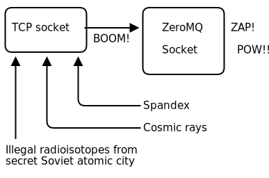

# 서문(Preface) {-}

## 번역 정보 {-}
이 책은 ØMQ 라이브러리의 입문서지만, 일반적인 메시징 시스템의 설계 방법을 배울 수 있도록 작성되어 있습니다.
멀티스레드 프로그래밍 및 네트워크 프로그래밍에서 일어나는 일반적인 문제 해결 방법 및 분산 응용 프로그램의 설계 방법 등을 배울 수 있습니다.
예를 들어, P2P(Peer-to-Peer) 응용프로그램과 분산 해시 테이블 등의 기반을 구현하고자 하는 분들도 추천합니다.

「ØMQ 가이드」는 피터 힌트젠스가 2015년 12월에 zeroMQ 3.2 버전 기준으로 작성한「[ØMQ - The Guide](http://zguide.zeromq.org/)」의 한국어 번역입니다.

「[ØMQ - The Guide](http://zguide.zeromq.org/)」을 기반으로 한글로 번역하였으며, 깃허브 문서로 작성하기 위하여 「[HAMANO Tsukasa](https://github.com/hamano)」씨의 문서를 참조하였습니다.
예제는 ØMQ v3.2 기준(2015년)이지만 v4.3.2(2020년)에서 원도우 및 리눅스(와 유닉스) 운영체제에서도 사용할 수 있도록 소스 일부 수정하였습니다.

원서의 내용이 수정이 필요하거나 모호한 부분에 대하여 고인이 된 저자에게 문의할 수 없어, 일부 내용 및 소스 수정이 가해진 부분이 있으며 [옮긴이]에 표시해 두었습니다.

향후 ØMQ 기능 변경에 따라 해당 문서는 지속적으로 수정 및 타 개발 언어들에서도 적용할 수 있도록 하겠습니다.

오자・오역 및 의견이 있을 경우 [@박재도(zzeddo@gmail.com)](https://www.facebook.com/zzeddo) 연락 부탁드립니다.

옮긴이(박재도)는 2000년대 초반부터 hp BASEstar Open이란 MOM(Message Oriented Middleware)를 국내 적용하였으며 
2011년부터 하이텍크 산업(반도체/LCD/OLED)에서 TIB/Rendezvous(TIB/RV)를 적용하는 일을 하였습니다. 
2012년에 zeroMQ를 처음 접하고 TIB/Rendezvous(TIB/RV) 대체하기 위한 프로젝틀 수행하였으며 
2017년 CERN(European Organization for Nuclear Research)에서 사용하는 CMW(Control Middleware)가 zeroMQ 기반으로 구축된 것을 확인하고 기술 이전을 받아 국내 적용하기도 하였습니다. 

현재 기존의 경험을 바탕으로 zeroMQ 기반의 SOOK MOM(Message Oriented Middleware)을 개발하고 있습니다.

## 100자로 ØMQ 설명하기(ØMQ in a Hundred Words) {-}
;ØMQ (also known as ØMQ, ØMQ, or zmq) looks like an embeddable networking library but acts like a concurrency framework. It gives you sockets that carry atomic messages across various transports like in-process, inter-process, TCP, and multicast. You can connect sockets N-to-N with patterns like fan-out, pub-sub, task distribution, and request-reply. It's fast enough to be the fabric for clustered products. Its asynchronous I/O model gives you scalable multicore applications, built as asynchronous message-processing tasks. It has a score of language APIs and runs on most operating systems. ØMQ is from iMatix and is LGPLv3 open source.

ZeroMQ(ØMQ, 0MQ, 혹은 zmq 알려짐)는 내장된 네트워킹 라이브러리와 유사하지만 동시성(concurrency) 프레임워크처럼 동작합니다. ØMQ는 다양한 전송계층 환경에서 단순 메시지를 전송하는 소켓을 제공하는데 전송수단으로 프로세스 내 통신(스레드 간), 프로세스 간 통신, TCP 그리고 멀티캐스트 등 다양합니다. 당신은 ØMQ 소켓을 N 대 N 방식으로 멀티캐스팅(pgm, epgm), 발행-구독(pub-sub), 작업 분배(pipeline), 그리고 요청-응답(request-reply) 등 패턴으로 사용할 수 있습니다. 이것은 클러스터 제품들에 적용해도 전혀 문제없는 높은 성능을 가지고 있습니다.  비동기 I/O 모델로 비동기 메시지 작업들을 구축하여 확장 가능한 멀티코어 응용프로그램을 제공합니다. 다양한 개발언어 API 있으며 거의 모든 운영체제에서 적용 가능합니다. ØMQ는 iMatix에서 개발했으며 LGPLv3 라이선스로 오픈소스입니다.

## 시작하기(How It Began) {-}
;We took a normal TCP socket, injected it with a mix of radioactive isotopes stolen from a secret Soviet atomic research project, bombarded it with 1950-era cosmic rays, and put it into the hands of a drug-addled comic book author with a badly-disguised fetish for bulging muscles clad in spandex. Yes, ØMQ sockets are the world-saving superheroes of the networking world.

일반적인 TCP 소켓을 가져다가 여러 가지 요소들(구소련 연방의 방사선 동위원소, 근육빵빵맨 등)을 혼합하여 ØMQ을 만들었으며, ØMQ 소켓은 네트워킹 세계(모두가 연결된)를 구원하는 슈퍼 히어로입니다.

그림 1 - 무서운 일

## Zero의 철학(The Zen of Zero) {-}
;The Ø in ØMQ is all about tradeoffs. On the one hand this strange name lowers ØMQ's visibility on Google and Twitter. On the other hand it annoys the heck out of some Danish folk who write us things like "ØMG røtfl", and "Ø is not a funny looking zero!" and "Rødgrød med Fløde!", which is apparently an insult that means "may your neighbours be the direct descendants of Grendel!" Seems like a fair trade.

ØMQ의 0은 단지 절충안입니다.
한편에서는 이상한 이름으로 구굴 또는 트위터 검색에서의 가시성이 저하되고 있습니다.
다른 한편에서는 덴마크의 끔찍한 놈들이란 "ØMG røtfl"의미로 혹은 "Ø는 이상한 모양 제로는 아니다"와 "Rødgrød med Fløde!"(크림이 오른 덴마크 간식)등으로 표현하는 것은 잘못되었습니다.

;Originally the zero in ØMQ was meant as "zero broker" and (as close to) "zero latency" (as possible). Since then, it has come to encompass different goals: zero administration, zero cost, zero waste. More generally, "zero" refers to the culture of minimalism that permeates the project. We add power by removing complexity rather than by exposing new functionality.

원래 ØMQ의 zero의 의미는 "브러커 없는{zero broker)"를 (좀 더 정확하게) 의미하였으며 "지연 없는(zero latency)"로(가능한) 하는 것이었습니다. 이것을 위하여 서로 상반된 목표들로 둘려 싸이게 되었습니다 : 관리 없애기(zero administration), 비용 없애기(zero cost), 낭비 없애기(zero waste). 
"zero"는 미니멀리즘 문화를 참조하여 프로젝트에 반영하였으며 새로운 기능을 부가하기보다는 복잡성을 제거함으로 힘을 부여하였습니다.

## 대상 독자(Audience) {-}
;This book is written for professional programmers who want to learn how to make the massively distributed software that will dominate the future of computing. We assume you can read C code, because most of the examples here are in C even though ØMQ is used in many languages. We assume you care about scale, because ØMQ solves that problem above all others. We assume you need the best possible results with the least possible cost, because otherwise you won't appreciate the trade-offs that ØMQ makes. Other than that basic background, we try to present all the concepts in networking and distributed computing you will need to use ØMQ.

이 책은 전문 프로그래머로 미래의 컴퓨팅을 지배할 거대한 분산 소프트웨어를 만드는 방법을 배우려는 사람을 대상으로 합니다. ØMQ가 여러 개발 언어를 사용할 수 있지만 여기에 있는 대부분의 예제는 C 언어로 되어 있기 때문에 C 코드를 읽을 수 있으며 네트워크상에서 응용프로그램을 확장하는 문제에 관심이 있고 최소한의 비용으로 최상의 결과가 필요하다고 가정합니다. 그렇지 않으면 ØMQ가 제공하는 절충안들을 인식하지 못할 것입니다. 
우리는 가능한 분산 컴퓨팅과 네트워크 상의 모든 개념들을 표현하여 ØMQ을 사용할 수 있도록 하였습니다.

## 감사(Acknowledgements) {-}
;Thanks to Andy Oram for making the O'Reilly book happen, and editing this text.

이 문서를 [도서](http://shop.oreilly.com/product/0636920026136.do)로 출판하기 위해 편집해 주신 Andy Oram에게 감사합니다。

작업에 도움을 주신 분들에게 감사합니다

Bill Desmarais, Brian Dorsey, Daniel Lin, Eric Desgranges, Gonzalo Diethelm, Guido Goldstein, Hunter Ford, Kamil Shakirov, Martin Sustrik, Mike Castleman, Naveen Chawla, Nicola Peduzzi, Oliver Smith, Olivier Chamoux, Peter Alexander, Pierre Rouleau, Randy Dryburgh, John Unwin, Alex Thomas, Mihail Minkov, Jeremy Avnet, Michael Compton, Kamil Kisiel, Mark Kharitonov, Guillaume Aubert, Ian Barber, Mike Sheridan, Faruk Akgul, Oleg Sidorov, Lev Givon, Allister MacLeod, Alexander D'Archangel, Andreas Hoelzlwimmer, Han Holl, Robert G. Jakabosky, Felipe Cruz, Marcus McCurdy, Mikhail Kulemin, Dr. Gergő Érdi, Pavel Zhukov, Alexander Else, Giovanni Ruggiero, Rick "Technoweenie", Daniel Lundin, Dave Hoover, Simon Jefford, Benjamin Peterson, Justin Case, Devon Weller, Richard Smith, Alexander Morland, Wadim Grasza, Michael Jakl, Uwe Dauernheim, Sebastian Nowicki, Simone Deponti, Aaron Raddon, Dan Colish, Markus Schirp, Benoit Larroque, Jonathan Palardy, Isaiah Peng, Arkadiusz Orzechowski, Umut Aydin, Matthew Horsfall, Jeremy W. Sherman, Eric Pugh, Tyler Sellon, John E. Vincent, Pavel Mitin, Min RK, Igor Wiedler, Olof Åkesson, Patrick Lucas, Heow Goodman, Senthil Palanisami, John Gallagher, Tomas Roos, Stephen McQuay, Erik Allik, Arnaud Cogoluègnes, Rob Gagnon, Dan Williams, Edward Smith, James Tucker, Kristian Kristensen, Vadim Shalts, Martin Trojer, Tom van Leeuwen, Hiten Pandya, Harm Aarts, Marc Harter, Iskren Ivov Chernev, Jay Han, Sonia Hamilton, Nathan Stocks, Naveen Palli, Zed Shaw